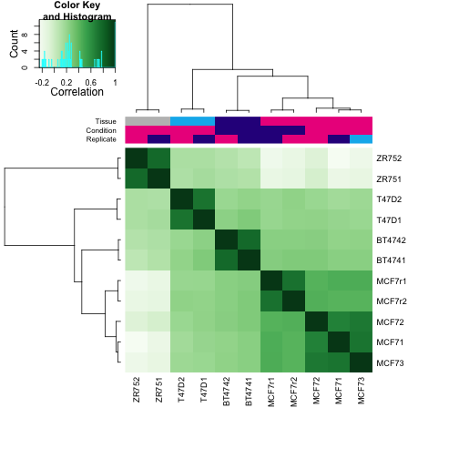
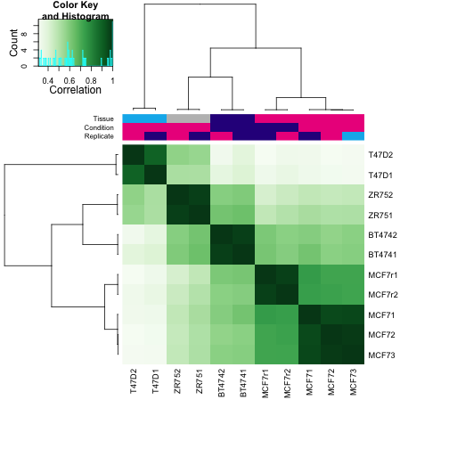
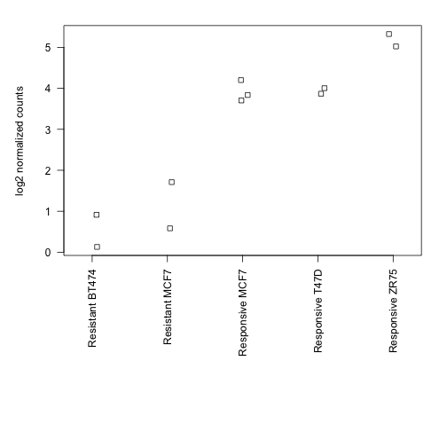

## Introduction

ChIP-seq is a protocol for inferring the locations of proteins bound or associated with DNA. The raw data looks quite different than DNA- or RNA-seq, in that the NGS reads form tall "peaks" at the locations where the proteins were tightly bound to DNA in the cells which were used to create the sample. More specifically, ChIP-seq results in two peaks of reads of different strands (plus/minus also referred to as Watson/Crick), as shown in [Figure 1](http://www.ncbi.nlm.nih.gov/pmc/articles/PMC2592715/figure/F1/) of the MACS manuscript: [Zhang 2008](#foot)

## Peak calling

In the first lab, we use the MACS software to call peaks. The code for this is in the [MACS.txt](https://github.com/genomicsclass/labs/blob/master/week8/MACS.txt) file.

There are many different algorithms for calling peaks, which have varying performance on different kinds of experiments. As mentioned in the lecture, for ChIP of proteins with broad peaks (such as modified histones), algorithms other than those for detecting sharp peaks might perform better.

## After peak calling

A number of analyses might be of interest following peak calling. In this lab we will focus on differential binding across samples, by focusing on the peak regions and counting the number of ChIP-seq reads which fall into the peaks for each sample.

Motif-finding is common ChIP-seq analysis which is not explored in this course, as we do not cover the basics of analysis of sequences. Motif-finding refers to the task of looking for common strings of DNA letters contained within peaks. These are biologically meaningful, as a number of proteins which are bound to DNA have conformations which make certain strings of DNA letters more preferable for binding. For more references, see the [Footnotes](#foot).

## Differential binding across samples

The following lab will go over the functionality of the `DiffBind` package, mostly using code from the vignette. This package is useful for manipulating ChIP-seq signal in R, for comparing signal across files and for performing tests of diffential binding.

## Reading peak files into R

We check the files in the `DiffBind` folder, and in the `peaks` subdirectory:


```r
#biocLite("DiffBind")
library(DiffBind)
```

```
## Loading required package: GenomicRanges
## Loading required package: methods
## Loading required package: BiocGenerics
## Loading required package: parallel
## 
## Attaching package: 'BiocGenerics'
## 
## The following objects are masked from 'package:parallel':
## 
##     clusterApply, clusterApplyLB, clusterCall, clusterEvalQ,
##     clusterExport, clusterMap, parApply, parCapply, parLapply,
##     parLapplyLB, parRapply, parSapply, parSapplyLB
## 
## The following object is masked from 'package:stats':
## 
##     xtabs
## 
## The following objects are masked from 'package:base':
## 
##     anyDuplicated, append, as.data.frame, as.vector, cbind,
##     colnames, do.call, duplicated, eval, evalq, Filter, Find, get,
##     intersect, is.unsorted, lapply, Map, mapply, match, mget,
##     order, paste, pmax, pmax.int, pmin, pmin.int, Position, rank,
##     rbind, Reduce, rep.int, rownames, sapply, setdiff, sort,
##     table, tapply, union, unique, unlist
## 
## Loading required package: IRanges
## Loading required package: GenomeInfoDb
## Loading required package: limma
## 
## Attaching package: 'limma'
## 
## The following object is masked from 'package:BiocGenerics':
## 
##     plotMA
## 
## Loading required package: GenomicAlignments
## Loading required package: Biostrings
## Loading required package: XVector
## Loading required package: Rsamtools
## Loading required package: BSgenome
## KernSmooth 2.23 loaded
## Copyright M. P. Wand 1997-2009
```

```r
setwd(system.file("extra", package="DiffBind"))
list.files()
```

```
## [1] "config.csv"              "peaks"                  
## [3] "tamoxifen_allfields.csv" "tamoxifen_GEO.csv"      
## [5] "tamoxifen_GEO.R"         "tamoxifen.csv"
```

```r
read.csv("tamoxifen.csv")
```

```
##    SampleID Tissue Factor  Condition  Treatment Replicate
## 1    BT4741  BT474     ER  Resistant Full-Media         1
## 2    BT4742  BT474     ER  Resistant Full-Media         2
## 3     MCF71   MCF7     ER Responsive Full-Media         1
## 4     MCF72   MCF7     ER Responsive Full-Media         2
## 5     MCF73   MCF7     ER Responsive Full-Media         3
## 6     T47D1   T47D     ER Responsive Full-Media         1
## 7     T47D2   T47D     ER Responsive Full-Media         2
## 8    MCF7r1   MCF7     ER  Resistant Full-Media         1
## 9    MCF7r2   MCF7     ER  Resistant Full-Media         2
## 10    ZR751   ZR75     ER Responsive Full-Media         1
## 11    ZR752   ZR75     ER Responsive Full-Media         2
##                      bamReads ControlID                  bamControl
## 1  reads/Chr18_BT474_ER_1.bam    BT474c reads/Chr18_BT474_input.bam
## 2  reads/Chr18_BT474_ER_2.bam    BT474c reads/Chr18_BT474_input.bam
## 3   reads/Chr18_MCF7_ER_1.bam     MCF7c  reads/Chr18_MCF7_input.bam
## 4   reads/Chr18_MCF7_ER_2.bam     MCF7c  reads/Chr18_MCF7_input.bam
## 5   reads/Chr18_MCF7_ER_3.bam     MCF7c  reads/Chr18_MCF7_input.bam
## 6   reads/Chr18_T47D_ER_1.bam     T47Dc        reads/T47D_input.bam
## 7   reads/Chr18_T47D_ER_2.bam     T47Dc        reads/T47D_input.bam
## 8   reads/Chr18_TAMR_ER_1.bam     TAMRc        reads/TAMR_input.bam
## 9         reads/TAMR_ER_2.bam     TAMRc        reads/TAMR_input.bam
## 10  reads/Chr18_ZR75_ER_1.bam     ZR75c        reads/ZR75_input.bam
## 11  reads/Chr18_ZR75_ER_2.bam     ZR75c        reads/ZR75_input.bam
##                      Peaks PeakCaller
## 1  peaks/BT474_ER_1.bed.gz        bed
## 2  peaks/BT474_ER_2.bed.gz        bed
## 3   peaks/MCF7_ER_1.bed.gz        bed
## 4   peaks/MCF7_ER_2.bed.gz        bed
## 5   peaks/MCF7_ER_3.bed.gz        bed
## 6   peaks/T47D_ER_1.bed.gz        bed
## 7   peaks/T47D_ER_2.bed.gz        bed
## 8   peaks/TAMR_ER_1.bed.gz        bed
## 9   peaks/TAMR_ER_2.bed.gz        bed
## 10  peaks/ZR75_ER_1.bed.gz        bed
## 11  peaks/ZR75_ER_2.bed.gz        bed
```

```r
list.files("peaks")
```

```
##  [1] "BT474_ER_1.bed.gz" "BT474_ER_2.bed.gz" "MCF7_ER_1.bed.gz" 
##  [4] "MCF7_ER_2.bed.gz"  "MCF7_ER_3.bed.gz"  "T47D_ER_1.bed.gz" 
##  [7] "T47D_ER_2.bed.gz"  "TAMR_ER_1.bed.gz"  "TAMR_ER_2.bed.gz" 
## [10] "ZR75_ER_1.bed.gz"  "ZR75_ER_2.bed.gz"
```

The `dba` function creates the basic object for an analysis of *Differential Binding Affinity*. The sample sheet specifies a data frame of file with certain required columns. Note that columns have restricted names, including *Tissue*, *Factor*, *Condition*, etc., which will be referred to later in analysis.

This function will automatically create a correlation plot showing the overlap of the peaks for all the samples.


```r
setwd(system.file("extra", package="DiffBind"))
ta <- dba(sampleSheet="tamoxifen.csv")
```

```
## BT4741 BT474 ER Resistant Full-Media 1 bed
## BT4742 BT474 ER Resistant Full-Media 2 bed
## MCF71 MCF7 ER Responsive Full-Media 1 bed
## MCF72 MCF7 ER Responsive Full-Media 2 bed
## MCF73 MCF7 ER Responsive Full-Media 3 bed
## T47D1 T47D ER Responsive Full-Media 1 bed
## T47D2 T47D ER Responsive Full-Media 2 bed
## MCF7r1 MCF7 ER Resistant Full-Media 1 bed
## MCF7r2 MCF7 ER Resistant Full-Media 2 bed
## ZR751 ZR75 ER Responsive Full-Media 1 bed
## ZR752 ZR75 ER Responsive Full-Media 2 bed
```

 

```r
ta
```

```
## 11 Samples, 2602 sites in matrix (3557 total):
##        ID Tissue Factor  Condition  Treatment Replicate Caller Intervals
## 1  BT4741  BT474     ER  Resistant Full-Media         1    bed      1084
## 2  BT4742  BT474     ER  Resistant Full-Media         2    bed      1115
## 3   MCF71   MCF7     ER Responsive Full-Media         1    bed      1513
## 4   MCF72   MCF7     ER Responsive Full-Media         2    bed      1037
## 5   MCF73   MCF7     ER Responsive Full-Media         3    bed      1372
## 6   T47D1   T47D     ER Responsive Full-Media         1    bed       509
## 7   T47D2   T47D     ER Responsive Full-Media         2    bed       347
## 8  MCF7r1   MCF7     ER  Resistant Full-Media         1    bed      1148
## 9  MCF7r2   MCF7     ER  Resistant Full-Media         2    bed       933
## 10  ZR751   ZR75     ER Responsive Full-Media         1    bed      2111
## 11  ZR752   ZR75     ER Responsive Full-Media         2    bed      1975
```

From the `DiffBind` vignette, we have:

> This shows how many peaks are in each peakset, as well as (in the first line) 
> total number of unique peaks *after merging overlapping ones* (3557) and the 
> default binding matrix of 11 samples by the 2602 sites that *overlap in at 
> least two of the samples*."

We can access the peaks for each file:


```r
names(ta)
```

```
##  [1] "config"      "chrmap"      "peaks"       "class"       "masks"      
##  [6] "samples"     "allvectors"  "overlapping" "vectors"     "attributes" 
## [11] "minOverlap"
```

```r
class(ta$peaks)
```

```
## [1] "list"
```

```r
head(ta$peaks[[1]])
```

```
##      V1     V2     V3 1
## 1 chr18  97113 100326 1
## 2 chr18 205561 206065 1
## 3 chr18 301531 302107 1
## 4 chr18 346655 347317 1
## 5 chr18 361153 362092 1
## 6 chr18 385190 386464 1
```

## Differential binding

The following code chunk will count the reads from the BAM files specified in the `samples` slot:


```r
ta$samples
```

```
##    SampleID Tissue Factor  Condition  Treatment Replicate
## 1    BT4741  BT474     ER  Resistant Full-Media         1
## 2    BT4742  BT474     ER  Resistant Full-Media         2
## 3     MCF71   MCF7     ER Responsive Full-Media         1
## 4     MCF72   MCF7     ER Responsive Full-Media         2
## 5     MCF73   MCF7     ER Responsive Full-Media         3
## 6     T47D1   T47D     ER Responsive Full-Media         1
## 7     T47D2   T47D     ER Responsive Full-Media         2
## 8    MCF7r1   MCF7     ER  Resistant Full-Media         1
## 9    MCF7r2   MCF7     ER  Resistant Full-Media         2
## 10    ZR751   ZR75     ER Responsive Full-Media         1
## 11    ZR752   ZR75     ER Responsive Full-Media         2
##                      bamReads ControlID                  bamControl
## 1  reads/Chr18_BT474_ER_1.bam    BT474c reads/Chr18_BT474_input.bam
## 2  reads/Chr18_BT474_ER_2.bam    BT474c reads/Chr18_BT474_input.bam
## 3   reads/Chr18_MCF7_ER_1.bam     MCF7c  reads/Chr18_MCF7_input.bam
## 4   reads/Chr18_MCF7_ER_2.bam     MCF7c  reads/Chr18_MCF7_input.bam
## 5   reads/Chr18_MCF7_ER_3.bam     MCF7c  reads/Chr18_MCF7_input.bam
## 6   reads/Chr18_T47D_ER_1.bam     T47Dc        reads/T47D_input.bam
## 7   reads/Chr18_T47D_ER_2.bam     T47Dc        reads/T47D_input.bam
## 8   reads/Chr18_TAMR_ER_1.bam     TAMRc        reads/TAMR_input.bam
## 9         reads/TAMR_ER_2.bam     TAMRc        reads/TAMR_input.bam
## 10  reads/Chr18_ZR75_ER_1.bam     ZR75c        reads/ZR75_input.bam
## 11  reads/Chr18_ZR75_ER_2.bam     ZR75c        reads/ZR75_input.bam
##                      Peaks PeakCaller
## 1  peaks/BT474_ER_1.bed.gz        bed
## 2  peaks/BT474_ER_2.bed.gz        bed
## 3   peaks/MCF7_ER_1.bed.gz        bed
## 4   peaks/MCF7_ER_2.bed.gz        bed
## 5   peaks/MCF7_ER_3.bed.gz        bed
## 6   peaks/T47D_ER_1.bed.gz        bed
## 7   peaks/T47D_ER_2.bed.gz        bed
## 8   peaks/TAMR_ER_1.bed.gz        bed
## 9   peaks/TAMR_ER_2.bed.gz        bed
## 10  peaks/ZR75_ER_1.bed.gz        bed
## 11  peaks/ZR75_ER_2.bed.gz        bed
```

```r
# this call does not actually work, because the BAM files are not included in the package
ta <- dba.count(ta, minOverlap=3)
```

```
## Warning: reads/Chr18_BT474_ER_1.bam not accessible
## Warning: reads/Chr18_BT474_ER_2.bam not accessible
## Warning: reads/Chr18_MCF7_ER_1.bam not accessible
## Warning: reads/Chr18_MCF7_ER_2.bam not accessible
## Warning: reads/Chr18_MCF7_ER_3.bam not accessible
## Warning: reads/Chr18_T47D_ER_1.bam not accessible
## Warning: reads/Chr18_T47D_ER_2.bam not accessible
## Warning: reads/Chr18_TAMR_ER_1.bam not accessible
## Warning: reads/TAMR_ER_2.bam not accessible
## Warning: reads/Chr18_ZR75_ER_1.bam not accessible
## Warning: reads/Chr18_ZR75_ER_2.bam not accessible
## Warning: reads/Chr18_BT474_input.bam not accessible
## Warning: reads/Chr18_MCF7_input.bam not accessible
## Warning: reads/T47D_input.bam not accessible
## Warning: reads/TAMR_input.bam not accessible
## Warning: reads/ZR75_input.bam not accessible
```

```
## Error: Some read files could not be accessed. See warnings for details.
```

```r
# instead we load the counts:
data(tamoxifen_counts)
ta2 <- tamoxifen
plot(ta2)
```

 

We can perform a test by specifying to contrast over the levels of condition. This will call edgeR (the default) or DESeq software in order to normalize samples for sequencing depth and perform essentially the same analysis as a differential expression analysis for RNA-Seq counts. Here we could also include the tissue as a blocking factor, by providing `DBA_TISSUE` to the `block` argument of `dba.contrast`.

The plot produced then looks at correlation only for those peaks which showed evidence of differential binding.


```r
ta2 <- dba.contrast(ta2, categories=DBA_CONDITION)
ta2 <- dba.analyze(ta2)
```

 

```r
ta2
```

```
## 11 Samples, 1772 sites in matrix:
##        ID Tissue Factor  Condition  Treatment Replicate Caller Intervals
## 1  BT4741  BT474     ER  Resistant Full-Media         1 counts      1772
## 2  BT4742  BT474     ER  Resistant Full-Media         2 counts      1772
## 3   MCF71   MCF7     ER Responsive Full-Media         1 counts      1772
## 4   MCF72   MCF7     ER Responsive Full-Media         2 counts      1772
## 5   MCF73   MCF7     ER Responsive Full-Media         3 counts      1772
## 6   T47D1   T47D     ER Responsive Full-Media         1 counts      1772
## 7   T47D2   T47D     ER Responsive Full-Media         2 counts      1772
## 8  MCF7r1   MCF7     ER  Resistant Full-Media         1 counts      1772
## 9  MCF7r2   MCF7     ER  Resistant Full-Media         2 counts      1772
## 10  ZR751   ZR75     ER Responsive Full-Media         1 counts      1772
## 11  ZR752   ZR75     ER Responsive Full-Media         2 counts      1772
##    FRiP
## 1  0.20
## 2  0.19
## 3  0.36
## 4  0.22
## 5  0.29
## 6  0.14
## 7  0.09
## 8  0.25
## 9  0.00
## 10 0.36
## 11 0.25
## 
## 1 Contrast:
##      Group1 Members1     Group2 Members2 DB.edgeR
## 1 Resistant        4 Responsive        7      314
```

From the `DiffBind` vignette, we have:

> By default, dba.analyze plots a correlation heatmap if it finds any 
> significantly differentially bound sites, shown in Figure 3. Using only 
> the differentially bound sites, we now see that the four tamoxifen 
> resistant samples (representing two cell lines) cluster together, 
> although the tamoxifen-responsive MCF7 replicates cluster closer to them 
> than to the other tamoxifen responsive samples."

Finally, we can generate the results table, which is attached as metadata columns to the peaks as genomic ranges. By specifying `bCounts = TRUE`, we also obtain the normalized counts for each sample.


```r
tadb <- dba.report(ta2)
tadb
```

```
## GRanges with 314 ranges and 6 metadata columns:
##        seqnames               ranges strand   |             Conc
##           <Rle>            <IRanges>  <Rle>   |        <numeric>
##    846    chr18 [34597337, 34598560]      *   | 5.82702702849364
##    258    chr18 [10023641, 10024769]      *   |  6.4142899155369
##    542    chr18 [21575222, 21575958]      *   | 5.61065475202444
##      9    chr18 [  394600,   396513]      *   |  6.9461632656995
##   1720    chr18 [74368318, 74370013]      *   | 7.92711543517715
##    ...      ...                  ...    ... ...              ...
##   1089    chr18 [45855805, 45858620]      *   | 7.57418051818759
##    710    chr18 [29237526, 29238327]      *   | 5.13372481157531
##    624    chr18 [24620485, 24623021]      *   | 6.62139358722481
##   1124    chr18 [46626418, 46627519]      *   | 4.65327137302054
##    534    chr18 [21275120, 21275855]      *   | 4.34159705218926
##          Conc_Resistant  Conc_Responsive              Fold
##               <numeric>        <numeric>         <numeric>
##    846 1.45276744477407 6.45358293585542 -5.00081549108135
##    258 7.60419190544083 4.51344869876694  3.09074320667388
##    542 6.80601911260069 3.68292214647758  3.12309696612311
##      9 8.17798159966392 4.82181957316395  3.35616202649998
##   1720  3.7813091211569 8.54924679408552 -4.76793767292862
##    ...              ...              ...               ...
##   1089 5.68623552731405 8.07705422202887 -2.39081869471482
##    710 5.99175741277292 4.23316070815612   1.7585967046168
##    624 7.46850251080639 5.74171908038376  1.72678343042262
##   1124 2.83024769420767 5.14889169305922 -2.31864399885155
##    534 5.10250489352047  3.6120913179152  1.49041357560527
##                     p.value                  FDR
##                   <numeric>            <numeric>
##    846 5.49982074824107e-08 9.61676744927068e-05
##    258 1.51525489145341e-07 9.61676744927068e-05
##    542 2.10965736912273e-07 9.61676744927068e-05
##      9 2.17082786665252e-07 9.61676744927068e-05
##   1720 2.94569330888335e-07 0.000104395370866826
##    ...                  ...                  ...
##   1089   0.0171595397709137   0.0980861434647065
##    710   0.0173896327717158   0.0990817661462395
##    624   0.0175366319558599   0.0995692585363159
##   1124   0.0175875721906698   0.0995692585363159
##    534   0.0177072105258631   0.0999273154516858
##   ---
##   seqlengths:
##    chr18
##       NA
```

```r
counts <- dba.report(ta2, bCounts=TRUE)
```

## Reproducing the log fold changes

The following code is used only to see if we can reproduce the log fold change obtained by the `dba.contrast` function. We extract the counts for the top peak, and put these in the order of the samples table:


```r
x <- mcols(counts)[1,-c(1:6)]
x <- unlist(x)
(xord <- x[match(ta2$samples$SampleID, names(x))])
```

```
##  BT4741  BT4742   MCF71   MCF72   MCF73   T47D1   T47D2  MCF7r1  MCF7r2 
##   2.491   1.138  40.595  46.393  66.720  54.827  47.857   5.530   1.791 
##   ZR751   ZR752 
## 151.802 205.313
```

```r
ta2$samples$SampleID
```

```
##  [1] "BT4741" "BT4742" "MCF71"  "MCF72"  "MCF73"  "T47D1"  "T47D2" 
##  [8] "MCF7r1" "MCF7r2" "ZR751"  "ZR752"
```

We create a vector of the conditions, and conditions combined with tissue:


```r
cond <- factor(ta2$samples[,"Condition"])
condcomb <- factor(paste(ta2$samples[,"Condition"], ta2$samples[,"Tissue"]))
```

A stripchart of the counts over the conditions:


```r
par(mar=c(15,5,2,2))
stripchart(log(xord) ~ condcomb, method="jitter", 
           vertical=TRUE, las=2, ylab="log2 normalized counts")
```

 

Finally, we show that the log2 fold change of the means is the same as reported by the `DiffBind` functions:


```r
means <- tapply(xord, cond, mean)
log2(means)
```

```
##  Resistant Responsive 
##      1.453      6.454
```

```r
log2(means[1] / means[2])
```

```
## Resistant 
##    -5.001
```

```r
mcols(tadb)[1,]
```

```
## DataFrame with 1 row and 6 columns
##        Conc Conc_Resistant Conc_Responsive      Fold   p.value       FDR
##   <numeric>      <numeric>       <numeric> <numeric> <numeric> <numeric>
## 1     5.827          1.453           6.454    -5.001   5.5e-08 9.617e-05
```

## Footnotes <a name="foot"></a>

### Model-based Analysis for ChIP-Seq (MACS)

Zhang Y, Liu T, Meyer CA, Eeckhoute J, Johnson DS, Bernstein BE, Nusbaum C, Myers RM, Brown M, Li W, Liu XS. "Model-based Analysis of ChIP-Seq (MACS)". Genome Biol. 2008.
<http://www.ncbi.nlm.nih.gov/pmc/articles/PMC2592715/>

Software: 

<http://liulab.dfci.harvard.edu/MACS/>

### Motif finding

Wikipedia's article on DNA sequence motifs: <http://en.wikipedia.org/wiki/Sequence_motif>

A non-comprehensive list of software for motif finding:

- [MEME/DREME](http://meme.nbcr.net/meme/)
- [RSAT peak-motifs](http://rsat.ulb.ac.be/peak-motifs_form.cgi)
- [motifRG (Bioconductor)](http://www.bioconductor.org/packages/release/bioc/html/motifRG.html)
- [rGADEM (Bioconductor)](http://www.bioconductor.org/packages/release/bioc/html/rGADEM.html)

A survey of motif finding algorithms: <http://www.biomedcentral.com/1471-2105/8/S7/S21/>

