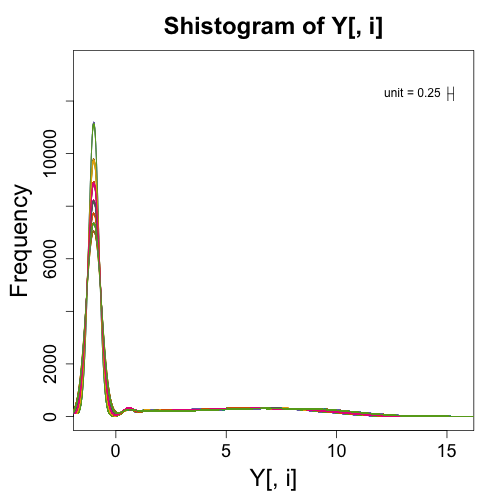
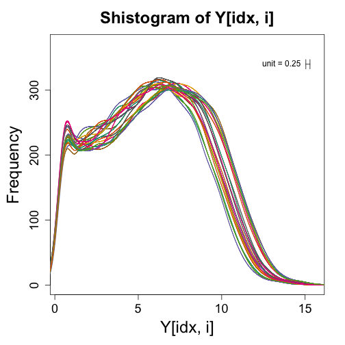
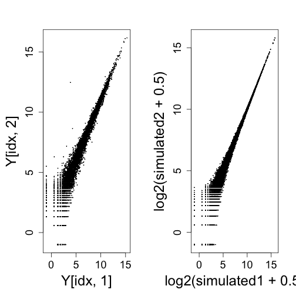
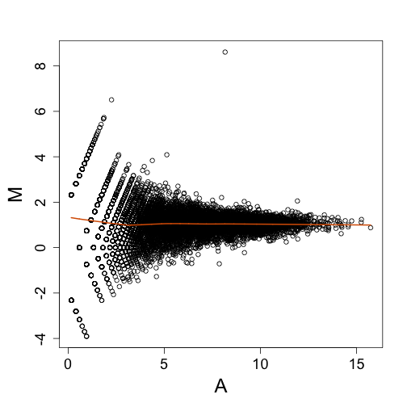

This is a dataset produced by Bottomly et al., sequencing two strains of mouse with many biological replicates. This dataset and a number of other sequencing datasets have been compiled from raw data into read counts tables by Frazee, Langmead, and Leek as part of the ReCount project. These datasets are made publicly available at the following website:

http://bowtie-bio.sourceforge.net/recount/

Unlike many sequencing studies, Bottomly et al., realizing the such information is important for downstream analysis, provided the experiment number for all samples. Below we can see that the experimental batch explains more variation than the condition of interest: the strain of mouse. 

We can make similar figures for NGS to the ones shown in the previous sections. However, the log transform does not work because RNAseq data contains many 0s. One quick way to get around this is by adding a constant before taking the log. A typical one is 0.5 which gives us a log2 value of -1 for 0s.


```r
if (!file.exists("bottomly_eset.RData")) download.file("http://bowtie-bio.sourceforge.net/recount/ExpressionSets/bottomly_eset.RData", 
    "bottomly_eset.RData")
load("bottomly_eset.RData")
library("Biobase")
```

```
## Loading required package: BiocGenerics
## Loading required package: methods
## Loading required package: parallel
## 
## Attaching package: 'BiocGenerics'
## 
## The following objects are masked from 'package:parallel':
## 
##     clusterApply, clusterApplyLB, clusterCall, clusterEvalQ,
##     clusterExport, clusterMap, parApply, parCapply, parLapply,
##     parLapplyLB, parRapply, parSapply, parSapplyLB
## 
## The following object is masked from 'package:stats':
## 
##     xtabs
## 
## The following objects are masked from 'package:base':
## 
##     anyDuplicated, append, as.data.frame, as.vector, cbind,
##     colnames, do.call, duplicated, eval, evalq, Filter, Find, get,
##     intersect, is.unsorted, lapply, Map, mapply, match, mget,
##     order, paste, pmax, pmax.int, pmin, pmin.int, Position, rank,
##     rbind, Reduce, rep.int, rownames, sapply, setdiff, sort,
##     table, tapply, union, unique, unlist
## 
## Welcome to Bioconductor
## 
##     Vignettes contain introductory material; view with
##     'browseVignettes()'. To cite Bioconductor, see
##     'citation("Biobase")', and for packages 'citation("pkgname")'.
```

```r
exprs(bottomly.eset)[1, ]
```

```
## SRX033480 SRX033488 SRX033481 SRX033489 SRX033482 SRX033490 SRX033483 
##       369       744       287       769       348       803       433 
## SRX033476 SRX033478 SRX033479 SRX033472 SRX033473 SRX033474 SRX033475 
##       469       585       321       301       461       309       374 
## SRX033491 SRX033484 SRX033492 SRX033485 SRX033493 SRX033486 SRX033494 
##       781       555       820       294       758       419       857
```

```r
pData(bottomly.eset)
```

```
##           sample.id num.tech.reps   strain experiment.number lane.number
## SRX033480 SRX033480             1 C57BL/6J                 6           1
## SRX033488 SRX033488             1 C57BL/6J                 7           1
## SRX033481 SRX033481             1 C57BL/6J                 6           2
## SRX033489 SRX033489             1 C57BL/6J                 7           2
## SRX033482 SRX033482             1 C57BL/6J                 6           3
## SRX033490 SRX033490             1 C57BL/6J                 7           3
## SRX033483 SRX033483             1 C57BL/6J                 6           5
## SRX033476 SRX033476             1 C57BL/6J                 4           6
## SRX033478 SRX033478             1 C57BL/6J                 4           7
## SRX033479 SRX033479             1 C57BL/6J                 4           8
## SRX033472 SRX033472             1   DBA/2J                 4           1
## SRX033473 SRX033473             1   DBA/2J                 4           2
## SRX033474 SRX033474             1   DBA/2J                 4           3
## SRX033475 SRX033475             1   DBA/2J                 4           5
## SRX033491 SRX033491             1   DBA/2J                 7           5
## SRX033484 SRX033484             1   DBA/2J                 6           6
## SRX033492 SRX033492             1   DBA/2J                 7           6
## SRX033485 SRX033485             1   DBA/2J                 6           7
## SRX033493 SRX033493             1   DBA/2J                 7           7
## SRX033486 SRX033486             1   DBA/2J                 6           8
## SRX033494 SRX033494             1   DBA/2J                 7           8
```


```r
Y <- log2(exprs(bottomly.eset) + 0.5)
# library(devtools) install_github('rafalib','ririzarr')
library("rafalib")
```

```
## Loading required package: RColorBrewer
```

```r
mypar(1, 1)
for (i in 1:ncol(Y)) {
    shist(Y[, i], unit = 0.25, col = i, plotHist = FALSE, add = i != 1)
}
```

 


If we get rid of the zeros (i.e., those with log2 value of -1), we can more easily see that shape of the distribution for the expressed genes:


```r
mypar(1, 1)
for (i in 1:ncol(Y)) {
    idx <- Y[, i] > -1
    shist(Y[idx, i], unit = 0.25, col = i, plotHist = FALSE, add = i != 1)
}
```

 


Plotting two samples against each other shows the spreading of points at the low end of expression from the log transformation. This can also be seen with randomly generated Poisson data.


```r
mypar(1, 2)
idx <- rowSums(Y[, 1:2]) > 0
plot(Y[idx, 1], Y[idx, 2], cex = 0.1)
rm <- rowMeans(2^Y[idx, 1:2])
simulated1 <- rpois(length(idx), rm)
simulated2 <- rpois(length(idx), rm)
plot(log2(simulated1 + 0.5), log2(simulated2 + 0.5), cex = 0.1)
```

 


The MA plot is again easier to look at, in that we don't have to rotate our heads sideways by 45 degrees to see deviations from the diagonal.


```r
mypar(1, 1)
maplot(Y[idx, 1], Y[idx, 2])
```

 


