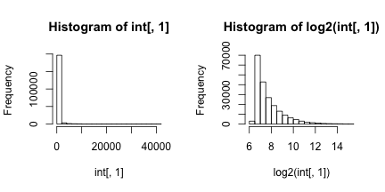
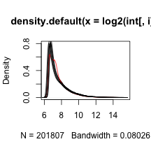
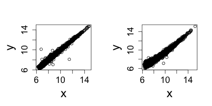
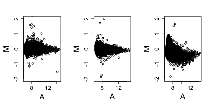
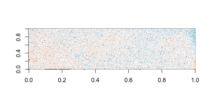
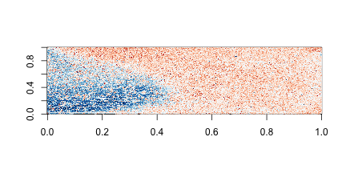

# EDA for Microarray data
Here we are analyzing microarray data from eight samples: two groups of four. A first step in any analysis of genomics data is to learn its general properties and search for problematic samples. By viewing the data from the first sample we immediately notice that over 90% of data is below 1,000 and the remaining 10% spans values up to 40,000. By taking the log we get a better picture of the distribution. We use base 2 because memorizing the powers of 2 is easy. It gives us a friendly range: 4-16. 


```r
# library(devtools) install_github('dagdata','genomicsclass')
library(dagdata)
data(SpikeInEDA)
par(mfrow = c(1, 2))
hist(int[, 1])
hist(log2(int[, 1]))
```

 


Next we look at all eight histograms simultaneously. To facilitate this we introduce the _density estimator_ or _smooth histogram_. Basically we create a histogram, draw a smooth curve through the top of the bars, and keep that curve. This permits us to put several histograms on the same page:


```r
par(mfrow = c(1, 1))
for (i in 1:ncol(int)) if (i == 1) plot(density(log2(int[, i])), col = (i == 
    4) + 1) else lines(density(log2(int[, i])), col = (i == 4) + 1)
```

 

Note that one histogram (we higlighted it by making it red) looks different: it has a different shape from the rest. So is this sample different from the rest in any significant way? If we compute the correlation between this sample and the rest it is not very different and all very high.

```r
signif(cor(int), 2)
```

```
##                 2353m99hpp_av08 2353n99hpp_av08 2353o99hpp_av08
## 2353m99hpp_av08            1.00            0.99            0.99
## 2353n99hpp_av08            0.99            1.00            0.99
## 2353o99hpp_av08            0.99            0.99            1.00
## 2353p99hpp_av08            0.99            0.99            0.99
## 2353q99hpp_av08            0.98            0.98            0.98
## 2353r99hpp_av08            0.98            0.98            0.98
## 2353s99hpp_av08            0.98            0.98            0.98
## 2353t99hpp_av08            0.98            0.98            0.98
##                 2353p99hpp_av08 2353q99hpp_av08 2353r99hpp_av08
## 2353m99hpp_av08            0.99            0.98            0.98
## 2353n99hpp_av08            0.99            0.98            0.98
## 2353o99hpp_av08            0.99            0.98            0.98
## 2353p99hpp_av08            1.00            0.98            0.98
## 2353q99hpp_av08            0.98            1.00            0.99
## 2353r99hpp_av08            0.98            0.99            1.00
## 2353s99hpp_av08            0.98            0.99            0.99
## 2353t99hpp_av08            0.98            0.99            0.99
##                 2353s99hpp_av08 2353t99hpp_av08
## 2353m99hpp_av08            0.98            0.98
## 2353n99hpp_av08            0.98            0.98
## 2353o99hpp_av08            0.98            0.98
## 2353p99hpp_av08            0.98            0.98
## 2353q99hpp_av08            0.99            0.99
## 2353r99hpp_av08            0.99            0.99
## 2353s99hpp_av08            1.00            0.99
## 2353t99hpp_av08            0.99            1.00
```

The problem is not immediately obviou from a scatter plot.

```r
## we don't need to show all the points so we take samples
library(rafalib)
```

```
## Loading required package: RColorBrewer
```

```r
splot <- function(x, y, ...) {
    ind <- sample(length(x), 10000)
    x = x[ind]
    y = y[ind]
    plot(x, y, ...)
}
mypar(1, 2)
splot(log2(int[, 1]), log2(int[, 2]))
splot(log2(int[, 1]), log2(int[, 4]))
```

 

Note that samples 1 through 4 are replicates and should produce the same values up to measurement error. Scatterplots and correlation are not the best tools to detect problems. Note for example that  1,2,3,4 and 100,200,300,400 two lists with very different values have perfect correlation. A better measure is the differences between the values and therefore a better plot is a rotation of the scatter plot containg the differences (log ratios) on the y-axis and the averages (in the log scale) on the x-axis. This plot is a refered to as an MA-plot. 

```r
maplot <- function(x, y, ...) splot((x + y)/2, y - x, ...)
mypar(1, 3)
maplot(log2(int[, 1]), log2(int[, 2]), xlab = "A", ylab = "M", ylim = c(-2, 
    2))
maplot(log2(int[, 1]), log2(int[, 3]), xlab = "A", ylab = "M", ylim = c(-2, 
    2))
maplot(log2(int[, 1]), log2(int[, 4]), xlab = "A", ylab = "M", ylim = c(-2, 
    2))
```

 

Now the problem is obvious. It turns out this samples comes from an array for which a spatial problem can be detected at the original image level. We actually have the grid locations for these measurements and can recreate the image.


```r
## we are doing this for two arrays 1 and 4
library(matrixStats)  ##need rowMedians
```

```
## matrixStats v0.8.14 (2013-11-23) successfully loaded. See ?matrixStats for help.
```

```r
library(RColorBrewer)
for (i in c(1, 4)) {
    r = log2(int[, i]) - rowMedians(log2(int))
    ## r are residuals from median array to avoind outliers taking over colors of
    ## image define a MAX
    MAX <- 1
    r[r > MAX] <- MAX
    r[r < -MAX] <- -MAX
    ## we now that every other column is skipped
    mat = matrix(NA, max(locations[, 1]), max(locations[, 2] + 1)/2)
    for (j in 1:nrow(locations)) {
        mat[locations[j, 1], (locations[j, 2] + 1)/2] <- r[j]
    }
    image(mat, col = brewer.pal(11, "RdBu"))
}
```

  


On the second image we can clearly see the spatial pattern (blue are positive residuals, red are negative)
