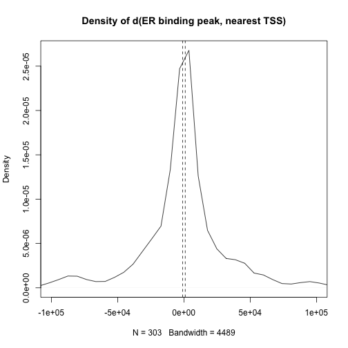

# Interval data on ER binding

A 2006 Nature Genetics paper (v38, n11) by Carroll, Meyer, Song et al.
describes the notion that a group of genes
whose expression correlates 
with the expression of the estrogen receptor (ER) gene
forms a signature of a breast cancer subtype
called "luminal".  This finding motivates interest in determining
the set of all genomic elements to which ER binds, and this has
been carried out using ChIP-seq experiments.  An important 
finding of the Carroll et al. paper was that ER binding 
in the MCF-7 cell line occurred only rarely promoter-proximal regions.
This study therefore unearthed previously unexplored 
cis-regulatory sites.

We will show how to relate binding peak locations to gene
transcription start sites in two cell lines analyzed in the
ENCODE project.

# Acquisition of binding data

Get the ERBS package.


```r
library(devtools)
install_github("genomicsclass/ERBS")
```

```
## Downloading github repo genomicsclass/ERBS@master
## Installing ERBS
## '/Library/Frameworks/R.framework/Resources/bin/R' --vanilla CMD INSTALL  \
##   '/private/var/folders/5_/14ld0y7s0vbg_z0g2c9l8v300000gp/T/RtmpHd7CMh/devtools10127278a89d8/genomicsclass-ERBS-a67e72c'  \
##   --library='/Library/Frameworks/R.framework/Versions/3.1/Resources/library'  \
##   --install-tests 
## 
## Reloading installed ERBS
```

```r
library(ERBS)
data(HepG2)  # cell line of liver origin
data(GM12878)  # immortalized B cell
HepG2  # locations of ER binding peaks
```

```
## GRanges object with 303 ranges and 7 metadata columns:
##         seqnames                 ranges strand   |      name     score
##            <Rle>              <IRanges>  <Rle>   | <numeric> <integer>
##     [1]     chr2 [ 20335378,  20335787]      *   |      <NA>         0
##     [2]    chr20 [   328285,    329145]      *   |      <NA>         0
##     [3]     chr6 [168135432, 168136587]      *   |      <NA>         0
##     [4]    chr19 [  1244419,   1245304]      *   |      <NA>         0
##     [5]    chr11 [ 64071828,  64073069]      *   |      <NA>         0
##     ...      ...                    ...    ... ...       ...       ...
##   [299]     chr4 [  1797182,   1797852]      *   |      <NA>         0
##   [300]     chr1 [110198573, 110199126]      *   |      <NA>         0
##   [301]    chr17 [ 17734052,  17734469]      *   |      <NA>         0
##   [302]     chr1 [ 48306453,  48306908]      *   |      <NA>         0
##   [303]    chr12 [123867207, 123867554]      *   |      <NA>         0
##               col signalValue    pValue       qValue      peak
##         <logical>   <numeric> <numeric>    <numeric> <integer>
##     [1]      <NA>      58.251    75.899 6.143712e-72       195
##     [2]      <NA>      10.808    69.685 5.028065e-66       321
##     [3]      <NA>      17.103    54.311 7.930665e-51       930
##     [4]      <NA>      12.427    43.855 1.359756e-40       604
##     [5]      <NA>       10.85    40.977 7.333863e-38       492
##     ...       ...         ...       ...          ...       ...
##   [299]      <NA>       9.681    10.057 1.423343e-08       402
##   [300]      <NA>       7.929    10.047 1.442076e-08       197
##   [301]      <NA>       5.864      9.99 1.638918e-08       227
##   [302]      <NA>        5.66     9.948 1.799414e-08       211
##   [303]      <NA>      13.211     9.918 1.921805e-08       163
##   -------
##   seqinfo: 23 sequences from an unspecified genome; no seqlengths
```

# Acquisition of gene transcription start sites

We can use Homo.sapiens:


```r
library(Homo.sapiens)
ghs = genes(Homo.sapiens)
tss = ifelse(strand(ghs)=="-", end(ghs), start(ghs))
tss[1:10]
```

```
##  [1]  58874214  18248755  43280376  25757445 244006886  49217763 101395274
##  [8]  71067384  72102894  89867818
```
We'll use distanceToNearest and want the chromosome
and strand information for the TSS.

```r
tssgr = GRanges(seqnames(ghs), IRanges(tss, width=1), strand=strand(ghs))
```

# Finding nearest gene for each binding event

The distanceToNearest function from GenomicFeatures will
create a Hits object with metadata giving the positive distance
between peak location and nearest TSS.  We'll discuss the Hits
object in the video.


```r
d = distanceToNearest(HepG2, tssgr)
d
```

```
## Hits of length 303
## queryLength: 303
## subjectLength: 23056
##     queryHits subjectHits  distance 
##      <integer>   <integer> <integer> 
##  1           1       22817     83588 
##  2           2       19883       914 
##  3           3        8191     60951 
##  4           4       13475      2669 
##  5           5        6316         0 
##  ...       ...         ...       ... 
##  299       299        6699      2142 
##  300       300        9555         0 
##  301       301       17983      5855 
##  302       302       11212    155653 
##  303       303       11132      1149
```

We will call a distance negative if the peak is 5' to the nearest TSS.
The density estimate given below shows that the vast majority of
events are remote from the 1kb region around TSS; we use dashed
lines to denote that region.


```r
dists = mcols(d)$distance
sdists = ifelse(end(HepG2) < start(tssgr[subjectHits(d)]), dists, -dists)
plot(density(sdists), xlim=c(-1e5,1e5), main="Density of d(ER binding peak, nearest TSS)" )
abline(v=1e3, lty=2)
abline(v=-1e3, lty=2)
```

 


