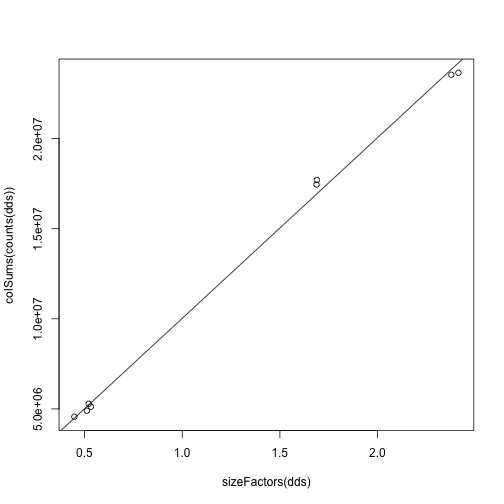
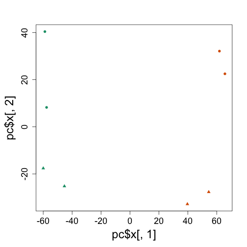
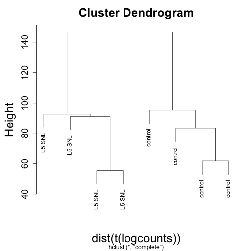
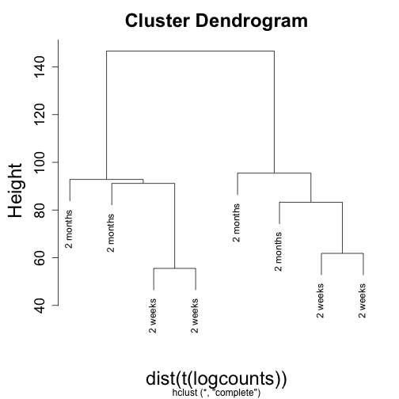
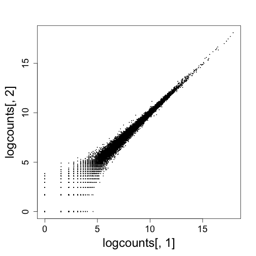
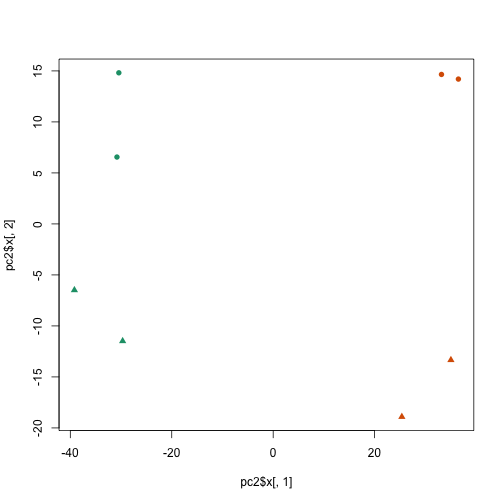
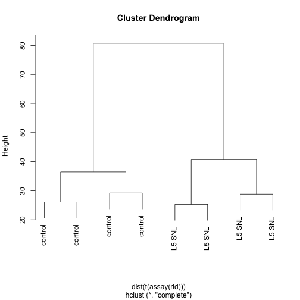
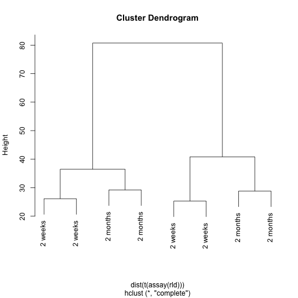
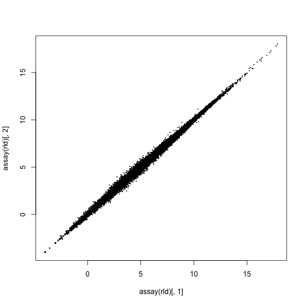
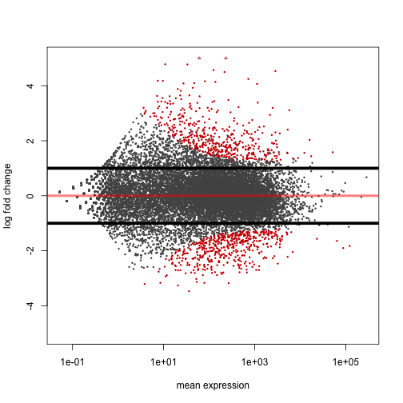

## Introduction

RNA-Seq is a valuable experiment for quantifying both the types and the amount of RNA molecules in a sample. We've covered the basic idea of the protocol in lectures, but some additional references for RNA-Seq include [Mortazavi (2008)](#foot) and [Marioni (2008)](#foot).

In the file, `cufflinks.txt`, we show some example calls for aligning RNA-Seq reads to the reference genome, and an example call for running Cufflinks, which estimates both the expression levels and the different RNA isoforms which are present in the sample. The main paper describing the Cufflinks method is [Trapnell (2010)](#foot) and the website for the Cufflinks software is:

<http://cufflinks.cbcb.umd.edu/>

In this lab, we will focus on comparing the expression levels of different samples, by counting the number of reads which overlap the exons of genes defined by a known annotation. As described in the lecture, this analysis sets aside the task of estimating the different kinds of RNA molecules.

## Counting reads in genes

We will work with a count matrix, which has genes along the rows and samples along the columns. The elements in the matrix give the number of reads which could be uniquely aligned to a given gene for a given sample. We will use count matrices already prepared, as otherwise, students would have to download very large BAM files containing the aligned reads. However, in [another lab](read_counting.html) we show the steps necessary to produce such a count matrix.

## Visualizing sample-sample distances

We will work with the [Hammer et al](#foot) dataset, as prepared by the ReCount website:

<http://bowtie-bio.sourceforge.net/recount/>

> ReCount is an online resource consisting of RNA-seq gene count datasets built 
> using the raw data from 18 different studies. The raw sequencing data (.fastq files) 
> were processed with Myrna to obtain tables of counts for each gene.

This is really helpful for us, so we don't have to download all the FASTQ files and map them ourselves. If you use this resource, you should cite [Frazee (2011)](#foot), and cite the appropriate paper for the experimental data that you download.

Here we read in the `Eset` hosted by ReCount, and turn it into a SummarizedExperiment.


```r
link <- "http://bowtie-bio.sourceforge.net/recount/ExpressionSets/hammer_eset.RData"
if (!file.exists("hammer_eset.RData")) download.file(link, "hammer_eset.RData")
load("hammer_eset.RData")
library(Biobase)
```

```
## Loading required package: BiocGenerics
## Loading required package: methods
## Loading required package: parallel
## 
## Attaching package: 'BiocGenerics'
## 
## The following objects are masked from 'package:parallel':
## 
##     clusterApply, clusterApplyLB, clusterCall, clusterEvalQ,
##     clusterExport, clusterMap, parApply, parCapply, parLapply,
##     parLapplyLB, parRapply, parSapply, parSapplyLB
## 
## The following object is masked from 'package:stats':
## 
##     xtabs
## 
## The following objects are masked from 'package:base':
## 
##     anyDuplicated, append, as.data.frame, as.vector, cbind,
##     colnames, do.call, duplicated, eval, evalq, Filter, Find, get,
##     intersect, is.unsorted, lapply, Map, mapply, match, mget,
##     order, paste, pmax, pmax.int, pmin, pmin.int, Position, rank,
##     rbind, Reduce, rep.int, rownames, sapply, setdiff, sort,
##     table, tapply, union, unique, unlist
## 
## Welcome to Bioconductor
## 
##     Vignettes contain introductory material; view with
##     'browseVignettes()'. To cite Bioconductor, see
##     'citation("Biobase")', and for packages 'citation("pkgname")'.
```

```r
library(GenomicRanges)
```

```
## Loading required package: IRanges
## Loading required package: GenomeInfoDb
```

```r
# the SimpleList() part below is only necessary for Bioc <= 2.13
se <- SummarizedExperiment(SimpleList(counts = exprs(hammer.eset)))
colData(se) <- DataFrame(pData(hammer.eset))
```


We need to fix a typo in the Time column:


```r
colData(se)
```

```
## DataFrame with 8 rows and 5 columns
##                   sample.id num.tech.reps protocol         strain     Time
##                    <factor>     <numeric> <factor>       <factor> <factor>
## SRX020102         SRX020102             1  control Sprague Dawley 2 months
## SRX020103         SRX020103             2  control Sprague Dawley 2 months
## SRX020104         SRX020104             1   L5 SNL Sprague Dawley 2 months
## SRX020105         SRX020105             2   L5 SNL Sprague Dawley  2months
## SRX020091-3     SRX020091-3             1  control Sprague Dawley  2 weeks
## SRX020088-90   SRX020088-90             2  control Sprague Dawley  2 weeks
## SRX020094-7     SRX020094-7             1   L5 SNL Sprague Dawley  2 weeks
## SRX020098-101 SRX020098-101             2   L5 SNL Sprague Dawley  2 weeks
```

```r
colData(se)$Time[4] <- "2 months"
colData(se)$Time <- factor(colData(se)$Time)
colData(se)$Time
```

```
## [1] 2 months 2 months 2 months 2 months 2 weeks  2 weeks  2 weeks  2 weeks 
## Levels: 2 months 2 weeks
```


### Normalization

We will use the `DESeq2` package to normalize the sample for sequencing depth. For now, don't worry about the `design` argument.


```r
# biocLite('DESeq2')
library(DESeq2)
```

```
## Loading required package: Rcpp
## Loading required package: RcppArmadillo
```

```r
dds <- DESeqDataSet(se, design = ~1)
```


The following estimates size factors to account for differences in sequencing depth.


```r
dds <- estimateSizeFactors(dds)
sizeFactors(dds)
```

```
##     SRX020102     SRX020103     SRX020104     SRX020105   SRX020091-3 
##        0.5211        0.4479        0.5122        0.5323        1.6893 
##  SRX020088-90   SRX020094-7 SRX020098-101 
##        1.6874        2.4138        2.3777
```

```r
colSums(counts(dds))
```

```
##     SRX020102     SRX020103     SRX020104     SRX020105   SRX020091-3 
##       5282855       4562100       4897807       5123782      17705411 
##  SRX020088-90   SRX020094-7 SRX020098-101 
##      17449646      23649094      23537179
```

```r
plot(sizeFactors(dds), colSums(counts(dds)))
abline(lm(colSums(counts(dds)) ~ sizeFactors(dds) + 0))
```

 


Now we can divide the columns by the size factor and take the log2 of these normalized counts plus a pseudocount of 1. We transpose in order to run PCA.


```r
logcounts <- log2(counts(dds, normalized = TRUE) + 1)
pc <- prcomp(t(logcounts))
```


A couple EDA plots:


```r
library(rafalib)
```

```
## Loading required package: RColorBrewer
```

```r
mypar()
plot(pc$x[, 1], pc$x[, 2], col = colData(dds)$protocol, pch = as.numeric(colData(dds)$Time) + 
    15)
```

 

```r
plot(hclust(dist(t(logcounts))), labels = colData(dds)$protocol)
```

 

```r
plot(hclust(dist(t(logcounts))), labels = colData(dds)$Time)
```

 

```r
plot(logcounts[, 1], logcounts[, 2], cex = 0.1)
```

 


Now we will use a normalization method, which is similar to the variance stablizing normalization method mentioned in Week 5. It uses the variance model to shrink together the sample values for lowly expressed genes with high variance. 

The data is in the `assay` slot, and needs to be transposed as before to run PCA.


```r
# this takes ~15 seconds
rld <- rlog(dds)
pc2 <- prcomp(t(assay(rld)))
```


We can look at the same plots now using this transformed data.


```r
plot(pc2$x[, 1], pc2$x[, 2], col = colData(rld)$protocol, pch = as.numeric(colData(rld)$Time) + 
    15)
```

 

```r
plot(hclust(dist(t(assay(rld)))), labels = colData(rld)$protocol)
```

 

```r
plot(hclust(dist(t(assay(rld)))), labels = colData(rld)$Time)
```

 

```r
plot(assay(rld)[, 1], assay(rld)[, 2], cex = 0.1)
```

 


## Differential gene expression

A number of methods for assessing differential gene expression from RNA-Seq counts use the Negative Binomial distribution to make probabilistic statements about the differences seen in an experiment. A few such methods are [edgeR](#foot), [DESeq](#foot), [DSS](#foot) and *many* others. A very incomplete list of other methods is provided in the [footnotes](#foot).

We will use `DESeq2` to perform differential gene expression on the counts. This also uses a Negative Binomial distribution to model the counts. It performs a similar step to `limma`, in using the variance of all the genes to improve the variance estimate for each individual gene. In addition, it shrinks the high variance fold changes, which will be seen in the resulting MA-plot.

First, we setup the `design` of the experiment, so that differences will be considered across time and protocol variables. The last variable is used for the default results tables and plots, and we make sure the "control" level is the first level, such that log fold changes will be treatment over control, and not control over treatment.


```r
colData(dds)$protocol
```

```
## [1] control control L5 SNL  L5 SNL  control control L5 SNL  L5 SNL 
## Levels: control L5 SNL
```

```r
# if control was not already the 'base level', we would do:
colData(dds)$protocol <- relevel(colData(dds)$protocol, "control")
levels(colData(dds)$protocol)
```

```
## [1] "control" "L5 SNL"
```

```r
design(dds) <- ~Time + protocol
```


The following line runs the model, and then we can extract a results table for all genes:


```r
# this takes ~20 seconds
dds <- DESeq(dds)
```

```
## using pre-existing size factors
## estimating dispersions
## gene-wise dispersion estimates
## mean-dispersion relationship
## final dispersion estimates
## fitting model and testing
```

```r
res <- results(dds)
head(res)
```

```
## log2 fold change (MAP): protocol L5 SNL vs control 
## Wald test p-value: protocol L5 SNL vs control 
## DataFrame with 6 rows and 6 columns
##                     baseMean log2FoldChange     lfcSE      stat    pvalue
##                    <numeric>      <numeric> <numeric> <numeric> <numeric>
## ENSRNOG00000000001    21.304         2.9267    0.4055    7.2180 5.275e-13
## ENSRNOG00000000007     3.548        -0.1309    0.6373   -0.2054 8.373e-01
## ENSRNOG00000000008     2.514         0.7699    0.7314    1.0526 2.925e-01
## ENSRNOG00000000009     0.000             NA        NA        NA        NA
## ENSRNOG00000000010    28.340        -0.3193    0.2899   -1.1013 2.708e-01
## ENSRNOG00000000012     8.633        -1.9587    0.4943   -3.9628 7.409e-05
##                         padj
##                    <numeric>
## ENSRNOG00000000001 4.219e-12
## ENSRNOG00000000007 8.886e-01
## ENSRNOG00000000008 4.039e-01
## ENSRNOG00000000009        NA
## ENSRNOG00000000010 3.798e-01
## ENSRNOG00000000012 2.411e-04
```


We can also make other results tables, such as control over SNL, or for comparing the time variable.


```r
head(results(dds, contrast = c("protocol", "control", "L5 SNL")))
```

```
## log2 fold change (MAP): protocol control vs L5 SNL 
## Wald test p-value: protocol control vs L5 SNL 
## DataFrame with 6 rows and 6 columns
##                     baseMean log2FoldChange     lfcSE      stat    pvalue
##                    <numeric>      <numeric> <numeric> <numeric> <numeric>
## ENSRNOG00000000001    21.304        -2.9267    0.4055   -7.2180 5.275e-13
## ENSRNOG00000000007     3.548         0.1309    0.6373    0.2054 8.373e-01
## ENSRNOG00000000008     2.514        -0.7699    0.7314   -1.0526 2.925e-01
## ENSRNOG00000000009     0.000             NA        NA        NA        NA
## ENSRNOG00000000010    28.340         0.3193    0.2899    1.1013 2.708e-01
## ENSRNOG00000000012     8.633         1.9587    0.4943    3.9628 7.409e-05
##                         padj
##                    <numeric>
## ENSRNOG00000000001 4.219e-12
## ENSRNOG00000000007 8.886e-01
## ENSRNOG00000000008 4.039e-01
## ENSRNOG00000000009        NA
## ENSRNOG00000000010 3.798e-01
## ENSRNOG00000000012 2.411e-04
```

```r
head(results(dds, contrast = c("Time", "2 months", "2 weeks")))
```

```
## log2 fold change (MAP): Time 2 months vs 2 weeks 
## Wald test p-value: Time 2 months vs 2 weeks 
## DataFrame with 6 rows and 6 columns
##                     baseMean log2FoldChange     lfcSE      stat    pvalue
##                    <numeric>      <numeric> <numeric> <numeric> <numeric>
## ENSRNOG00000000001    21.304         0.2950    0.3227    0.9143    0.3605
## ENSRNOG00000000007     3.548         0.3728    0.4307    0.8656    0.3867
## ENSRNOG00000000008     2.514         0.3814    0.4162    0.9163    0.3595
## ENSRNOG00000000009     0.000             NA        NA        NA        NA
## ENSRNOG00000000010    28.340         0.1863    0.2753    0.6766    0.4986
## ENSRNOG00000000012     8.633        -0.5253    0.4018   -1.3073    0.1911
##                         padj
##                    <numeric>
## ENSRNOG00000000001    0.5496
## ENSRNOG00000000007        NA
## ENSRNOG00000000008        NA
## ENSRNOG00000000009        NA
## ENSRNOG00000000010    0.6726
## ENSRNOG00000000012        NA
```


We can now contruct an MA-plot of the fold change over the average expression level of all samples.


```r
# Bioc 2.13
plotMA(dds, ylim = c(-5, 5))
# Bioc 2.14
plotMA(res, ylim = c(-5, 5))
```

 


Suppose we are not interested in small log2 fold changes. We can also test for log2 fold changes larger than 1 in absolute value.


```r
resBigFC <- results(dds, lfcThreshold = 1, altHypothesis = "greaterAbs")
plotMA(resBigFC, ylim = c(-5, 5))
abline(h = c(-1, 1), lwd = 5)
```

 


Let's examine the top gene, sorting by p-value:


```r
resSort <- res[order(res$pvalue), ]
head(resSort)
```

```
## log2 fold change (MAP): protocol L5 SNL vs control 
## Wald test p-value: protocol L5 SNL vs control 
## DataFrame with 6 rows and 6 columns
##                     baseMean log2FoldChange     lfcSE      stat     pvalue
##                    <numeric>      <numeric> <numeric> <numeric>  <numeric>
## ENSRNOG00000004805    1127.9          4.068   0.10665     38.15  0.000e+00
## ENSRNOG00000004874    1271.5          2.498   0.08466     29.50 2.532e-191
## ENSRNOG00000015156    1166.1          3.383   0.12076     28.01 1.090e-172
## ENSRNOG00000004731     892.4         -2.588   0.09352    -27.67 1.620e-168
## ENSRNOG00000003745    2495.9          3.196   0.12372     25.83 3.707e-147
## ENSRNOG00000032884    3219.1         -2.466   0.09607    -25.66 2.889e-145
##                          padj
##                     <numeric>
## ENSRNOG00000004805  0.000e+00
## ENSRNOG00000004874 2.016e-187
## ENSRNOG00000015156 5.784e-169
## ENSRNOG00000004731 6.450e-165
## ENSRNOG00000003745 1.181e-143
## ENSRNOG00000032884 7.669e-142
```

```r
k <- counts(dds)[rownames(resSort)[1], ]
cond <- with(colData(se), factor(paste(Time, protocol)))
par(mar = c(15, 5, 2, 2))
stripchart(log2(k + 1) ~ cond, method = "jitter", vertical = TRUE, las = 2)
```

 


We can then check the annotation of these highly significant genes:


```r
# biocLite('org.Rn.eg.db')
library(org.Rn.eg.db)
```

```
## Loading required package: AnnotationDbi
## Loading required package: DBI
```

```r
keytypes(org.Rn.eg.db)
```

```
##  [1] "ENTREZID"     "PFAM"         "IPI"          "PROSITE"     
##  [5] "ACCNUM"       "ALIAS"        "CHR"          "CHRLOC"      
##  [9] "CHRLOCEND"    "ENZYME"       "PATH"         "PMID"        
## [13] "REFSEQ"       "SYMBOL"       "UNIGENE"      "ENSEMBL"     
## [17] "ENSEMBLPROT"  "ENSEMBLTRANS" "GENENAME"     "UNIPROT"     
## [21] "GO"           "EVIDENCE"     "ONTOLOGY"     "GOALL"       
## [25] "EVIDENCEALL"  "ONTOLOGYALL"
```

```r
head(rownames(dds))
```

```
## [1] "ENSRNOG00000000001" "ENSRNOG00000000007" "ENSRNOG00000000008"
## [4] "ENSRNOG00000000009" "ENSRNOG00000000010" "ENSRNOG00000000012"
```

```r
geneinfo <- select(org.Rn.eg.db, keys = rownames(resSort)[1:20], columns = c("ENSEMBL", 
    "SYMBOL", "GENENAME"), keytype = "ENSEMBL")
geneinfo
```

```
##               ENSEMBL     SYMBOL
## 1  ENSRNOG00000004805      Stac2
## 2  ENSRNOG00000004874      Flrt3
## 3  ENSRNOG00000015156        Gal
## 4  ENSRNOG00000004731       Ano3
## 5  ENSRNOG00000003745       Atf3
## 6  ENSRNOG00000032884     Scn11a
## 7  ENSRNOG00000018808        Vip
## 8  ENSRNOG00000033531   Cacna2d1
## 9  ENSRNOG00000032473     Scn10a
## 10 ENSRNOG00000019486      Trpv1
## 11 ENSRNOG00000009186      Stmn4
## 12 ENSRNOG00000012448     Chrnb3
## 13 ENSRNOG00000019574     Cuedc2
## 14 ENSRNOG00000031997       <NA>
## 15 ENSRNOG00000002595      Dpp10
## 16 ENSRNOG00000027331      Ppef1
## 17 ENSRNOG00000015055       Scg2
## 18 ENSRNOG00000000129 RGD1559864
## 19 ENSRNOG00000003386     Rbfox3
## 20 ENSRNOG00000020136       Tgm1
##                                                              GENENAME
## 1                                      SH3 and cysteine rich domain 2
## 2                    fibronectin leucine rich transmembrane protein 3
## 3                                          galanin/GMAP prepropeptide
## 4                                                         anoctamin 3
## 5                                   activating transcription factor 3
## 6               sodium channel, voltage-gated, type XI, alpha subunit
## 7                                       vasoactive intestinal peptide
## 8          calcium channel, voltage-dependent, alpha2/delta subunit 1
## 9                sodium channel, voltage-gated, type X, alpha subunit
## 10 transient receptor potential cation channel, subfamily V, member 1
## 11                                                    stathmin-like 4
## 12                 cholinergic receptor, nicotinic, beta 3 (neuronal)
## 13                                            CUE domain containing 2
## 14                                                               <NA>
## 15                                             dipeptidylpeptidase 10
## 16              protein phosphatase, EF-hand calcium binding domain 1
## 17                                                   secretogranin II
## 18                                       similar to mKIAA1045 protein
## 19                  RNA binding protein, fox-1 homolog (C. elegans) 3
## 20                                                 transglutaminase 1
```


## Footnotes <a name="foot"></a>

### Introduction

Mortazavi A, Williams BA, McCue K, Schaeffer L, Wold B., "Mapping and quantifying mammalian transcriptomes by RNA-Seq", Nat Methods. 2008.
<http://www.nature.com/nmeth/journal/v5/n7/full/nmeth.1226.html>

John C. Marioni, Christopher E. Mason, Shrikant M. Mane, Matthew Stephens, and Yoav Gilad, "RNA-seq: An assessment of technical reproducibility and comparison with gene expression arrays" Genome Res. 2008.
<http://www.ncbi.nlm.nih.gov/pmc/articles/PMC2527709/>

Trapnell C, Williams BA, Pertea G, Mortazavi AM, Kwan G, van Baren MJ, Salzberg SL, Wold B, Pachter L.,  "Transcript assembly and quantification by RNA-Seq reveals unannotated transcripts and isoform switching during cell differentiation", Nature Biotechnology, 2010.
<http://www.nature.com/nbt/journal/v28/n5/full/nbt.1621.html>
<http://cufflinks.cbcb.umd.edu/>

### Hammer et al

Hammer P, Banck MS, Amberg R, Wang C, Petznick G, Luo S, Khrebtukova I, Schroth GP, Beyerlein P, Beutler AS. "mRNA-seq with agnostic splice site discovery for nervous system transcriptomics tested in chronic pain." Genome Res. 2010
<http://www.ncbi.nlm.nih.gov/pubmed?term=20452967>

### ReCount

Frazee AC, Langmead B, Leek JT. "ReCount: a multi-experiment resource of analysis-ready RNA-seq gene count datasets". BMC Bioinformatics 12:449 <http://www.ncbi.nlm.nih.gov/pubmed/22087737>

### Negative Binomial methods for differential expression of count data

All the following methods are available on Bioconductor:

- `edgeR`

Mark D. Robinson, Davis J. McCarthy, and Gordon K. Smyth, "edgeR: a Bioconductor package for differential expression analysis of digital gene expression data" Bioinformatics 2010.
<http://www.ncbi.nlm.nih.gov/pmc/articles/PMC2796818/>

- `DESeq` (the latest version is a separate package, `DESeq2`)

Simon Anders and Wolfgang Huber, "Differential expression analysis for sequence count data", Genome Biology 2010.
<http://genomebiology.com/2010/11/10/r106>

- `DSS`

Hao Wu, Chi Wang, Zhijin Wu, "A new shrinkage estimator for dispersion improves differential expression detection in RNA-seq data" Biostatistics 2013.
<http://biostatistics.oxfordjournals.org/content/14/2/232>

### Transformation followed by linear model methods

`voom` in the `limma` Bioconductor package

Charity W Law, Yunshun Chen, Wei Shi and Gordon K Smyth, "voom: precision weights unlock linear model analysis tools for RNA-seq read counts", Genome Biology. 2014.
<http://genomebiology.com/2014/15/2/R29>

### Resampling-based methods

`SAMseq` in the `samr` package on CRAN

Jun Li and Robert Tibshirani, "Finding consistent patterns: A nonparametric approach for identifying differential expression in RNA-Seq data", Stat Methods Med Res. 2013.
<http://smm.sagepub.com/content/22/5/519.short>

### Incorporating isoform-abundance

- `Cuffdiff` (the latest version is `Cuffdiff2`)

Trapnell C, Hendrickson DG, Sauvageau M, Goff L, Rinn JL, Pachter L., "Differential analysis of gene regulation at transcript resolution with RNA-seq" Nat Biotechnol. 2013.
<http://www.ncbi.nlm.nih.gov/pubmed/23222703>

- `BitSeq`

Peter Glaus, Antti Honkela, and Magnus Rattray, "Identifying differentially expressed transcripts from RNA-seq data with biological variation", Bioinformatics. 2012.
<http://bioinformatics.oxfordjournals.org/content/28/13/1721>

