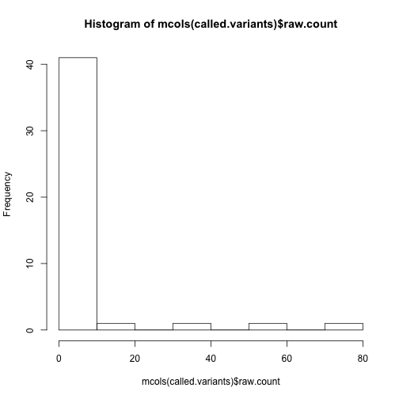
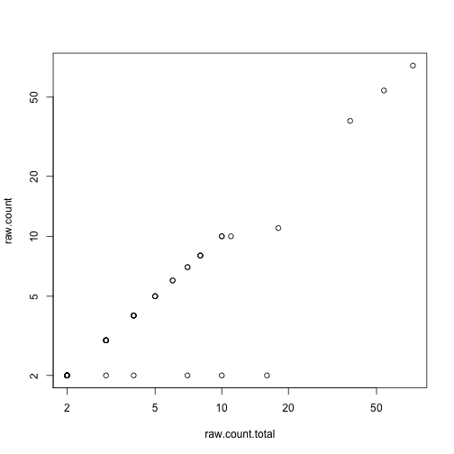

We start by loading all the libraries we will need for calling and annotating single nucleotide variants (SNVs).


```r
# biocLite('VariantAnnotation') biocLite('VariantTools')
# biocLite('TxDb.Hsapiens.UCSC.hg19.knownGene') biocLite('org.Hs.eg.db')
# biocLite('LungCancerLines') this package is 900 Mb
# biocLite('BSgenome.Hsapiens.UCSC.hg19')
library(VariantTools)
```

```
## Loading required package: IRanges
## Loading required package: methods
## Loading required package: BiocGenerics
## Loading required package: parallel
## 
## Attaching package: 'BiocGenerics'
## 
## The following objects are masked from 'package:parallel':
## 
##     clusterApply, clusterApplyLB, clusterCall, clusterEvalQ,
##     clusterExport, clusterMap, parApply, parCapply, parLapply,
##     parLapplyLB, parRapply, parSapply, parSapplyLB
## 
## The following object is masked from 'package:stats':
## 
##     xtabs
## 
## The following objects are masked from 'package:base':
## 
##     anyDuplicated, append, as.data.frame, as.vector, cbind,
##     colnames, do.call, duplicated, eval, evalq, Filter, Find, get,
##     intersect, is.unsorted, lapply, Map, mapply, match, mget,
##     order, paste, pmax, pmax.int, pmin, pmin.int, Position, rank,
##     rbind, Reduce, rep.int, rownames, sapply, setdiff, sort,
##     table, tapply, union, unique, unlist
## 
## Loading required package: GenomicRanges
## Loading required package: GenomeInfoDb
## Loading required package: VariantAnnotation
## Loading required package: Rsamtools
## Loading required package: XVector
## Loading required package: Biostrings
## 
## Attaching package: 'VariantAnnotation'
## 
## The following object is masked from 'package:base':
## 
##     tabulate
```

```r
library(TxDb.Hsapiens.UCSC.hg19.knownGene)
```

```
## Loading required package: GenomicFeatures
## Loading required package: AnnotationDbi
## Loading required package: Biobase
## Welcome to Bioconductor
## 
##     Vignettes contain introductory material; view with
##     'browseVignettes()'. To cite Bioconductor, see
##     'citation("Biobase")', and for packages 'citation("pkgname")'.
```

```r
library(org.Hs.eg.db)
```

```
## Loading required package: DBI
```

```r
library(LungCancerLines)
library(BSgenome.Hsapiens.UCSC.hg19)
```

```
## Loading required package: BSgenome
## 
## Attaching package: 'BSgenome'
## 
## The following object is masked from 'package:AnnotationDbi':
## 
##     species
```


## Calling variants

The `VariantTools` can be used to find variants using a reference genome and a file with aligned reads (BAM file). The reference genome needs to be a `GmapGenome`, but the `GmapGenome` function is available to convert any FASTA file to a genome for use with `VariantTools`.

Here we will examine RNA-Seq reads mapped to the TP53 gene plus 1 Mb flanking sequence.


```r
p53 <- gmapR:::exonsOnTP53Genome("TP53")
genome <- gmapR::TP53Genome()
# ?LungCancerBamFiles
bams <- LungCancerLines::LungCancerBamFiles()
path(bams)
```

```
##                                                                                                             H1993 
## "/usr/local/Cellar/r/3.1.0/R.framework/Versions/3.1/Resources/library/LungCancerLines/extdata/H1993.analyzed.bam" 
##                                                                                                             H2073 
## "/usr/local/Cellar/r/3.1.0/R.framework/Versions/3.1/Resources/library/LungCancerLines/extdata/H2073.analyzed.bam"
```

```r
bam <- bams$H1993
```


Again, note that the genome is not hg19.


```r
p53
```

```
## GRanges with 21 ranges and 1 metadata column:
##        seqnames             ranges strand   |   exon_id
##           <Rle>          <IRanges>  <Rle>   | <integer>
##    [1]     TP53 [1000001, 1000236]      -   |    224094
##    [2]     TP53 [1004308, 1004466]      -   |    224095
##    [3]     TP53 [1006624, 1007912]      -   |    224096
##    [4]     TP53 [1008831, 1008937]      -   |    224097
##    [5]     TP53 [1011429, 1011488]      -   |    224098
##    ...      ...                ...    ... ...       ...
##   [17]     TP53 [1014604, 1014844]      -   |    224110
##   [18]     TP53 [1014743, 1014841]      -   |    224111
##   [19]     TP53 [1014743, 1014844]      -   |    224112
##   [20]     TP53 [1015547, 1015649]      -   |    224113
##   [21]     TP53 [1025599, 1025772]      -   |    224114
##   ---
##   seqlengths:
##       TP53
##    2025772
```

```r
# Bioc 2.13
library(GenomicRanges)
# Bioc 2.14
library(GenomicAlignments)
readGAlignments(bam)
```

```
## GAlignments with 4980 alignments and 0 metadata columns:
##          seqnames strand       cigar    qwidth     start       end
##             <Rle>  <Rle> <character> <integer> <integer> <integer>
##      [1]     TP53      +       99M1S       100    237885    237983
##      [2]     TP53      -  53M107N47M       100    237931    238137
##      [3]     TP53      +        100M       100    238941    239040
##      [4]     TP53      -        100M       100    239044    239143
##      [5]     TP53      +       3S97M       100    258991    259087
##      ...      ...    ...         ...       ...       ...       ...
##   [4976]     TP53      - 74M7376N26M       100   1961426   1968901
##   [4977]     TP53      +  38M146N62M       100   1961462   1961707
##   [4978]     TP53      - 41M7156N59M       100   1961679   1968934
##   [4979]     TP53      +        100M       100   1970185   1970284
##   [4980]     TP53      -        100M       100   1970259   1970358
##              width     njunc
##          <integer> <integer>
##      [1]        99         0
##      [2]       207         1
##      [3]       100         0
##      [4]       100         0
##      [5]        97         0
##      ...       ...       ...
##   [4976]      7476         1
##   [4977]       246         1
##   [4978]      7256         1
##   [4979]       100         0
##   [4980]       100         0
##   ---
##   seqlengths:
##       TP53
##    2025772
```


We can write out a FASTA file for use in IGV.


```r
x <- as(genome, "DNAStringSet")
library(rtracklayer)
export(x, "genome.fasta")
path(bam)
```

```
## [1] "/usr/local/Cellar/r/3.1.0/R.framework/Versions/3.1/Resources/library/LungCancerLines/extdata/H1993.analyzed.bam"
```


The following call will use a binomial likelihood ratio test to call variants. From the help file:

> The test amounts to excluding putative variants with less than ~4% alt frequency. 
> A variant is also required to be represented by at least 2 alt reads. 

Regarding base quality, the help says 

> we typically use 56 for old Illumina, 23 for Sanger/Illumina1.8.

The `TallyVariantsParam` step takes some time the first time it is run (15 minutes or so).


```r
tally.param <- TallyVariantsParam(genome, high_base_quality = 23L, which = range(p53) + 
    50000)
called.variants <- callVariants(bam, tally.param)
called.variants
```

```
## VRanges with 4 ranges and 15 metadata columns:
##       seqnames             ranges strand         ref              alt
##          <Rle>          <IRanges>  <Rle> <character> <characterOrRle>
##   [1]     TP53 [1003991, 1003991]      +           T                C
##   [2]     TP53 [1012459, 1012459]      +           G                C
##   [3]     TP53 [1013114, 1013114]      +           T                C
##   [4]     TP53 [1014376, 1014376]      +           G                C
##           totalDepth       refDepth       altDepth   sampleNames
##       <integerOrRle> <integerOrRle> <integerOrRle> <factorOrRle>
##   [1]              2              0              2          <NA>
##   [2]              8              0              8          <NA>
##   [3]              4              0              4          <NA>
##   [4]              4              0              4          <NA>
##       softFilterMatrix | raw.count raw.count.ref raw.count.total
##               <matrix> | <integer>     <integer>       <integer>
##   [1]                  |         2             0               2
##   [2]                  |         8             0               8
##   [3]                  |         4             0               4
##   [4]                  |         4             0               4
##       mean.quality mean.quality.ref count.plus count.plus.ref count.minus
##          <numeric>        <numeric>  <integer>      <integer>   <integer>
##   [1]           33              NaN          1              0           1
##   [2]       35.375              NaN          6              0           2
##   [3]        35.75              NaN          0              0           4
##   [4]        34.75              NaN          1              0           3
##       count.minus.ref read.pos.mean read.pos.mean.ref read.pos.var
##             <integer>     <numeric>         <numeric>    <numeric>
##   [1]               0          36.5               NaN       2112.5
##   [2]               0        64.125               NaN   990.984375
##   [3]               0         49.75               NaN    2435.9375
##   [4]               0          31.5               NaN      1363.75
##       read.pos.var.ref     mdfne mdfne.ref
##              <numeric> <numeric> <numeric>
##   [1]             <NA>      <NA>      <NA>
##   [2]             <NA>      <NA>      <NA>
##   [3]             <NA>      <NA>      <NA>
##   [4]             <NA>      <NA>      <NA>
##   ---
##   seqlengths:
##       TP53
##    2025772
##   hardFilters(4): nonRef nonNRef readCount likelihoodRatio
```


Now we will call variants for the whole region:


```r
tally.param <- TallyVariantsParam(genome, high_base_quality = 23L)
called.variants <- callVariants(bam, tally.param)
called.variants
```

```
## VRanges with 45 ranges and 15 metadata columns:
##        seqnames             ranges strand         ref              alt
##           <Rle>          <IRanges>  <Rle> <character> <characterOrRle>
##    [1]     TP53   [352607, 352607]      +           C                T
##    [2]     TP53   [352702, 352702]      +           T                C
##    [3]     TP53   [353997, 353997]      +           T                C
##    [4]     TP53   [589438, 589438]      +           G                A
##    [5]     TP53   [589486, 589486]      +           T                C
##    ...      ...                ...    ...         ...              ...
##   [41]     TP53 [1813169, 1813169]      +           T                C
##   [42]     TP53 [1813170, 1813170]      +           G                A
##   [43]     TP53 [1813836, 1813836]      +           A                G
##   [44]     TP53 [1851805, 1851805]      +           C                T
##   [45]     TP53 [1859174, 1859174]      +           G                A
##            totalDepth       refDepth       altDepth   sampleNames
##        <integerOrRle> <integerOrRle> <integerOrRle> <factorOrRle>
##    [1]             10              0             10          <NA>
##    [2]              4              0              4          <NA>
##    [3]              3              0              3          <NA>
##    [4]              4              0              4          <NA>
##    [5]              3              0              3          <NA>
##    ...            ...            ...            ...           ...
##   [41]              3              0              3          <NA>
##   [42]              3              0              3          <NA>
##   [43]              7              0              7          <NA>
##   [44]              2              0              2          <NA>
##   [45]              2              0              2          <NA>
##        softFilterMatrix   | raw.count raw.count.ref raw.count.total
##                <matrix>   | <integer>     <integer>       <integer>
##    [1]                    |        10             0              10
##    [2]                    |         4             0               4
##    [3]                    |         3             0               3
##    [4]                    |         4             0               4
##    [5]                    |         3             0               3
##    ...              ... ...       ...           ...             ...
##   [41]                    |         3             0               3
##   [42]                    |         3             0               3
##   [43]                    |         7             0               7
##   [44]                    |         2             0               2
##   [45]                    |         2             0               2
##            mean.quality mean.quality.ref count.plus count.plus.ref
##               <numeric>        <numeric>  <integer>      <integer>
##    [1]             34.3              NaN          2              0
##    [2]            34.75              NaN          0              0
##    [3] 29.6666666666667              NaN          2              0
##    [4]             34.5              NaN          1              0
##    [5]               38              NaN          1              0
##    ...              ...              ...        ...            ...
##   [41]               25              NaN          1              0
##   [42]               24              NaN          1              0
##   [43] 38.1428571428571              NaN          3              0
##   [44]               39              NaN          0              0
##   [45]               37              NaN          1              0
##        count.minus count.minus.ref    read.pos.mean read.pos.mean.ref
##          <integer>       <integer>        <numeric>         <numeric>
##    [1]           8               0             62.9               NaN
##    [2]           4               0            27.25               NaN
##    [3]           1               0 62.3333333333333               NaN
##    [4]           3               0               45               NaN
##    [5]           2               0 36.3333333333333               NaN
##    ...         ...             ...              ...               ...
##   [41]           2               0 75.3333333333333               NaN
##   [42]           2               0               75               NaN
##   [43]           4               0 30.7142857142857               NaN
##   [44]           2               0             31.5               NaN
##   [45]           1               0             62.5               NaN
##            read.pos.var read.pos.var.ref     mdfne mdfne.ref
##               <numeric>        <numeric> <numeric> <numeric>
##    [1] 1106.36777777778             <NA>      <NA>      <NA>
##    [2] 421.770833333333             <NA>      <NA>      <NA>
##    [3] 3255.05555555556             <NA>      <NA>      <NA>
##    [4]             1881             <NA>      <NA>      <NA>
##    [5] 962.388888888889             <NA>      <NA>      <NA>
##    ...              ...              ...       ...       ...
##   [41] 2997.88888888889             <NA>      <NA>      <NA>
##   [42]           2969.5             <NA>      <NA>      <NA>
##   [43] 1263.46598639456             <NA>      <NA>      <NA>
##   [44]            924.5             <NA>      <NA>      <NA>
##   [45]           2112.5             <NA>      <NA>      <NA>
##   ---
##   seqlengths:
##       TP53
##    2025772
##   hardFilters(4): nonRef nonNRef readCount likelihoodRatio
```


How many non-reference alleles do we see:


```r
hist(mcols(called.variants)$raw.count)
```

 

```r
with(mcols(called.variants), plot(raw.count.total, raw.count, log = "xy"))
```

 

```r
(i <- which.max(mcols(called.variants)$raw.count))
```

```
## [1] 9
```

```r
called.variants[i, ]
```

```
## VRanges with 1 range and 15 metadata columns:
##       seqnames           ranges strand         ref              alt
##          <Rle>        <IRanges>  <Rle> <character> <characterOrRle>
##   [1]     TP53 [650046, 650046]      +           G                A
##           totalDepth       refDepth       altDepth   sampleNames
##       <integerOrRle> <integerOrRle> <integerOrRle> <factorOrRle>
##   [1]             67              0             67          <NA>
##       softFilterMatrix | raw.count raw.count.ref raw.count.total
##               <matrix> | <integer>     <integer>       <integer>
##   [1]                  |        72             1              73
##           mean.quality mean.quality.ref count.plus count.plus.ref
##              <numeric>        <numeric>  <integer>      <integer>
##   [1] 36.1492537313433              NaN         43              0
##       count.minus count.minus.ref read.pos.mean read.pos.mean.ref
##         <integer>       <integer>     <numeric>         <numeric>
##   [1]          29               1            51                85
##           read.pos.var read.pos.var.ref     mdfne mdfne.ref
##              <numeric>        <numeric> <numeric> <numeric>
##   [1] 580.464788732394             <NA>      <NA>      <NA>
##   ---
##   seqlengths:
##       TP53
##    2025772
##   hardFilters(4): nonRef nonNRef readCount likelihoodRatio
```


## Writing out VCF files


```r
sampleNames(called.variants) <- "H1993"
mcols(called.variants) <- NULL
vcf <- asVCF(called.variants)
writeVcf(vcf, "H1993.vcf", index = TRUE)
```


A few more details:


```r
# ?postFilterVariants ?callSampleSpecificVariants
somatic <- callSampleSpecificVariants(bams$H1993, bams$H2073, tally.param)
```


## Reading in VCF and annotating

To annotate the VCF, we start by loading a UCSC transcript database:


```r
library(TxDb.Hsapiens.UCSC.hg19.knownGene)
txdb <- TxDb.Hsapiens.UCSC.hg19.knownGene
```


Now we read in a small subset of a VCF file, over chr22, which is stored in the VariantAnnotation package. Note that the `readVcf` function can be slow if the file is many Mb. This one is less than 1 Mb.


```r
library(VariantAnnotation)
fl <- system.file("extdata", "chr22.vcf.gz", package = "VariantAnnotation")
vcf <- readVcf(fl, genome = "hg19")
rowData(vcf)
```

```
## GRanges with 10376 ranges and 5 metadata columns:
##               seqnames               ranges strand   | paramRangeID
##                  <Rle>            <IRanges>  <Rle>   |     <factor>
##     rs7410291       22 [50300078, 50300078]      *   |         <NA>
##   rs147922003       22 [50300086, 50300086]      *   |         <NA>
##   rs114143073       22 [50300101, 50300101]      *   |         <NA>
##   rs141778433       22 [50300113, 50300113]      *   |         <NA>
##   rs182170314       22 [50300166, 50300166]      *   |         <NA>
##           ...      ...                  ...    ... ...          ...
##   rs187302552       22 [50999536, 50999536]      *   |         <NA>
##     rs9628178       22 [50999538, 50999538]      *   |         <NA>
##     rs5770892       22 [50999681, 50999681]      *   |         <NA>
##   rs144055359       22 [50999830, 50999830]      *   |         <NA>
##   rs114526001       22 [50999964, 50999964]      *   |         <NA>
##                          REF                ALT      QUAL      FILTER
##               <DNAStringSet> <DNAStringSetList> <numeric> <character>
##     rs7410291              A                  G       100        PASS
##   rs147922003              C                  T       100        PASS
##   rs114143073              G                  A       100        PASS
##   rs141778433              C                  T       100        PASS
##   rs182170314              C                  T       100        PASS
##           ...            ...                ...       ...         ...
##   rs187302552              A                  G       100        PASS
##     rs9628178              A                  G       100        PASS
##     rs5770892              A                  G       100        PASS
##   rs144055359              G                  A       100        PASS
##   rs114526001              G                  C       100        PASS
##   ---
##   seqlengths:
##    22
##    NA
```


Note that we can also restrict the amount we read in, either by specifying a range, or using yieldSize


```r
param <- ScanVcfParam(which = GRanges("22", IRanges(50500000, 50600000)))
vcf <- readVcf(fl, genome = "hg19", param = param)
rowData(vcf)
```

```
## GRanges with 1726 ranges and 5 metadata columns:
##                   seqnames               ranges strand   | paramRangeID
##                      <Rle>            <IRanges>  <Rle>   |     <factor>
##       rs142027672       22 [50500000, 50500000]      *   |         <NA>
##   22:50500032_C/T       22 [50500032, 50500032]      *   |         <NA>
##        rs75152548       22 [50500263, 50500263]      *   |         <NA>
##       rs190746868       22 [50500297, 50500297]      *   |         <NA>
##       rs183916737       22 [50500375, 50500375]      *   |         <NA>
##               ...      ...                  ...    ... ...          ...
##       rs187838910       22 [50599491, 50599491]      *   |         <NA>
##       rs148213119       22 [50599735, 50599735]      *   |         <NA>
##       rs141267497       22 [50599771, 50599771]      *   |         <NA>
##   22:50599777_C/T       22 [50599777, 50599777]      *   |         <NA>
##       rs150761060       22 [50599930, 50599930]      *   |         <NA>
##                              REF                ALT      QUAL      FILTER
##                   <DNAStringSet> <DNAStringSetList> <numeric> <character>
##       rs142027672              C                  T       100        PASS
##   22:50500032_C/T              C                  T       100        PASS
##        rs75152548              T                  C       100        PASS
##       rs190746868              C                  T       100        PASS
##       rs183916737              G                  T       100        PASS
##               ...            ...                ...       ...         ...
##       rs187838910              G                  A       100        PASS
##       rs148213119              G                  A       100        PASS
##       rs141267497              G                  A       100        PASS
##   22:50599777_C/T              C                  T       100        PASS
##       rs150761060              C                  T       100        PASS
##   ---
##   seqlengths:
##    22
##    NA
```

```r
# ?readVcf
```


We can find which variants overlap coding regions with the `locateVariants` function:


```r
# here we hack the chromosome from '22' to 'chr22'
seqlevels(vcf) <- paste0("chr", seqlevels(vcf))
loc <- locateVariants(vcf, txdb, CodingVariants())
loc
```

```
## GRanges with 455 ranges and 7 metadata columns:
##         seqnames               ranges strand   | LOCATION   QUERYID
##            <Rle>            <IRanges>  <Rle>   | <factor> <integer>
##     [1]    chr22 [50500032, 50500032]      -   |   coding         2
##     [2]    chr22 [50500032, 50500032]      -   |   coding         2
##     [3]    chr22 [50500032, 50500032]      -   |   coding         2
##     [4]    chr22 [50500032, 50500032]      -   |   coding         2
##     [5]    chr22 [50500032, 50500032]      -   |   coding         2
##     ...      ...                  ...    ... ...      ...       ...
##   [451]    chr22 [50599253, 50599253]      +   |   coding      1717
##   [452]    chr22 [50599253, 50599253]      +   |   coding      1717
##   [453]    chr22 [50599466, 50599466]      +   |   coding      1721
##   [454]    chr22 [50599466, 50599466]      +   |   coding      1721
##   [455]    chr22 [50599466, 50599466]      +   |   coding      1721
##              TXID     CDSID      GENEID       PRECEDEID        FOLLOWID
##         <integer> <integer> <character> <CharacterList> <CharacterList>
##     [1]     75255    218579       23209                                
##     [2]     75256    218579       23209                                
##     [3]     75257    218579       23209                                
##     [4]     75258    218579       23209                                
##     [5]     75259    218579       23209                                
##     ...       ...       ...         ...             ...             ...
##   [451]     74369    216346       54456                                
##   [452]     74372    216346       54456                                
##   [453]     74366    216347       54456                                
##   [454]     74367    216347       54456                                
##   [455]     74372    216347       54456                                
##   ---
##   seqlengths:
##    chr22
##       NA
```


We can double check that it did what we expected:


```r
loc[1]
```

```
## GRanges with 1 range and 7 metadata columns:
##       seqnames               ranges strand | LOCATION   QUERYID      TXID
##          <Rle>            <IRanges>  <Rle> | <factor> <integer> <integer>
##   [1]    chr22 [50500032, 50500032]      - |   coding         2     75255
##           CDSID      GENEID       PRECEDEID        FOLLOWID
##       <integer> <character> <CharacterList> <CharacterList>
##   [1]    218579       23209                                
##   ---
##   seqlengths:
##    chr22
##       NA
```

```r
g <- genes(txdb)
fo <- findOverlaps(loc[1], g)
fo
```

```
## Hits of length 1
## queryLength: 1
## subjectLength: 23056
##   queryHits subjectHits 
##    <integer>   <integer> 
##  1         1        7061
```

```r
g[subjectHits(fo)]
```

```
## GRanges with 1 range and 1 metadata column:
##         seqnames               ranges strand |         gene_id
##            <Rle>            <IRanges>  <Rle> | <CharacterList>
##   23209    chr22 [50497820, 50524358]      - |           23209
##   ---
##   seqlengths:
##                    chr1                 chr2 ...       chrUn_gl000249
##               249250621            243199373 ...                38502
```

```r
loc[1]
```

```
## GRanges with 1 range and 7 metadata columns:
##       seqnames               ranges strand | LOCATION   QUERYID      TXID
##          <Rle>            <IRanges>  <Rle> | <factor> <integer> <integer>
##   [1]    chr22 [50500032, 50500032]      - |   coding         2     75255
##           CDSID      GENEID       PRECEDEID        FOLLOWID
##       <integer> <character> <CharacterList> <CharacterList>
##   [1]    218579       23209                                
##   ---
##   seqlengths:
##    chr22
##       NA
```


