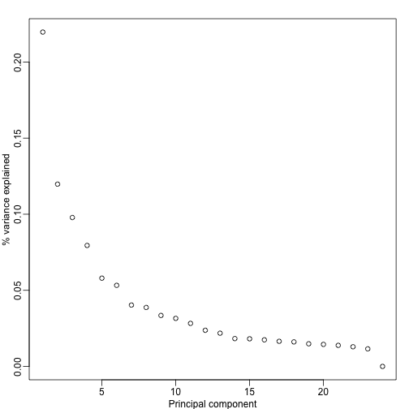
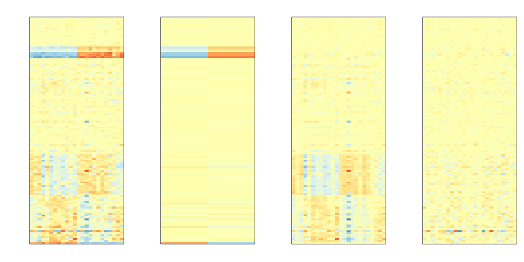

##  Modeling Batch Effects with Factor Analysis

The R markdown document for this section is available [here](https://github.com/genomicsclass/labs/tree/master/batch/adjusting_with_factor_analysis.Rmd).

To illustrate how we can adjust for batch effects using statistical methods, we continue to use our subset example with sex as the outcome of interest, and with months purposely somewhat confounded with sex. 


```r
library(GSE5859Subset)
data(GSE5859Subset)
```

Below is an image we showed earlier with a subset of genes showing both the sex effect and the time effects, along with sample to sample correlations (computed on all genes) showing the complex structure of the data:


```r
library(rafalib)
library(RColorBrewer)
library(genefilter)


sex <- sampleInfo$group

batch <- factor(format(sampleInfo$date,"%m"))

chr <- geneAnnotation$CHR

tt<-rowttests(geneExpression,batch)

ind1 <- which(chr=="chrY") #real differences
ind2 <- setdiff(c(order(tt$dm)[1:25],order(-tt$dm)[1:25]),ind1)

set.seed(1)
ind0 <- setdiff(sample(seq(along=tt$dm),50),c(ind2,ind1))
geneindex<-c(ind2,ind0,ind1)
mat<-geneExpression[geneindex,]
mat <- mat -rowMeans(mat)
icolors <- colorRampPalette(rev(brewer.pal(11,"RdYlBu")))(100)

mypar(1,2)
image(t(mat),xaxt="n",yaxt="n",col=icolors)
y <- geneExpression - rowMeans(geneExpression)
image(1:ncol(y),1:ncol(y),cor(y),col=icolors,zlim=c(-1,1),
       xaxt="n",xlab="",yaxt="n",ylab="")
axis(2,1:ncol(y),sex,las=2)
axis(1,1:ncol(y),sex,las=2)
```

 


We have seen how approaches that assume month explains the batch and use linear models perform relatively well. However, there was still room for improvement. This is most likely due to the fact that month is only a surrogate for some other variable that actually induces structure or between sample correlation.

#### What is a batch?

Here is a plot of dates for each sample, with color representing month:


```r
times <-sampleInfo$date 
mypar(1,1)
o=order(times)
plot(times[o],pch=21,bg=as.numeric(batch)[o],ylab="date")
o=order(times)
plot(times[o],pch=21,bg=as.numeric(batch)[o],ylab="date")
```

 
There is more than one day per month. Could day have an effect as well?


#### PCA

Here is a plot of the first principal component ordered by date:

```r
s <- svd(y)
mypar(1,1)
o<-order(times)
cols <- as.numeric( batch)
plot(s$v[o,1],pch=21,cex=1.25,bg=cols[o],ylab="First PC",xaxt="n",xlab="")
legend("topleft",c("Month 1","Month 2"),col=1:2,pch=16,box.lwd=0)
```

 

Day seems to be highly correlated and explained a high percentage of the variability:


```r
mypar(1,1)
plot(s$d^2/sum(s$d^2),ylab="% variance explained",xlab="Principal component")
```

 

In fact, the first six or so PC seem to be at least partially driven by date:

```r
mypar(3,4)
for(i in 1:12){
  days <- gsub("2005-","",times)  
  boxplot(split(s$v[,i],gsub("2005-","",days)))
}
```

 


What happens if we simply remove the top six PC from the data and then perform a t-test? 


```r
D <- s$d; D[1:4]<-0 #take out first 2
cleandat <- sweep(s$u,2,D,"*")%*%t(s$v)
res <-rowttests(cleandat,factor(sex))
```

This does remove the batch effect, but it seems we have also removed much of the biological effect we are interested in. In fact, no genes have q-value <0.1 anymore.


```r
mypar(1,2)
hist(res$p.value[which(!chr%in%c("chrX","chrY") )],main="",ylim=c(0,1300))

plot(res$dm,-log10(res$p.value))
points(res$dm[which(chr=="chrX")],-log10(res$p.value[which(chr=="chrX")]),col=1,pch=16)
points(res$dm[which(chr=="chrY")],-log10(res$p.value[which(chr=="chrY")]),col=2,pch=16,xlab="Effect size",ylab="-log10(p-value)")
legend("bottomright",c("chrX","chrY"),col=1:2,pch=16)
```

 

<a name="sva"></a>
#### Surrogate Variable Analysis

An alternative is to fit models with both the covariate of interest, as well as those believed to be batches. An example of an approach that does this is Surrogate Variable Analysis (SVA).

The basic idea of SVA is to first estimate the factors, but taking care not to include the outcome of interest. To do this, an interactive approach is used in which each row is given a weight. These weights are then used in the SVD calculation with higher weights given to rows not associated with the outcome of interest and associated with batches. Below is a demonstration of two iterations. The three images are the data (for a subset of genes), the weights, and the estimated first factor.


```r
library(sva)
```

```
## Loading required package: mgcv
## Loading required package: nlme
## This is mgcv 1.8-6. For overview type 'help("mgcv-package")'.
```

```r
library(limma)
mod <- model.matrix(~sex)
cind <- order( as.Date(sampleInfo$date) )
dates <- gsub("2005-","",sampleInfo$date)
weights=rep(1,nrow(y))
par(mar = c(4.1, 2.1, 3.5, 2.1), 
    mgp = c(1.5, 0.5, 0))
layout(matrix(c(1:6),nrow=2,byrow=TRUE),widths=c(5,1.5,5))
for(b in 1:2){
  image(1:ncol(mat),1:nrow(mat),t(mat[,cind]*weights[geneindex]),xaxt="n",yaxt="n",col=icolors,xlab="",ylab="")
  axis(side=1,seq(along=dates),dates[cind],las=2)
  abline(v=12.5)
  
  svafit <- sva(y,mod,B=b,n.sv=5)
  weights = svafit$pprob.gam*(1-svafit$pprob.b)
  
  surrogate <- svd( y*weights)$v[,1]#Weighted SVD
  
  image(matrix(weights[geneindex],nrow=1),xaxt="n",yaxt="n",col=brewer.pal(9,"Blues"))
  plot(surrogate[cind],bg=sex[cind]+1,pch=21,xlab="",xaxt="n",ylab="Surrogate variable",ylim=c(-.5,.5),cex=1.5)
  axis(side=1,seq(along=dates),dates[cind],las=2)
  abline(v=12.5)
  text(1,0.5,"June")
  text(13.5,0.5,"Oct")
  legend("bottomright",c("0","1"),col=c(1,2),pch=16)
}
```

```
## Number of significant surrogate variables is:  5 
## Iteration (out of 1 ):1
```

```
## Number of significant surrogate variables is:  5 
## Iteration (out of 2 ):1  2
```

 


The above is an illustration of the algorithm. To actually run SVA, we follow the code. In this case, SVA picks the number of surrogate values or factors for us.


```r
library(limma)
svafit <- sva(geneExpression,mod)
```

```
## Number of significant surrogate variables is:  5 
## Iteration (out of 5 ):1  2  3  4  5
```

```r
svaX<-model.matrix(~sex+svafit$sv)
lmfit <- lmFit(geneExpression,svaX)
tt<- lmfit$coef[,2]*sqrt(lmfit$df.residual)/(2*lmfit$sigma)
```

There is an observable improvement over all other approaches:


```r
res <- data.frame(dm= -lmfit$coef[,2],
                  p.value=2*(1-pt(abs(tt),lmfit$df.residual[1]) ) )
mypar(1,2)
hist(res$p.value[which(!chr%in%c("chrX","chrY") )],main="",ylim=c(0,1300))

plot(res$dm,-log10(res$p.value))
points(res$dm[which(chr=="chrX")],-log10(res$p.value[which(chr=="chrX")]),col=1,pch=16)
points(res$dm[which(chr=="chrY")],-log10(res$p.value[which(chr=="chrY")]),col=2,pch=16,xlab="Effect size",ylab="-log10(p-value)")
legend("bottomright",c("chrX","chrY"),col=1:2,pch=16)
```

 


And here is a decompose of the data into sex effects, surrogate variables, and independent noise:


```r
Batch<- lmfit$coef[geneindex,3:7]%*%t(svaX[,3:7])
Signal<-lmfit$coef[geneindex,1:2]%*%t(svaX[,1:2])
error <- geneExpression[geneindex,]-Signal-Batch
##demean for plot
Signal <-Signal-rowMeans(Signal)
mat <- geneExpression[geneindex,]-rowMeans(geneExpression[geneindex,])
mypar(1,4,mar = c(2.75, 4.5, 2.6, 1.1))
image(t(mat),col=icolors,zlim=c(-5,5),xaxt="n",yaxt="n")
image(t(Signal),col=icolors,zlim=c(-5,5),xaxt="n",yaxt="n")
image(t(Batch),col=icolors,zlim=c(-5,5),xaxt="n",yaxt="n")
image(t(error),col=icolors,zlim=c(-5,5),xaxt="n",yaxt="n")
```

 


