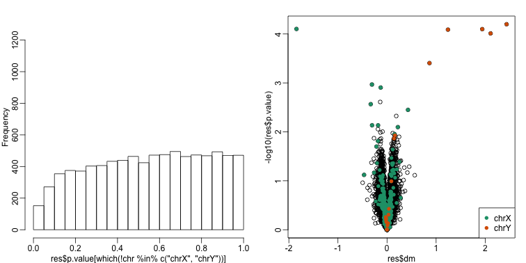

##  Modeling Batch Effects with Factor Analysis

We continue to use this data set:

```r
library(GSE5859Subset)
data(GSE5859Subset)
```

Below is the image we showed earlier with a subset of genes showing both the sex effect and the month time effects, but now with an image showing the sample to sample correlations (computed on all genes) showing the complex structure of the data (code not shown):


 


We have seen how the approach that assumes month explains the batch and adjusts with linear models perform relatively well. However, there was still room for improvement. This is most likely due to the fact that month is only a surrogate for some hidden factor or factors that actually induces structure or between sample correlation.

#### What is a batch?

Here is a plot of dates for each sample, with color representing month:


```r
times <-sampleInfo$date 
mypar(1,1)
o=order(times)
plot(times[o],pch=21,bg=as.numeric(batch)[o],ylab="date")
o=order(times)
plot(times[o],pch=21,bg=as.numeric(batch)[o],ylab="date")
```

 

We note that there is more than one day per month. Could day have an effect as well? We can use PCA and EDA to try to answer this question. Here is a plot of the first principal component ordered by date:


```r
s <- svd(y)
mypar(1,1)
o<-order(times)
cols <- as.numeric( batch)
plot(s$v[o,1],pch=21,cex=1.25,bg=cols[o],ylab="First PC",xaxt="n",xlab="")
legend("topleft",c("Month 1","Month 2"),col=1:2,pch=16,box.lwd=0)
```

 

Day seems to be highly correlated with the first PC, which explains a high percentage of the variability:


```r
mypar(1,1)
plot(s$d^2/sum(s$d^2),ylab="% variance explained",xlab="Principal component")
```

 

Further exploration shows that the first six or so PC seem to be at least partially driven by date:

```r
mypar(3,4)
for(i in 1:12){
  days <- gsub("2005-","",times)  
  boxplot(split(s$v[,i],gsub("2005-","",days)))
}
```

 


So what happens if we simply remove the top six PC from the data and then perform a t-test? 


```r
D <- s$d; D[1:4]<-0 #take out first 2
cleandat <- sweep(s$u,2,D,"*")%*%t(s$v)
res <-rowttests(cleandat,factor(sex))
```

This does remove the batch effect, but it seems we have also removed much of the biological effect we are interested in. In fact, no genes have q-value <0.1 anymore.


```r
library(qvalue)
mypar(1,2)
hist(res$p.value[which(!chr%in%c("chrX","chrY") )],main="",ylim=c(0,1300))

plot(res$dm,-log10(res$p.value))
points(res$dm[which(chr=="chrX")],-log10(res$p.value[which(chr=="chrX")]),col=1,pch=16)
points(res$dm[which(chr=="chrY")],-log10(res$p.value[which(chr=="chrY")]),col=2,pch=16,xlab="Effect size",ylab="-log10(p-value)")
legend("bottomright",c("chrX","chrY"),col=1:2,pch=16)
```

 

```r
qvals <- qvalue(res$p.value)$qvalue
index <- which(qvals<0.1)

cat("Total genes with q-value < 0.1: ",length(index),"\n",
    "Number of selected genes on chrY: ", sum(chr[index]=="chrY",na.rm=TRUE),"\n",
    "Number of selected genes on chrX: ", sum(chr[index]=="chrX",na.rm=TRUE),sep="")
```

```
## Total genes with q-value < 0.1: 0
## Number of selected genes on chrY: 0
## Number of selected genes on chrX: 0
```

In this case we seem to have over corrected since we now recover many fewer chromosome Y genes and the p-value histogram shows a dearth of small p-values that makes the distribution non-uniform. Because sex is probably correlated with some of the first PCs, this may be a case of "throwing out the baby with the bath water".

<a name="sva"></a>

#### Surrogate Variable Analysis

A solution to the problem of over-correcting and removing the variability associated with the outcome of interest is fit models with both the covariate of interest, as well as those believed to be batches. An example of an approach that does this is [Surrogate Variable Analysis](http://www.ncbi.nlm.nih.gov/pmc/articles/PMC1994707/) (SVA).

The basic idea of SVA is to first estimate the factors, but taking care not to include the outcome of interest. To do this, an interactive approach is used in which each row is given a weight that quantifies the probability of the gene being exclusively associated with the surrogate variables and not the outcome of interest. These weights are then used in the SVD calculation with higher weights given to rows not associated with the outcome of interest and associated with batches. Below is a demonstration of two iterations. The three images are the data multiplied by the weight (for a subset of genes), the weights, and the estimated first factor (code not shown).


```
## Loading required package: mgcv
## Loading required package: nlme
## This is mgcv 1.8-7. For overview type 'help("mgcv-package")'.
```

```
## Number of significant surrogate variables is:  5 
## Iteration (out of 1 ):1
```

```
## Number of significant surrogate variables is:  5 
## Iteration (out of 2 ):1  2
```

 

The algorithm iterates this procedure several times (controlled by `B` argument) and returns an estimate of the surrogate variables, which are analogous to the hidden factors of factor analysis.
To actually run SVA, we run the `sva` function. In this case, SVA picks the number of surrogate values or factors for us.


```r
library(limma)
svafit <- sva(geneExpression,mod)
```

```
## Number of significant surrogate variables is:  5 
## Iteration (out of 5 ):1  2  3  4  5
```

```r
svaX<-model.matrix(~sex+svafit$sv)
lmfit <- lmFit(geneExpression,svaX)
tt<- lmfit$coef[,2]*sqrt(lmfit$df.residual)/(2*lmfit$sigma)
```

There is an improvement over previous approaches:


```r
res <- data.frame(dm= -lmfit$coef[,2],
                  p.value=2*(1-pt(abs(tt),lmfit$df.residual[1]) ) )
mypar(1,2)
hist(res$p.value[which(!chr%in%c("chrX","chrY") )],main="",ylim=c(0,1300))

plot(res$dm,-log10(res$p.value))
points(res$dm[which(chr=="chrX")],-log10(res$p.value[which(chr=="chrX")]),col=1,pch=16)
points(res$dm[which(chr=="chrY")],-log10(res$p.value[which(chr=="chrY")]),col=2,pch=16,xlab="Effect size",ylab="-log10(p-value)")
legend("bottomright",c("chrX","chrY"),col=1:2,pch=16)
```

 

```r
qvals <- qvalue(res$p.value)$qvalue
index <- which(qvals<0.1)

cat("Total genes with q-value < 0.1: ",length(index),"\n",
    "Number of selected genes on chrY: ", sum(chr[index]=="chrY",na.rm=TRUE),"\n",
    "Number of selected genes on chrX: ", sum(chr[index]=="chrX",na.rm=TRUE),sep="")
```

```
## Total genes with q-value < 0.1: 14
## Number of selected genes on chrY: 5
## Number of selected genes on chrX: 8
```


To visualize what SVA achieved, below is a visualization of the original dataset decomposed into sex effects, surrogate variables, and independent noise estimated by the algorithm (code not shown):

 


