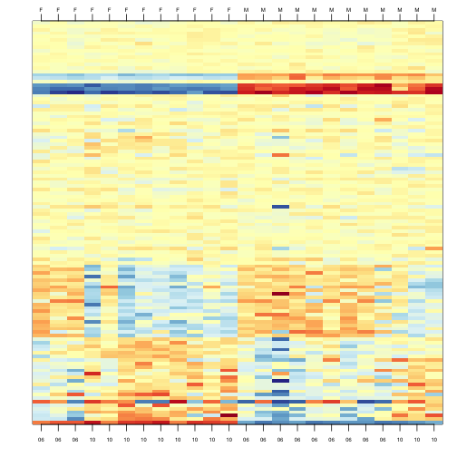

## Motivation for Statistical Approaches

#### Data example

To illustrate how we can adjust for batch effects using statistical methods, we will create a data example in which the outcome of interest is somewhat confounded with batch, but not completely. To aid with the illustration and assessment of the methods we demonstrate, we will also select an outcome for which we have an expectation of what genes should be differentially expressed. Namely, we make sex the outcome of interest and expect genes on the Y chromosome to be differentially expressed. We may also see genes from the X chromosome as differentially expressed since some escape X inactivation. The data with these properties is the one included in this dataset:


```r
##available from course github repository
library(GSE5859Subset)
data(GSE5859Subset)
```

We can see the correlation between sex and month:

```r
month <- format(sampleInfo$date,"%m")
table(sampleInfo$group, month)
```

```
##    month
##     06 10
##   0  9  3
##   1  3  9
```


To illustrate the confounding, we will pick some genes to show in a heatmap plot. We pick 1) all Y chromosome genes, 2) some genes that we see correlate with batch, and 3) some randomly selected genes. The image below (code not shown) shows high values in red, low values in blue, middle values in yellow. Each column is a sample and each row is one of the randomly selected genes:

 

In the plot above, the first 12 columns are females (1s) and the last 12 columns are males (0s). We can see some Y chromosome genes towards the top since they are blue for females and red from males. We can also see some genes that correlate with month towards the bottom of the image. Some genes are low in June (6) and high in October (10), while others do the opposite. The month effect is not as clear as the sex effect, but it is certainly present.  

In what follows, we will imitate the typical analysis we would do in practice. We will act as if we don't know which genes are supposed to be differentially expressed between males and females, find genes that are differentially expressed, and the evaluate these methods by comparing to what we expect to be correct. Note while in the plot we only show a few genes, for the analysis we analyze 
all 8,793.


#### Assessment plots and summaries

For the assessment of the methods we present, we will assume that 
autosomal (not on chromosome X or Y) genes on the list are likely false positives. We will also assume that genes on chromosome Y are likely true positives. Chromosome X genes could go either way. This gives us the opportunity to estimate both specificity and sensitivity. Since in practice we rarely know the "truth", these evaluations are not possible. Simulations are therefore commonly used for evaluation purposes: we know the truth because we construct the data. However, simulations are at risk of not capturing all the nuances of real experimental data. In contrast, this dataset is an experimental dataset. 

In the next sections, we will use the histogram p-values  to evaluate the specificity (low false positive rates) of the batch adjustment procedures presented here. Because the autosomal genes are not expected to be differentially expressed, we should see a a flat p-value histogram. To evaluate sensitivity (low false negative rates), we will report the number of the reported genes on chromosome X and chromosome Y for which we reject the null hypothesis. We also include a volcano plot with a horizontal dashed line separating the genes called significant from those that are not, and colors used to highlight chromosome X and Y genes.

Below are the results of applying a naive t-test and report genes with q-values smaller than 0.1. 


```r
library(qvalue)
res <- rowttests(geneExpression,as.factor( sampleInfo$group ))
mypar(1,2)
hist(res$p.value[which(!chr%in%c("chrX","chrY") )],main="",ylim=c(0,1300))

plot(res$dm,-log10(res$p.value))
points(res$dm[which(chr=="chrX")],-log10(res$p.value[which(chr=="chrX")]),col=1,pch=16)
points(res$dm[which(chr=="chrY")],-log10(res$p.value[which(chr=="chrY")]),col=2,pch=16,xlab="Effect size",ylab="-log10(p-value)")
legend("bottomright",c("chrX","chrY"),col=1:2,pch=16)
qvals <- qvalue(res$p.value)$qvalue
index <- which(qvals<0.1)
abline(h=-log10(max(res$p.value[index])))
```

 

```r
cat("Total genes with q-value < 0.1: ",length(index),"\n",
    "Number of selected genes on chrY: ", sum(chr[index]=="chrY",na.rm=TRUE),"\n",
    "Number of selected genes on chrX: ", sum(chr[index]=="chrX",na.rm=TRUE),sep="")
```

```
## Total genes with q-value < 0.1: 59
## Number of selected genes on chrY: 8
## Number of selected genes on chrX: 12
```

We immediately note that the histogram is not flat. Instead, low p-values are over-represented. Furthermore, more than half of the genes on the final list are autosomal. We now describe two statistical solutions and try to improve on this.

## Adjusting for Batch Effects with Linear Models

We have already observed that processing date has an effect on gene expression.  We will therefore try to _adjust_ for this by including it in a model.  When we perform a t-test comparing the two groups, it is equivalent to fitting the following linear model:

$$Y_{ij} = \alpha_j + x_i \beta_{j} + \varepsilon_{ij}$$

to each gene $$j$$ with $$x_i=1$$ if subject $$i$$ is female and 0 otherwise. Note that $$\beta_{j}$$ represents the estimated difference for gene $$j$$ and $$\varepsilon_{ij}$$ represents the within group variation. So what is the problem?

The theory we described in the linear models chapter assumes that the error terms are independent. We know that this is not the case for all genes because we know the error terms from October will be more alike to each other than the June error terms. We can _adjust_ for this by including a term that models this effect:


$$Y_{ij} = \alpha_j + x_i \beta_{j} + z_i \gamma_j+\varepsilon_{ij}.$$

Here $$z_i=1$$ if sample $$i$$ was processed in October and 0 otherwise and $$\gamma_j$$ is the month effect for gene $$j$$. This an example of how linear models give us much more flexibility than procedures such as the t-test.

We construct a model matrix that includes batch.

```r
sex <- sampleInfo$group
X <- model.matrix(~sex+batch)
```

Now we can fit a model for each gene. For example, note the difference between the original model and one that has been adjusted for batch:


```r
j <- 7635
y <- geneExpression[j,]
X0 <- model.matrix(~sex) 
fit <- lm(y~X0-1)
summary(fit)$coef
```

```
##                 Estimate Std. Error   t value     Pr(>|t|)
## X0(Intercept)  6.9555747  0.2166035 32.112008 5.611901e-20
## X0sex         -0.6556865  0.3063237 -2.140502 4.365102e-02
```

```r
X <- model.matrix(~sex+batch)
fit <- lm(y~X)
summary(fit)$coef
```

```
##                Estimate Std. Error    t value     Pr(>|t|)
## (Intercept)  7.26329968  0.1605560 45.2384140 2.036006e-22
## Xsex        -0.04023663  0.2427379 -0.1657616 8.699300e-01
## Xbatch10    -1.23089977  0.2427379 -5.0709009 5.070727e-05
```

We then fit this new model for each gene. For instance, we can use `sapply` to recover the estimated coefficient and p-value in the following way:


```r
res <- t( sapply(1:nrow(geneExpression),function(j){
  y <- geneExpression[j,]
  fit <- lm(y~X-1)
  summary(fit)$coef[2,c(1,4)]
} ) )


##turn into data.frame so we can use the same code for plots as above
res <- data.frame(res)
names(res) <- c("dm","p.value")

mypar(1,2)
hist(res$p.value[which(!chr%in%c("chrX","chrY") )],main="",ylim=c(0,1300))

plot(res$dm,-log10(res$p.value))
points(res$dm[which(chr=="chrX")],-log10(res$p.value[which(chr=="chrX")]),col=1,pch=16)
points(res$dm[which(chr=="chrY")],-log10(res$p.value[which(chr=="chrY")]),col=2,pch=16,xlab="Effect size",ylab="-log10(p-value)")
legend("bottomright",c("chrX","chrY"),col=1:2,pch=16)
qvals <- qvalue(res$p.value)$qvalue
index <- which(qvals<0.1)
abline(h=-log10(max(res$p.value[index])))
```

 

```r
cat("Total genes with q-value < 0.1: ",length(index),"\n",
    "Number of selected genes on chrY: ", sum(chr[index]=="chrY",na.rm=TRUE),"\n",
    "Number of selected genes on chrX: ", sum(chr[index]=="chrX",na.rm=TRUE),sep="")
```

```
## Total genes with q-value < 0.1: 17
## Number of selected genes on chrY: 6
## Number of selected genes on chrX: 9
```

There is a great improvement in specificity (less false positives) without much loss in sensitivity (we still find many chromosome Y genes). However, we still see some bias in the histogram. In a later section we will see that month does not perfectly account for the batch effect and that better estimates are possible.


#### A note on computing efficiency

In the code above, the design matrix does not change within the iterations we are computing $$(X^\top X)^{-1}$$ repeatedly and applying to each gene. Instead we can perform this calculation in one matrix algebra calculation by computing it once and then obtaining all the betas by multiplying $$(X^\top X)^{-1}X^\top Y$$ with the columns of $$Y$$ representing genes in this case. The `limma` package has an implementation of this idea (using the QR decomposition). Notice how much faster this is:


```r
library(limma)
X <- model.matrix(~sex+batch)
fit <- lmFit(geneExpression,X)
```

The estimated regression coefficients for each gene are obtained like this:

```r
dim( fit$coef)
```

```
## [1] 8793    3
```
We have one estimate for each gene. To obtain p-values for one of these, we have to construct the ratios:


```r
k <- 2 ##second coef
ses <- fit$stdev.unscaled[,k]*fit$sigma
ttest <- fit$coef[,k]/ses
pvals <- 2*pt(-abs(ttest),fit$df)
```

#### Combat

 [Combat](http://biostatistics.oxfordjournals.org/content/8/1/118.short) is a popular method and is based on using linear models to adjust for batch effects. It fits a hierarchical model to estimate and remove row specific batch effects. Combat uses a modular approach. In a first step, what is considered to be a batch effect is removed:


```r
library(sva) #available from Bioconductor
mod <- model.matrix(~sex)
cleandat <- ComBat(geneExpression,batch,mod)
```

```
## Found 2 batches
## Adjusting for 1 covariate(s) or covariate level(s)
## Standardizing Data across genes
## Fitting L/S model and finding priors
## Finding parametric adjustments
## Adjusting the Data
```

Then the results can be used to fit a model with our variable of interest:


```r
res<-genefilter::rowttests(cleandat,factor(sex))
```

In this case, the results are less specific than what we obtain by fitting the simple linear model:


```r
mypar(1,2)
hist(res$p.value[which(!chr%in%c("chrX","chrY") )],main="",ylim=c(0,1300))

plot(res$dm,-log10(res$p.value))
points(res$dm[which(chr=="chrX")],-log10(res$p.value[which(chr=="chrX")]),col=1,pch=16)
points(res$dm[which(chr=="chrY")],-log10(res$p.value[which(chr=="chrY")]),col=2,pch=16,xlab="Effect size",ylab="-log10(p-value)")
legend("bottomright",c("chrX","chrY"),col=1:2,pch=16)
qvals <- qvalue(res$p.value)$qvalue
index <- which(qvals<0.1)
abline(h=-log10(max(res$p.value[index])))
```

 

```r
cat("Total genes with q-value < 0.1: ",length(index),"\n",
    "Number of selected genes on chrY: ", sum(chr[index]=="chrY",na.rm=TRUE),"\n",
    "Number of selected genes on chrX: ", sum(chr[index]=="chrX",na.rm=TRUE),sep="")
```

```
## Total genes with q-value < 0.1: 68
## Number of selected genes on chrY: 8
## Number of selected genes on chrX: 16
```

