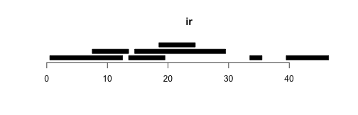
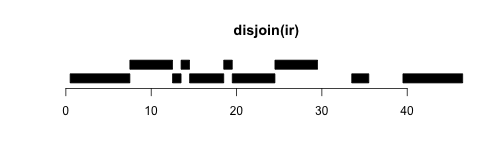
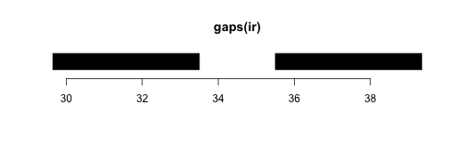
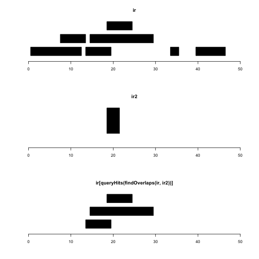

# Organizing genomic sequences: GRanges

It is seldom of great interest to compute with the
entire chromosomal sequence.  Subsequences formed of
contiguous bases are used to define genes and other
genomic elements, and coincidences of subsequences (for
example, sequences defining locations of variants and
sequences defining locations of promoters) should
be efficiently computable.

## IRanges, the low-level support infrastructure

The IRanges package provides a very basic and efficient
set of structures and tools for manipulating intervals,
defined as sequences of consecutive integers.  The IRanges
instances can be handled as vectors of intervals.

### Construction and arithmetic


```r
library(IRanges)
i1 = IRanges(start=c(3,4,5,6), end=c(400,450,20, 122))
i2 = IRanges(start=c(34,52,68,777), end=c(4400,1450,209, 2122))
i1
```

```
## IRanges of length 4
##     start end width
## [1]     3 400   398
## [2]     4 450   447
## [3]     5  20    16
## [4]     6 122   117
```

Arithmetic on IRanges instances is specialized.  Ranges
contract when a constant (vector) is subtracted from them, and expand when
a constant (vector) is added. 


```r
i2-10
```

```
## IRanges of length 4
##     start  end width
## [1]    44 4390  4347
## [2]    62 1440  1379
## [3]    78  199   122
## [4]   787 2112  1326
```

```r
i1+(1:4)
```

```
## IRanges of length 4
##     start end width
## [1]     2 401   400
## [2]     2 452   451
## [3]     2  23    22
## [4]     2 126   125
```

### Coercion

A column-oriented representation can be produced.

```r
as(i1, "data.frame")
```

```
##   start end width
## 1     3 400   398
## 2     4 450   447
## 3     5  20    16
## 4     6 122   117
```

When repeated overlap testing is to be performed, it can
be useful to coerce an `IRanges` instance to class `IntervalTree`.
We will address this in benchmarking examples later on.

### Reduce, disjoin, gaps

We'll borrow some code from the IRanges vignette to illustrate
additional ideas.


```r
ir <- IRanges(c(1, 8, 14, 15, 19, 34, 40),
  width = c(12, 6, 6, 15, 6, 2, 7))
```

First, let's visualize `ir`:

```r
plotRanges(ir)
```

 
Operations reduce, disjoin, and gaps have the following results:

```r
plotRanges(reduce(ir))
```

 

```r
plotRanges(disjoin(ir))
```

 

```r
plotRanges(gaps(ir))
```

 

### findOverlaps

We'll create another IRanges instance to illustrate findOverlaps.

```r
ir2 = IRanges(19,21)
findOverlaps(ir, ir2)
```

```
## Hits of length 3
## queryLength: 7
## subjectLength: 1
##   queryHits subjectHits 
##    <integer>   <integer> 
##  1         3           1 
##  2         4           1 
##  3         5           1
```

`findOverlaps` creates a `Hits` instance which can be
queried for indices of query or subject ranges satisfying
the overlap conditions.


```r
 par(mfrow=c(3,1))
 plotRanges(ir, xlim=c(0,50))
 plotRanges(ir2, xlim=c(0,50))
 plotRanges(ir[queryHits(findOverlaps(ir,ir2))], xlim=c(0,50))
```

 

### Partitionings

It is often useful to distinguish subsets of ranges.  When
this is done on a large scale, copying can be a concern.
A partitioning structure can be added to reflect the
substructure and to direct subset-oriented computations.


```r
irs = split(ir, c(1,1,2,2,3,3,3))
irs
```

```
## IRangesList of length 3
## $$`1`
## IRanges of length 2
##     start end width
## [1]     1  12    12
## [2]     8  13     6
## 
## $$`2`
## IRanges of length 2
##     start end width
## [1]    14  19     6
## [2]    15  29    15
## 
## $$`3`
## IRanges of length 3
##     start end width
## [1]    19  24     6
## [2]    34  35     2
## [3]    40  46     7
```

```r
elementLengths(irs)
```

```
## 1 2 3 
## 2 2 3
```

### Metadata

Range-specific metadata can be attached using a `DataFrame` instance.
In this example, we want to label each range with a letter and
supply a random uniform score.


```r
irmd = DataFrame( code=LETTERS[1:7], score=runif(7) )
mcols(ir) = irmd
ir
```

```
## IRanges of length 7
##     start end width
## [1]     1  12    12
## [2]     8  13     6
## [3]    14  19     6
## [4]    15  29    15
## [5]    19  24     6
## [6]    34  35     2
## [7]    40  46     7
```

```r
mcols(ir)  # could be elementMetadata, but falling out of favor
```

```
## DataFrame with 7 rows and 2 columns
##          code     score
##   <character> <numeric>
## 1           A 0.1270245
## 2           B 0.4672968
## 3           C 0.3404941
## 4           D 0.2318309
## 5           E 0.1680202
## 6           F 0.1224445
## 7           G 0.4648833
```

Also useful is a global metadata facility.  This involves
creating and binding a list.

```r
metadata(ir) = list(creator="Vince", creationDate=date())
```

The latter approach to fostering object self-description is
underutilized.

## IRanges applied to genomic sequences: GRanges

Efficient computations on chromosome contents and
subsequences are performed using IRanges infrastructure
with additional metadata that help define genomic
context.  These include

- `seqinfo`, to identify high-level organizing elements such as reference build and chromosome lengths from which the specific ranges in an object are derived
- `seqnames`, to provide, on a range-specific basis, the name of the sequence from which the range is derived
- `strand`, to indicate strand of residence of a range, when relevant

To illustrate, we'll use the custom `ph525x` package to
create a gene model.

```r
library(ph525x)
om = genemodel("ORMDL3")
om
```

```
## GRanges object with 8 ranges and 2 metadata columns:
##       seqnames               ranges strand |   exon_id   exon_name
##          <Rle>            <IRanges>  <Rle> | <integer> <character>
##   [1]    chr17 [38077296, 38078938]      - |    226677        <NA>
##   [2]    chr17 [38079365, 38079516]      - |    226678        <NA>
##   [3]    chr17 [38080283, 38080473]      - |    226679        <NA>
##   [4]    chr17 [38080283, 38080478]      - |    226680        <NA>
##   [5]    chr17 [38081008, 38081058]      - |    226681        <NA>
##   [6]    chr17 [38081422, 38081624]      - |    226682        <NA>
##   [7]    chr17 [38081876, 38083094]      - |    226683        <NA>
##   [8]    chr17 [38083737, 38083884]      - |    226684        <NA>
##   -------
##   seqinfo: 93 sequences (1 circular) from hg19 genome
```
This represents the addresses of exons identified in transcripts
associated with ORMDL3.  We can create a picture, again using
a custom function.  The amount of infrastructure required is
substantial, but once it is in place, we can create models
and visualizations fairly rapidly.


```r
modPlot("ORMDL3", collapse=FALSE, useGeneSym=FALSE)
```

 

The additional information defining genomic context is worth reviewing.

```r
seqinfo(om)
```

```
## Seqinfo object with 93 sequences (1 circular) from hg19 genome:
##   seqnames       seqlengths isCircular genome
##   chr1            249250621      FALSE   hg19
##   chr2            243199373      FALSE   hg19
##   chr3            198022430      FALSE   hg19
##   chr4            191154276      FALSE   hg19
##   chr5            180915260      FALSE   hg19
##   ...                   ...        ...    ...
##   chrUn_gl000245      36651      FALSE   hg19
##   chrUn_gl000246      38154      FALSE   hg19
##   chrUn_gl000247      36422      FALSE   hg19
##   chrUn_gl000248      39786      FALSE   hg19
##   chrUn_gl000249      38502      FALSE   hg19
```

```r
seqnames(om)
```

```
## factor-Rle of length 8 with 1 run
##   Lengths:     8
##   Values : chr17
## Levels(93): chr1 chr2 chr3 ... chrUn_gl000248 chrUn_gl000249
```

```r
strand(om)
```

```
## factor-Rle of length 8 with 1 run
##   Lengths: 8
##   Values : -
## Levels(3): + - *
```

The use of run-length-encoding for highly repetitious components
like seqnames and strand achieves efficiency of representation.

## Using GRanges to create views of chromosomal substructures

With the hg19 reference, we can obtain addresses of all
genes and their sequence contents very efficiently.

To do this we use a `TxDb` instance that includes transcript
addresses for the knownGene track of the UCSC hg19 build.

### The TxDb transcript databases

Addresses, names and relationships among transcripts, exons, and
genes are modeled in the TxDb framework.


```r
library(BSgenome.Hsapiens.UCSC.hg19)
library(TxDb.Hsapiens.UCSC.hg19.knownGene)
txdb = TxDb.Hsapiens.UCSC.hg19.knownGene  # abbreviate
txdb
```

```
## TxDb object:
## | Db type: TxDb
## | Supporting package: GenomicFeatures
## | Data source: UCSC
## | Genome: hg19
## | Organism: Homo sapiens
## | UCSC Table: knownGene
## | Resource URL: http://genome.ucsc.edu/
## | Type of Gene ID: Entrez Gene ID
## | Full dataset: yes
## | miRBase build ID: GRCh37
## | transcript_nrow: 82960
## | exon_nrow: 289969
## | cds_nrow: 237533
## | Db created by: GenomicFeatures package from Bioconductor
## | Creation time: 2014-09-26 11:16:12 -0700 (Fri, 26 Sep 2014)
## | GenomicFeatures version at creation time: 1.17.17
## | RSQLite version at creation time: 0.11.4
## | DBSCHEMAVERSION: 1.0
```

The transcripts recorded for three Entrez genes are represented
thusly:

```r
txg = transcriptsBy(txdb, by="gene")
txg[8:10]
```

```
## GRangesList object of length 3:
## $$10001 
## GRanges object with 5 ranges and 2 metadata columns:
##       seqnames               ranges strand |     tx_id     tx_name
##          <Rle>            <IRanges>  <Rle> | <integer> <character>
##   [1]    chr14 [71050957, 71067384]      - |     52995  uc001xmf.3
##   [2]    chr14 [71050957, 71067384]      - |     52996  uc010tth.2
##   [3]    chr14 [71050957, 71067384]      - |     52997  uc010tti.2
##   [4]    chr14 [71059228, 71067384]      - |     52998  uc001xmg.1
##   [5]    chr14 [71059295, 71067384]      - |     52999  uc010ttj.2
## 
## $$10002 
## GRanges object with 2 ranges and 2 metadata columns:
##       seqnames               ranges strand | tx_id    tx_name
##   [1]    chr15 [72102894, 72107270]      + | 54546 uc002ath.1
##   [2]    chr15 [72102894, 72110597]      + | 54547 uc002ati.3
## 
## $$10003 
## GRanges object with 5 ranges and 2 metadata columns:
##       seqnames               ranges strand | tx_id    tx_name
##   [1]    chr11 [89867818, 89892505]      + | 42606 uc001pdd.2
##   [2]    chr11 [89867818, 89897369]      + | 42607 uc001pde.3
##   [3]    chr11 [89867818, 89925779]      + | 42608 uc001pdf.4
##   [4]    chr11 [89867818, 89925779]      + | 42609 uc009yvx.3
##   [5]    chr11 [89867818, 89925779]      + | 42610 uc009yvy.3
## 
## -------
## seqinfo: 93 sequences (1 circular) from hg19 genome
```

Other query functions for TxDb instances are provided
in the GenomicFeatures package.

### Extracting genomic sequence for genes

We can combine address information in the TxDb GRanges
with sequence information in the BSgenome.Hsapiens package.

We will focus on chromosome 17, using the `seqlevels`
facility with forcing.


```r
seqlevels(txdb, force=TRUE) = "chr17"
#ii = isActiveSeq(txdb)
#ii[] = FALSE
#ii["chr17"] = TRUE
#isActiveSeq(txdb) = ii
allg17 = genes(txdb)
call17 = getSeq(Hsapiens, allg17)
call17
```

```
##   A DNAStringSet instance of length 1357
##           width seq                                    names               
##    [1]      132 CCTCCTACAAAGGCATGT...AACCATCCCACATAGAA 100124536
##    [2]       98 TTGGGCAAGGTGCGGGGC...CTCAACCTTACTCGGTC 100126313
##    [3]      111 AGAGTGTTCAAGGACAGC...TTGCAGTGTGCATCGGG 100126356
##    [4]     2129 TTTTTTAGTTCCTGGTTC...GAGCAAGACTCTGTCTC 100128288
##    [5]    52158 GCGGCCGCCGAGTCCGTC...ATTAGGGCCCACCCTAA 100128977
##    ...      ... ...
## [1353]   174766 ATGCTTTGTGGGGACGTT...CTTTTTAATAATTTGGA 9931
## [1354]    44987 GTGGCCAGGGCGCGAGAG...ACAGCCCTAGGGTTCTG 9953
## [1355]   106239 CAGCGGCGGCCCAGGAGG...TAAAAAAATAAATCTTG 9955
## [1356]    71355 AATCGCTCGGCCTCCCCC...GGATATGGAAAATCCAA 996
## [1357]   122678 GTTTCTCTCTCTGGTCGG...TATTCATGAAGCCTTCA 9969
```

# Managing chromosome names and lengths: GenomeInfoDb

There are at least three prominent but incompatible
schemes for naming chromosomes.  The UCSC genome browser
uses "chr" as a prefix, omitted in most NCBI resources.
Many dbSNP builds use "ch".  Combining information
from different providers is often important, and depends
upon consistency in naming of `seqnames` elements of
GRanges instances.

The GenomeInfoDb package helps with establishing consistency.
Let's consider the genes on chromosome 17.  The seqinfo
element controls the labeling of seqnames.


```r
allg17
```

```
## GRanges object with 1357 ranges and 1 metadata column:
##             seqnames               ranges strand   |     gene_id
##                <Rle>            <IRanges>  <Rle>   | <character>
##   100124536    chr17 [65736786, 65736917]      +   |   100124536
##   100126313    chr17 [11985216, 11985313]      +   |   100126313
##   100126356    chr17 [29902430, 29902540]      +   |   100126356
##   100128288    chr17 [ 8261731,  8263859]      -   |   100128288
##   100128977    chr17 [43920722, 43972879]      -   |   100128977
##         ...      ...                  ...    ... ...         ...
##        9931    chr17 [65066554, 65241319]      -   |        9931
##        9953    chr17 [14204506, 14249492]      +   |        9953
##        9955    chr17 [13399006, 13505244]      -   |        9955
##         996    chr17 [45195311, 45266665]      -   |         996
##        9969    chr17 [60019966, 60142643]      -   |        9969
##   -------
##   seqinfo: 1 sequence from hg19 genome
```

```r
seqinfo(allg17)
```

```
## Seqinfo object with 1 sequence from hg19 genome:
##   seqnames seqlengths isCircular genome
##   chr17      81195210      FALSE   hg19
```

The `seqlevelsStyle` method can be used to switch nomenclatures.


```r
seqlevelsStyle(allg17) = "NCBI"
seqlevels(allg17)
```

```
## [1] "17"
```

This can be applied at high levels.

```r
seqlevelsStyle(Hsapiens) = "dbSNP"
seqlevels(Hsapiens)[1:8]
```

```
## [1] "ch1" "ch2" "ch3" "ch4" "ch5" "ch6" "ch7" "ch8"
```

```r
seqlevelsStyle(txdb)
```

```
## [1] "UCSC"
```

```r
seqlevelsStyle(txdb) = "NCBI"
seqlevels(txdb)
```

```
## [1] "17"
```

The seqinfo component that holds genome
tags and chromosome lengths is useful
for checking consistency between GRanges that may have been
generated independently, with limited provenance metadata.


```r
library(TxDb.Hsapiens.UCSC.hg38.knownGene)
tx38 = TxDb.Hsapiens.UCSC.hg38.knownGene
seqlevelsStyle(tx38) = "NCBI"
seqlevels(tx38, force=TRUE) = "17"
allg17_38 = genes(tx38)
fo = try(findOverlaps(allg17, allg17_38))
cat(fo)
```

```
## Error in mergeNamedAtomicVectors(genome(x), genome(y), what = c("sequence",  : 
##   sequence 17 has incompatible genomes:
##   - in 'x': hg19
##   - in 'y': hg38
```
