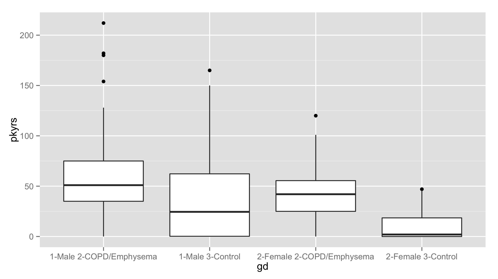
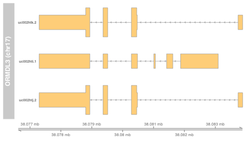

# The phenotype concept


- "Phenotype" is an extremely broad term
- In this course, it connotes low-dimensional representation of observable characteristics of an organism
- Representation can be numerical or categorical
    * units of measurement should be recorded
    * "codes" for categorical items should be clear

## Example: ExperimentalData package on COPD

We cross-tabulate gender and disease status for individuals in a study of chronic obstructive pulmonary disease


```r
library(COPDSexualDimorphism.data)
data(lgrc.expr.meta)
with(expr.meta, table(gender, diagmaj))
```

```
##           diagmaj
## gender     2-COPD/Emphysema 3-Control
##   1-Male                 93        26
##   2-Female               71        39
```
## Continuous by categorical

Here's a boxplot of pack-years distributions, stratified by
gender and disease status.  The stratum labels become clumsy.


```r
gd = with(expr.meta, factor(paste(gender,diagmaj)))
expr.meta$gd = gd
library(ggplot2)
```

```
## Loading required package: methods
```

```r
ggplot(expr.meta, aes(x=gd, y=pkyrs)) + geom_boxplot()
```



```r
#plot(pkyrs~gd, data=expr.meta)
```
## Phenotype carefully and record faithfully

- Validated questionnaires and protocols
- Standardized terminology, units
- Precise phenotypic characterization fosters more accurate mechanistic modeling
- Caveat: molecular "basis" suggests causal directionality, but phenotype and environment can influence molecular state

# Computing tools for inference on molecular mechanisms

- "Molecular basis" is likewise a broad notion
- Systematic terminologies exist to help clarify what is asserted in a given hypothesis or finding
- At the boundaries of scientific knowledge, disagreement is common and terminologies diverge
- Two examples: 
    * What is a gene?
    * What is a gene's function?
    
# Gene: A concrete computational definition

- ORMDL3 is a gene implicated in genome-wide association
studies as a factor in risk of asthma
- Here's a view of its "structure" according to human reference build hg19 (use ph525x::modPlot)

```r
library(ph525x)
```

```
## Loading required package: png
## Loading required package: grid
## Loading required package: Biobase
## Loading required package: BiocGenerics
## Loading required package: parallel
## 
## Attaching package: 'BiocGenerics'
## 
## The following objects are masked from 'package:parallel':
## 
##     clusterApply, clusterApplyLB, clusterCall, clusterEvalQ,
##     clusterExport, clusterMap, parApply, parCapply, parLapply,
##     parLapplyLB, parRapply, parSapply, parSapplyLB
## 
## The following object is masked from 'package:stats':
## 
##     xtabs
## 
## The following objects are masked from 'package:base':
## 
##     anyDuplicated, append, as.data.frame, as.vector, cbind,
##     colnames, do.call, duplicated, eval, evalq, Filter, Find, get,
##     intersect, is.unsorted, lapply, Map, mapply, match, mget,
##     order, paste, pmax, pmax.int, pmin, pmin.int, Position, rank,
##     rbind, Reduce, rep.int, rownames, sapply, setdiff, sort,
##     table, tapply, union, unique, unlist, unsplit
## 
## Welcome to Bioconductor
## 
##     Vignettes contain introductory material; view with
##     'browseVignettes()'. To cite Bioconductor, see
##     'citation("Biobase")', and for packages 'citation("pkgname")'.
```

```r
modPlot("ORMDL3", collapse=FALSE, useGeneSym=FALSE)
```

```
## Loading required package: Gviz
## Loading required package: S4Vectors
## Loading required package: stats4
## Loading required package: IRanges
## Loading required package: GenomeInfoDb
## Loading required package: GenomicRanges
## Loading required package: Homo.sapiens
## Loading required package: AnnotationDbi
## 
## Attaching package: 'AnnotationDbi'
## 
## The following object is masked from 'package:GenomeInfoDb':
## 
##     species
## 
## Loading required package: OrganismDbi
## Loading required package: GenomicFeatures
## Loading required package: GO.db
## Loading required package: DBI
## 
## Loading required package: org.Hs.eg.db
## 
## Loading required package: TxDb.Hsapiens.UCSC.hg19.knownGene
```

 
* This will change with new reference build GRCh38

# Characterizing ORMDL3 functionality


```r
library(Homo.sapiens)
orfunc = select(Homo.sapiens, key="ORMDL3", keytype="SYMBOL", 
   columns=c("GO", "TERM"))
```

```
## Warning in .generateExtraRows(tab, keys, jointype): 'select' resulted in
## 1:many mapping between keys and return rows
```

```
## Warning in .generateExtraRows(tab, keys, jointype): 'select' resulted in
## 1:many mapping between keys and return rows
```

```r
orfunc[,c("ONTOLOGY", "TERM")]
```

```
##   ONTOLOGY                           TERM
## 1       MF                protein binding
## 2       CC          endoplasmic reticulum
## 3       CC endoplasmic reticulum membrane
## 4       BP     ceramide metabolic process
## 5       CC integral component of membrane
## 6       CC                  SPOTS complex
```
- Gene Ontology standardizes terminology for biological processes, cellular components, and molecular functions

# Summary

* Phenotype characterization is challenging and frequently non-standard
* Tokens available for data analysis in R are fairly simple and are used in ad hoc ways to characterize sample phenotype and condition
* Reasoning about molecular processes underlying phenotype and disease states is intrinsically complex
* Standardized vocabularies and models exist and are available in Bioconductor, but limitations must be admitted

