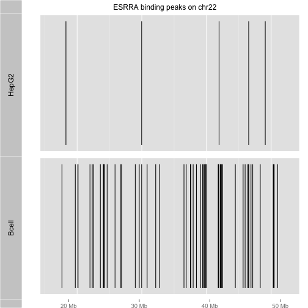
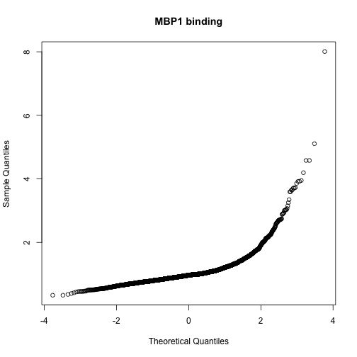
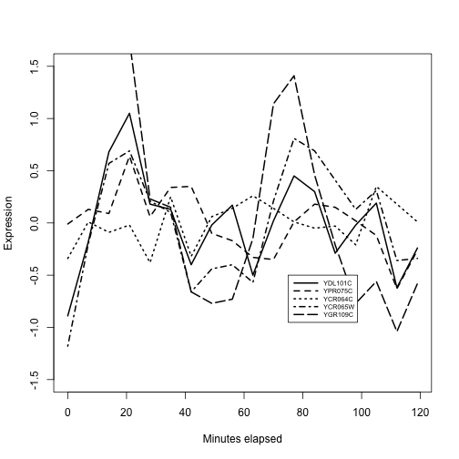

```
## Loading required package: methods
## Loading required package: stats4
## Loading required package: BiocGenerics
## Loading required package: parallel
## 
## Attaching package: 'BiocGenerics'
## 
## The following objects are masked from 'package:parallel':
## 
##     clusterApply, clusterApplyLB, clusterCall, clusterEvalQ,
##     clusterExport, clusterMap, parApply, parCapply, parLapply,
##     parLapplyLB, parRapply, parSapply, parSapplyLB
## 
## The following object is masked from 'package:stats':
## 
##     xtabs
## 
## The following objects are masked from 'package:base':
## 
##     anyDuplicated, append, as.data.frame, as.vector, cbind,
##     colnames, do.call, duplicated, eval, evalq, Filter, Find, get,
##     intersect, is.unsorted, lapply, Map, mapply, match, mget,
##     order, paste, pmax, pmax.int, pmin, pmin.int, Position, rank,
##     rbind, Reduce, rep.int, rownames, sapply, setdiff, sort,
##     table, tapply, union, unique, unlist, unsplit
## 
## Loading required package: Biobase
## Welcome to Bioconductor
## 
##     Vignettes contain introductory material; view with
##     'browseVignettes()'. To cite Bioconductor, see
##     'citation("Biobase")', and for packages 'citation("pkgname")'.
## 
## Loading required package: GenomeInfoDb
## Loading required package: S4Vectors
## Loading required package: IRanges
## 
## Attaching package: 'AnnotationDbi'
## 
## The following object is masked from 'package:GenomeInfoDb':
## 
##     species
## 
## Loading required package: ggplot2
## Need specific help about ggbio? try mailing 
##  the maintainer or visit http://tengfei.github.com/ggbio/
## 
## Attaching package: 'ggbio'
## 
## The following objects are masked from 'package:ggplot2':
## 
##     geom_bar, geom_rect, geom_segment, ggsave, stat_bin,
##     stat_identity, xlim
## 
## Loading required package: GenomicFeatures
## Loading required package: tools
## Loading required package: Biostrings
## Loading required package: XVector
## 
## Attaching package: 'harbChIP'
## 
## The following object is masked from 'package:OrganismDbi':
## 
##     keys
## 
## The following object is masked from 'package:AnnotationDbi':
## 
##     keys
## 
## The following object is masked from 'package:GenomeInfoDb':
## 
##     organism
```

## Introduction to architectural concepts for Bioconductor

The basic objective is to support an efficient and reliable flow of experimental
and reference data.

Start with

- Assay outputs bound to sample-level data

Pass to

- Algorithms for preprocessing to remove technical artifacts

Combine clean assay outputs with

- Annotation on genome structure and function and on experimental design

Continue with

- Algorithms for inference on biological hypotheses

Conclude with

- Efficient and appropriate reporting, visualization and export

As noted previously, your experiments and analyses may serve
as data and annotation for future experiments in other labs.

In this subunit we want to clarify some of the architectural
principles underlying Bioconductor so that this objective of
efficient and reliable data flow can be
achieved *making good use of community collaboration and
total commitment to open source*.

Our key topics will be:

- How to create R packages

- How to support integrative analysis of multiple assay types

- How to streamline access to curated institutional archives like GEO

- How to make good use of parallel computing concepts on laptops and clusters

- How Bioconductor ensures reliable interoperability of project software and data assets


## What is an R package?

Conceptually, an R package is a collection of functions, data
objects, and documentation that coherently support a family
of related data analysis operations.

Concretely, an R package is a structured collection of folders,
organized and populated according to the rules of
[Writing R Extensions](http://cran.r-project.org/doc/manuals/r-release/R-exts.html).

### A new software package with `package.skeleton`

We can create our own packages using `package.skeleton`.  We'll illustrate that now
with an enhancement to the ERBS package that was created for the course.
We'll create a new package that utilizes the peak data, defining
a function `juxta` that allows us to compare binding peak patterns for the two cell
types on a selected chromosome.  (I have commented out code that
uses an alternative graphics engine, for optional exploration.)

Here's a definition of `juxta`.  Add it to your R session.

```r
juxta = function (chrname="chr22", ...) 
{
    require(ERBS)
    data(HepG2)
    data(GM12878)
    require(ggbio)
    require(GenomicRanges)  # "subset" is overused, need import detail
    ap1 = autoplot(GenomicRanges::subset(HepG2, seqnames==chrname))
    ap2 = autoplot(GenomicRanges::subset(GM12878, seqnames==chrname))
    tracks(HepG2 = ap1, Bcell = ap2, ...)
# alternative code for Gviz below
#    require(Gviz)
#    ap1 = AnnotationTrack(GenomicRanges::subset(HepG2, seqnames==chrname))
#    names(ap1) = "HepG2"
#    ap2 = AnnotationTrack(GenomicRanges::subset(GM12878, seqnames==chrname))
#    names(ap2) = "B-cell"
#    ax = GenomeAxisTrack()
#    plotTracks(list(ax, ap1, ap2))
}
```

Now demonstrate it as follows.


```r
library(ERBS)
juxta("chr22", main="ESRRA binding peaks on chr22")
```

 

In the video we will show how to use `package.skeleton` and the Rstudio
editor to generate, document, and install this new package!  We will not
streamline the code in `juxta` to make use of inter-package
symbol transfer by properly writing the DESCRIPTION and NAMESPACE
files for the package, but leave this for an advanced course in
software development.

### A new annotation package with OrganismDbi

We have found the `Homo.sapiens` package to be quite convenient.
We can get gene models, symbol to GO mappings, and so on, without
remembering any more than `keytypes`, `columns`, `keys`, and `select`.
At present there is no similar resource for *S. cerevisiae*.
We can make one, following the OrganismDbi vignette.  This is
a very lightweight integrative package.


```r
library(OrganismDbi)
gd = list( join1 = c(GO.db="GOID", org.Sc.sgd.db="GO"),
           join2 = c(org.Sc.sgd.db="ENTREZID",
              TxDb.Scerevisiae.UCSC.sacCer3.sgdGene="GENEID"))
if (!file.exists("Sac.cer3")) # don't do twice...
makeOrganismPackage(pkgname="Sac.cer3",  # simplify typing!
  graphData=gd, organism="Saccharomyces cerevisiae",
  version="1.0.0", maintainer="Student <ph525x@harvardx.edu>",
  author="Student <ph525x@harvardx.edu>",
  destDir=".",
  license="Artistic-2.0")
```

At this point we have a folder structure in our
working folder that can support an installation.

```r
install.packages("Sac.cer3", repos=NULL, type="source")
library(Sac.cer3)
```

```
## Loading required package: GO.db
## Loading required package: DBI
## 
## Loading required package: org.Sc.sgd.db
## 
## Loading required package: TxDb.Scerevisiae.UCSC.sacCer3.sgdGene
```

```r
Sac.cer3
```

```
## class: OrganismDb 
## Annotation resources:
## [1] "GO.db"                                
## [2] "org.Sc.sgd.db"                        
## [3] "TxDb.Scerevisiae.UCSC.sacCer3.sgdGene"
## Annotation relationships:
##      xDbs            yDbs                                    xKeys     
## [1,] "GO.db"         "org.Sc.sgd.db"                         "GOID"    
## [2,] "org.Sc.sgd.db" "TxDb.Scerevisiae.UCSC.sacCer3.sgdGene" "ENTREZID"
##      yKeys   
## [1,] "GO"    
## [2,] "GENEID"
## For more details, please see the show methods for the component objects listed above.
```

```r
columns(Sac.cer3)
```

```
##  [1] "GOID"         "TERM"         "ONTOLOGY"     "DEFINITION"  
##  [5] "ORF"          "ENTREZID"     "PFAM"         "ENZYME"      
##  [9] "PATH"         "PMID"         "REFSEQ"       "ENSEMBL"     
## [13] "ENSEMBLPROT"  "ENSEMBLTRANS" "UNIPROT"      "GO"          
## [17] "EVIDENCE"     "GOALL"        "EVIDENCEALL"  "ONTOLOGYALL" 
## [21] "DESCRIPTION"  "COMMON"       "INTERPRO"     "SMART"       
## [25] "SGD"          "ALIAS"        "CHRLOC"       "CHRLOCEND"   
## [29] "GENENAME"     "CHR"          "CDSID"        "CDSNAME"     
## [33] "CDSCHROM"     "CDSSTRAND"    "CDSSTART"     "CDSEND"      
## [37] "EXONID"       "EXONNAME"     "EXONCHROM"    "EXONSTRAND"  
## [41] "EXONSTART"    "EXONEND"      "GENEID"       "TXID"        
## [45] "EXONRANK"     "TXNAME"       "TXCHROM"      "TXSTRAND"    
## [49] "TXSTART"      "TXEND"
```

```r
genes(Sac.cer3)
```

```
## GRanges object with 6534 ranges and 1 metadata column:
##             seqnames           ranges strand   |        GENEID
##                <Rle>        <IRanges>  <Rle>   | <IntegerList>
##       Q0010     chrM   [ 3952,  4415]      +   |         Q0010
##       Q0032     chrM   [11667, 11957]      +   |         Q0032
##       Q0055     chrM   [13818, 26701]      +   |         Q0055
##       Q0075     chrM   [24156, 25255]      +   |         Q0075
##       Q0080     chrM   [27666, 27812]      +   |         Q0080
##         ...      ...              ...    ... ...           ...
##     YPR200C   chrXVI [939279, 939671]      -   |       YPR200C
##     YPR201W   chrXVI [939922, 941136]      +   |       YPR201W
##     YPR202W   chrXVI [943032, 944188]      +   |       YPR202W
##   YPR204C-A   chrXVI [946856, 947338]      -   |     YPR204C-A
##     YPR204W   chrXVI [944603, 947701]      +   |       YPR204W
##   -------
##   seqinfo: 17 sequences (1 circular) from sacCer3 genome
```

## Packages that provide access to data external to R

In this subunit we have created two packages.  `erbsViz` was created to provide
packaged access to an R function `juxta`, that we coded.
`Sac.cer3` was created to provide access to an instance of the
`OrganismDb` class, which is an S4 object.

There are many examples of R packages that include or facilitate
access to entities that are not R functions or data objects.  By far
the most common examples of this approach are the annotation packages
that employ relational databases to serve data to R sessions.
Other examples provide access to other types of data, often
as illustrations of how R-based infrastructure can be used
to efficiently interact with non-R data.  We'll now illustrate
two of these bridging package concepts.

### SQLite as the back end

SQL stands for Structured Query Language.  This is a highly
regimented language used for working with relational databases.
Knowledge of SQL permits us to work with databases in Microsoft Access,
Oracle, Postgres, and other relational data stores.
The basic idea of relational databases is that data we are interested
in can be stored in rectangular tables, with rows thought of as records
and columns thought of as attributes.  Our primary activities with
a database are choosing attributes of interest (this is carried
out with the SQL operation called "SELECT"), specifying the tables
where these attributes should be looked up (with "FROM" or "USING" 
clauses), and filtering records (with "WHERE" clauses).  We'll
have an example below.

SQLite is an open-source relational database system that
requires no special configuration or infrastructure.  We can
interact with SQLite databases and tables through R's database interface
package (DBI) and the RSQLite package that implements the
interface protocol for SQLite.  Here's an example.
We'll look at the database underlying the GO.db annotation package.


```r
library(GO.db)
```
There is a file on disk containing all the annotation data.

```r
GO.db$conn@dbname
```

```
## [1] "/Library/Frameworks/R.framework/Versions/3.1/Resources/library/GO.db/extdata/GO.sqlite"
```
We can list the tables present in the database.  We pass
the connection object to `dbListTables`.

```r
dbListTables( GO.db$conn )
```

```
##  [1] "go_bp_offspring" "go_bp_parents"   "go_cc_offspring"
##  [4] "go_cc_parents"   "go_mf_offspring" "go_mf_parents"  
##  [7] "go_obsolete"     "go_ontology"     "go_synonym"     
## [10] "go_term"         "map_counts"      "map_metadata"   
## [13] "metadata"        "sqlite_stat1"
```

Everything else that we are concerned with involves constructing
SQL queries and executing them in the database.  You can
have a look at the SQLite web page for background and details
on valid query syntax.

Here we sample records from the table that manages
terms corresponding to GO categories using a limit clause.

```r
dbGetQuery( GO.db$conn, "select * from go_term limit 5")
```

```
##   _id      go_id                                        term ontology
## 1  27 GO:0000001                   mitochondrion inheritance       BP
## 2  29 GO:0000002            mitochondrial genome maintenance       BP
## 3  30 GO:0000003                                reproduction       BP
## 4  34 GO:0042254                         ribosome biogenesis       BP
## 5  35 GO:0044183 protein binding involved in protein folding       MF
##                                                                                                                                                                                                           definition
## 1                            The distribution of mitochondria, including the mitochondrial genome, into daughter cells after mitosis or meiosis, mediated by interactions between mitochondria and the cytoskeleton.
## 2                                                                  The maintenance of the structure and integrity of the mitochondrial genome; includes replication and segregation of the mitochondrial chromosome.
## 3                                                                                       The production of new individuals that contain some portion of genetic material inherited from one or more parent organisms.
## 4      A cellular process that results in the biosynthesis of constituent macromolecules, assembly, and arrangement of constituent parts of ribosome subunits; includes transport to the sites of protein synthesis.
## 5 Interacting selectively and non-covalently with any protein or protein complex (a complex of two or more proteins that may include other nonprotein molecules) that contributes to the process of protein folding.
```

The `dbGetQuery` function will return a data.frame instance.
Why don't we just manage the annotation as a data.frame?  There
are several reasons.  First, for very large data tables, just
loading the data into an R session can be time consuming and
interferes with interactivity.  Second, SQLite includes
considerable infrastructure that optimizes query resolution, particularly
when multiple tables are being joined.  It is better to capitalize
on that investment than to add tools for query optimization to the
R language.

Fortunately, if you are not interested in direct interaction with
the RDBMS, you can pretend it is not there, and just work with the
high-level R annotation functions that we have described.

### Tabix-indexed text or BAM as the back end

Our example data for import (narrowPeak files in the ERBS package)
was low volume and we have no problem importing the entire contents
of each file into R.  In certain cases, very large quantities
of data may be provided in narrowPeak or other genomic file formats
like bed or bigWig, and it will be cumbersome to import the
entire file.  

The Tabix utilities for compressing and indexing textual files
presenting data on genomic coordinates can be used through the
Rsamtools and rtracklayer packages.  Once the records have been
sorted and compressed, Tabix indexing allows us to make targeted
queries of the data in the files.  We can traverse a file
in chunks to keep our memory footprint small; we can even process
multiple chunks in parallel in certain settings.

We will illustrate some of these ideas in the video.  An important
bit of knowledge is that you can sort a bed file, on a unix system,
with the command `sort -k1,1 -k2,2g -o ...`, and this is a necessary
prelude to Tabix indexing.

Here's how we carried out the activities of the video:
```
# check file
head ENCFF001VEH.narrowPeak
# sort
sort -k1,1 -k2,2g -o bcell.narrowPeak ENCFF001VEH.narrowPeak
# compress
bgzip bcell.narrowPeak
# index
tabix -p bed bcell.narrowPeak.gz
# generates the bcell.narrowPeak.gz.tbi
tabix bcell.narrowPeak.gz chr22:1-20000000
# yields only two records on chr22
```
In R we made use of the compressed and indexed version
as follows:

```r
library(Rsamtools)
library(rtracklayer)
targ = import.bedGraph("bcell.narrowPeak.gz", which=GRanges("chr22", IRanges(1,2e7)))
```
This is a targeted import.  We do not import the contents of the entire
file but just the records that reside in the `which` range.


## Integrative analysis concepts
 
### TF binding and expression co-regulation in yeast

An example of integrative analysis was given in the introductory
lecture, in connection with the regulatory program of the yeast 
cell cycle.  There are two key experimental components:

- Protein binding patterns: based on ChIP-chip experiments, we can determine
the gene promoter regions to which transcription factors bind.

- Expression patterns: based on timed observations of gene expression in a yeast colony
we can identify times at which groups of genes reach maximal expression.


The diagram that we looked at indicated that the Mbp1 transcription
factor played a role in regulating expression in the transition
from G1 to S phases of the cell cycle.  The ChIP-chip data is
in the `harbChIP` package.


```r
library(harbChIP)
data(harbChIP)
harbChIP
```

```
## ExpressionSet (storageMode: lockedEnvironment)
## assayData: 6230 features, 204 samples 
##   element names: exprs, se.exprs 
## protocolData: none
## phenoData
##   sampleNames: A1 (MATA1) ABF1 ... ZMS1 (204 total)
##   varLabels: txFac
##   varMetadata: labelDescription
## featureData
##   featureNames: YAL001C YAL002W ... MRH1 (6230 total)
##   fvarLabels: ID PLATE ... REV_SEQ (12 total)
##   fvarMetadata: labelDescription
## experimentData: use 'experimentData(object)'
##   pubMedIds: 15343339 
## Annotation:
```
This is a well-documented data object, and we can read the abstract
of the paper directly.


```r
abstract(harbChIP)
```

```
## [1] "DNA-binding transcriptional regulators interpret the genome's regulatory code by binding to specific sequences to induce or repress gene expression. Comparative genomics has recently been used to identify potential cis-regulatory sequences within the yeast genome on the basis of phylogenetic conservation, but this information alone does not reveal if or when transcriptional regulators occupy these binding sites. We have constructed an initial map of yeast's transcriptional regulatory code by identifying the sequence elements that are bound by regulators under various conditions and that are conserved among Saccharomyces species. The organization of regulatory elements in promoters and the environment-dependent use of these elements by regulators are discussed. We find that environment-specific use of regulatory elements predicts mechanistic models for the function of a large population of yeast's transcriptional regulators."
```

Let's find MBP1 and assess the distribution of reported binding affinity
measures.  The sample names of the ExpressionSet (structure
used for convenience
even though the data are not expression data)
are the names of the proteins "chipped" onto the yeast
promoter array.


```r
mind = which(sampleNames(harbChIP)=="MBP1")
qqnorm(exprs(harbChIP)[,mind], main="MBP1 binding")
```

 

The shape of the qq-normal plot is indicative of
a strong
departure from Gaussianity in the distribution
of binding scores, with a very long right tail.
We'll focus on the top five genes.


```r
topb = featureNames(harbChIP)[ order(
  exprs(harbChIP)[,mind], decreasing=TRUE)[1:5] ]
topb
```

```
## [1] "YDL101C" "YPR075C" "YCR064C" "YCR065W" "YGR109C"
```

```r
library(org.Sc.sgd.db)
select(org.Sc.sgd.db, keys=topb, keytype="ORF",
  columns="COMMON")
```

```
##       ORF        SGD COMMON
## 1 YDL101C S000002259   DUN1
## 2 YPR075C S000006279   OPY2
## 3 YCR064C S000000660   <NA>
## 4 YCR065W S000000661   HCM1
## 5 YGR109C S000003341   CLB6
```

Our conjecture is that these genes will exhibit
similar expression trajectories, peaking well
within the first half of cell cycle
for the yeast strain studied.

We will subset the cell cycle expression data from
the `yeastCC` package to a colony whose cycling was
synchronized using alpha pheromone.


```r
library(yeastCC)
data(spYCCES)
alp = spYCCES[, spYCCES$syncmeth=="alpha"]
par(mfrow=c(1,1))
plot(exprs(alp)[ topb[1], ]~alp$time, lty=1,
   type="l", ylim=c(-1.5,1.5), lwd=2, ylab="Expression",
    xlab="Minutes elapsed")
for (i in 2:5) lines(exprs(alp)[topb[i],]~alp$time, lty=i, lwd=2)
legend(75,-.5, lty=1:10, legend=topb, lwd=2, cex=.6, seg.len=4)
```

 

We have the impression that at least three of these
genes reach peak expression roughly together near times
20 and 80 minutes.  There is considerable variability.
A data filtering and visualization pattern is emerging
by which genes bound by a given transcription factor
can be assessed for coregulation of expression.  We
have not entered into the assessment of statistical
significance, but have focused on how the data
types are brought together.


### Harvesting GEO for families of microarray archives

The NCBI Gene Expression Omnibus is a basic resource for
integrative bioinformatics.  The Bioconductor GEOmetadb
package helps with discovery and characterization of
GEO datasets.

The GEOmetadb database is a 240MB download that decompresses to 3.6 GB
of SQLite.  Once you have acquired the GEOmetadb.sqlite file using
the `getSQLiteFile` function, you can create a connection
and start interrogating the database locally.


```r
library(RSQLite)
lcon = dbConnect(SQLite(), "GEOmetadb.sqlite")
dbListTables(lcon)
```

```
##  [1] "gds"               "gds_subset"        "geoConvert"       
##  [4] "geodb_column_desc" "gpl"               "gse"              
##  [7] "gse_gpl"           "gse_gsm"           "gsm"              
## [10] "metaInfo"          "sMatrix"
```

We will build a query that returns all the GEO GSE entries
that have the phrase "pancreatic cancer" in their titles.
Because GEO uses uninformative labels for array platforms,
we will retrieve a field that records the Bioconductor array
annotation package name so that we know what technology was
in use.  We'll tabulate the various platforms used.


```r
vbls = "gse.gse, gse.title, gpl.gpl, gpl.bioc_package"
req1 = " from gse join gse_gpl on gse.gse=gse_gpl.gse"
req2 = " join gpl on gse_gpl.gpl=gpl.gpl"
goal = " where gse.title like '%pancreatic%cancer%'"
quer = paste0("select ", vbls, req1, req2, goal)
lkpc = dbGetQuery(lcon, quer)
dim(lkpc)
```

```
## [1] 137   4
```

```r
table(lkpc$bioc_package)
```

```
## 
##                     hgu133a                    hgu133a2 
##                           3                           3 
##                     hgu133b                 hgu133plus2 
##                           3                          27 
##                   hgug4110b       HsAgilentDesign026652 
##                           1                           1 
## hugene10sttranscriptcluster IlluminaHumanMethylation27k 
##                           1                           2 
##             illuminaHumanv4                  mouse430a2 
##                           7                           7
```

We won't insist that you take the GEOmetadb.sqlite download/expansion,
but if you do, variations on the query string constructed above
can assist you with targeted identification of GEO datasets 
for analysis and reinterpretation.

### TF binding and genome-wide associations in humans

Genetic epidemiology has taken advantage of high-throughput
genotyping (mostly using genotyping arrays supplemented with
model-based genotype imputation) to develop the concept of
"genome-wide association study" (GWAS).  Here a cohort is assembled
and individuals are distinguished in terms of disease status or
phenotype measurement, and the genome is searched for variants
exhibiting statistical association with disease status or phenotypic
class or value.  An example of a GWAS result can be
seen with the gwascat package, which includes selections from the [NHGRI
GWAS catalog](https://www.genome.gov/26525384), which has recently
moved to EBI-EMBL.


```r
library(gwascat)
data(gwrngs19)
gwrngs19[100]
```

```
## gwasloc instance with 1 records and 35 attributes per record.
## Extracted:  Mon Sep  8 13:08:13 2014 
## Genome:  hg19 
## Excerpt:
## GRanges object with 1 range and 3 metadata columns:
##       seqnames                 ranges strand |        Disease.Trait
##          <Rle>              <IRanges>  <Rle> |          <character>
##   100    chr11 [118729391, 118729391]      * | Rheumatoid arthritis
##              SNPs   p.Value
##       <character> <numeric>
##   100  rs10790268     1e-15
##   -------
##   seqinfo: 23 sequences from hg19 genome
```

```r
mcols(gwrngs19[100])[,c(2,7,8,9,10,11)]
```

```
## DataFrame with 1 row and 6 columns
##    PUBMEDID
##   <integer>
## 1  24390342
##                                                                         Study
##                                                                   <character>
## 1 Genetics of rheumatoid arthritis contributes to biology and drug discovery.
##          Disease.Trait
##            <character>
## 1 Rheumatoid arthritis
##                                                                                                                                               Initial.Sample.Size
##                                                                                                                                                       <character>
## 1 up to 14,361 European ancestry cases, up to 42,923 European ancestry controls, up to 4,873 East Asian ancestry cases, up to 17,642 East Asian ancestry controls
##                                                                                                                                        Replication.Sample.Size
##                                                                                                                                                    <character>
## 1 up to 3,775 European ancestry cases, up to 5,801 European ancestry controls, up to 6,871 East Asian ancestry cases, up to 6,392 East Asian ancestry controls
##        Region
##   <character>
## 1     11q23.3
```

This shows the complexity involved in recording information about
a replicated genome-wide association finding.  There are many
fields recorded, by the key elements are the name and location of
the SNP, and the phenotype to which it is apparently linked.
In this case, we are talking about rheumatoid arthritis.

We will now consider the relationship between ESRRA binding
in B-cells and phenotypes for which GWAS associations
have been reported.  


```r
library(ERBS)
data(GM12878)
fo = findOverlaps(GM12878, gwrngs19)
fo
```

```
## Hits of length 55
## queryLength: 1873
## subjectLength: 17254
##     queryHits subjectHits 
##      <integer>   <integer> 
##  1          12        2897 
##  2          28       11889 
##  3          28       17104 
##  4          39        3975 
##  5          84        9207 
##  ...       ...         ... 
##  51       1869       14660 
##  52       1869       14661 
##  53       1869       16004 
##  54       1869       16761 
##  55       1869       16793
```

```r
sort(table(gwrngs19$Disease.Trait[ 
    subjectHits(fo) ]), decreasing=TRUE)[1:5]
```

```
## 
##        Rheumatoid arthritis             LDL cholesterol 
##                           7                           6 
##          Cholesterol, total Lipid metabolism phenotypes 
##                           4                           4 
##            Bipolar disorder 
##                           3
```

What can explain this observation?  We see that there
are commonly observed DNA variants in locations where ESRRA tends
to bind.  Do individuals with particular genotypes
of SNPs in these areas have higher risk of disease
because the presence of the variant allele 
interferes with ESRRA function and leads to
arthritis or abnormal cholesterol levels?   Or is this
observation consistent with the play of chance in our
work with these data?  We will examine this in the exercises.

## Summary of basic architectual considerations

Let's review the aspects of Bioconductor architecture that facilitated
the inquiries conducted here.  

- Easily installed and highly self-descriptive packages provide the key experimental and annotation data.

- Conventional containers (ExpressionSets) are used
for assay plus sample-level data (even when the experiment
does not assess expression) so that it is easy
to quickly isolate features and samples of interest.

- GRanges containers for genomic coordinates and arbitrary metadata
are used to represent findings in genetic epidemiology as well
as findings of genome-scale TF binding assays, allowing quick
identification of coincidences of genetic lesions and recently
assaysed genomic
features.

- Immediate access to R's visualization and statistical
analysis functions makes appraisal and inference
very convenient.
