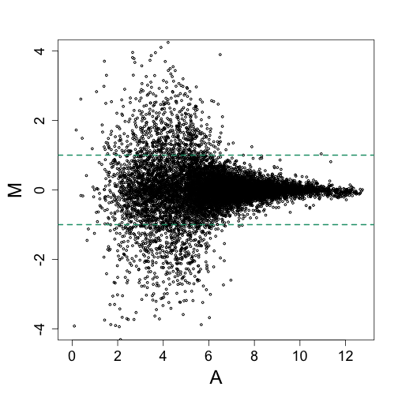
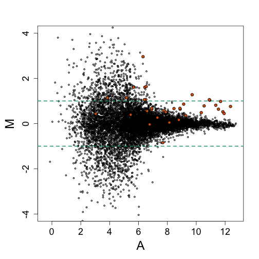
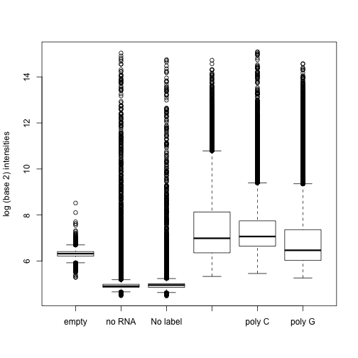
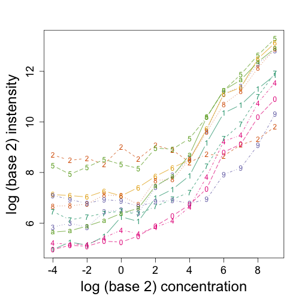
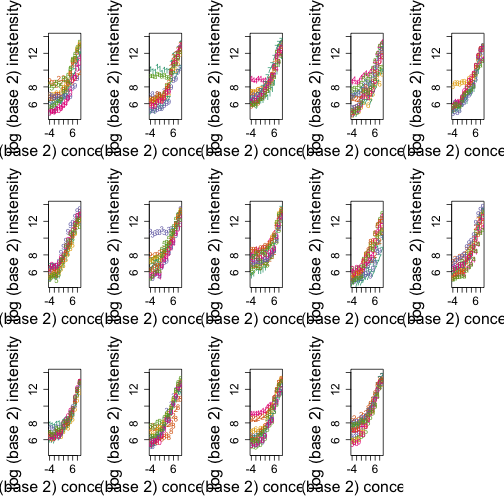
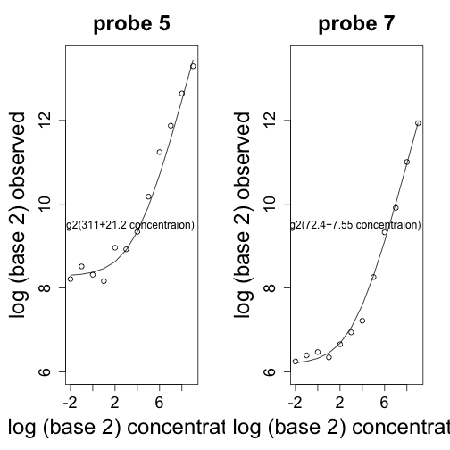
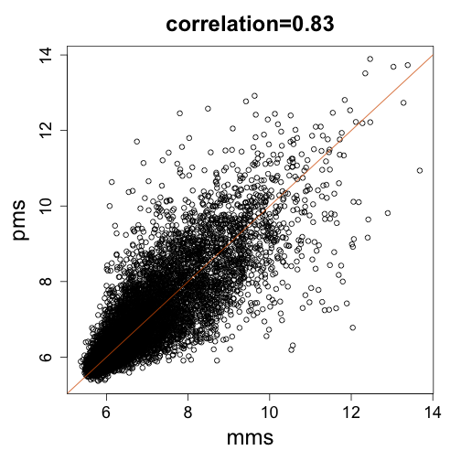
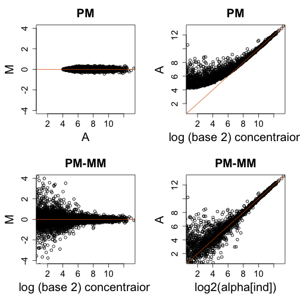
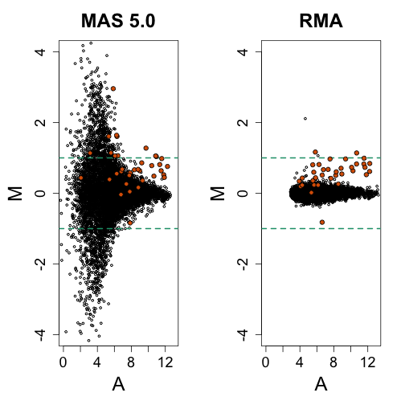

# Background noise

If for every gene on a microarray we compute the log ratio from replicates, we obtain a Figure like this:

```r
library(rafalib)
```

```
## Loading required package: RColorBrewer
```

```r
library(SpikeInSubset)
```

```
## Loading required package: Biobase
## Loading required package: BiocGenerics
## Loading required package: methods
## Loading required package: parallel
## 
## Attaching package: 'BiocGenerics'
## 
## The following objects are masked from 'package:parallel':
## 
##     clusterApply, clusterApplyLB, clusterCall, clusterEvalQ,
##     clusterExport, clusterMap, parApply, parCapply, parLapply,
##     parLapplyLB, parRapply, parSapply, parSapplyLB
## 
## The following object is masked from 'package:stats':
## 
##     xtabs
## 
## The following objects are masked from 'package:base':
## 
##     anyDuplicated, append, as.data.frame, as.vector, cbind,
##     colnames, do.call, duplicated, eval, evalq, Filter, Find, get,
##     intersect, is.unsorted, lapply, Map, mapply, match, mget,
##     order, paste, pmax, pmax.int, pmin, pmin.int, Position, rank,
##     rbind, Reduce, rep.int, rownames, sapply, setdiff, sort,
##     table, tapply, union, unique, unlist
## 
## Welcome to Bioconductor
## 
##     Vignettes contain introductory material; view with
##     'browseVignettes()'. To cite Bioconductor, see
##     'citation("Biobase")', and for packages 'citation("pkgname")'.
## 
## Loading required package: affy
```

```r
data(mas133)
e = exprs(mas133)  ##get expression
A = (log2(e[, 5]) + log(e[, 2]))/2
M = log2(e[, 4]/e[, 1])
mypar(1, 1)
splot(A, M, ylim = c(-4, 4), cex = 0.5)
abline(h = c(-1, 1), col = 1, lwd = 2, lty = 2)
```

 


The data shown here happens to be from an experimetn were the same RNA was hybridized to several arrays and 16 genes spiked-in at different concentrations. This means that only 16 genes should have large fold-chages yet we see hundreds of genes with fold changes above 2. 

We now add the 16 genes that, in this particular comparison, are epxected to be twice as expressed on one experiment versus the other.


```r
siNames <- colnames(pData(mas133))
siNames <- siNames[pData(mas133)[4, ]/pData(mas133)[1, ] == 2]
spikeinIndex = match(siNames, rownames(e))
mypar()
splot(A, M, ylim = c(-4, 4), cex = 0.5)
abline(h = c(-1, 1), col = 1, lwd = 2, lty = 2)
points(A[spikeinIndex], M[spikeinIndex], bg = 2, pch = 21)
```

 


Note that distinguishing these 16 genes from the highly variabe (noisy) data seems impossible. So why so much noise? It turns out that modeling can help us explain this.

## Background noise
Microarray data is known to contain what is called _background noise_. Even in cases were a target is not present, a probe will return an intensity. We have experimental data to confirm this.


```r
# library(devtools)
# install_github('BackgroundExperimentYeast','stephaniehicks')
library(BackgroundExperimentYeast)
data(backgroundData)
pms = log2(pm(backgroundData))
```

```
## Warning: replacing previous import by 'utils::head' when loading 'hgu95av2cdf'
## Warning: replacing previous import by 'utils::tail' when loading 'hgu95av2cdf'
```

```
## 
```

```r
Names = pData(backgroundData)$sample_type
Names[3] <- "No label"
boxplot(pms, names = Names, ylab = "log (base 2) intensities")
```

 


```r
library(SpikeIn)
data(SpikeIn133)
pd <- pData(SpikeIn133)
pns <- probeNames(SpikeIn133)
```

```
## Warning: replacing previous import by 'utils::head' when loading 'hgu133atagcdf'
## Warning: replacing previous import by 'utils::tail' when loading 'hgu133atagcdf'
```

```
## 
## 
## Attaching package: 'hgu133atagcdf'
## 
## The following objects are masked from 'package:hgu95av2cdf':
## 
##     i2xy, xy2i
```

```r
pms <- pm(SpikeIn133[, 1:14])  ##pick the first 14, rest are reps
ind <- which(pns == colnames(pd)[1])  ##probes in gene 1
concentration <- pd[1:14, 1]
concentration[1] <- 1/16
mypar(1, 1)
matplot(log2(concentration), t(log2(pms[ind, ])), type = "b", xlab = "log (base 2) concentration", 
    ylab = "log (base 2) instensity")
```

 

Here are other genes

```r
mypar(3, 5)
for (i in 1:14) {
    ind <- which(pns == colnames(pd)[i])  ##probes in gene i
    concentration <- pd[1:14, i]
    concentration[concentration == 0] <- 1/16
    matplot(log2(concentration), t(log2(pms[ind, ])), type = "p", xlab = "log (base 2) concentration", 
        ylab = "log (base 2) instensity", ylim = c(4.5, 14))
}
```

 


These figures motivate a statistical model for the PM intensities. 
$$
Y_j =\beta_j + \phi_j \theta + \varepsilon_j
$$
Here is an example of how this model fits the data for one of the probes

```r
mypar(1, 2)
ind <- which(pns == colnames(pd)[1])  ##probes in gene i
for (i in c(5, 7)) {
    y <- pms[ind[i], ]
    x <- pd[1:14, 1]
    out = which(x == 0)
    x = x[-out]
    y = y[-out]
    coefs <- lm(y ~ x, weights = sqrt(1/x))$coef  ##varia
    plot(log2(x[-1]), log2(y[-1]), xlab = "log (base 2) concentration", ylab = "log (base 2) observed", 
        ylim = c(6, 13.5), main = paste("probe", i))
    lines(log2(x[-1]), log2(coefs[1] + coefs[2] * x[-1]))
    text(3, 9.5, paste0("log2(", signif(coefs[1], 3), "+", signif(coefs[2], 
        3), " concentraion)"))
}
```

 


with $Y$ the observed intensity for probe $j$, $\beta_j$ a background level, $\phi_j$ a multiplicative affinity affect and $\theta$ a value proportional to $\varepsilon$ is measruement error. From the figures it appears that the $\beta$s range from 16 to 1024 across genes. One adverse effect of this is that fold changes will be extremely attenuated for small values of $\theta$. Note for example that if we are comparing true expression values that are $2$ and $1$, with a background of $32$, we will observe a fold change of $(32 + 2)/(32 + 1) \approx 1$. For larger values, this is not a problem $(32+20000)/(32+10000)\approx 2$. 

One difficult challenge is that, even within the same gene, each probe has a different background level. The solution proposed by the manufacturer was to designa background probe for each probe. These pairs were named the _perfect match_ (PM) and _mismath_ (MM) probes respectively. The assumption was that the MM would measure only the background part of the intensity and $PM-MM$ would sever a corrected measure. This actually explains the high levels of variability observed in our first plot. We illustrate this with a simple statistical model.


```r
library(BackgroundExperimentYeast)
data(backgroundData)
pms = log2(pm(backgroundData[, 6]))
mms = log2(mm(backgroundData[, 6]))
mypar(1, 1)
splot(mms, pms, main = paste0("correlation=", signif(cor(pms, mms), 2)))
abline(0, 1, col = 2)
```

 


If, for simplicity, we assume that the signal related to expression is $\alpha$ then the data suggests this model
$$PM = \beta_{PM} + \alpha \mbox{ and } MM = \beta_{MM}$$
with the background are not identical but rather correlated
$\mbox{corr}(\beta_{MM},\beta_{PM}) \approx 0.8$. Let's generate some data

```r
library(MASS)
N = 10000  ##10,000 genes
## alpha = rexp(N,1/1000)
sigma = 0.1
alpha = rgamma(10000, 0.05, 5e-04)
alpha1 = alpha * 2^rnorm(N, 0, sigma)  ##this measurement error
alpha2 = alpha * 2^rnorm(N, 0, sigma)
betas = 2^mvrnorm(N, c(4, 4), matrix(c(1, 0.8, 0.8, 1) * 3, 2, 2))
betas1 = betas * cbind(2^rnorm(N, 0, sigma), 2^rnorm(N, 0, sigma))
betas2 = betas * cbind(2^rnorm(N, 0, sigma), 2^rnorm(N, 0, sigma))

PM1 = 16 + alpha1 + betas1[, 1]
PM2 = 16 + alpha2 + betas2[, 1]  ##PM is signal + bg
MM1 = 16 + betas1[, 2]
MM2 = 16 + betas2[, 2]  ##MM is just bg
y1 = PM1 - MM1  ##dont let it be 0
y2 = PM2 - MM2  ##dont let it be 0
ind = which(y1 > 0 & y2 > 0)
mypar(2, 2)
YLIM = c(-4, 4)
XLIM = c(1, 13)
M = log2(PM1[ind]/PM2[ind])
A = ((log2(PM1[ind]) + log2(PM2[ind]))/2)
plot(A, M, xlim = XLIM, ylim = YLIM, main = "PM")
abline(h = 0, col = 2)
plot(log2(alpha[ind]), A, xlim = XLIM, ylim = XLIM, xlab = "log (base 2) concentraion", 
    main = "PM")
abline(0, 1, col = 2)
M = log2(y2[ind]/y1[ind])
A = ((log2(y1[ind]) + log2(y2[ind]))/2)
plot(A, M, xlim = XLIM, ylim = YLIM, xlab = "log (base 2) concentraion", main = "PM-MM")
abline(h = 0, col = 2)
plot(log2(alpha[ind]), A, xlim = XLIM, ylim = XLIM, main = "PM-MM")
abline(0, 1, col = 2)
```

 


## Model based adjustment
Model based approaches have been suggested for correcting for background while controling variance inflation. The most widely used approach assumes that that signal follows an exponential distirubtion with rate $\lambda$ and the background a normal distribution with mean $\mu$ and standard deviation $\sigma$. The parameters are estimated from the signal and then these are plugged into to the posterior mean of the signal given the observed values

$$
\mbox{E}[ \mbox{signal} | PM ] = PM - \mu - \lambda \sigma^2 + \sigma \left[ \frac{1}{\sqrt{2\pi}} \exp\left( -\frac{ (PM/\sigma)^2 }{ 2 \Phi(PM/\sigma) } \right) \right] 
$$

This parametric model does not fit the data well, but does provide a usable background correction approach. It is implemented in the widely used Robust Multi-array Average (RMA). 


```r
data(mas133)
e = exprs(mas133)  ##get expression
A = (log2(e[, 4]) + log(e[, 1]))/2
M = log2(e[, 4]/e[, 1])
mypar(1, 2)
splot(A, M, xlim = c(0, 13), ylim = c(-4, 4), cex = 0.5, main = "MAS 5.0")
abline(h = c(-1, 1), col = 1, lwd = 2, lty = 2)
points(A[spikeinIndex], M[spikeinIndex], bg = 2, pch = 21)

data(rma133)
e = exprs(rma133)  ##get expression
A = (e[, 4] + e[, 1])/2  ##already in log
M = e[, 4] - e[, 1]
splot(A, M, xlim = c(0, 13), ylim = c(-4, 4), cex = 0.5, main = "RMA")
abline(h = c(-1, 1), col = 1, lwd = 2, lty = 2)
points(A[spikeinIndex], M[spikeinIndex], bg = 2, pch = 21)
```

 

Althought the variance is greatly reduced we also note that the size of the signal is also reduced. An improved background model was proposed by Zhijin Wu, "A Model Based Background Adjustment for Oligonucleotide Expression Arrays" ( http://biostats.bepress.com/jhubiostat/paper1/?35 )

