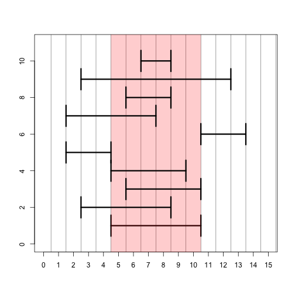

## IRanges


```r
library(IRanges)
```

```
## Loading required package: methods
## Loading required package: BiocGenerics
## Loading required package: parallel
## 
## Attaching package: 'BiocGenerics'
## 
## The following objects are masked from 'package:parallel':
## 
##     clusterApply, clusterApplyLB, clusterCall, clusterEvalQ,
##     clusterExport, clusterMap, parApply, parCapply, parLapply,
##     parLapplyLB, parRapply, parSapply, parSapplyLB
## 
## The following object is masked from 'package:stats':
## 
##     xtabs
## 
## The following objects are masked from 'package:base':
## 
##     anyDuplicated, append, as.data.frame, as.vector, cbind,
##     colnames, do.call, duplicated, eval, evalq, Filter, Find, get,
##     intersect, is.unsorted, lapply, Map, mapply, match, mget,
##     order, paste, pmax, pmax.int, pmin, pmin.int, Position, rank,
##     rbind, Reduce, rep.int, rownames, sapply, setdiff, sort,
##     table, tapply, union, unique, unlist
```

```r
ir <- IRanges(5, 10)
ir
```

```
## IRanges of length 1
##     start end width
## [1]     5  10     6
```

```r
start(ir)
```

```
## [1] 5
```

```r
end(ir)
```

```
## [1] 10
```

```r
width(ir)
```

```
## [1] 6
```

```r
# ?IRanges
```


```r
ir <- IRanges(start = c(3, 5, 17), end = c(10, 8, 20))
ir
```

```
## IRanges of length 3
##     start end width
## [1]     3  10     8
## [2]     5   8     4
## [3]    17  20     4
```

```r
ir <- IRanges(5, 10)
```


```r
# ?'intra-range-methods'
shift(ir, -2)
```

```
## IRanges of length 1
##     start end width
## [1]     3   8     6
```


Remeber, all of these commands can work on more than one range at once. Here we show the effects of the different methods using a single range:


```r
shift(ir, -2)
```

```
## IRanges of length 1
##     start end width
## [1]     3   8     6
```

```r
narrow(ir, start = 2)
```

```
## IRanges of length 1
##     start end width
## [1]     6  10     5
```

```r
narrow(ir, end = 5)
```

```
## IRanges of length 1
##     start end width
## [1]     5   9     5
```

```r
flank(ir, width = 3, start = TRUE, both = FALSE)
```

```
## IRanges of length 1
##     start end width
## [1]     2   4     3
```

```r
flank(ir, width = 3, start = FALSE, both = FALSE)
```

```
## IRanges of length 1
##     start end width
## [1]    11  13     3
```

```r
flank(ir, width = 3, start = TRUE, both = TRUE)
```

```
## IRanges of length 1
##     start end width
## [1]     2   7     6
```

```r
ir * 2
```

```
## IRanges of length 1
##     start end width
## [1]     6   8     3
```

```r
ir + 2
```

```
## IRanges of length 1
##     start end width
## [1]     3  12    10
```

```r
ir - 2
```

```
## IRanges of length 1
##     start end width
## [1]     7   8     2
```


```r
# set up a plotting window so we can look at range operations
plotir <- function(ir, i) {
    arrows(start(ir) - 0.5, i, end(ir) + 0.5, i, code = 3, angle = 90, lwd = 3)
}
plot(0, 0, xlim = c(0, 15), ylim = c(0, 11), type = "n", xlab = "", ylab = "", 
    xaxt = "n")
axis(1, 0:15)
abline(v = 0:30 + 0.5, col = rgb(0, 0, 0, 0.5))

# plot the original IRange
plotir(ir, 1)

# draw a red shadow for the original IRange
polygon(c(start(ir) - 0.5, start(ir) - 0.5, end(ir) + 0.5, end(ir) + 0.5), c(-1, 
    12, 12, -1), col = rgb(1, 0, 0, 0.2), border = NA)
plotir(shift(ir, -2), 2)
plotir(narrow(ir, start = 2), 3)
plotir(narrow(ir, end = 5), 4)
plotir(flank(ir, width = 3, start = TRUE, both = FALSE), 5)
plotir(flank(ir, width = 3, start = FALSE, both = FALSE), 6)
plotir(flank(ir, width = 3, start = TRUE, both = TRUE), 7)
plotir(ir * 2, 8)
plotir(ir + 2, 9)
plotir(ir - 2, 10)
```

 


```r
# ?'inter-range-methods'
ir <- IRanges(start = c(3, 5, 17), end = c(10, 8, 20))
range(ir)
```

```
## IRanges of length 1
##     start end width
## [1]     3  20    18
```

```r
reduce(ir)
```

```
## IRanges of length 2
##     start end width
## [1]     3  10     8
## [2]    17  20     4
```

```r
gaps(ir)
```

```
## IRanges of length 1
##     start end width
## [1]    11  16     6
```

```r
disjoin(ir)
```

```
## IRanges of length 4
##     start end width
## [1]     3   4     2
## [2]     5   8     4
## [3]     9  10     2
## [4]    17  20     4
```


## GRanges and GRangesList

### GRanges


```r
library(GenomicRanges)
```

```
## Loading required package: GenomeInfoDb
```

```r
gr <- GRanges("chrZ", IRanges(start = c(5, 10), end = c(35, 45)), strand = "+", 
    seqlengths = c(chrZ = 100L))
gr
```

```
## GRanges with 2 ranges and 0 metadata columns:
##       seqnames    ranges strand
##          <Rle> <IRanges>  <Rle>
##   [1]     chrZ  [ 5, 35]      +
##   [2]     chrZ  [10, 45]      +
##   ---
##   seqlengths:
##    chrZ
##     100
```

```r
shift(gr, 10)
```

```
## GRanges with 2 ranges and 0 metadata columns:
##       seqnames    ranges strand
##          <Rle> <IRanges>  <Rle>
##   [1]     chrZ  [15, 45]      +
##   [2]     chrZ  [20, 55]      +
##   ---
##   seqlengths:
##    chrZ
##     100
```

```r
shift(gr, 80)
```

```
## Warning: 'ranges' contains values outside of sequence bounds. See ?trim to
## subset ranges.
```

```
## GRanges with 2 ranges and 0 metadata columns:
##       seqnames    ranges strand
##          <Rle> <IRanges>  <Rle>
##   [1]     chrZ [85, 115]      +
##   [2]     chrZ [90, 125]      +
##   ---
##   seqlengths:
##    chrZ
##     100
```

```r
trim(shift(gr, 80))
```

```
## GRanges with 2 ranges and 0 metadata columns:
##       seqnames    ranges strand
##          <Rle> <IRanges>  <Rle>
##   [1]     chrZ [85, 100]      +
##   [2]     chrZ [90, 100]      +
##   ---
##   seqlengths:
##    chrZ
##     100
```

```r
mcols(gr)
```

```
## DataFrame with 2 rows and 0 columns
```

```r
mcols(gr)$value <- c(-1, 4)
gr
```

```
## GRanges with 2 ranges and 1 metadata column:
##       seqnames    ranges strand |     value
##          <Rle> <IRanges>  <Rle> | <numeric>
##   [1]     chrZ  [ 5, 35]      + |        -1
##   [2]     chrZ  [10, 45]      + |         4
##   ---
##   seqlengths:
##    chrZ
##     100
```


### GRangesList


```r
gr2 <- GRanges("chrZ", IRanges(11:13, 51:53))
mcols(gr)$value <- NULL
grl <- GRangesList(gr, gr2)
grl
```

```
## GRangesList of length 2:
## [[1]] 
## GRanges with 2 ranges and 0 metadata columns:
##       seqnames    ranges strand
##          <Rle> <IRanges>  <Rle>
##   [1]     chrZ  [ 5, 35]      +
##   [2]     chrZ  [10, 45]      +
## 
## [[2]] 
## GRanges with 3 ranges and 0 metadata columns:
##       seqnames   ranges strand
##   [1]     chrZ [11, 51]      *
##   [2]     chrZ [12, 52]      *
##   [3]     chrZ [13, 53]      *
## 
## ---
## seqlengths:
##  chrZ
##   100
```

```r
length(grl)
```

```
## [1] 2
```

```r
grl[[1]]
```

```
## GRanges with 2 ranges and 0 metadata columns:
##       seqnames    ranges strand
##          <Rle> <IRanges>  <Rle>
##   [1]     chrZ  [ 5, 35]      +
##   [2]     chrZ  [10, 45]      +
##   ---
##   seqlengths:
##    chrZ
##     100
```

```r
mcols(grl)$value <- c(5, 7)
grl
```

```
## GRangesList of length 2:
## [[1]] 
## GRanges with 2 ranges and 0 metadata columns:
##       seqnames    ranges strand
##          <Rle> <IRanges>  <Rle>
##   [1]     chrZ  [ 5, 35]      +
##   [2]     chrZ  [10, 45]      +
## 
## [[2]] 
## GRanges with 3 ranges and 0 metadata columns:
##       seqnames   ranges strand
##   [1]     chrZ [11, 51]      *
##   [2]     chrZ [12, 52]      *
##   [3]     chrZ [13, 53]      *
## 
## ---
## seqlengths:
##  chrZ
##   100
```

```r
mcols(grl)
```

```
## DataFrame with 2 rows and 1 column
##       value
##   <numeric>
## 1         5
## 2         7
```


### findOverlaps and %over%


```r
gr1 <- GRanges("chrZ", IRanges(c(1, 11, 21, 31, 41), width = 5))
gr2 <- GRanges("chrZ", IRanges(c(19, 33), c(38, 35)))
gr1
```

```
## GRanges with 5 ranges and 0 metadata columns:
##       seqnames    ranges strand
##          <Rle> <IRanges>  <Rle>
##   [1]     chrZ  [ 1,  5]      *
##   [2]     chrZ  [11, 15]      *
##   [3]     chrZ  [21, 25]      *
##   [4]     chrZ  [31, 35]      *
##   [5]     chrZ  [41, 45]      *
##   ---
##   seqlengths:
##    chrZ
##      NA
```

```r
gr2
```

```
## GRanges with 2 ranges and 0 metadata columns:
##       seqnames    ranges strand
##          <Rle> <IRanges>  <Rle>
##   [1]     chrZ  [19, 38]      *
##   [2]     chrZ  [33, 35]      *
##   ---
##   seqlengths:
##    chrZ
##      NA
```

```r
fo <- findOverlaps(gr1, gr2)
fo
```

```
## Hits of length 3
## queryLength: 5
## subjectLength: 2
##   queryHits subjectHits 
##    <integer>   <integer> 
##  1         3           1 
##  2         4           1 
##  3         4           2
```

```r
queryHits(fo)
```

```
## [1] 3 4 4
```

```r
subjectHits(fo)
```

```
## [1] 1 1 2
```

```r
gr1 %over% gr2
```

```
## [1] FALSE FALSE  TRUE  TRUE FALSE
```

```r
gr1[gr1 %over% gr2]
```

```
## GRanges with 2 ranges and 0 metadata columns:
##       seqnames    ranges strand
##          <Rle> <IRanges>  <Rle>
##   [1]     chrZ  [21, 25]      *
##   [2]     chrZ  [31, 35]      *
##   ---
##   seqlengths:
##    chrZ
##      NA
```


### Rle and Views


```r
r <- Rle(c(1, 1, 1, 0, 0, -2, -2, -2, rep(-1, 20)))
r
```

```
## numeric-Rle of length 28 with 4 runs
##   Lengths:  3  2  3 20
##   Values :  1  0 -2 -1
```

```r
str(r)
```

```
## Formal class 'Rle' [package "IRanges"] with 4 slots
##   ..@ values         : num [1:4] 1 0 -2 -1
##   ..@ lengths        : int [1:4] 3 2 3 20
##   ..@ elementMetadata: NULL
##   ..@ metadata       : list()
```

```r
as.numeric(r)
```

```
##  [1]  1  1  1  0  0 -2 -2 -2 -1 -1 -1 -1 -1 -1 -1 -1 -1 -1 -1 -1 -1 -1 -1
## [24] -1 -1 -1 -1 -1
```

```r
Views(r, start = c(4, 2), end = c(7, 6))
```

```
## Views on a 28-length Rle subject
## 
## views:
##     start end width
## [1]     4   7     4 [ 0  0 -2 -2]
## [2]     2   6     5 [ 1  1  0  0 -2]
```


## ExpressionSet and SummarizedExperiment


```r
library(Biobase)
```

```
## Welcome to Bioconductor
## 
##     Vignettes contain introductory material; view with
##     'browseVignettes()'. To cite Bioconductor, see
##     'citation("Biobase")', and for packages 'citation("pkgname")'.
```

```r
library(GEOquery)
```

```
## Setting options('download.file.method.GEOquery'='auto')
```

```r
geoq <- getGEO("GSE9514")
```

```
## ftp://ftp.ncbi.nlm.nih.gov/geo/series/GSE9nnn/GSE9514/matrix/
## Found 1 file(s)
## GSE9514_series_matrix.txt.gz
## File stored at: 
## /var/folders/6d/d_8pbllx7318htlp5wv_rm580000gn/T//RtmpIx0G3f/GPL90.soft
```

```r
names(geoq)
```

```
## [1] "GSE9514_series_matrix.txt.gz"
```

```r
e <- geoq[[1]]
```


### ExpressionSet


```r
dim(e)
```

```
## Features  Samples 
##     9335        8
```

```r
exprs(e)[1:3, 1:3]
```

```
##            GSM241146 GSM241147 GSM241148
## 10000_at       15.33     9.459     7.985
## 10001_at      283.47   300.729   270.016
## 10002_i_at   2569.45  2382.815  2711.814
```

```r
dim(exprs(e))
```

```
## [1] 9335    8
```

```r

pData(e)[1:3, 1:6]
```

```
##                                                                           title
## GSM241146 hem1 strain grown in YPD with 250 uM ALA (08-15-06_Philpott_YG_S98_1)
## GSM241147    WT strain grown in YPD under Hypoxia (08-15-06_Philpott_YG_S98_10)
## GSM241148    WT strain grown in YPD under Hypoxia (08-15-06_Philpott_YG_S98_11)
##           geo_accession                status submission_date
## GSM241146     GSM241146 Public on Nov 06 2007     Nov 02 2007
## GSM241147     GSM241147 Public on Nov 06 2007     Nov 02 2007
## GSM241148     GSM241148 Public on Nov 06 2007     Nov 02 2007
##           last_update_date type
## GSM241146      Aug 14 2011  RNA
## GSM241147      Aug 14 2011  RNA
## GSM241148      Aug 14 2011  RNA
```

```r
dim(pData(e))
```

```
## [1]  8 31
```

```r
names(pData(e))
```

```
##  [1] "title"                   "geo_accession"          
##  [3] "status"                  "submission_date"        
##  [5] "last_update_date"        "type"                   
##  [7] "channel_count"           "source_name_ch1"        
##  [9] "organism_ch1"            "characteristics_ch1"    
## [11] "molecule_ch1"            "extract_protocol_ch1"   
## [13] "label_ch1"               "label_protocol_ch1"     
## [15] "taxid_ch1"               "hyb_protocol"           
## [17] "scan_protocol"           "description"            
## [19] "data_processing"         "platform_id"            
## [21] "contact_name"            "contact_email"          
## [23] "contact_department"      "contact_institute"      
## [25] "contact_address"         "contact_city"           
## [27] "contact_state"           "contact_zip/postal_code"
## [29] "contact_country"         "supplementary_file"     
## [31] "data_row_count"
```

```r
pData(e)$characteristics_ch1
```

```
##                       V2                       V3                       V4 
## BY4742 hem1 delta strain                   BY4742                   BY4742 
##                       V5                       V6                       V7 
## BY4742 hem1 delta strain BY4742 hem1 delta strain BY4742 hem1 delta strain 
##                       V8                       V9 
##            BY4742 strain            BY4742 strain 
## Levels: BY4742 BY4742 hem1 delta strain BY4742 strain
```

```r

fData(e)[1:3, 1:3]
```

```
##                    ID     ORF SPOT_ID
## 10000_at     10000_at YLR331C    <NA>
## 10001_at     10001_at YLR332W    <NA>
## 10002_i_at 10002_i_at YLR333C    <NA>
```

```r
dim(fData(e))
```

```
## [1] 9335   17
```

```r
names(fData(e))
```

```
##  [1] "ID"                               "ORF"                             
##  [3] "SPOT_ID"                          "Species Scientific Name"         
##  [5] "Annotation Date"                  "Sequence Type"                   
##  [7] "Sequence Source"                  "Target Description"              
##  [9] "Representative Public ID"         "Gene Title"                      
## [11] "Gene Symbol"                      "ENTREZ_GENE_ID"                  
## [13] "RefSeq Transcript ID"             "SGD accession number"            
## [15] "Gene Ontology Biological Process" "Gene Ontology Cellular Component"
## [17] "Gene Ontology Molecular Function"
```

```r
head(fData(e)$"Gene Symbol")
```

```
## [1] JIP3   MID2          RPS25B        NUP2  
## 4869 Levels:  ACO1 ARV1 ATP14 BOP2 CDA1 CDA2 CDC25 CDC3 CDD1 CTS1 ... Il4
```

```r
head(rownames(e))
```

```
## [1] "10000_at"   "10001_at"   "10002_i_at" "10003_f_at" "10004_at"  
## [6] "10005_at"
```

```r

experimentData(e)
```

```
## Experiment data
##   Experimenter name:  
##   Laboratory:  
##   Contact information:  
##   Title:  
##   URL:  
##   PMIDs:  
##   No abstract available.
```

```r
annotation(e)
```

```
## [1] "GPL90"
```


### Summarized Experiment


```r
library(parathyroidSE)
data(parathyroidGenesSE)
se <- parathyroidGenesSE
se
```

```
## class: SummarizedExperiment 
## dim: 63193 27 
## exptData(1): MIAME
## assays(1): counts
## rownames(63193): ENSG00000000003 ENSG00000000005 ... LRG_98 LRG_99
## rowData metadata column names(0):
## colnames: NULL
## colData names(8): run experiment ... study sample
```


```r
dim(se)
```

```
## [1] 63193    27
```

```r
assay(se)[1:3, 1:3]
```

```
##                 [,1] [,2] [,3]
## ENSG00000000003  792 1064  444
## ENSG00000000005    4    1    2
## ENSG00000000419  294  282  164
```

```r
dim(assay(se))
```

```
## [1] 63193    27
```

```r

colData(se)[1:3, 1:6]
```

```
## DataFrame with 3 rows and 6 columns
##           run experiment  patient treatment     time submission
##   <character>   <factor> <factor>  <factor> <factor>   <factor>
## 1   SRR479052  SRX140503        1   Control      24h  SRA051611
## 2   SRR479053  SRX140504        1   Control      48h  SRA051611
## 3   SRR479054  SRX140505        1       DPN      24h  SRA051611
```

```r
dim(colData(se))
```

```
## [1] 27  8
```

```r
names(colData(se))
```

```
## [1] "run"        "experiment" "patient"    "treatment"  "time"      
## [6] "submission" "study"      "sample"
```

```r
colData(se)$treatment
```

```
##  [1] Control Control DPN     DPN     OHT     OHT     Control Control
##  [9] DPN     DPN     DPN     OHT     OHT     OHT     Control Control
## [17] DPN     DPN     OHT     OHT     Control DPN     DPN     DPN    
## [25] OHT     OHT     OHT    
## Levels: Control DPN OHT
```

```r

rowData(se)[1]
```

```
## GRangesList of length 1:
## $ENSG00000000003 
## GRanges with 17 ranges and 2 metadata columns:
##        seqnames               ranges strand   |   exon_id       exon_name
##           <Rle>            <IRanges>  <Rle>   | <integer>     <character>
##    [1]        X [99883667, 99884983]      -   |    664095 ENSE00001459322
##    [2]        X [99885756, 99885863]      -   |    664096 ENSE00000868868
##    [3]        X [99887482, 99887565]      -   |    664097 ENSE00000401072
##    [4]        X [99887538, 99887565]      -   |    664098 ENSE00001849132
##    [5]        X [99888402, 99888536]      -   |    664099 ENSE00003554016
##    ...      ...                  ...    ... ...       ...             ...
##   [13]        X [99890555, 99890743]      -   |    664106 ENSE00003512331
##   [14]        X [99891188, 99891686]      -   |    664108 ENSE00001886883
##   [15]        X [99891605, 99891803]      -   |    664109 ENSE00001855382
##   [16]        X [99891790, 99892101]      -   |    664110 ENSE00001863395
##   [17]        X [99894942, 99894988]      -   |    664111 ENSE00001828996
## 
## ---
## seqlengths:
##                  1                 2 ...            LRG_99
##          249250621         243199373 ...             13294
```

```r
class(rowData(se))
```

```
## [1] "GRangesList"
## attr(,"package")
## [1] "GenomicRanges"
```

```r
length(rowData(se))
```

```
## [1] 63193
```

```r
head(rownames(se))
```

```
## [1] "ENSG00000000003" "ENSG00000000005" "ENSG00000000419" "ENSG00000000457"
## [5] "ENSG00000000460" "ENSG00000000938"
```

```r
metadata(rowData(se))
```

```
## $genomeInfo
## $genomeInfo$`Db type`
## [1] "TranscriptDb"
## 
## $genomeInfo$`Supporting package`
## [1] "GenomicFeatures"
## 
## $genomeInfo$`Data source`
## [1] "BioMart"
## 
## $genomeInfo$Organism
## [1] "Homo sapiens"
## 
## $genomeInfo$`Resource URL`
## [1] "www.biomart.org:80"
## 
## $genomeInfo$`BioMart database`
## [1] "ensembl"
## 
## $genomeInfo$`BioMart database version`
## [1] "ENSEMBL GENES 72 (SANGER UK)"
## 
## $genomeInfo$`BioMart dataset`
## [1] "hsapiens_gene_ensembl"
## 
## $genomeInfo$`BioMart dataset description`
## [1] "Homo sapiens genes (GRCh37.p11)"
## 
## $genomeInfo$`BioMart dataset version`
## [1] "GRCh37.p11"
## 
## $genomeInfo$`Full dataset`
## [1] "yes"
## 
## $genomeInfo$`miRBase build ID`
## [1] NA
## 
## $genomeInfo$transcript_nrow
## [1] "213140"
## 
## $genomeInfo$exon_nrow
## [1] "737783"
## 
## $genomeInfo$cds_nrow
## [1] "531154"
## 
## $genomeInfo$`Db created by`
## [1] "GenomicFeatures package from Bioconductor"
## 
## $genomeInfo$`Creation time`
## [1] "2013-07-30 17:30:25 +0200 (Tue, 30 Jul 2013)"
## 
## $genomeInfo$`GenomicFeatures version at creation time`
## [1] "1.13.21"
## 
## $genomeInfo$`RSQLite version at creation time`
## [1] "0.11.4"
## 
## $genomeInfo$DBSCHEMAVERSION
## [1] "1.0"
```

```r

exptData(se)$MIAME
```

```
## Experiment data
##   Experimenter name: Felix Haglund 
##   Laboratory: Science for Life Laboratory Stockholm 
##   Contact information: Mikael Huss 
##   Title: DPN and Tamoxifen treatments of parathyroid adenoma cells 
##   URL: http://www.ncbi.nlm.nih.gov/geo/query/acc.cgi?acc=GSE37211 
##   PMIDs: 23024189 
## 
##   Abstract: A 251 word abstract is available. Use 'abstract' method.
```

```r
abstract(exptData(se)$MIAME)
```

```
## [1] "Primary hyperparathyroidism (PHPT) is most frequently present in postmenopausal women. Although the involvement of estrogen has been suggested, current literature indicates that parathyroid tumors are estrogen receptor (ER) alpha negative. Objective: The aim of the study was to evaluate the expression of ERs and their putative function in parathyroid tumors. Design: A panel of 37 parathyroid tumors was analyzed for expression and promoter methylation of the ESR1 and ESR2 genes as well as expression of the ERalpha and ERbeta1/ERbeta2 proteins. Transcriptome changes in primary cultures of parathyroid adenoma cells after treatment with the selective ERbeta1 agonist diarylpropionitrile (DPN) and 4-hydroxytamoxifen were identified using next-generation RNA sequencing. Results: Immunohistochemistry revealed very low expression of ERalpha, whereas all informative tumors expressed ERbeta1 (n = 35) and ERbeta2 (n = 34). Decreased nuclear staining intensity and mosaic pattern of positive and negative nuclei of ERbeta1 were significantly associated with larger tumor size. Tumor ESR2 levels were significantly higher in female vs. male cases. In cultured cells, significantly increased numbers of genes with modified expression were detected after 48 h, compared to 24-h treatments with DPN or 4-hydroxytamoxifen, including the parathyroid-related genes CASR, VDR, JUN, CALR, and ORAI2. Bioinformatic analysis of transcriptome changes after DPN treatment revealed significant enrichment in gene sets coupled to ER activation, and a highly significant similarity to tumor cells undergoing apoptosis. Conclusions: Parathyroid tumors express ERbeta1 and ERbeta2. Transcriptional changes after ERbeta1 activation and correlation to clinical features point to a role of estrogen signaling in parathyroid function and disease."
```


## Footnotes

For more information about the `GenomicRanges` package, check out the PLOS Comp Bio paper, which the authors of GenomicRanges published:

<http://www.ploscompbiol.org/article/info%3Adoi%2F10.1371%2Fjournal.pcbi.1003118>

Also the software vignettes have a lot of details about the functionality. Check out "An Introduction to Genomic Ranges Classes":

<http://www.bioconductor.org/packages/release/bioc/vignettes/GenomicRanges/inst/doc/GenomicRangesIntroduction.pdf>

All of the vignette PDFs are available here:

<http://www.bioconductor.org/packages/release/bioc/html/GenomicRanges.html>

