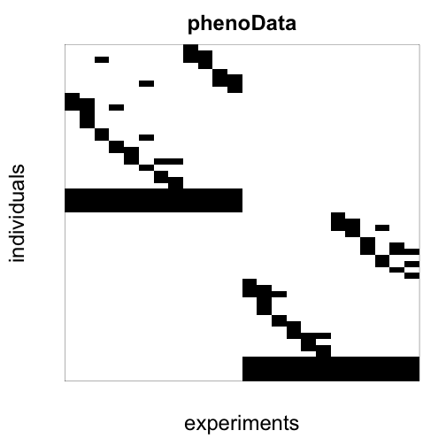
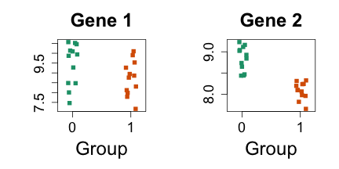
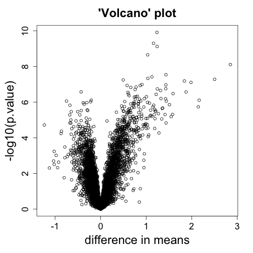
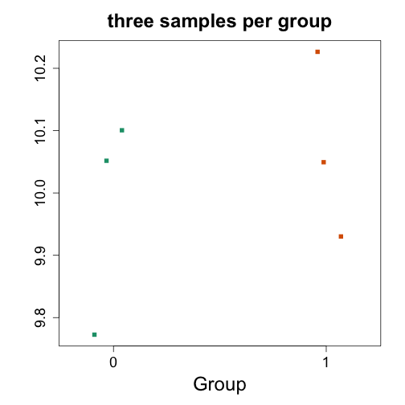
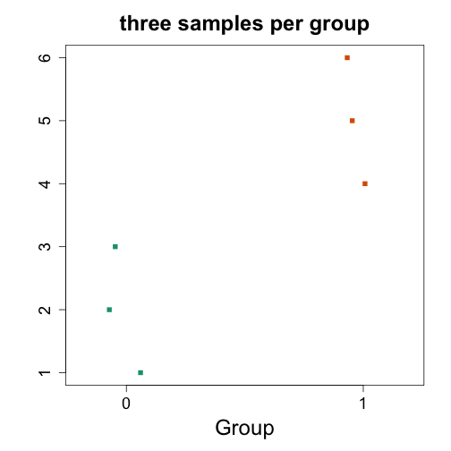
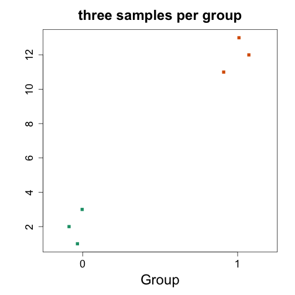
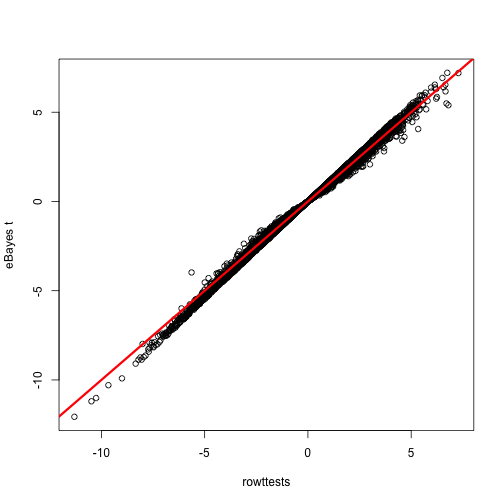

# Basic inference for microarray data

We have data for two strains of mice which we will refer to as strain 0 and 1. We want to know which genes are differentially expressed.  We extracted RNA from 12 randomely selected mice from each strain. In one experiment we pooled the RNA from all individuals from each strain and then created 4 replicate samples from this pool. 


```r
library(Biobase)
```

```
## Loading required package: BiocGenerics
## Loading required package: methods
## Loading required package: parallel
## 
## Attaching package: 'BiocGenerics'
## 
## The following objects are masked from 'package:parallel':
## 
##     clusterApply, clusterApplyLB, clusterCall, clusterEvalQ,
##     clusterExport, clusterMap, parApply, parCapply, parLapply,
##     parLapplyLB, parRapply, parSapply, parSapplyLB
## 
## The following object is masked from 'package:stats':
## 
##     xtabs
## 
## The following objects are masked from 'package:base':
## 
##     anyDuplicated, append, as.data.frame, as.vector, cbind,
##     colnames, do.call, duplicated, eval, evalq, Filter, Find, get,
##     intersect, is.unsorted, lapply, Map, mapply, match, mget,
##     order, paste, pmax, pmax.int, pmin, pmin.int, Position, rank,
##     rbind, Reduce, rep.int, rownames, sapply, setdiff, sort,
##     table, tapply, union, unique, unlist
## 
## Welcome to Bioconductor
## 
##     Vignettes contain introductory material; view with
##     'browseVignettes()'. To cite Bioconductor, see
##     'citation("Biobase")', and for packages 'citation("pkgname")'.
```

```r
# library(devtools)
# install_github("dagdata","genomicsclass")
library(dagdata)
data(maPooling)
e <- maPooling
head(pData(e))
```

```
##          a2 a3 a4 a5 a6 a7 a8 a9 a10 a11 a12 a14 b2 b3 b5 b6 b8 b9 b10 b11
## a10       0  0  0  0  0  0  0  0   1   0   0   0  0  0  0  0  0  0   0   0
## a10a11    0  0  0  0  0  0  0  0   1   1   0   0  0  0  0  0  0  0   0   0
## a10a11a4  0  0  1  0  0  0  0  0   1   1   0   0  0  0  0  0  0  0   0   0
## a11       0  0  0  0  0  0  0  0   0   1   0   0  0  0  0  0  0  0   0   0
## a12       0  0  0  0  0  0  0  0   0   0   1   0  0  0  0  0  0  0   0   0
## a12a14    0  0  0  0  0  0  0  0   0   0   1   1  0  0  0  0  0  0   0   0
##          b12 b13 b14 b15
## a10        0   0   0   0
## a10a11     0   0   0   0
## a10a11a4   0   0   0   0
## a11        0   0   0   0
## a12        0   0   0   0
## a12a14     0   0   0   0
```

```r
# install_github("rafalib","ririzarr")
library(rafalib)
```

```
## Loading required package: RColorBrewer
```

```r
mypar()
flipt <- function(m) t(m[nrow(m):1,])
myimage <- function(m,...) {
  image(flipt(m),xaxt="n",yaxt="n",...)
  }

myimage(as.matrix(pData(e)),col=c("white","black"),
        xlab="experiments",
        ylab="individuals",
        main="phenoData")
```

 

```r
# individuals will contain the rows with data from only one experiment
individuals <- which(rowSums(pData(e)) == 1)
individuals
```

```
##   a10   a11   a12   a14    a2    a3 a3tr1 a3tr2    a4    a5    a6    a7 
##     1     4     5     8     9    12    13    14    15    17    19    21 
##    a8    a9   b10   b11   b12   b13   b14   b15    b2    b3 b3tr1 b3tr2 
##    22    24    29    32    33    36    38    39    40    43    44    45 
##    b5    b6    b8    b9 
##    46    48    50    52
```

```r
## remove replicates (tr = technical replicates)
names(individuals)
```

```
##  [1] "a10"   "a11"   "a12"   "a14"   "a2"    "a3"    "a3tr1" "a3tr2"
##  [9] "a4"    "a5"    "a6"    "a7"    "a8"    "a9"    "b10"   "b11"  
## [17] "b12"   "b13"   "b14"   "b15"   "b2"    "b3"    "b3tr1" "b3tr2"
## [25] "b5"    "b6"    "b8"    "b9"
```

```r
individuals <- individuals[-grep("tr",names(individuals))]

# graphical check: now we have only points, there are no stripes (stripe= several rows containing data from the same experiment, as in the original data).
es <- e[,individuals]
myimage(as.matrix(pData(es)),col=c("white","black"))
```

 

```r
# strains a and b are marked with a and b in the names
es$group <- factor(as.numeric(grepl("b",colnames(es))))
es$group
```

```
##  [1] 0 0 0 0 0 0 0 0 0 0 0 0 1 1 1 1 1 1 1 1 1 1 1 1
## Levels: 0 1
```

## Plots of gene expression across group

Let's look at 2 pre-selected genes for illustration, which are the same genes from the lecture.

Expression set contains normalized gene expression values (next lectures will explain normalization, this set has already been normalized)

```r
i=11425
j=11878
mypar(1,2)
stripchart(split(exprs(es)[i,], es$group), vertical=TRUE, method="jitter", col=c(1,2), main="Gene 1", xlab="Group", pch=15)
stripchart(split(exprs(es)[j,], es$group), vertical=TRUE, method="jitter", col=c(1,2), main="Gene 2", xlab="Group", pch=15)
```

 

# bloxplots can also be used
boxplot(split(exprs(es)[i,], es$group))
boxplot(split(exprs(es)[j,], es$group))

# equivalent to
boxplot(exprs(es)[i,] ~ es$group)
boxplot(exprs(es)[j,] ~ es$group)

## Compute a t-test for each gene (row)


```r
# biocLite("genefilter")
library(genefilter)
```

```
## 
## Attaching package: 'genefilter'
## 
## The following object is masked from 'package:base':
## 
##     anyNA
```

```r
tt <- rowttests(exprs(es), es$group)
head(tt)
```

```
##            statistic        dm p.value
## 1367452_at  -1.14745 -0.092545  0.2635
## 1367453_at  -0.40971 -0.026868  0.6860
## 1367454_at  -0.03675 -0.003017  0.9710
## 1367455_at   1.30954  0.101727  0.2039
## 1367456_at   0.11782  0.006900  0.9073
## 1367457_at  -0.54473 -0.038318  0.5914
```

```r
# check that rowttests computes the difference between the mean of the first group and the mean of the second group, reports it tt$dm
head(tt,1)
```

```
##            statistic       dm p.value
## 1367452_at    -1.147 -0.09254  0.2635
```

```r
mean(exprs(es)[1,es$group == 0]) - mean(exprs(es)[1,es$group == 1]) 
```

```
## [1] -0.09254
```

```r
# for a single row, direct t.test calculation (rowtests will be faster for many rows)
simple.t <- t.test(exprs(es)[1,] ~ es$group, var.equal=TRUE)
simple.t$p.value
```

```
## [1] 0.2635
```

```r
head(tt,1)
```

```
##            statistic       dm p.value
## 1367452_at    -1.147 -0.09254  0.2635
```

```r
tt$p.value[i]
```

```
## [1] 0.08987
```

```r
tt$p.value[j]
```

```
## [1] 1.979e-07
```

```r
mypar(1,1)
with(tt, plot(dm, -log10(p.value), 
              xlab="difference in means",
              main="'Volcano' plot"))

# gets the value of the a point in a plot
tt[with(tt, identify(dm, -log10(p.value))),]
```

 

```
## [1] statistic dm        p.value  
## <0 rows> (or 0-length row.names)
```

## Compare with non-parametric tests


```r
# take 3 samples from strain a and 3 from strain b (it is previously known that 1,2 3 belong to strain a and 13, 14, 15 belong to strain b)
es2 <- es[,c(1,2,3,13,14,15)]
head(exprs(es2))
```

```
##               a10    a11    a12    b10    b11    b12
## 1367452_at 10.052  9.773 10.101  9.930 10.049 10.226
## 1367453_at 10.163 10.127 10.402 10.187 10.254 10.214
## 1367454_at 10.212 10.364 10.267 10.086 10.372 10.280
## 1367455_at 10.335 10.182 10.491 10.097 10.285 10.270
## 1367456_at 10.889 10.716 10.804 10.716 10.817 10.907
## 1367457_at  9.667  9.555  9.618  9.641  9.598  9.723
```

```r
mypar(1,1)
stripchart(exprs(es2)[1,] ~ es2$group, vertical=TRUE, method="jitter", col=c(1,2), main="three samples per group", xlab="Group", ylab="", pch=15)
```

 

```r
t.test(exprs(es2)[1,] ~ es2$group)
```

```
## 
## 	Welch Two Sample t-test
## 
## data:  exprs(es2)[1, ] by es2$group
## t = -0.7016, df = 3.888, p-value = 0.5227
## alternative hypothesis: true difference in means is not equal to 0
## 95 percent confidence interval:
##  -0.4688  0.2814
## sample estimates:
## mean in group 0 mean in group 1 
##           9.975          10.069
```

```r
wilcox.test(exprs(es2)[1,] ~ es2$group)
```

```
## 
## 	Wilcoxon rank sum test
## 
## data:  exprs(es2)[1, ] by es2$group
## W = 4, p-value = 1
## alternative hypothesis: true location shift is not equal to 0
```

```r
# wilcox is conservative, in the following two examples we have clear separation between groups but p.value is much higher than t test
y <- 1:6
x <- es2$group
stripchart(y ~ x, vertical=TRUE, method="jitter", col=c(1,2), main="three samples per group", xlab="Group", ylab="", pch=15)
```

 

```r
t.test(y ~ x)
```

```
## 
## 	Welch Two Sample t-test
## 
## data:  y by x
## t = -3.674, df = 4, p-value = 0.02131
## alternative hypothesis: true difference in means is not equal to 0
## 95 percent confidence interval:
##  -5.267 -0.733
## sample estimates:
## mean in group 0 mean in group 1 
##               2               5
```

```r
wilcox.test(y ~ x)
```

```
## 
## 	Wilcoxon rank sum test
## 
## data:  y by x
## W = 0, p-value = 0.1
## alternative hypothesis: true location shift is not equal to 0
```

```r
# very clear separation, and wilcox report conservative p-value, same as previous example, as ranks are identicals in both cases
y <- c(1:3,11:13)
stripchart(y ~ x, vertical=TRUE, method="jitter", col=c(1,2), main="three samples per group", xlab="Group", ylab="", pch=15)
```

 

```r
t.test(y ~ x)
```

```
## 
## 	Welch Two Sample t-test
## 
## data:  y by x
## t = -12.25, df = 4, p-value = 0.0002552
## alternative hypothesis: true difference in means is not equal to 0
## 95 percent confidence interval:
##  -12.267  -7.733
## sample estimates:
## mean in group 0 mean in group 1 
##               2              12
```

```r
wilcox.test(y ~ x)
```

```
## 
## 	Wilcoxon rank sum test
## 
## data:  y by x
## W = 0, p-value = 0.1
## alternative hypothesis: true location shift is not equal to 0
```

## Basic inference on microarray using lmFit from limma package

We will discuss the limma package in the lecture on Hierarchical Modeling. The reference is [Smyth 2004](#foot).


```r
# biocLite("limma")
library(limma)
```

```
## 
## Attaching package: 'limma'
## 
## The following object is masked from 'package:BiocGenerics':
## 
##     plotMA
```

```r
# ?lmFit
design <- model.matrix(~ es$group)
design
```

```
##    (Intercept) es$group1
## 1            1         0
## 2            1         0
## 3            1         0
## 4            1         0
## 5            1         0
## 6            1         0
## 7            1         0
## 8            1         0
## 9            1         0
## 10           1         0
## 11           1         0
## 12           1         0
## 13           1         1
## 14           1         1
## 15           1         1
## 16           1         1
## 17           1         1
## 18           1         1
## 19           1         1
## 20           1         1
## 21           1         1
## 22           1         1
## 23           1         1
## 24           1         1
## attr(,"assign")
## [1] 0 1
## attr(,"contrasts")
## attr(,"contrasts")$`es$group`
## [1] "contr.treatment"
```

```r
fit <- lmFit(es, design)
names(fit)
```

```
##  [1] "coefficients"     "rank"             "assign"          
##  [4] "qr"               "df.residual"      "sigma"           
##  [7] "cov.coefficients" "stdev.unscaled"   "pivot"           
## [10] "Amean"            "method"           "design"
```

```r
head(coef(fit))
```

```
##            (Intercept) es$group1
## 1367452_at      10.027  0.092545
## 1367453_at      10.174  0.026868
## 1367454_at      10.275  0.003017
## 1367455_at      10.372 -0.101727
## 1367456_at      10.816 -0.006900
## 1367457_at       9.607  0.038318
```

```r
# difference in means from t test is the same as the difference in means reported by t test
coef(fit)[1,]
```

```
## (Intercept)   es$group1 
##    10.02745     0.09254
```

```r
tt[1,]
```

```
##            statistic       dm p.value
## 1367452_at    -1.147 -0.09254  0.2635
```

```r
# we will introduce the eBayes() function
# in a later module called 'hierarchical modeling'
# but we call it now as it is standard in microarray analysis
fit <- eBayes(fit)
names(fit)
```

```
##  [1] "coefficients"     "rank"             "assign"          
##  [4] "qr"               "df.residual"      "sigma"           
##  [7] "cov.coefficients" "stdev.unscaled"   "pivot"           
## [10] "Amean"            "method"           "design"          
## [13] "df.prior"         "s2.prior"         "var.prior"       
## [16] "proportion"       "s2.post"          "t"               
## [19] "df.total"         "p.value"          "lods"            
## [22] "F"                "F.p.value"
```

```r
# p-values for intercept and difference between gene 1 and gene 2
fit$p.value[1,]
```

```
## (Intercept)   es$group1 
##   3.871e-43   2.442e-01
```

```r
fit$t[1,]
```

```
## (Intercept)   es$group1 
##     182.450       1.191
```

```r
# ebayes and t test are different
tt[1,]
```

```
##            statistic       dm p.value
## 1367452_at    -1.147 -0.09254  0.2635
```

```r
# graphical comparison: in most cases they are close, but not the same
plot(-1 * tt$statistic, fit$t[,2],
     xlab="rowttests", 
     ylab="eBayes t")
abline(0,1,col="red",lwd=3)
```

 

```r
#
head(topTable(fit, coef=2, sort.by="p"),3)
```

```
##             logFC AveExpr      t   P.Value adj.P.Val     B
## 1388618_at -1.236  10.155 -12.07 2.313e-12 3.683e-08 17.80
## 1372006_at -1.162  10.156 -11.20 1.252e-11 9.578e-08 16.27
## 1371293_at -1.240   6.414 -11.01 1.804e-11 9.578e-08 15.94
```

## Footnotes <a name="foot"></a>

Smyth GK, "Linear models and empirical bayes methods for assessing differential expression in microarray experiments". Stat Appl Genet Mol Biol. 2004 <http://www.ncbi.nlm.nih.gov/pubmed/16646809>
