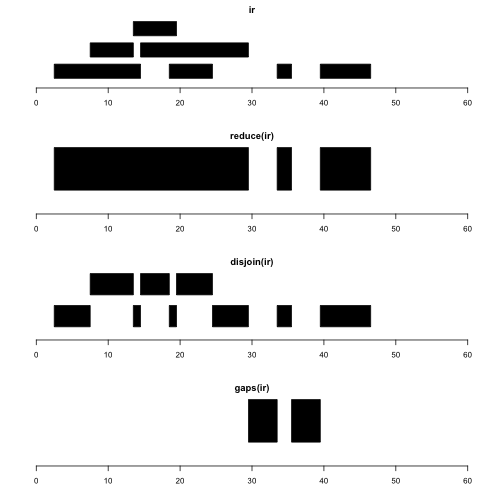

```
## Now getting the GODb Object directly
```

```
## Now getting the OrgDb Object directly
```

```
## Now getting the TxDb Object directly
```
# Overview

In this document we work with a small set of ranges and
illustrate basic intra-range operations reduce, disjoin, gaps.
We then add strand and seqname information and show how
resize and flank are useful for identifying TSS and promoter regions.

## A simple set of ranges


```r
ir <- IRanges(c(3, 8, 14, 15, 19, 34, 40),
  width = c(12, 6, 6, 15, 6, 2, 7))
```


Let's visualize `ir` and several intra-range operations.

```r
par(mfrow=c(4,1), mar=c(4,2,2,2))
plotRanges(ir, xlim=c(0,60))
plotRanges(reduce(ir), xlim=c(0,60))
plotRanges(disjoin(ir), xlim=c(0,60))
plotRanges(gaps(ir), xlim=c(0,60))
```



reduce(x) produces a set of
nonoverlapping ranges that cover all positions covered by x.
This can be used to reduce complexity of a gene model
with many transcripts, where we may just want the addresses
of intervals known to be transcribed, regardless of transcript
of residence.

disjoin(x) produces a set of ranges that cover all positions
covered by x, such that none of the ranges in the
disjoin output overlaps any end points of intervals in x.
This gives us the largest possible collection of contiguous
intervals that are separated wherever the original set
of intervals had an endpoint.

gaps(x) produces a set of ranges covering the positions
in [start(x), end(x)] that are not covered by any range in x.
Given coding sequence addresses and exon intervals, this can
be used to enumerate introns.

# Extension to GRanges

We add chromosome and strand information.


```r
library(GenomicRanges)
gir = GRanges(seqnames="chr1", ir, strand=c(rep("+", 4), rep("-",3)))
```

Let's assume the intervals represent genes.
The following plots illustrate the identification of
transcription start sites (green), upstream promoter
regions (purple), downstream promoter regions (brown).


```r
par(mfrow=c(4,1), mar=c(4,2,2,2))
plotGRanges(gir, xlim=c(0,60))
plotGRanges(resize(gir,1), xlim=c(0,60),col="green")
plotGRanges(flank(gir,3), xlim=c(0,60), col="purple")
plotGRanges(flank(gir,2,start=FALSE), xlim=c(0,60), col="brown")
```


Note that we do not need to take special steps to
deal with the differences in strand.
