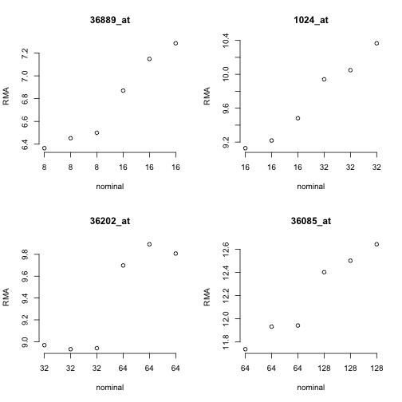
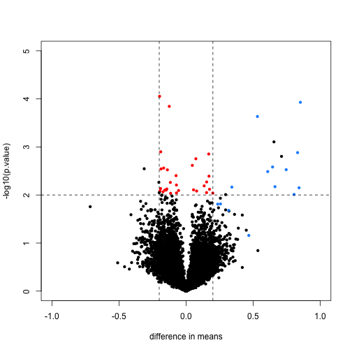
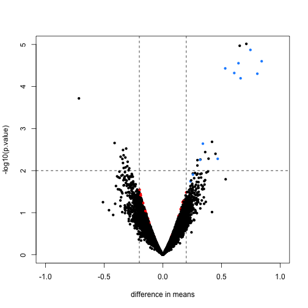
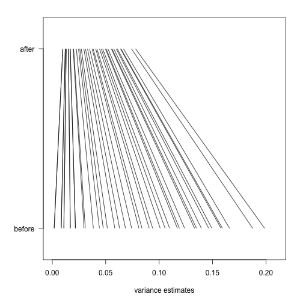

## First, simple t-tests

In this unit, we will show the difference between using the simple t-test and doing differential expression with the *[limma](http://bioconductor.org/packages/limma)* hierarchical model. The reference is [Smyth 2004](#foot), listed in the footnotes.

Here we also show the basic steps for performing a `limma` analysis. Note that the `limma` package is very powerful, and has hundreds of pages of documentation which we cannot cover in this course, however we recommend that users wanting to explore further should check out this guide.

<a name="spikein"></a>

### The spike-in dataset

We start by loading the normalized spike-in data generated by 
Affymetrix. 


```r
# biocLite("SpikeInSubset")
library(SpikeInSubset)
data(rma95)
fac <- factor(rep(1:2,each=3))
```

Briefly, there are 16 mRNA species for which fixed concentration
samples have been prepared and mixed for quantification using
the hgu95 array.  This subset is such that for each
of the spiked in mRNA species, the
first trio and second trio of samples in the ExpressionSet have fixed
distinct values.  This can be seen by examining the pData:

```r
pData(rma95)
```

```
##                  37777_at 684_at 1597_at 38734_at 39058_at 36311_at
## 1521a99hpp_av06      0.00   0.25     0.5        1        2        4
## 1532a99hpp_av04      0.00   0.25     0.5        1        2        4
## 2353a99hpp_av08      0.00   0.25     0.5        1        2        4
## 1521b99hpp_av06      0.25   0.50     1.0        2        4        8
## 1532b99hpp_av04      0.25   0.50     1.0        2        4        8
## 2353b99hpp_av08r     0.25   0.50     1.0        2        4        8
##                  36889_at 1024_at 36202_at 36085_at 40322_at 407_at
## 1521a99hpp_av06         8      16       32       64      128   0.00
## 1532a99hpp_av04         8      16       32       64      128   0.00
## 2353a99hpp_av08         8      16       32       64      128   0.00
## 1521b99hpp_av06        16      32       64      128      256   0.25
## 1532b99hpp_av04        16      32       64      128      256   0.25
## 2353b99hpp_av08r       16      32       64      128      256   0.25
##                  1091_at 1708_at 33818_at 546_at
## 1521a99hpp_av06      512    1024      256     32
## 1532a99hpp_av04      512    1024      256     32
## 2353a99hpp_av08      512    1024      256     32
## 1521b99hpp_av06     1024       0      512     64
## 1532b99hpp_av04     1024       0      512     64
## 2353b99hpp_av08r    1024       0      512     64
```

To get a feel for the response of the array quantifications
to this design, consider the following plots for four of the
spiked mRNAs.

```r
par(mfrow=c(2,2))
for (i in 1:4) {
  spg = names(pData(rma95))
  plot(1:6, exprs(rma95)[spg[i+6],], main=spg[i+6], ylab="RMA",
    xlab="nominal", axes=FALSE)
  axis(2)
  axis(1, at=1:6, labels=pData(rma95)[[spg[i+6]]])
}
```




Since the RMA (robust multi-array average) 
quantifications are on a log2 scale, the observed differences
in approximate mean of normalized measures
seems reasonable.  But considerable
variability is present for the measures within each concentration setting.

<a name="simpleT"></a>

### `rowttests`

We can now perform simple t-tests using the `rowttests` function in the `genefilter` package:


```r
library(genefilter)
rtt <- rowttests(exprs(rma95),fac)
```

We will define colors depending on whether the p-value is small, the absolute difference in means is large, and whether the feature is a spike-in value.


```r
mask <- with(rtt, abs(dm) < .2 & p.value < .01)
spike <- rownames(rma95) %in% colnames(pData(rma95))
cols <- ifelse(mask,"red",ifelse(spike,"dodgerblue","black"))
```

We now plot the results, using the colors defined above. We multiply the `dm` by -1, because we are interested in the difference from the second group to the first (this is the difference used by `lm` and the `limma` package by default). The spike-in genes are in blue, which have mostly small p-value and large difference in means. The red points indicate genes which have small p-values but also small differences in means. We will see how these points change after using `limma`.


```r
with(rtt, plot(-dm, -log10(p.value), cex=.8, pch=16,
     xlim=c(-1,1), ylim=c(0,5),
     xlab="difference in means",
     col=cols))
abline(h=2,v=c(-.2,.2), lty=2)
```



Note that the red genes have mostly low estimates of standard deviation.


```r
rtt$s <- apply(exprs(rma95), 1, function(row) sqrt(.5 * (var(row[1:3]) + var(row[4:6]))))
with(rtt, plot(s, -log10(p.value), cex=.8, pch=16,
              log="x",xlab="estimate of standard deviation",
              col=cols))
```


<a name="limmaSteps"></a>

## limma steps

The following three steps perform the basic `limma` analysis. We specify `coef=2` because we are interested in the difference between groups, not the intercept.


```r
library(limma)
options(digits=3)
fit <- lmFit(rma95, design=model.matrix(~ fac))  # step 1 least squares estimates
colnames(coef(fit))     
```

```
## [1] "(Intercept)" "fac2"
```

```r
fit <- eBayes(fit)           # step 2 moderate the t statistics
tt <- topTable(fit, coef=2)  # step 3 report
tt
```

```
##           logFC AveExpr      t  P.Value adj.P.Val    B
## 1708_at  -7.061    7.95 -73.53 7.82e-17  9.87e-13 8.65
## 36202_at  0.853    9.37   9.98 4.94e-07  3.12e-03 4.59
## 36311_at  0.832    8.56   8.36 3.02e-06  1.27e-02 3.57
## 33264_at  0.712    4.92   7.43 9.67e-06  2.71e-02 2.84
## 32660_at  0.655    8.68   7.36 1.07e-05  2.71e-02 2.77
## 38734_at  0.747    6.26   7.19 1.35e-05  2.83e-02 2.62
## 1024_at   0.843    9.70   6.73 2.50e-05  4.40e-02 2.20
## 36085_at  0.645   12.19   6.65 2.79e-05  4.40e-02 2.12
## 33818_at  0.532   12.29   6.45 3.70e-05  5.19e-02 1.92
## 39058_at  0.609    7.53   6.28 4.77e-05  5.69e-02 1.74
```

`topTable` will return the top genes ranked by whichever value you define. You can also ask topTable to return all the values, sorted by `"none"`. Note that a column automatically is included which gives the *adjusted p-values* for each gene. By default the method of Benjamini-Hochberg is used, by calling the `p.adjust` function.


```r
# ?topTable
dim(topTable(fit, coef=2, number=Inf, sort.by="none"))
```

```
## [1] 12626     6
```

```r
# ?p.adjust
```

<a name="expose"></a>

Here we will compare the previous volcano plot with the `limma` results. Note that the red points are now all under the line where `-log10(p.value)` is equal to 2. Also, the blue points which represent real differences have p-values which are even higher than before.


```r
limmares <- data.frame(dm=coef(fit)[,"fac2"], p.value=fit$p.value[,"fac2"])
with(limmares, plot(dm, -log10(p.value),cex=.8, pch=16,
     col=cols,xlab="difference in means",
     xlim=c(-1,1), ylim=c(0,5)))
abline(h=2,v=c(-.2,.2), lty=2)
```



<a name="shrinkage"></a>

Finally, we will construct a plot which shows how `limma` shrinks the variance estimates towards a common value, eliminating false positives which might arise from too-low estimates of variance.

Here we pick, for each of 40 bins of different variance estimates, a single gene which falls in that bin. We remove bins which do not have any such genes.


```r
n <- 40
qs <- seq(from=0,to=.2,length=n)
idx <- sapply(seq_len(n),function(i) which(as.integer(cut(rtt$s^2,qs)) == i)[1])
idx <- idx[!is.na(idx)]
```

Now we will plot a line, from the initial estimate of variance for these genes to the estimate after running `limma`.


```r
par(mar=c(5,5,2,2))
plot(1,1,xlim=c(0,.21),ylim=c(0,1),type="n",
     xlab="variance estimates",ylab="",yaxt="n")
axis(2,at=c(.1,.9),c("before","after"),las=2)
segments((rtt$s^2)[idx],rep(.1,n),
         fit$s2.post[idx],rep(.9,n))
```



The statistical details are provided in the lecture on
[hierarchical models](http://genomicsclass.github.io/book/pages/hierarchical_models.html).

## Footnotes <a name="foot"></a>

Smyth GK, "Linear models and empirical bayes methods for assessing differential expression in microarray experiments". Stat Appl Genet Mol Biol. 2004 <http://www.ncbi.nlm.nih.gov/pubmed/16646809>
