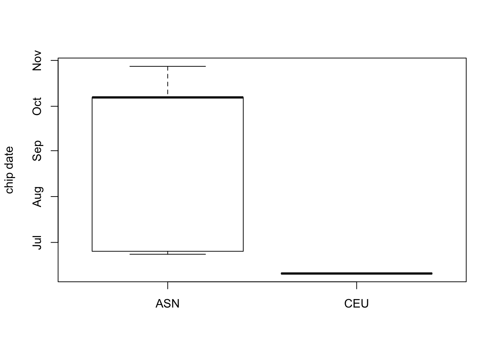
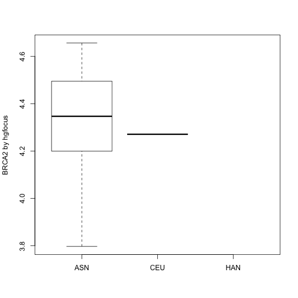

```
## Warning: multiple methods tables found for 'unlist'
```

```
## Warning: multiple methods tables found for 'as.vector'
```

```
## Warning: multiple methods tables found for 'unlist'
```

```
## Warning: multiple methods tables found for 'as.vector'
```

```
## Warning: multiple methods tables found for 'unlist'

## Warning: multiple methods tables found for 'unlist'
```

# Introduction

It is very common for life scientists to use spreadsheets
to record and manage experimental data.  In these problems
we will build up a discipline of data management for
genome-scale experiments using R and Bioconductor.  

It may seem unusual to recommend R-based software for managing
data.  Ordinarily R is used for programming and computing
statistical analyses.  However, Bioconductor has taken very
seriously the need to carefully annotate, in a unified way,
many aspects of complex biological experiments.  This approach
allows us to import assay outputs (such as multiple microarray
scans, or multiple sequencing alignments), combining them with
relevant metadata about the experiment and the samples assayed,
saving all the information in a single R variable.  By carefully
designing the structure of this variable, programs can operate
reliably on various aspects of the data.  Ultimately a more
efficient management and analysis environment is obtained.

We will come to understand this enhancement of efficiency by
working from some very basic representations of experimental
data, proceeding stepwise to more advanced integrative
representations that are the hallmark of Bioconductor's
approach to genome-scale data.

## Illustrative exercises (worked through in video)

1.0 Distinct components from an experiment.


```r
library(GSE5859Subset)
library(Biobase)
.oldls = ls()
data(GSE5859Subset)
.newls = ls()
```

The objects obtained from the data() command are

```r
newstuff = setdiff(.newls, .oldls)
newstuff
```

```
## [1] "geneAnnotation" "geneExpression" "sampleInfo"
```
and they have classes

```r
cls = lapply(newstuff, function(x) class(get(x)))
names(cls) = newstuff
cls
```

```
## $$geneAnnotation
## [1] "data.frame"
## 
## $$geneExpression
## [1] "matrix"
## 
## $$sampleInfo
## [1] "data.frame"
```

It is easy to make an informative plot of hybridization date
by ethnicity of sample source using standard R:


```r
boxplot(date~factor(ethnicity), data=sampleInfo, ylab="chip date")
```



What if we want to look at expression of the gene BRCA2 by ethnicity?
We have to do several things:  

* We need to determine which row of `geneExpression` corresponds to BRCA2,
and to do this we need to know which column of `geneAnnotation` provides
the information;
* We need to ensure that the
gene expression data in the matrix `geneExpression` are ordered consistently
with the ordering of data in `sampleInfo`, and to do this we need to
know which column of `sampleInfo` identifies the samples using the
same tags as `geneExpression`.

Therefore, to relate gene expression to a sample characteristic we
need to manipulate three different entities (expression, sample annotation,
and gene annotation), ensuring that they are properly coordinated.


```r
all.equal(colnames(geneExpression), sampleInfo$filename)
```

```
## [1] TRUE
```

```r
all.equal(rownames(geneExpression), sampleInfo$PROBEID)
```

```
## [1] "Modes: character, NULL"              
## [2] "Lengths: 8793, 0"                    
## [3] "target is character, current is NULL"
```

```r
ind = which(geneAnnotation$SYMBOL=="BRCA2")
boxplot(geneExpression[ind,]~sampleInfo$ethnicity, ylab="BRCA2 by hgfocus")
```



It works, but it is complicated.  To reduce complexity, Bioconductor
defines `ExpressionSet`.

1.1 _The ExpressionSet container_.  

There are high-level commands that simplify ExpressionSet construction.


```r
es1 = ExpressionSet(geneExpression)
pData(es1) = sampleInfo
fData(es1) = geneAnnotation
es1
```

```
## ExpressionSet (storageMode: lockedEnvironment)
## assayData: 8793 features, 24 samples 
##   element names: exprs 
## protocolData: none
## phenoData
##   sampleNames: 107 122 ... 159 (24 total)
##   varLabels: ethnicity date filename group
##   varMetadata: labelDescription
## featureData
##   featureNames: 1 30 ... 12919 (8793 total)
##   fvarLabels: PROBEID CHR CHRLOC SYMBOL
##   fvarMetadata: labelDescription
## experimentData: use 'experimentData(object)'
## Annotation:
```

When we mention `es1` we get 
a compact representation of lots of information about the
experiment.  Use `es1` to visualize the confounding of
hybridization date with ethnicity:

```r
boxplot(es1$date~es1$ethnicity)
```

Now you've been introduced to the ExpressionSet
container design and you've even constructed an
ExpressionSet instance.  We'll use a more comprehensive
representation of the data in the underlying experiment
in the next task.  We'll use


```r
library(GSE5859)
data(GSE5859)
e
```

```
## ExpressionSet (storageMode: lockedEnvironment)
## assayData: 8793 features, 208 samples 
##   element names: exprs, se.exprs 
## protocolData
##   sampleNames: GSM25349.CEL.gz GSM25350.CEL.gz ...
##     GSM136729.CEL.gz (208 total)
##   varLabels: ScanDate
##   varMetadata: labelDescription
## phenoData
##   sampleNames: 1 2 ... 208 (208 total)
##   varLabels: ethnicity date filename
##   varMetadata: labelDescription
## featureData: none
## experimentData: use 'experimentData(object)'
## Annotation: hgfocus
```

1.2 _Metadata management_.  It is useful to have information
about an experiment's intentions and methods ready-to-hand.
Some of the arrays used for GSE5859 were produced for a 2004
paper with Pubmed ID 15269782.  We can, if connected to the
internet, import information about that paper into R.


```r
library(annotate)
p = pmid2MIAME("15269782")
p
```

```
## Experiment data
##   Experimenter name: Morley M 
##   Laboratory: NA 
##   Contact information:  
##   Title: Genetic analysis of genome-wide variation in human gene expression. 
##   URL:  
##   PMIDs: 15269782 
## 
##   Abstract: A 167 word abstract is available. Use 'abstract' method.
```

Check the display of `e` in your session.  Then
Use the command `experimentData(e) <- p`.  How
has the display of `e` changed?  What is the result of
`experimentData(e)`?


# ExpressionSet: Why? and How?

We have moved fairly quickly through the creation and use
of an `ExpressionSet` instance to illustrate some of its
virtues.  We will now provide some details on why and how this structure
is designed and used.

Motivations underlying the ExpressionSet design are many.  A
few of the most important are
* to reduce complexity of programming with complex assay, annotation, and sample-level information,
* to support simple and idiomatic filtering of features and samples,
* to control memory consumption as assay data are passed to analytical functions.

So much for "why", to this point.  "How" takes us for an excursion
in software design strategy: object-oriented programming in R with the
class system known as S4.

## Object-oriented programming and S4 classes

Object-oriented programming (OOP) is a discipline of computer
programming that helps to reduce program complexity and
maintenance requirements, and to enhance program interoperability.
There are various approaches to OOP, even within R, and
we focus on the one known as S4.  The basic
idea is that an object 

- brings together data of different types in a unified structure,
- is identified as a member of a formally specified class, and may be formally situated in a system of related objects,
- "responds to" generic method calls in a class-specific way.

We can see the class structure for an ExpressionSet with `getClass`:

```r
getClass("ExpressionSet")
```

```
## Class "ExpressionSet" [package "Biobase"]
## 
## Slots:
##                                                                
## Name:      experimentData          assayData          phenoData
## Class:              MIAME          AssayData AnnotatedDataFrame
##                                                                
## Name:         featureData         annotation       protocolData
## Class: AnnotatedDataFrame          character AnnotatedDataFrame
##                          
## Name:   .__classVersion__
## Class:           Versions
## 
## Extends: 
## Class "eSet", directly
## Class "VersionedBiobase", by class "eSet", distance 2
## Class "Versioned", by class "eSet", distance 3
```
This shows that there are 7
'slots' comprising the class definition.  Only the `annotation` slot
is occupied by a simple R data type.  All the other slots
are to be occupied by instances of other S4 classes (or more basic
R data types).

As an example, the `MIAME` class has the following definition:

```r
getClass("MIAME")
```

```
## Class "MIAME" [package "Biobase"]
## 
## Slots:
##                                                             
## Name:               name               lab           contact
## Class:         character         character         character
##                                                             
## Name:              title          abstract               url
## Class:         character         character         character
##                                                             
## Name:          pubMedIds           samples    hybridizations
## Class:         character              list              list
##                                                             
## Name:       normControls     preprocessing             other
## Class:              list              list              list
##                         
## Name:  .__classVersion__
## Class:          Versions
## 
## Extends: 
## Class "MIAxE", directly
## Class "characterORMIAME", directly
## Class "Versioned", by class "MIAxE", distance 2
```

So we see that S4 allows us to define new data structures that
encapsulate diverse types of information.  We could do this
with the very general "list" structure provided by R.  But S4
allows us to guarantee properties of our new structures 
so that programs defined for these structures
do not have to "check" on what they are operating on.  The checks
are built in to the class system.

## DataFrame: an enhanced structure for tabular data

We are familiar with the `data.frame` structure from base R.
Bioconductor introduced the `DataFrame` class to provide some
additional capabilities that will be heavily exploited later.


```r
library(S4Vectors)
sa2 = DataFrame(sampleInfo)
sa2
```

```
## DataFrame with 24 rows and 4 columns
##     ethnicity       date         filename     group
##      <factor>     <Date>      <character> <numeric>
## 1         ASN 2005-06-23 GSM136508.CEL.gz         1
## 2         ASN 2005-06-27 GSM136530.CEL.gz         1
## 3         ASN 2005-06-27 GSM136517.CEL.gz         1
## 4         ASN 2005-10-28 GSM136576.CEL.gz         1
## 5         ASN 2005-10-07 GSM136566.CEL.gz         1
## ...       ...        ...              ...       ...
## 20        ASN 2005-06-27 GSM136524.CEL.gz         0
## 21        ASN 2005-06-23 GSM136514.CEL.gz         0
## 22        ASN 2005-10-07 GSM136563.CEL.gz         0
## 23        ASN 2005-10-07 GSM136564.CEL.gz         0
## 24        ASN 2005-10-07 GSM136572.CEL.gz         0
```

The `show` method depicts top and bottom table row data, provides
information on column datatype, and has the capacity to manage
complex data types in columns more effectively than `data.frame`.
Here is the class definition:


```r
getClass("DataFrame")
```

```
## Class "DataFrame" [package "S4Vectors"]
## 
## Slots:
##                                                                       
## Name:         rownames           nrows        listData     elementType
## Class: characterORNULL         integer            list       character
##                                       
## Name:  elementMetadata        metadata
## Class: DataTableORNULL            list
## 
## Extends: 
## Class "DataTable", directly
## Class "SimpleList", directly
## Class "DataTableORNULL", by class "DataTable", distance 2
## Class "List", by class "SimpleList", distance 2
## Class "Vector", by class "SimpleList", distance 3
## Class "Annotated", by class "SimpleList", distance 4
```

## Representations for mature archives from multisample NGS experiments

Short read sequencing leads to data collections that are
more voluminous than gene-oriented microarray outputs.  
Sequencing experiments may also be analyzed in
more varied ways, so that it is valuable to 
provide efficient access to assay outputs at
various levels of granularity.

A typical data flow for RNA-seq studies has phases
1) chromatographic display of base calls per cycle (seldom
provided after, say, 2008), 2)
base calls over the read length, with quality values, in FASTQ format,
3) feature quantification through statistical
processing of genomic or transcriptomic alignments,
4) genome-scale archiving of multiple samples for
inference on biologic questions of interest.
FASTQ files are often developed in pairs for each sample.

### A set of BAM files in Bioconductor

The *[RNAseqData.HNRNPC.bam.chr14](http://bioconductor.org/packages/RNAseqData.HNRNPC.bam.chr14)* package
includes BAM files derived from paired-end sequencing
of 8 samples of HeLa cell lines, 4 of which were subjected to
RNA interference to "knock down" the expression of the heterogeneous
nuclear ribonucleoproteins C1 and C2 (denoted hnRNPC).
This family of nuclear proteins is involved in pre-mRNA processing.
We will demonstrate some approaches to managing the data
from BAM to archived counts related to HNRNPC.

The BAM file pathnames are available in a character
vector stored in the RNAseqData... package.


```r
library(RNAseqData.HNRNPC.bam.chr14)
bfp = RNAseqData.HNRNPC.bam.chr14_BAMFILES
length(bfp)
```

```
## [1] 8
```

```r
bfp[1]
```

```
##                                                                                                                ERR127306 
## "/Library/Frameworks/R.framework/Versions/3.3/Resources/library/RNAseqData.HNRNPC.bam.chr14/extdata/ERR127306_chr14.bam"
```

We use the *[Rsamtools](http://bioconductor.org/packages/Rsamtools)* package to manage these
using a single variable.

```r
library(Rsamtools)
bfl = BamFileList(file=bfp)
bfl
```

```
## BamFileList of length 8
## names(8): ERR127306 ERR127307 ERR127308 ... ERR127303 ERR127304 ERR127305
```

The BAM files include a limited amount of metadata about the
genome to which the reads were aligned.  This is propagated
to the BamFileList instance.

```r
seqinfo(bfl)
```

```
## Seqinfo object with 93 sequences from an unspecified genome:
##   seqnames              seqlengths isCircular genome
##   chr1                   249250621       <NA>   <NA>
##   chr10                  135534747       <NA>   <NA>
##   chr11                  135006516       <NA>   <NA>
##   chr11_gl000202_random      40103       <NA>   <NA>
##   chr12                  133851895       <NA>   <NA>
##   ...                          ...        ...    ...
##   chrUn_gl000247             36422       <NA>   <NA>
##   chrUn_gl000248             39786       <NA>   <NA>
##   chrUn_gl000249             38502       <NA>   <NA>
##   chrX                   155270560       <NA>   <NA>
##   chrY                    59373566       <NA>   <NA>
```
We see that the genome is "unspecified", but we happen to know
that the reference build 'hg19' was used to define the
genomic sequence for alignment.  [genome(bfl) <- "hg19" should
rectify this but at present there is a bug.  This should
be fixed so that attempts to compare alignments using different
references can be flagged or throw errors.]

In order to verify the success of the knockdown we will check
the alignments in the vicinity of the genomic sequence coding
for HNRNPC.  Later we will show how to obtain the gene address
using Bioconductor annotation tools; for now we just assert
that for hg19

```r
hnrnpcLoc = GRanges("chr14", IRanges(21677296, 21737638))
hnrnpcLoc
```

```
## GRanges object with 1 range and 0 metadata columns:
##       seqnames               ranges strand
##          <Rle>            <IRanges>  <Rle>
##   [1]    chr14 [21677296, 21737638]      *
##   -------
##   seqinfo: 1 sequence from an unspecified genome; no seqlengths
```
This identifies a region of chromosome 14 to which the HNRNPC
coding gene is annotated for hg19.  A simple way of assessing the
expression quantifications uses `summarizeOverlaps` from the 
*[GenomicAlignments](http://bioconductor.org/packages/GenomicAlignments)* package.
This counting method will implicitly use multicore computation.  

```r
library(GenomicAlignments)
library(BiocParallel)
register(SerialParam())
hnse = summarizeOverlaps(hnrnpcLoc,bfl)
```

### Exercise

5.1  Examine the contents of the `count` component of `hnse`.  What are
the column identifiers for
quantifications corresponding to the HNRNPC knockdown?

5.2  Add a variable `condition` with values `knockdown` and
`wildtype` to the `colData` component of `hnse`.

5.3  Samples with identifier suffixes 306 and 307 are technical
replicates of a single control sample; likewise for 308 and 309.
Consequently there are six different biological samples in use.
Add a variable to `colData` distinguishing these six samples.

## Some intricacies of the ExpressionSet design (advanced)

Bioinformaticians work in an environment that is constantly
changing.  Computer capacity and throughput has increased
dramatically since Bioconductor began (around 2000CE).  The
R language has also changed considerably.
In the early days, it was important to be very economical
about memory consumption, and R's semantics at that time
led to some inefficiencies through copying of objects in
memory as they are passed to functions.  Copying does not
occur for R objects of class 'environment', and this led to
the adoption of environments for storage of voluminous assay
data.


```r
class(slot(es1, "assayData"))
```

```
## [1] "environment"
```

```r
ae = slot(es1, "assayData")
ae
```

```
## <environment: 0x7fdaf37c6d20>
```

This is a very special type of object for R.  It can be thought
of as a container for a reference to the matrix of expression values.


```r
ls(ae)
```

```
## [1] "exprs"
```

```r
dim(ae$exprs)
```

```
## [1] 8793   24
```

```r
dim(exprs(es1))
```

```
## [1] 8793   24
```

```r
object.size(ae)
```

```
## 56 bytes
```

```r
object.size(ae$exprs)
```

```
## 2253824 bytes
```

### Exercise (optional)

4.1.  Explain the following findings.


```r
e1 = new.env()
l1 = list()
e1$x = 5
l1$x = 5
all.equal(e1$x, l1$x)
```

```
## [1] TRUE
```

```r
f = function(z) {z$x = 4; z$x}
all.equal(f(e1), f(l1))
```

```
## [1] TRUE
```

```r
all.equal(e1$x, l1$x)  # different from before
```

```
## [1] "Mean relative difference: 0.25"
```

<!--

Week 1. Overview of Bioconductor: Channeling R for genome-scale data

 A. What we measure and why videos with exercises
 B. Bioconductor overview: Software, Annotation, Experimental data packages
 C. Brief overview of object-oriented programming and S4
 D. Managing genome-scale data: ExpressionSet, SummarizedExperiment with exercises


Week 2. Genomic annotation with Bioconductor

 A. Prologue: Genomic ranges with exercises
 B. Structural annotation: reference genomic sequence, genes, transcripts with exercises
 C. Assay annotation: microarray platforms with exercises
 D. Functional annotation: Gene ontology, KEGG, AnnotationHub with exercises

Week 3. Preprocessing genome-scale data with Bioconductor

 A. Microarray import and quality assessment with exercises
 B. Short-read import and quality assessment with exercises
 C. Background correction and normalization for microarrays
 D. Bias-correction and normalization for RNA-seq

Week 4. Testing biological hypotheses with Bioconductor

 A. Two-sample tests for differential expression with exercises
 B. Regression and other structured models for gene-specific hypotheses
 C. Modeling with adjustments for confounders
 D. Gene set enrichment analysis

-->

