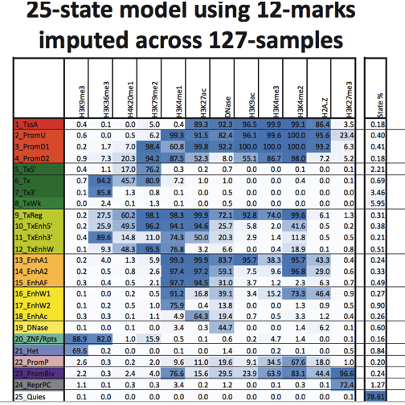
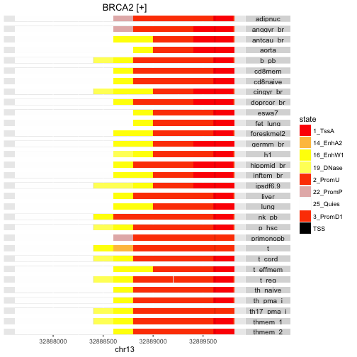
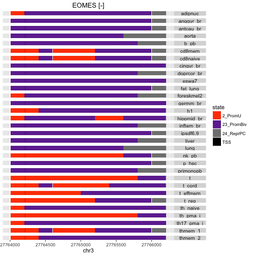

# Introduction

We have seen some very basic and relatively small scale
data management problems solved fairly straightforwardly
with the ExpressionSet class and with BamFileList
for a collection of BAM alignment files.

- S4 classes help control complexity and ensure coherence among components.
- R packages are further used to coordinate and distribute data, software utilities, and documentation.  Later in the course we will demonstrate how to build such packages.

To conclude this section on data management we address a
problem that does not have an obviously optimal solution.
We consider the dilemma between packaging serialized instances
of GRanges, and packaging indexed compressed text files
that can naturally be processed with parallel computing using
GenomicFiles.

Why is this a dilemma?  In certain contexts, GRanges instances for
large numbers of features will be very large, can take significant
time to load, and can consume significant quantities of RAM.  This
can lead to difficulties in using these representations on cluster nodes
with limited RAM.  If the data are kept on disk in an indexed format
allowing random access, transforming targeted extracts of file content
into GRanges on an as-needed basis may produce better performance
for certain applications.  One reason for creating the erma package
is to acquire data on the tradeoffs between these different approaches.

# erma: epigenomic road map adventures

To foster improved interpretation of effects of DNA variants,
we are interested in epigenomic variation among cell types.
Information on analysis of ChIP-seq experiments has been
collected in the NIH epigenomic road map, with hundreds of different
cell-type-specific and mark-specific files archived for public use.

What is an efficient way to manage such data?  One experimental
approach is provided in the [erma](http://www.bioconductor.org/packages/erma)
package.  

## A collection of BED files

Statistical 'imputation' of chromatin states has been performed
as reported by Ernst and Kellis using data on a large number of cell lines.


```r
library(erma)
ef = dir(system.file("bed_tabix", package="erma"), patt="bed.gz$")
length(ef)
```

```
## [1] 31
```

```r
head(ef)
```

```
## [1] "E002_25_imputed12marks_mnemonics.bed.gz"
## [2] "E003_25_imputed12marks_mnemonics.bed.gz"
## [3] "E021_25_imputed12marks_mnemonics.bed.gz"
## [4] "E032_25_imputed12marks_mnemonics.bed.gz"
## [5] "E033_25_imputed12marks_mnemonics.bed.gz"
## [6] "E034_25_imputed12marks_mnemonics.bed.gz"
```

## GenomicFiles for managing; improving the naming

We regard names of files as immutable, but the vector of paths
to the bed files can be named more informatively.  The metadata
can be obtained through the `makeErmaSet` function.


```r
mm = makeErmaSet()
```

```
## NOTE: input data had non-ASCII characters replaced by ' '.
```

```r
mm
```

```
## ErmaSet object with 0 ranges and 31 files: 
## files: E002_25_imputed12marks_mnemonics.bed.gz, E003_25_imputed12marks_mnemonics.bed.gz, ..., E088_25_imputed12marks_mnemonics.bed.gz, E096_25_imputed12marks_mnemonics.bed.gz 
## detail: use files(), rowRanges(), colData(), ...
```

```r
head(colData(mm))
```

```
## (showing narrow slice of  6 x 95  DataFrame)   narrDF with 6 rows and 6 columns
##      Epigenome.ID..EID.          GROUP Epigenome.Mnemonic     ANATOMY
##             <character>    <character>        <character> <character>
## E002               E002            ESC            ESC.WA7         ESC
## E003               E003            ESC             ESC.H1         ESC
## E021               E021           iPSC        IPSC.DF.6.9        IPSC
## E032               E032   HSC & B-cell       BLD.CD19.PPC       BLOOD
## E033               E033 Blood & T-cell        BLD.CD3.CPC       BLOOD
## E034               E034 Blood & T-cell        BLD.CD3.PPC       BLOOD
##                TYPE         SEX
##         <character> <character>
## E002 PrimaryCulture      Female
## E003 PrimaryCulture        Male
## E021 PrimaryCulture        Male
## E032    PrimaryCell        Male
## E033    PrimaryCell     Unknown
## E034    PrimaryCell        Male
## use colnames() for full set of metadata attributes.
```

```r
names(files(mm)) = colData(mm)$Epigenome.Mnemonic
head(files(mm))
```

```
##                                                                                                                 ESC.WA7 
## "/Library/Frameworks/R.framework/Versions/3.3/Resources/library/erma/bed_tabix/E002_25_imputed12marks_mnemonics.bed.gz" 
##                                                                                                                  ESC.H1 
## "/Library/Frameworks/R.framework/Versions/3.3/Resources/library/erma/bed_tabix/E003_25_imputed12marks_mnemonics.bed.gz" 
##                                                                                                             IPSC.DF.6.9 
## "/Library/Frameworks/R.framework/Versions/3.3/Resources/library/erma/bed_tabix/E021_25_imputed12marks_mnemonics.bed.gz" 
##                                                                                                            BLD.CD19.PPC 
## "/Library/Frameworks/R.framework/Versions/3.3/Resources/library/erma/bed_tabix/E032_25_imputed12marks_mnemonics.bed.gz" 
##                                                                                                             BLD.CD3.CPC 
## "/Library/Frameworks/R.framework/Versions/3.3/Resources/library/erma/bed_tabix/E033_25_imputed12marks_mnemonics.bed.gz" 
##                                                                                                             BLD.CD3.PPC 
## "/Library/Frameworks/R.framework/Versions/3.3/Resources/library/erma/bed_tabix/E034_25_imputed12marks_mnemonics.bed.gz"
```

# Tabulating chromatin state assignments

## An overview of the states and marks used to define them

The following table indicates how configurations of
various types of chromatin
marks are combined to infer the state of a
chromosomal segment.  Abbreviations used indicate inferred existence of
an active TSS (TssA), upstream and downstream promoters of two types,
(PromU, PromD1, PromD2), Transcription that is 5' or 3' preferential
or simply strong or weak (Tx5', Tx3', Tx, TxWk), jointly transcribed
and regulatory (TxReg), transcribed with preference and enhancer
activity, possibly weak (TxEnh5', TxEnh3', TxEnhW), active enhancers
of two types, possibly flanking or weak (EnhA1, EnhA2, EnhAF, EnhW1, EnhW2)
or facilitated by H3K27ac (EnhAc), primary DNase (DNase), ZNF genes
and repeats (ZNF/Rpts), heterochromatin (Het), promoters of
bivalent or poised type (PromP, PromBiv), repressed polycomb (ReprPC)
or quiescent (Quies).


```r
library(png)
im = readPNG(system.file("pngs/emparms.png", package="erma"))
grid.raster(im)
```



The files in the erma package contain tilings of
genomes for 31 different cell lines, with assignments of
tiles to chromatin states according to the state map shown above.

Here's an example of state labeling in the promoter regions for
two genes,
BRCA2 and EOMES.


```r
stateProfile(mm, "BRCA2")
```

```
## 'select()' returned 1:many mapping between keys and columns
```

```
## Warning: executing %dopar% sequentially: no parallel backend registered
```

```
## Scale for 'y' is already present. Adding another scale for 'y', which
## will replace the existing scale.
```




```r
stateProfile(mm, "EOMES")
```

```
## 'select()' returned 1:many mapping between keys and columns
```

```
## Scale for 'y' is already present. Adding another scale for 'y', which
## will replace the existing scale.
```



The two genes differ both in terms of prevalent
state in the promoter region, and in terms of cell-type
to cell-type consistency.

## Parallelized targeted queries

The visualizations are nice, but we want to be
able to program over the files to extract information
for downstream use.  Here we simply tabulate
the states present for each cell type.
`reduceByFile` assigns files to available cores
or hosts for parallel processing.


```r
gm = promoters(range(genemodel("BRCA2"))) # 2000 upstream, 200 down by default
library(BiocParallel)
register(MulticoreParam(workers=2))
library(GenomicFiles)
ans = reduceByFile( gm, files(mm), MAP=function(range,file) {
   table( import(file, genome="hg19", which=range)$name ) } )
ans= unlist(ans, recursive=FALSE)
names(ans) = colData(mm)$Epigenome.Mnemonic
ans[1:4]
```

```
## $$ESC.WA7
## 
##   1_TssA 16_EnhW1  2_PromU 25_Quies 
##        1        1        1        1 
## 
## $$ESC.H1
## 
##   1_TssA 16_EnhW1 19_DNase  2_PromU 25_Quies 3_PromD1 
##        1        1        1        1        1        1 
## 
## $$IPSC.DF.6.9
## 
##   1_TssA 16_EnhW1 19_DNase  2_PromU 25_Quies 
##        1        1        1        1        1 
## 
## $$BLD.CD19.PPC
## 
##   1_TssA 16_EnhW1 19_DNase  2_PromU 25_Quies 3_PromD1 
##        1        1        1        1        1        1
```

So we see that there is cell-type specific variation in the
numbers and types of
states imputed to genomic sequence in the promoter region
of a given gene.  In exercises we will consider how to develop
other summaries of potential interest in this manner.

# Summary

We have shown how we can 

- "leave on disk" large numbers of indexed textual representations of genomic annotation or experimental result,
- use R packaging to simplify identification of paths to these resources,
- use GenomicFiles to manage metadata about the files,
- use reduceByFile to process file contents in parallel.

Such technique provides a certain level of scalability by avoiding construction,
saving and loading of large R object serializations.  In certain applications
with large numbers of clusters with limited RAM, such strategy may
be highly cost-effective.
