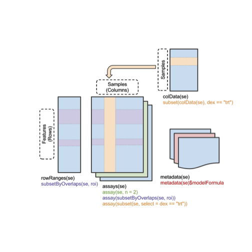
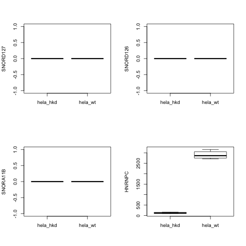

# Introduction

In the data management overview, we applied `summarizeOverlaps` to
the set of BAM files in RNAseqData.HNRNPC.bam.chr14.  Let's do it
again to focus on the object that is returned.

## BAM files to SummarizedExperiment for a single region


```r
library(RNAseqData.HNRNPC.bam.chr14)
bfp = RNAseqData.HNRNPC.bam.chr14_BAMFILES
library(Rsamtools)
bfl = BamFileList(file=bfp)
hnrnpcLoc = GRanges("chr14", IRanges(21677296, 21737638))
library(GenomicAlignments)
library(BiocParallel)
register(SerialParam())
hnse = summarizeOverlaps(hnrnpcLoc,bfl)
hnse
```

```
## class: RangedSummarizedExperiment 
## dim: 1 8 
## metadata(0):
## assays(1): counts
## rownames: NULL
## rowData names(0):
## colnames(8): ERR127306 ERR127307 ... ERR127304 ERR127305
## colData names(0):
```

`hnse` is an instance of RangedSummarizedExperiment.  This class is like
an ExpressionSet but has more facilities (and more modern
facilities) for managing assay summaries and metadata.
A visual schematic follows:



Effective use of SummarizedExperiment instances involves learning
about methods that have been defined for them.
In order to get at the read/region overlap counts for HNRNPC, we apply
the `assay` method:

```r
assay(hnse)
```

```
##      ERR127306 ERR127307 ERR127308 ERR127309 ERR127302 ERR127303 ERR127304
## [1,]      5422      6320      5896      5558       172       196       316
##      ERR127305
## [1,]       282
```
This is a bare-bones representation of the result.  The sample
identifiers have been propagated to column names of the matrix
of counts, but information on the region examined is lost in
this display.

## Metadata opportunities in the SummarizedExperiment

The `hnse` object has a little more information.

```r
rowRanges(hnse)
```

```
## GRanges object with 1 range and 0 metadata columns:
##       seqnames               ranges strand
##          <Rle>            <IRanges>  <Rle>
##   [1]    chr14 [21677296, 21737638]      *
##   -------
##   seqinfo: 1 sequence from an unspecified genome; no seqlengths
```

```r
seqinfo(hnse)
```

```
## Seqinfo object with 1 sequence from an unspecified genome; no seqlengths:
##   seqnames seqlengths isCircular genome
##   chr14            NA         NA   <NA>
```

```r
metadata(hnse)
```

```
## list()
```
We can do better.  We will set up the analysis differently
so that the output is more comprehensive and self-describing.
# Making SummarizedExperiment more effective by enriching the inputs to summarizing methods

## Defining regions of interest, with metadata

We have seen that it is sufficient to define a single GRanges
to drive `summarizeOverlaps` over a set of BAM files.  We'd
like to preserve more metadata about the regions examined.
We'll use the TxDb infrastructure, to be described in more detail
later, to get a structure defining gene regions on chr14.
We'll also use the Homo.sapiens annotation package to add
gene symbols.

```r
library(TxDb.Hsapiens.UCSC.hg19.knownGene)
txdb = TxDb.Hsapiens.UCSC.hg19.knownGene
gr14 = genes(txdb, vals=list(tx_chrom="chr14"))
```

```
## Warning: 'elementLengths' is deprecated.
## Use 'elementNROWS' instead.
## See help("Deprecated")

## Warning: 'elementLengths' is deprecated.
## Use 'elementNROWS' instead.
## See help("Deprecated")
```

```r
gr14$symbol = mapIds(Homo.sapiens, keys=gr14$gene_id, keytype="ENTREZID",
   column="SYMBOL")
```

```
## 'select()' returned 1:1 mapping between keys and columns
```

```r
gr14
```

```
## GRanges object with 781 ranges and 2 metadata columns:
##             seqnames                 ranges strand |     gene_id
##                <Rle>              <IRanges>  <Rle> | <character>
##       10001    chr14 [ 71050957,  71067384]      - |       10001
##   100113389    chr14 [ 45580078,  45580176]      + |   100113389
##   100113391    chr14 [ 20794600,  20794698]      - |   100113391
##   100124539    chr14 [ 91592770,  91592896]      + |   100124539
##   100126297    chr14 [101507700, 101507781]      + |   100126297
##         ...      ...                    ...    ... .         ...
##        9870    chr14 [ 75127955,  75179807]      - |        9870
##        9878    chr14 [ 21945335,  21967319]      + |        9878
##        9895    chr14 [102829300, 102968818]      + |        9895
##        9950    chr14 [ 93260650,  93306304]      + |        9950
##        9985    chr14 [ 24641234,  24649463]      + |        9985
##                  symbol
##             <character>
##       10001        MED6
##   100113389    SNORD127
##   100113391    SNORD126
##   100124539    SNORA11B
##   100126297      MIR300
##         ...         ...
##        9870       AREL1
##        9878        TOX4
##        9895      TECPR2
##        9950      GOLGA5
##        9985        REC8
##   -------
##   seqinfo: 93 sequences (1 circular) from hg19 genome
```

## Defining the sample characteristics for the BAM files

We have three distinct preparations, one for control and two for knockdown.
We will use the GenomicFiles infrastructure to bind the sample level
metadata.

```r
char = rep(c("hela_wt", "hela_hkd"), each=4)
bff = GenomicFiles(files=path(bfl))
colData(bff)$condition = char
sid = c(1,1,1,1,2,2,3,3)
bff$sample = sid
bff
```

```
## GenomicFiles object with 0 ranges and 8 files: 
## files: ERR127306_chr14.bam, ERR127307_chr14.bam, ..., ERR127304_chr14.bam, ERR127305_chr14.bam 
## detail: use files(), rowRanges(), colData(), ...
```

## Comparing read overlaps, preserving metadata

We'll look at 5 genes, including HNRNPC.  After computing, we
bind the sample-level data back into the result.

```r
hnse = summarizeOverlaps(gr14[c(1:4,305)],files(bff))
colData(hnse) = cbind(colData(hnse), colData(bff))
hnse
```

```
## class: RangedSummarizedExperiment 
## dim: 5 8 
## metadata(0):
## assays(1): counts
## rownames(5): 10001 100113389 100113391 100124539 3183
## rowData names(2): gene_id symbol
## colnames(8): ERR127306 ERR127307 ... ERR127304 ERR127305
## colData names(2): condition sample
```

```r
assay(hnse)
```

```
##           ERR127306 ERR127307 ERR127308 ERR127309 ERR127302 ERR127303
## 10001           114       156       129       144       175       213
## 100113389         0         0         0         0         0         0
## 100113391         0         0         0         0         0         0
## 100124539         0         0         0         0         0         0
## 3183           2711      3160      2948      2779        86        98
##           ERR127304 ERR127305
## 10001           210       165
## 100113389         0         0
## 100113391         0         0
## 100124539         0         0
## 3183            158       141
```
Note that row identifiers are now present with the count matrix.

A simple sanity check:

```r
par(mfrow=c(2,2))
for (i in 2:5) {
  boxplot(assay(hnse)[i,]~hnse$condition, ylab=rowRanges(hnse)$symbol[i])
}
```



# Converting from ExpressionSet

This is easy, but more work will be needed to allow
subsetting of array probes based on genomic range queries.

```r
library(ALL)
data(ALL)
allse = makeSummarizedExperimentFromExpressionSet(ALL)
allse
```

```
## class: RangedSummarizedExperiment 
## dim: 12625 128 
## metadata(3): experimentData annotation protocolData
## assays(1): exprs
## rownames(12625): 1000_at 1001_at ... AFFX-YEL021w/URA3_at
##   AFFX-YEL024w/RIP1_at
## rowData names(0):
## colnames(128): 01005 01010 ... 83001 LAL4
## colData names(21): cod diagnosis ... f.u date.last.seen
```

```r
rowRanges(allse)
```

```
## Warning: 'elementLengths' is deprecated.
## Use 'elementNROWS' instead.
## See help("Deprecated")
```

```
## GRangesList object of length 12625:
## $$1000_at 
## GRanges object with 0 ranges and 0 metadata columns:
##    seqnames    ranges strand
##       <Rle> <IRanges>  <Rle>
## 
## $$1001_at 
## GRanges object with 0 ranges and 0 metadata columns:
##      seqnames ranges strand
## 
## $$1002_f_at 
## GRanges object with 0 ranges and 0 metadata columns:
##      seqnames ranges strand
## 
## ...
## <12622 more elements>
## -------
## seqinfo: no sequences
```

# Summary

The RangedSummarizedExperiment class instantiates some of the key
principles of Bioconductor data structure design:

* Assay data and metadata on sample characteristics (colData) are bound together in a coordinated way
* Matrix-like subsetting works directly on both assay and sample data
* Range-based subsetting works for assay components addressible by genomic coordinates
* Arbitrary metadata on assay features can be provided in the mcols(rowRanges(se))
* Arbitrary general metadata can be provided through `metadata(se)<-`
 
We'll learn more about adaptations of SummarizedExperiment to perform
specifically for multistage processing and analysis of RNA-seq experiments later in the course.
