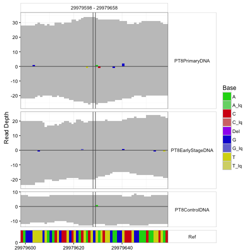

```
## Warning: replacing previous import by 'BiocGenerics::Position' when loading
## 'ggbio'
```

```
## Warning: replacing previous import by 'grid::arrow' when loading 'h5vc'
```

```
## Warning: replacing previous import by 'grid::unit' when loading 'h5vc'
```

## Packages that provide access to data external to R

There are numerous R packages that include or facilitate
access to entities that are not R functions or data objects.  
Why is this important in genome-scale statistical computing?

* We typically do not want to ingest large genomic datasets _in toto_ --
loading them into R and dealing with the large implied RAM 
image may not be cost-effective.

* We can often obtain answers to questions by operating on only
a slice, or iterating over a sequence of slices, so that
a holistic representation of the data in R is not necessary.

* We may want to use tools other than R to interact with the
data, in which case it is wise to
represent the data in a standardized format with APIs for diverse languages.


So far
the most common examples of external data arise with the annotation packages
that employ relational databases to serve data to R sessions.
We'll now give more details on the RDBMS approach, and
will discuss potential roles for tabix and HDF5 for
data on genomic coordinates.


<a name="sqlite"></a>

### SQLite as the back end

SQL stands for Structured Query Language.  This is a highly
regimented language used for working with relational databases.
Knowledge of SQL permits us to work with databases in Microsoft Access,
Oracle, Postgres, and other relational data stores.
The basic idea of relational databases is that data we are interested
in can be stored in rectangular tables, with rows thought of as records
and columns thought of as attributes.  Our primary activities with
a database are choosing attributes of interest (this is carried
out with the SQL operation called "SELECT"), specifying the tables
where these attributes should be looked up (with "FROM" or "USING" 
clauses), and filtering records (with "WHERE" clauses).  We'll
have an example below.

SQLite is an open-source relational database system that
requires no special configuration or infrastructure.  We can
interact with SQLite databases and tables through R's database interface
package (DBI) and the RSQLite package that implements the
interface protocol for SQLite.  Here's an example.
We'll look at the database underlying the GO.db annotation package.


```r
library(GO.db)
```
There is a file on disk containing all the annotation data.

```r
GO.db$conn@dbname
```

```
## [1] "/Library/Frameworks/R.framework/Versions/3.3/Resources/library/GO.db/extdata/GO.sqlite"
```
We can list the tables present in the database.  We pass
the connection object to `dbListTables`.

```r
dbListTables( GO.db$conn )
```

```
##  [1] "go_bp_offspring" "go_bp_parents"   "go_cc_offspring"
##  [4] "go_cc_parents"   "go_mf_offspring" "go_mf_parents"  
##  [7] "go_obsolete"     "go_ontology"     "go_synonym"     
## [10] "go_term"         "map_counts"      "map_metadata"   
## [13] "metadata"        "sqlite_stat1"
```

Everything else that we are concerned with involves constructing
SQL queries and executing them in the database.  You can
have a look at the [SQLite web page](http://www.sqlite.org) for background and details
on valid query syntax.

Here we sample records from the table that manages
terms corresponding to GO categories using a limit clause.

```r
dbGetQuery( GO.db$conn, "select * from go_term limit 5")
```

```
##   _id      go_id                                        term ontology
## 1  28 GO:0000001                   mitochondrion inheritance       BP
## 2  30 GO:0000002            mitochondrial genome maintenance       BP
## 3  31 GO:0000003                                reproduction       BP
## 4  35 GO:0042254                         ribosome biogenesis       BP
## 5  36 GO:0044183 protein binding involved in protein folding       MF
##                                                                                                                                                                                                           definition
## 1                            The distribution of mitochondria, including the mitochondrial genome, into daughter cells after mitosis or meiosis, mediated by interactions between mitochondria and the cytoskeleton.
## 2                                                                  The maintenance of the structure and integrity of the mitochondrial genome; includes replication and segregation of the mitochondrial chromosome.
## 3                                                                                       The production of new individuals that contain some portion of genetic material inherited from one or more parent organisms.
## 4      A cellular process that results in the biosynthesis of constituent macromolecules, assembly, and arrangement of constituent parts of ribosome subunits; includes transport to the sites of protein synthesis.
## 5 Interacting selectively and non-covalently with any protein or protein complex (a complex of two or more proteins that may include other nonprotein molecules) that contributes to the process of protein folding.
```

The `dbGetQuery` function will return a data.frame instance.
Why don't we just manage the annotation as a data.frame?  There
are several reasons.  First, for very large data tables, just
loading the data into an R session can be time consuming and
interferes with interactivity.  Second, SQLite includes
considerable infrastructure that optimizes query resolution, particularly
when multiple tables are being joined.  It is better to capitalize
on that investment than to add tools for query optimization to the
R language.

Fortunately, if you are not interested in direct interaction with
the RDBMS, you can pretend it is not there, and just work with the
high-level R annotation functions that we have described.

<a name="tabix"></a>

### Tabix-indexed text or BAM as the back end

Our example data for import (narrowPeak files in the ERBS package)
was low volume and we have no problem importing the entire contents
of each file into R.  In certain cases, very large quantities
of data may be provided in narrowPeak or other genomic file formats
like bed or bigWig, and it will be cumbersome to import the
entire file.  

The [Tabix utilities](http://samtools.sourceforge.net/tabix.shtml) 
for compressing and indexing textual files
presenting data on genomic coordinates can be used through the
Rsamtools and rtracklayer packages.  Once the records have been
sorted and compressed, Tabix indexing allows us to make targeted
queries of the data in the files.  We can traverse a file
in chunks to keep our memory footprint small; we can even process
multiple chunks in parallel in certain settings.

We will illustrate some of these ideas in the video.  An important
bit of knowledge is that you can sort a bed file, on a unix system,
with the command `sort -k1,1 -k2,2g -o ...`, and this is a necessary
prelude to Tabix indexing.  Some details on the sort utility for
unix systems are available in [Wikipedia](http://en.wikipedia.org/wiki/Sort_(Unix)); you can also use `man sort`
on most unix systems for details.

Here's how we carried out the activities of the video:
```
# check file
head ENCFF001VEH.narrowPeak
# sort
sort -k1,1 -k2,2g -o bcell.narrowPeak ENCFF001VEH.narrowPeak
# compress
bgzip bcell.narrowPeak
# index
tabix -p bed bcell.narrowPeak.gz
# generates the bcell.narrowPeak.gz.tbi
tabix bcell.narrowPeak.gz chr22:1-20000000
# yields only two records on chr22
```
In R we made use of the compressed and indexed version
as follows:

```r
library(Rsamtools)
library(rtracklayer)
targ = import.bedGraph("bcell.narrowPeak.gz", which=GRanges("chr22", IRanges(1,2e7)))
```
This is a targeted import.  We do not import the contents of the entire
file but just the records that reside in the `which` range.

<a name="hdf5"></a>

### HDF5

The [HDF5 system](https://www.hdfgroup.org/) "provides a unique suite of technologies and supporting services that make possible the management of large and complex data collections. Its mission is to advance and support Hierarchical Data Format (HDF) technologies and ensure long-term access to HDF data." (From the
linked web site.)  There is a BioHDF project mentioned on the web site
but it seems to have been inactive for some time.

Bioconductor packages are available for adoption of HDF5 infrastructure
and deployment of HDF5 against various genomic analysis problems.  We'll
examine an approach to managing information on genomic variants
in the `h5vc` package.


```r
library(h5vc)
library(rhdf5)
tallyFile <- system.file( "extdata", "example.tally.hfs5", 
    package = "h5vcData")
h5ls(tallyFile)
```

```
##               group         name       otype  dclass                   dim
## 0                 / ExampleStudy   H5I_GROUP                              
## 1     /ExampleStudy           16   H5I_GROUP                              
## 2  /ExampleStudy/16       Counts H5I_DATASET INTEGER 12 x 6 x 2 x 90354753
## 3  /ExampleStudy/16    Coverages H5I_DATASET INTEGER      6 x 2 x 90354753
## 4  /ExampleStudy/16    Deletions H5I_DATASET INTEGER      6 x 2 x 90354753
## 5  /ExampleStudy/16    Reference H5I_DATASET INTEGER              90354753
## 6     /ExampleStudy           22   H5I_GROUP                              
## 7  /ExampleStudy/22       Counts H5I_DATASET INTEGER 12 x 6 x 2 x 51304566
## 8  /ExampleStudy/22    Coverages H5I_DATASET INTEGER      6 x 2 x 51304566
## 9  /ExampleStudy/22    Deletions H5I_DATASET INTEGER      6 x 2 x 51304566
## 10 /ExampleStudy/22    Reference H5I_DATASET INTEGER              51304566
```

This shows that the example data (managed in HDF5 format)
covers 90 megabases of information on six samples in two
different studies.  The notation `12 x 6 x 2 x 90354753`
corresponds to bases x samples x strands x locations.
The number of bases here allows for 4 nucleotides, insertion,
and deletion, each with a possible special value for "low quality".

Sample data are bound in the HDF5 container.

```r
sampleData <- getSampleData( tallyFile, "/ExampleStudy/16" )
sampleData
```

```
##   ClinicalVariable Column  Patient           Sample
## 1      -0.32711078      6 Patient8    PT8PrimaryDNA
## 2       1.04121382      2 Patient5    PT5PrimaryDNA
## 3       0.60577885      3 Patient5    PT5RelapseDNA
## 4      -1.10424860      5 Patient8 PT8EarlyStageDNA
## 5       0.27186571      1 Patient5    PT5ControlDNA
## 6       0.01634734      4 Patient8    PT8ControlDNA
##                      SampleFiles    Type
## 1     ../Input/PT8PrimaryDNA.bam    Case
## 2     ../Input/PT5PrimaryDNA.bam    Case
## 3     ../Input/PT5RelapseDNA.bam    Case
## 4 ../Input/PT8PreLeukemiaDNA.bam    Case
## 5     ../Input/PT5ControlDNA.bam Control
## 6     ../Input/PT8ControlDNA.bam Control
```

We can extract coverage and read count data on a
1000 base region from one experiment:

```r
data <- h5readBlock(
  filename = tallyFile,
  group = "/ExampleStudy/16",
  names = c( "Coverages", "Counts" ),
  range = c(29000000,29001000)
  )
str(data)
```

```
## List of 3
##  $$ Coverages   : int [1:6, 1:2, 1:1001] 0 0 0 0 0 0 0 0 0 0 ...
##  $$ Counts      : int [1:12, 1:6, 1:2, 1:1001] 0 0 0 0 0 0 0 0 0 0 ...
##  $$ h5dapplyInfo:List of 4
##   ..$$ Blockstart: int 29000000
##   ..$$ Blockend  : int 29001000
##   ..$$ Datasets  :'data.frame':	2 obs. of  3 variables:
##   .. ..$$ Name    : chr [1:2] "Coverages" "Counts"
##   .. ..$$ DimCount: int [1:2] 3 4
##   .. ..$$ PosDim  : int [1:2] 3 4
##   ..$$ Group     : chr "/ExampleStudy/16"
```

An important application is visualization of departures from
reference sequence in selected regions.


```r
  sampleData <- getSampleData( tallyFile, "/ExampleStudy/16" )
  position <- 29979628
  windowsize <- 30
  samples <- sampleData$Sample[sampleData$Patient == "Patient8"]
  data <- h5readBlock(
    filename = tallyFile,
    group = "/ExampleStudy/16",
    names = c("Coverages", "Counts", "Deletions", "Reference"),
    range = c(position - windowsize, position + windowsize)
  )
  #Plotting with position and windowsize
  p <- mismatchPlot(
    data = data,
    sampledata = sampleData,
    samples = samples,
    windowsize = windowsize,
    position = position
  )
  print(p)
```



## Conclusions

We've seen how RDBMS, tabix, and HDF5 can be used to manage
large data volumes, supporting relatively seamless targeted
ingestion to R sessions for analysis and visualization.
Another approach of interest uses objects in R to mediate
access to raw flat files: this is pursued by the
[ff](http://ff.r-forge.r-project.org/) and
[bigmemory](https://cran.r-project.org/web/packages/bigmemory/index.html)
packages.  Both of these projects have add-on packages to
support analytics in R in memory-efficient ways, and are worthy
of exploration.
