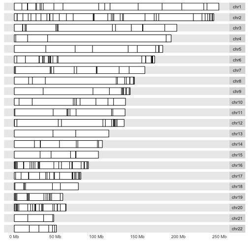
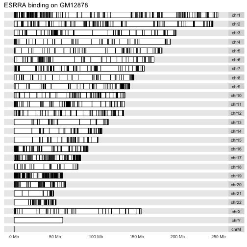

There are many interesting approaches to visualizing genome-scale data.
Two major packages in Bioconductor are Gviz and ggbio.  Both represent
significant efforts at bridging the gap between graphics facilities
and various genomic data structures.

ggbio's `autoplot` method can be very useful for broad overviews.
For a GRanges instance, each range for which data exists can be
depicted as a band on the chromosome.  The karyogram layout
gives a genome-wide view, but it can be important to control
the handling of extra-chromosomal sequence levels.


Here is the layout for the liver cell line:

```r
library(ERBS)
data(HepG2)
library(GenomeInfoDb)  # trim all but autosomal chroms
HepG2 = keepStandardChromosomes(HepG2)
data(GM12878)
GM12878 = keepStandardChromosomes(GM12878)
library(ggbio)
autoplot(HepG2, layout="karyogram", main="ESRRA binding on HepG2")
```

```
## Scale for 'x' is already present. Adding another scale for 'x', which
## will replace the existing scale.
## Scale for 'x' is already present. Adding another scale for 'x', which
## will replace the existing scale.
```



And for the B-cell line:


```r
autoplot(GM12878, layout="karyogram", main="ESRRA binding on GM12878")
```

```
## Scale for 'x' is already present. Adding another scale for 'x', which
## will replace the existing scale.
## Scale for 'x' is already present. Adding another scale for 'x', which
## will replace the existing scale.
```


