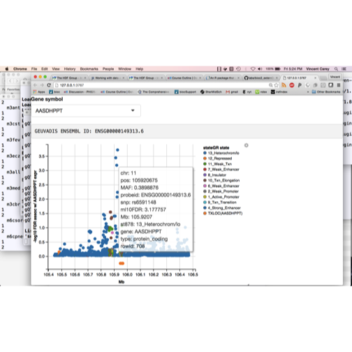

## Introduction

We've looked at a number of approaches to
working with data external to R:

* HDF5, which manages groups of multidimensional arrays on disk
* sqlite, a zero-configuration relational database
* tabix, a simple approach to indexing records on genomic coordinates

Here I want to describe an approach that seems useful for millions
of ranges annotated in the course of searching for variants that
affect gene expression at the population level.  The approach
is based on a concept of storing data in "shards", homogeneous small
fragments that can be quickly loaded and unloaded, discoverable
by index and traversable in parallel.

## Motivation: An integrative view of associations in GEUVADIS

The [GEUVADIS study](http://www.nature.com/nature/journal/v501/n7468/full/nature12531.html) is an intensive multiomic study of gene expression in multiple
populations.  We want to make use of the data from this study to
investigate variants affecting genes of interest, with one tool
an interactive graphical utility illustrated in the video:


```r
library(ph525x)
ggshot()
```



We want to be able to select genes by symbol and explore names
and epigenetic contexts of variants whose content is associated with
expression variation.  It is useful to have the variants annotated
using GRanges, but a very large GRanges object (there are hundreds
of millions of SNP-gene associations recorded) can be unwieldy.
Solutions using RDBMS or HDF5 may be viable but more infrastructure
for rapidly searching such stores using genomic coordinates,
and for converting query results to GRanges will be needed.

BatchJobs was used to generate the association tests, and it
produces
an organized system of "sharded" GRanges recording the
associations along with metadata about the associated features.
This system can be stored in a package, exemplified by geuvStore.

## A quick look at geuvStore

The association test results are organized using a BatchJobs
registry that is wrapped in an S4 class called ciseStore.

```r
library(geuvStore)
m = makeGeuvStore()
class(m)
```

```
## [1] "ciseStore"
## attr(,"package")
## [1] "gQTLBase"
```

```r
m
```

```
## ciseStore instance with 92 completed jobs.
## excerpt from job  1 :
## GRanges object with 1 range and 11 metadata columns:
##       seqnames                 ranges strand |       paramRangeID
##          <Rle>              <IRanges>  <Rle> |           <factor>
##   [1]        1 [225418903, 225418903]      * | ENSG00000183814.10
##                  REF             ALT     chisq permScore_1 permScore_2
##       <DNAStringSet> <CharacterList> <numeric>   <numeric>   <numeric>
##   [1]              G               A 0.2972831   0.1150969    8.312895
##       permScore_3             snp        MAF            probeid   mindist
##         <numeric>     <character>  <numeric>        <character> <numeric>
##   [1]   0.1021324 snp_1_225418903 0.03246753 ENSG00000183814.10    999947
##   -------
##   seqinfo: 1 sequence from hg19 genome; no seqlengths
```

The show method for m probes into the store and retrieves one record
from one GRanges instance.

## Scalable traversal

The traversal of all GRanges available in this selection is
governed by foreach loops.

```r
library(gQTLBase)
ut1 = unix.time(l1 <- storeApply(m, length))
```

```
## Warning: executing %dopar% sequentially: no parallel backend registered
```

```r
ut1
```

```
##    user  system elapsed 
##  24.698   0.830  27.130
```

```r
library(doParallel)
registerDoParallel(cores=2)
ut2 = unix.time(l2 <- storeApply(m, length))
ut2
```

```
##    user  system elapsed 
##  11.109   1.000  13.947
```

```r
print(sum(unlist(l2)))
```

```
## [1] 7559723
```

```r
all.equal(l1, l2)
```

```
## [1] TRUE
```
We see that doubling the number of processors halves the
time required to get the length of each component of the archive.
With large numbers of cores, we can quickly assemble information
about many variants.

## Scalable histogram construction

When the histogram bins are fixed, divide and conquer can be
used to assemble a histogram in parallel over many chunks.


```r
registerDoParallel(cores=1)
unix.time(ll <- storeToHist(m, getter=function(x)log(mcols(x)$chisq+1), breaks=c(0,seq(.1,5,.1),10)))
```

```
##    user  system elapsed 
##  30.023   1.072  32.991
```

```r
registerDoParallel(cores=2)
unix.time(ll <- storeToHist(m, getter=function(x)log(mcols(x)$chisq+1), breaks=c(0,seq(.1,5,.1),10)))
```

```
##    user  system elapsed 
##  36.836   5.548  20.117
```

## Indexing for targeted retrievals

The ciseStore class includes two maps: one from range to shard number,
another from gene identifier to shard number.  This allows rapid
retrievals.


```r
myr = GRanges(2, IRanges(1975.7e5, width=50000))
extractByRanges(m, myr)
```

```
## GRanges object with 200 ranges and 12 metadata columns:
##         seqnames                 ranges strand |      paramRangeID
##            <Rle>              <IRanges>  <Rle> |          <factor>
##     [1]        2 [197570297, 197570297]      * | ENSG00000081320.5
##     [2]        2 [197570357, 197570357]      * | ENSG00000081320.5
##     [3]        2 [197570746, 197570746]      * | ENSG00000081320.5
##     [4]        2 [197570827, 197570827]      * | ENSG00000081320.5
##     [5]        2 [197570836, 197570836]      * | ENSG00000081320.5
##     ...      ...                    ...    ... .               ...
##   [196]        2 [197618837, 197618837]      * | ENSG00000247626.2
##   [197]        2 [197619213, 197619213]      * | ENSG00000247626.2
##   [198]        2 [197619564, 197619564]      * | ENSG00000247626.2
##   [199]        2 [197619731, 197619731]      * | ENSG00000247626.2
##   [200]        2 [197619903, 197619903]      * | ENSG00000247626.2
##                    REF             ALT        chisq permScore_1
##         <DNAStringSet> <CharacterList>    <numeric>   <numeric>
##     [1]              A               G 0.0000797335  1.34071991
##     [2]              A               G 1.5774115410  0.99443759
##     [3]              C               T 0.7244833433  0.56338572
##     [4]              C               A 0.1256116785  0.03349971
##     [5]              A               G 0.1151608618  0.02007809
##     ...            ...             ...          ...         ...
##   [196]              G               T   0.93231576 0.002427724
##   [197]              A               G   0.01200268 2.724431054
##   [198]              T               C   1.64505243 5.206863764
##   [199]              T               G   0.93231576 0.002427724
##   [200]              A               G   4.51953232 0.135438049
##          permScore_2 permScore_3             snp        MAF
##            <numeric>   <numeric>     <character>  <numeric>
##     [1] 0.0002409020 0.025332616 snp_2_197570297 0.02813853
##     [2] 0.1107690245 0.002726640 snp_2_197570357 0.01406926
##     [3] 0.0447474434 0.056227993 snp_2_197570746 0.22943723
##     [4] 0.0002531456 0.006607562 snp_2_197570827 0.08116883
##     [5] 0.0114138147 0.011073228 snp_2_197570836 0.07900433
##     ...          ...         ...             ...        ...
##   [196]   1.71279163   0.3497103 snp_2_197618837 0.02922078
##   [197]   0.04059358   1.2460256 snp_2_197619213 0.21645022
##   [198]   0.02544705   0.8429119 snp_2_197619564 0.29761905
##   [199]   1.71279163   0.3497103 snp_2_197619731 0.02922078
##   [200]   0.42022666   2.9603032 snp_2_197619903 0.01190476
##                   probeid   mindist     jobid
##               <character> <numeric> <integer>
##     [1] ENSG00000081320.5    529070       401
##     [2] ENSG00000081320.5    529130       401
##     [3] ENSG00000081320.5    529519       401
##     [4] ENSG00000081320.5    529600       401
##     [5] ENSG00000081320.5    529609       401
##     ...               ...       ...       ...
##   [196] ENSG00000247626.2    951250       403
##   [197] ENSG00000247626.2    950874       403
##   [198] ENSG00000247626.2    950523       403
##   [199] ENSG00000247626.2    950356       403
##   [200] ENSG00000247626.2    950184       403
##   -------
##   seqinfo: 1 sequence from hg19 genome; no seqlengths
```

## Conclusions

geuvStore is a complex architecture that aims to provide a
partly baked representation of quantities from genome-scale
surveys that can be scalably surveyed and integrated.  This
is accomplished by keeping ranges for association scores
and metadata in small sharded GRanges with some simple indexes,
retrieval utilities, and with support for parallelized traversal
and summary.  It would be very nice to achieve these aims with
a more homogeneous underlying architecture such as HDF5, and
this may be possible as file-backed SummarizedExperiments come
on line.

