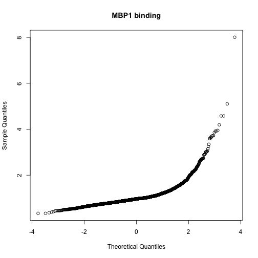
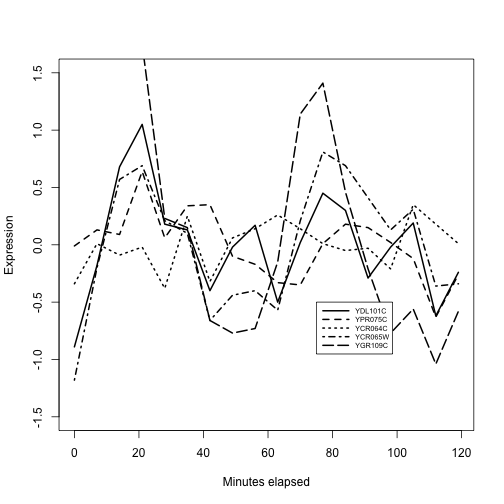

```
## Loading required package: methods
```

```
## Loading required package: stats4
```

```
## Loading required package: BiocGenerics
```

```
## Loading required package: parallel
```

```
## 
## Attaching package: 'BiocGenerics'
```

```
## The following objects are masked from 'package:parallel':
## 
##     clusterApply, clusterApplyLB, clusterCall, clusterEvalQ,
##     clusterExport, clusterMap, parApply, parCapply, parLapply,
##     parLapplyLB, parRapply, parSapply, parSapplyLB
```

```
## The following objects are masked from 'package:stats':
## 
##     IQR, mad, xtabs
```

```
## The following objects are masked from 'package:base':
## 
##     anyDuplicated, append, as.data.frame, cbind, colnames,
##     do.call, duplicated, eval, evalq, Filter, Find, get, grep,
##     grepl, intersect, is.unsorted, lapply, lengths, Map, mapply,
##     match, mget, order, paste, pmax, pmax.int, pmin, pmin.int,
##     Position, rank, rbind, Reduce, rownames, sapply, setdiff,
##     sort, table, tapply, union, unique, unsplit
```

```
## Loading required package: Biobase
```

```
## Welcome to Bioconductor
## 
##     Vignettes contain introductory material; view with
##     'browseVignettes()'. To cite Bioconductor, see
##     'citation("Biobase")', and for packages 'citation("pkgname")'.
```

```
## Loading required package: IRanges
```

```
## Loading required package: S4Vectors
```

```
## 
## Attaching package: 'S4Vectors'
```

```
## The following object is masked from 'package:base':
## 
##     expand.grid
```

```
## Loading required package: ggplot2
```

```
## Warning: replacing previous import by 'BiocGenerics::Position' when loading
## 'ggbio'
```

```
## Need specific help about ggbio? try mailing 
##  the maintainer or visit http://tengfei.github.com/ggbio/
```

```
## 
## Attaching package: 'ggbio'
```

```
## The following objects are masked from 'package:ggplot2':
## 
##     geom_bar, geom_rect, geom_segment, ggsave, stat_bin,
##     stat_identity, xlim
```

```
## Loading required package: Homo.sapiens
```

```
## Loading required package: OrganismDbi
```

```
## Loading required package: GenomicFeatures
```

```
## Loading required package: GenomeInfoDb
```

```
## Loading required package: GenomicRanges
```

```
## Loading required package: GO.db
```

```
## Loading required package: DBI
```

```
## 
```

```
## Loading required package: org.Hs.eg.db
```

```
## 
```

```
## Loading required package: TxDb.Hsapiens.UCSC.hg19.knownGene
```

```
## gwascat loaded.  Use data(ebicat38) for hg38 coordinates;
```

```
##  data(ebicat37) for hg19 coordinates.
```

```
## Loading required package: tools
```

```
## Loading required package: Biostrings
```

```
## Loading required package: XVector
```

```
## 
## Attaching package: 'harbChIP'
```

```
## The following object is masked from 'package:OrganismDbi':
## 
##     keys
```

```
## The following object is masked from 'package:GenomicFeatures':
## 
##     organism
```

```
## The following object is masked from 'package:GenomeInfoDb':
## 
##     organism
```

```
## The following object is masked from 'package:AnnotationDbi':
## 
##     keys
```

```
## The following object is masked from 'package:BiocGenerics':
## 
##     organism
```

## Integrative analysis examples

In this document we'll review a few approaches to using genome-scale data of different
types to reason about certain focused questions.
 
<a name="yeasttfs"></a>
### TF binding and expression co-regulation in yeast

An example of integrative analysis can be found in a paper
of [Lee and Rinaldi](http://www.ncbi.nlm.nih.gov/pubmed/12399584)
in connection with the regulatory program of the yeast 
cell cycle.  There are two key experimental components:

- Protein binding patterns: based on ChIP-chip experiments, we can determine
the gene promoter regions to which transcription factors bind.

- Expression patterns: based on timed observations of gene expression in a yeast colony
we can identify times at which groups of genes reach maximal expression.


Figure 5 of the paper indicates that the Mbp1 transcription
factor played a role in regulating expression in the transition
from G1 to S phases of the cell cycle.  The ChIP-chip data is
in the `harbChIP` package.


```r
library(harbChIP)
data(harbChIP)
harbChIP
```

```
## ExpressionSet (storageMode: lockedEnvironment)
## assayData: 6230 features, 204 samples 
##   element names: exprs, se.exprs 
## protocolData: none
## phenoData
##   sampleNames: A1 (MATA1) ABF1 ... ZMS1 (204 total)
##   varLabels: txFac
##   varMetadata: labelDescription
## featureData
##   featureNames: YAL001C YAL002W ... MRH1 (6230 total)
##   fvarLabels: ID PLATE ... REV_SEQ (12 total)
##   fvarMetadata: labelDescription
## experimentData: use 'experimentData(object)'
##   pubMedIds: 15343339 
## Annotation:
```
This is a well-documented data object, and we can read the abstract
of the paper directly.


```r
abstract(harbChIP)
```

```
## [1] "DNA-binding transcriptional regulators interpret the genome's regulatory code by binding to specific sequences to induce or repress gene expression. Comparative genomics has recently been used to identify potential cis-regulatory sequences within the yeast genome on the basis of phylogenetic conservation, but this information alone does not reveal if or when transcriptional regulators occupy these binding sites. We have constructed an initial map of yeast's transcriptional regulatory code by identifying the sequence elements that are bound by regulators under various conditions and that are conserved among Saccharomyces species. The organization of regulatory elements in promoters and the environment-dependent use of these elements by regulators are discussed. We find that environment-specific use of regulatory elements predicts mechanistic models for the function of a large population of yeast's transcriptional regulators."
```

Let's find MBP1 and assess the distribution of reported binding affinity
measures.  The sample names of the ExpressionSet (structure
used for convenience
even though the data are not expression data)
are the names of the proteins "chipped" onto the yeast
promoter array.


```r
mind = which(sampleNames(harbChIP)=="MBP1")
qqnorm(exprs(harbChIP)[,mind], main="MBP1 binding")
```



The shape of the qq-normal plot is indicative of
a strong
departure from Gaussianity in the distribution
of binding scores, with a very long right tail.
We'll focus on the top five genes.


```r
topb = featureNames(harbChIP)[ order(
  exprs(harbChIP)[,mind], decreasing=TRUE)[1:5] ]
topb
```

```
## [1] "YDL101C" "YPR075C" "YCR064C" "YCR065W" "YGR109C"
```

```r
library(org.Sc.sgd.db)
```

```
## 
```

```r
select(org.Sc.sgd.db, keys=topb, keytype="ORF",
  columns="COMMON")
```

```
## 'select()' returned 1:many mapping between keys and columns
```

```
##       ORF        SGD                               COMMON
## 1 YDL101C S000002259                                 DUN1
## 2 YDL101C S000002259 serine/threonine protein kinase DUN1
## 3 YPR075C S000006279                                 OPY2
## 4 YCR064C S000000660                                 <NA>
## 5 YCR065W S000000661                                 HCM1
## 6 YGR109C S000003341                                 CLB6
## 7 YGR109C S000003341                   B-type cyclin CLB6
```

Our conjecture is that these genes will exhibit
similar expression trajectories, peaking well
within the first half of cell cycle
for the yeast strain studied.

We will subset the cell cycle expression data from
the `yeastCC` package to a colony whose cycling was
synchronized using alpha pheromone.


```r
library(yeastCC)
data(spYCCES)
alp = spYCCES[, spYCCES$syncmeth=="alpha"]
par(mfrow=c(1,1))
plot(exprs(alp)[ topb[1], ]~alp$time, lty=1,
   type="l", ylim=c(-1.5,1.5), lwd=2, ylab="Expression",
    xlab="Minutes elapsed")
for (i in 2:5) lines(exprs(alp)[topb[i],]~alp$time, lty=i, lwd=2)
legend(75,-.5, lty=1:10, legend=topb, lwd=2, cex=.6, seg.len=4)
```



We have the impression that at least three of these
genes reach peak expression roughly together near times
20 and 80 minutes.  There is considerable variability.
A data filtering and visualization pattern is emerging
by which genes bound by a given transcription factor
can be assessed for coregulation of expression.  We
have not entered into the assessment of statistical
significance, but have focused on how the data
types are brought together.

<a name="gwastf"></a>
### TF binding and genome-wide DNA-phenotype associations in humans

Genetic epidemiology has taken advantage of high-throughput
genotyping (mostly using genotyping arrays supplemented with
model-based genotype imputation) to develop the concept of
"genome-wide association study" (GWAS).  Here a cohort is assembled
and individuals are distinguished in terms of disease status or
phenotype measurement, and the genome is searched for variants
exhibiting statistical association with disease status or phenotypic
class or value.  An example of a GWAS result can be
seen with the gwascat package, which includes selections from the [NHGRI
GWAS catalog](https://www.genome.gov/26525384), which has recently
moved to EBI-EMBL.


```r
library(gwascat)
data(gwrngs19)
gwrngs19[100]
```

```
## gwasloc instance with 1 records and 35 attributes per record.
## Extracted:  Mon Sep  8 13:08:13 2014 
## Genome:  hg19 
## Excerpt:
## GRanges object with 1 range and 35 metadata columns:
##       seqnames                 ranges strand | Date.Added.to.Catalog
##          <Rle>              <IRanges>  <Rle> |           <character>
##   100    chr11 [118729391, 118729391]      * |            08/05/2014
##        PUBMEDID First.Author        Date     Journal
##       <integer>  <character> <character> <character>
##   100  24390342      Okada Y  12/25/2013      Nature
##                                              Link
##                                       <character>
##   100 http://www.ncbi.nlm.nih.gov/pubmed/24390342
##                                                                             Study
##                                                                       <character>
##   100 Genetics of rheumatoid arthritis contributes to biology and drug discovery.
##              Disease.Trait
##                <character>
##   100 Rheumatoid arthritis
##                                                                                                                                                   Initial.Sample.Size
##                                                                                                                                                           <character>
##   100 up to 14,361 European ancestry cases, up to 42,923 European ancestry controls, up to 4,873 East Asian ancestry cases, up to 17,642 East Asian ancestry controls
##                                                                                                                                            Replication.Sample.Size
##                                                                                                                                                        <character>
##   100 up to 3,775 European ancestry cases, up to 5,801 European ancestry controls, up to 6,871 East Asian ancestry cases, up to 6,392 East Asian ancestry controls
##            Region      Chr_id Chr_pos.hg38 Reported.Gene.s.    Mapped_gene
##       <character> <character>    <numeric>      <character>    <character>
##   100     11q23.3          11    118858682            CXCR5 SETP16 - CXCR5
##       Upstream_gene_id Downstream_gene_id Snp_gene_ids
##            <character>        <character>  <character>
##   100           649925                643             
##       Upstream_gene_distance Downstream_gene_distance
##                  <character>              <character>
##   100                  24.12                    25.08
##       Strongest.SNP.Risk.Allele        SNPs      Merged Snp_id_current
##                     <character> <character> <character>    <character>
##   100              rs10790268-G  rs10790268           0       10790268
##           Context  Intergenic Risk.Allele.Frequency   p.Value Pvalue_mlog
##       <character> <character>           <character> <numeric>   <numeric>
##   100  Intergenic           1                  0.81     1e-15          15
##       p.Value..text. OR.or.beta X95..CI..text.
##          <character>  <numeric>    <character>
##   100                      1.14   [1.11-1.18] 
##                              Platform..SNPs.passing.QC.         CNV
##                                             <character> <character>
##   100 Affymetrix & Illumina [up to 9,739,303] (Imputed)           N
##       num.Risk.Allele.Frequency
##                       <numeric>
##   100                      0.81
##   -------
##   seqinfo: 23 sequences from hg19 genome
```

```r
mcols(gwrngs19[100])[,c(2,7,8,9,10,11)]
```

```
## DataFrame with 1 row and 6 columns
##    PUBMEDID
##   <integer>
## 1  24390342
##                                                                         Study
##                                                                   <character>
## 1 Genetics of rheumatoid arthritis contributes to biology and drug discovery.
##          Disease.Trait
##            <character>
## 1 Rheumatoid arthritis
##                                                                                                                                               Initial.Sample.Size
##                                                                                                                                                       <character>
## 1 up to 14,361 European ancestry cases, up to 42,923 European ancestry controls, up to 4,873 East Asian ancestry cases, up to 17,642 East Asian ancestry controls
##                                                                                                                                        Replication.Sample.Size
##                                                                                                                                                    <character>
## 1 up to 3,775 European ancestry cases, up to 5,801 European ancestry controls, up to 6,871 East Asian ancestry cases, up to 6,392 East Asian ancestry controls
##        Region
##   <character>
## 1     11q23.3
```

This shows the complexity involved in recording information about
a replicated genome-wide association finding.  There are many
fields recorded, by the key elements are the name and location of
the SNP, and the phenotype to which it is apparently linked.
In this case, we are talking about rheumatoid arthritis.

We will now consider the relationship between ESRRA binding
in B-cells and phenotypes for which GWAS associations
have been reported.  

It is tempting to proceed as follows.  We simply
compute overlaps between the binding peak regions
and the catalog GRanges.

```r
library(ERBS)
data(GM12878)
fo = findOverlaps(GM12878, gwrngs19)
fo
```

```
## Hits object with 55 hits and 0 metadata columns:
##        queryHits subjectHits
##        <integer>   <integer>
##    [1]        12        2897
##    [2]        28       11889
##    [3]        28       17104
##    [4]        39        3975
##    [5]        84        9207
##    ...       ...         ...
##   [51]      1869       14660
##   [52]      1869       14661
##   [53]      1869       16004
##   [54]      1869       16761
##   [55]      1869       16793
##   -------
##   queryLength: 1873 / subjectLength: 17254
```

```r
sort(table(gwrngs19$Disease.Trait[ 
    subjectHits(fo) ]), decreasing=TRUE)[1:5]
```

```
## 
##        Rheumatoid arthritis             LDL cholesterol 
##                           7                           6 
##          Cholesterol, total Lipid metabolism phenotypes 
##                           4                           4 
##            Bipolar disorder 
##                           3
```
The problem with this is that `gwrngs19` is a set of *records* of
GWAS hits.  There are cases of SNP that are associated
with multiple phenotypes, and there are cases of multiple studies that find
the same result for a given SNP.  It is easy to get 
a sense of the magnitude of the problem using `reduce`.


```r
length(gwrngs19)-length(reduce(gwrngs19))
```

```
## [1] 3659
```
So our strategy will be to find overlaps with the
reduced version of `gwrngs19` and then come back
to enumerate phenotypes at unique SNPs occupying binding sites.

```r
fo = findOverlaps(GM12878, reduce(gwrngs19))
fo
```

```
## Hits object with 28 hits and 0 metadata columns:
##        queryHits subjectHits
##        <integer>   <integer>
##    [1]        12        3120
##    [2]        28       12162
##    [3]        39        7588
##    [4]        84        9947
##    [5]       257        7797
##    ...       ...         ...
##   [24]      1564       11567
##   [25]      1635        4554
##   [26]      1669       12996
##   [27]      1709        8057
##   [28]      1869          83
##   -------
##   queryLength: 1873 / subjectLength: 13595
```

```r
ovrngs = reduce(gwrngs19)[subjectHits(fo)]
phset = lapply( ovrngs, function(x)
  unique( gwrngs19[ which(gwrngs19 %over% x) ]$Disease.Trait ) )
sort(table(unlist(phset)), decreasing=TRUE)[1:5]
```

```
## 
## Rheumatoid arthritis     Bipolar disorder   Cholesterol, total 
##                    4                    2                    2 
##      HDL cholesterol      Type 1 diabetes 
##                    2                    2
```

What can explain this observation?  We see that there
are commonly observed DNA variants in locations where ESRRA tends
to bind.  Do individuals with particular genotypes
of SNPs in these areas have higher risk of disease
because the presence of the variant allele 
interferes with ESRRA function and leads to
arthritis or abnormal cholesterol levels?   Or is this
observation consistent with the play of chance in our
work with these data?  We will examine this in the exercises.

<a name="geo"></a>
### Harvesting GEO for families of microarray archives

The NCBI Gene Expression Omnibus is a basic resource for
integrative bioinformatics.  The Bioconductor GEOmetadb
package helps with discovery and characterization of
GEO datasets.

The GEOmetadb database is a 240MB download that decompresses to 3.6 GB
of SQLite.  Once you have acquired the GEOmetadb.sqlite file using
the `getSQLiteFile` function, you can create a connection
and start interrogating the database locally.


```r
library(RSQLite)
lcon = dbConnect(SQLite(), Sys.getenv("GEOMETADB_SQLITE_PATH"))
dbListTables(lcon)
```

```
## character(0)
```

We will build a query that returns all the GEO GSE entries
that have the phrase "pancreatic cancer" in their titles.
Because GEO uses uninformative labels for array platforms,
we will retrieve a field that records the Bioconductor array
annotation package name so that we know what technology was
in use.  We'll tabulate the various platforms used.


```r
vbls = "gse.gse, gse.title, gpl.gpl, gpl.bioc_package"
req1 = " from gse join gse_gpl on gse.gse=gse_gpl.gse"
req2 = " join gpl on gse_gpl.gpl=gpl.gpl"
goal = " where gse.title like '%pancreatic%cancer%'"
quer = paste0("select ", vbls, req1, req2, goal)
lkpc = dbGetQuery(lcon, quer)
```

```
## Error in sqliteSendQuery(con, statement, bind.data): error in statement: no such table: gse
```

```r
dim(lkpc)
```

```
## Error in eval(expr, envir, enclos): object 'lkpc' not found
```

```r
table(lkpc$bioc_package)
```

```
## Error in eval(expr, envir, enclos): object 'lkpc' not found
```

We won't insist that you take the GEOmetadb.sqlite download/expansion,
but if you do, variations on the query string constructed above
can assist you with targeted identification of GEO datasets 
for analysis and reinterpretation.
