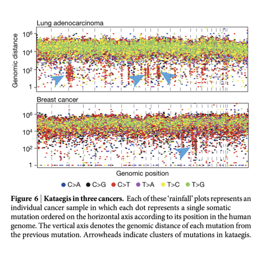
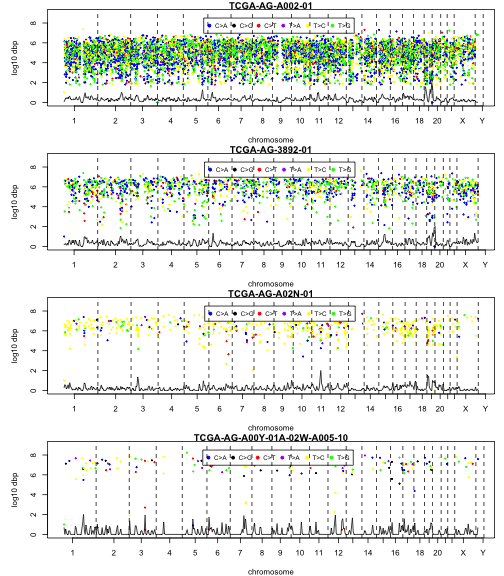

## Introduction

We will use data in the ph525x package on mutations in
breast cancer and rectal adenocarcinoma to illustrate
some issues in dealing with mutations data from TCGA.
A basic objective is construction of a "rainfall plot".
An example is Figure 6 from [Alexandrov et al. 2013](http://www.pubmedcentral.nih.gov/articlerender.fcgi?artid=3776390&tool=pmcentrez&rendertype=abstract):



These plots include data from deeply sequenced individual tumors,
and we'd like to understand how to construct them using
tools from Bioconductor.

## The mutation data frames from RTCGAToolbox

The `readMuts` data are from the 20150402 TCGA production.

```r
library(ph525x)
data(readMuts)
dim(readMuts)
```

```
## [1] 22075    39
```

```r
data(brcaMuts)
dim(brcaMuts)
```

```
## [1] 90490    67
```

## Mutation types and their contents


```r
table(readMuts$Variant_Type)
```

```
## 
##   DEL   DNP   INS   SNP 
##   208    85   188 21594
```

```r
with(readMuts, head(Reference_Allele[Variant_Type=="DEL"]))
```

```
## [1] "GG" "TT" "G"  "C"  "C"  "A"
```

## Tabulating substitution types

The following function enumerates substitutions according to
the [COSMIC convention](http://cancer.sanger.ac.uk/cosmic/signatures):
"The profile of each signature is displayed using the six substitution subtypes: C>A, C>G, C>T, T>A, T>C, and T>G (all substitutions are referred to by the pyrimidine of the mutated Watson–Crick base pair)."


```r
 subt = function(ref, a1, a2) {
        alt = ifelse(a1 != ref, a1, a2)
        tmp = ref
        needsw = which(alt %in% c("C", "T"))
        ref[needsw] = alt[needsw]
        alt[needsw] = tmp[needsw]
        paste(ref, alt, sep = ">")
    }
with(readMuts[readMuts$Variant_Type=="SNP",],
   table(subt(Reference_Allele, Tumor_Seq_Allele1, Tumor_Seq_Allele2)))
```

```
## 
##  A>G  C>A  C>G  C>T  G>A  T>A  T>C  T>G 
##  785 4195  467  760 5298  443 5340 4306
```

A>G and G>A substitutions are not included in kataegis plots.

To define the colors used for substitutions:


```r
ph525x:::kataColors
```

```
## function () 
## {
##     cmap = c("blue", "black", "red", "purple", "yellow", "green")
##     names(cmap) = c("C>A", "C>G", "C>T", "T>A", "T>C", "T>G")
##     cmap
## }
## <environment: namespace:ph525x>
```

## Total genomic distance

The mutation locations reported are not particularly convenient for genome-wide
plotting as the distances are all relative to chromosome start.
The following hidden function computes total distance relative
to start of chr1, assuming that the data are held in GRanges.

```r
ph525x:::totalgd
```

```
## function (gr) 
## {
##     an = as.numeric
##     off = c(0, cumsum(an(seqlengths(gr)[-length(seqlengths(gr))])))
##     names(off) = names(seqlengths(gr))
##     gr = trim(gr)
##     gr$totalgd = GenomicRanges::start(gr) + off[as.character(seqnames(gr))]
##     gr
## }
## <environment: namespace:ph525x>
```

## A demo plot for four tumors

The rainfall function will organize the input data by sample, and
samples can, in the present version, be selected according to
their position in an ordering based on number of mutations reported.
The default plots the sample with the greatest number of mutations.
The oind parameter allows selection of samples further down in the
ordering.  We embellish the plot with a simple kernel estimate
of the density of mutations along the chromosomes.  The
function invisibly returns a list of items related to the plot.


```r
rainouts = list()
par(mfrow=c(4,1),mar=c(4,5,1,1))
for (i in 1:4) rainouts[[i]] = rainfall(readMuts, oind=i)
```




```r
str(rainouts[[1]])
```

```
## List of 3
##  $$ mutGR  :Formal class 'GRanges' [package "GenomicRanges"] with 6 slots
##   .. ..@ seqnames       :Formal class 'Rle' [package "S4Vectors"] with 4 slots
##   .. .. .. ..@ values         : Factor w/ 24 levels "chr1","chr2",..: 1 2 3 4 5 6 7 8 9 10 ...
##   .. .. .. ..@ lengths        : int [1:24] 902 784 601 494 535 557 480 330 316 384 ...
##   .. .. .. ..@ elementMetadata: NULL
##   .. .. .. ..@ metadata       : list()
##   .. ..@ ranges         :Formal class 'IRanges' [package "IRanges"] with 6 slots
##   .. .. .. ..@ start          : int [1:9341] 882169 3318358 4729855 4734386 5857679 5887415 5888070 6114290 6192876 6559246 ...
##   .. .. .. ..@ width          : int [1:9341] 1 1 1 1 1 1 1 1 1 1 ...
##   .. .. .. ..@ NAMES          : NULL
##   .. .. .. ..@ elementType    : chr "integer"
##   .. .. .. ..@ elementMetadata: NULL
##   .. .. .. ..@ metadata       : list()
##   .. ..@ strand         :Formal class 'Rle' [package "S4Vectors"] with 4 slots
##   .. .. .. ..@ values         : Factor w/ 3 levels "+","-","*": 3
##   .. .. .. ..@ lengths        : int 9341
##   .. .. .. ..@ elementMetadata: NULL
##   .. .. .. ..@ metadata       : list()
##   .. ..@ elementMetadata:Formal class 'DataFrame' [package "S4Vectors"] with 6 slots
##   .. .. .. ..@ rownames       : NULL
##   .. .. .. ..@ nrows          : int 9341
##   .. .. .. ..@ listData       :List of 41
##   .. .. .. .. ..$$ Hugo_Symbol                  : chr [1:9341] "NOC2L" "PRDM16" "AJAP1" "AJAP1" ...
##   .. .. .. .. ..$$ Entrez_Gene_Id               : chr [1:9341] "26155" "63976" "55966" "55966" ...
##   .. .. .. .. ..$$ Center                       : chr [1:9341] "broad.mit.edu" "broad.mit.edu" "broad.mit.edu" "broad.mit.edu" ...
##   .. .. .. .. ..$$ NCBI_Build                   : chr [1:9341] "36" "36" "36" "36" ...
##   .. .. .. .. ..$$ Chromosome                   : chr [1:9341] "1" "1" "1" "1" ...
##   .. .. .. .. ..$$ Start_Position               : chr [1:9341] "882169" "3318358" "4729855" "4734386" ...
##   .. .. .. .. ..$$ End_Position                 : chr [1:9341] "882169" "3318358" "4729855" "4734386" ...
##   .. .. .. .. ..$$ Strand                       : chr [1:9341] "+" "+" "+" "+" ...
##   .. .. .. .. ..$$ Variant_Classification       : chr [1:9341] "Missense_Mutation" "Silent" "Missense_Mutation" "Silent" ...
##   .. .. .. .. ..$$ Variant_Type                 : chr [1:9341] "SNP" "SNP" "SNP" "SNP" ...
##   .. .. .. .. ..$$ Reference_Allele             : chr [1:9341] "C" "C" "A" "C" ...
##   .. .. .. .. ..$$ Tumor_Seq_Allele1            : chr [1:9341] "T" "T" "C" "T" ...
##   .. .. .. .. ..$$ Tumor_Seq_Allele2            : chr [1:9341] "T" "T" "C" "T" ...
##   .. .. .. .. ..$$ dbSNP_RS                     : chr [1:9341] "novel" "rs35579804" "novel" "novel" ...
##   .. .. .. .. ..$$ dbSNP_Val_Status             : chr [1:9341] "" "by-frequency" "" "" ...
##   .. .. .. .. ..$$ Tumor_Sample_Barcode         : chr [1:9341] "TCGA-AG-A002-01" "TCGA-AG-A002-01" "TCGA-AG-A002-01" "TCGA-AG-A002-01" ...
##   .. .. .. .. ..$$ Matched_Norm_Sample_Barcode  : chr [1:9341] "TCGA-AG-A002-01" "TCGA-AG-A002-01" "TCGA-AG-A002-01" "TCGA-AG-A002-01" ...
##   .. .. .. .. ..$$ Match_Norm_Seq_Allele1       : chr [1:9341] "C" "C" "A" "C" ...
##   .. .. .. .. ..$$ Match_Norm_Seq_Allele2       : chr [1:9341] "C" "C" "A" "C" ...
##   .. .. .. .. ..$$ Tumor_Validation_Allele1     : chr [1:9341] "C" "" "A" "C" ...
##   .. .. .. .. ..$$ Tumor_Validation_Allele2     : chr [1:9341] "T" "" "C" "T" ...
##   .. .. .. .. ..$$ Match_Norm_Validation_Allele1: chr [1:9341] "C" "" "A" "C" ...
##   .. .. .. .. ..$$ Match_Norm_Validation_Allele2: chr [1:9341] "C" "" "A" "C" ...
##   .. .. .. .. ..$$ Verification_Status          : chr [1:9341] "Unknown" "Unknown" "Unknown" "Unknown" ...
##   .. .. .. .. ..$$ Validation_Status            : chr [1:9341] "Valid" "Unknown" "Valid" "Valid" ...
##   .. .. .. .. ..$$ Mutation_Status              : chr [1:9341] "Somatic" "Somatic" "Somatic" "Somatic" ...
##   .. .. .. .. ..$$ Sequencing_Phase             : chr [1:9341] "Phase_I" "Phase_I" "Phase_I" "Phase_I" ...
##   .. .. .. .. ..$$ Sequence_Source              : chr [1:9341] "Capture" "Capture" "Capture" "Capture" ...
##   .. .. .. .. ..$$ Validation_Method            : chr [1:9341] "SOLID" "" "SOLID" "SOLID" ...
##   .. .. .. .. ..$$ Score                        : chr [1:9341] "" "" "" "" ...
##   .. .. .. .. ..$$ BAM_file                     : chr [1:9341] "" "" "" "" ...
##   .. .. .. .. ..$$ Sequencer                    : chr [1:9341] "Illumina" "Illumina" "Illumina" "Illumina" ...
##   .. .. .. .. ..$$ TranscriptID                 : chr [1:9341] "NM_015658" "NM_022114" "NM_001042478" "NM_001042478" ...
##   .. .. .. .. ..$$ Exon                         : chr [1:9341] "exon4" "exon9" "exon3" "exon5" ...
##   .. .. .. .. ..$$ ChromChange                  : chr [1:9341] "c.G454A" "c.C1737T" "c.A912C" "c.C1203T" ...
##   .. .. .. .. ..$$ AAChange                     : chr [1:9341] "p.A152T" "p.F579F" "p.K304N" "p.F401F" ...
##   .. .. .. .. ..$$ COSMIC_Codon                 : chr [1:9341] "." "." "." "." ...
##   .. .. .. .. ..$$ COSMIC_Gene                  : chr [1:9341] "." "." "." "." ...
##   .. .. .. .. ..$$ Drug_Target                  : chr [1:9341] "." "." "." "." ...
##   .. .. .. .. ..$$ subst                        : chr [1:9341] "T>C" "T>C" "C>A" "T>C" ...
##   .. .. .. .. ..$$ totalgd                      : Named num [1:9341] 882169 3318358 4729855 4734386 5857679 ...
##   .. .. .. .. .. ..- attr(*, "names")= chr [1:9341] "chr1" "chr1" "chr1" "chr1" ...
##   .. .. .. ..@ elementType    : chr "ANY"
##   .. .. .. ..@ elementMetadata: NULL
##   .. .. .. ..@ metadata       : list()
##   .. ..@ seqinfo        :Formal class 'Seqinfo' [package "GenomeInfoDb"] with 4 slots
##   .. .. .. ..@ seqnames   : chr [1:24] "chr1" "chr2" "chr3" "chr4" ...
##   .. .. .. ..@ seqlengths : int [1:24] 249250621 243199373 198022430 191154276 180915260 171115067 159138663 146364022 141213431 135534747 ...
##   .. .. .. ..@ is_circular: logi [1:24] NA NA NA NA NA NA ...
##   .. .. .. ..@ genome     : chr [1:24] "hg19" "hg19" "hg19" "hg19" ...
##   .. ..@ metadata       : list()
##  $$ density:List of 7
##   ..$$ x        : num [1:512] 879169 6859124 12839080 18819035 24798991 ...
##   ..$$ y        : num [1:512] 1.32e-07 6.01e-07 9.84e-07 1.01e-06 1.16e-06 ...
##   ..$$ bw       : num 1000
##   ..$$ n        : int 9341
##   ..$$ call     : language density.default(x = gg3$totalgd, bw = inbw)
##   ..$$ data.name: chr "gg3$totalgd"
##   ..$$ has.na   : logi FALSE
##   ..- attr(*, "class")= chr "density"
##  $$ thecall: language rainfall(mut = readMuts, oind = i)
```


