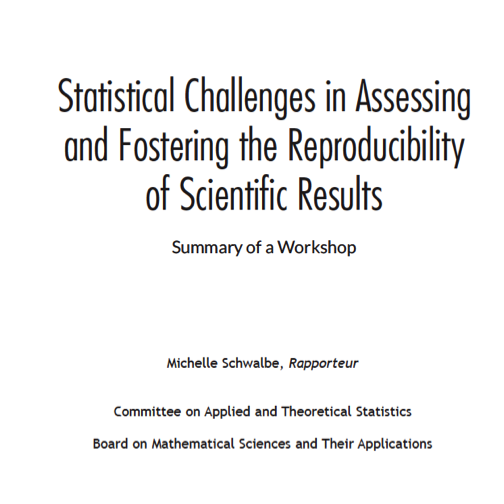
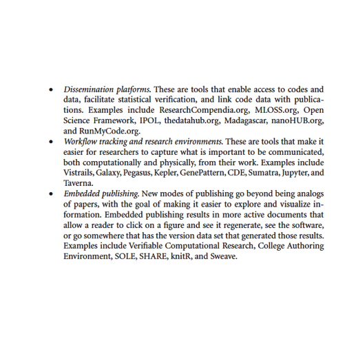
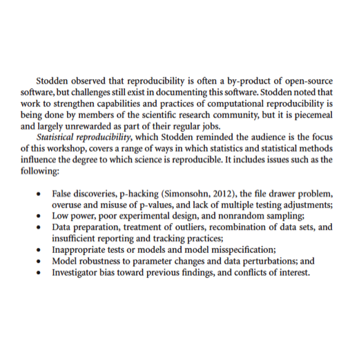

## Overview

A key reason for contributing to open software and data for genome-scale
is fostering reproducibility and extensibility of important findings.
Two forms of reproducibility are

* _concrete reproducibility_: the published computational result can be exactly reproduced by independent investigators in possession of the code and data;
* _amenability to replication_: independent investigators equipped with the same experimental protocol, and comparable biological specimens and lab environment, will obtain qualitatively similar inferences.

There are many examples in modern genomic science where neither form of reproducibility is achieved, hence a burgeoning movement called "reproducible research" has had significant interaction with practitioners in genome biology.

The National Academy of Sciences has issued a [report](http://www.nap.edu/21915) on statistical and methodological concerns in the domain of reproducibility:

A number of interesting infrastructure responses
to reproducibility problems are noted by Victoria Stodden:

She also gives a treatment of _statistical reproducibility_:

## Topics to be covered in this unit

We want to be able to foster reproducibility and extension of our
work.  To this end we will cover 

* construction of R packages for software and annotation, that
are versioned and can include formal tests for correctness of
function operation
* use of knitr to create workflow documents -- background in
notes of [Laurent Gatto](https://www.bioconductor.org/help/course-materials/2015/CSAMA2015/lab/rr-authoring.html)
* use of the [docker container discipline](http://bioconductor.org/help/docker/) to specify and
recover environments in which computations are performed

