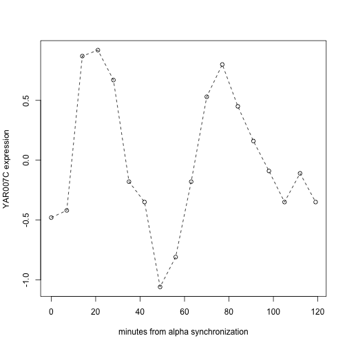

# Basic premise and overview

You know to manipulate and analyze data using R, and
you understand a considerable amount about statistical modeling.
The Bioconductor project demonstrates that R is an effective
vehicle for performing many -- but not all -- tasks that
arise in genome-scale computational biology.

Some of the fundamental concepts that distinguish Bioconductor from other
software systems addressing genome-scale data are

* use of object-oriented design concepts to unify disparate data types arising in genomic experiments;
* commitment to interoperable structures for genomic annotation, from nucleotide to population scale;
* continuous integration discipline for release and development cycles, withdaily testing on multiple widely used compute platforms.
The purpose of this four-week module is to build appreciation for and
expertise in the use of this system for many aspects of genome scale
data analysis.

This module, 525.5x, breaks into four main pieces, with one week 
devoted to each of

* Motivation and techniques: what we measure and why, and how we manage the measurements with R
* Genomic annotation, with particular attention to the role of ranges in genomic coordinates in identifying genomic structures
* Preprocessing concepts for genome scale data, focusing on implementations in Bioconductor
* Testing genome-scale hypotheses with Bioconductor

Subsections of this chapter will sketch the concepts to
be covered, along with some illustrative computations.

## Motivation and techniques

The videos in "What we measure and why" provide schematic
illustrations of the basic biological processes that can now
be studied computationally.  We noted that recipes for
all the proteins that are
fundamental to life processes of an organism are coded
in the organism's genomic DNA.  Studies of differences
between organisms, and certain changes within organisms (for
example, development of tumors), often rely on computations involving 
genomic DNA sequence.  

Bioconductor provides tools for working
directly with genomic DNA sequence for many organisms.  
One basic approach uses computations on a "reference sequence",
another focuses on differences between the genomic sequence
of a given individual, and the reference.

### Reference sequence access

It is very easy to use Bioconductor to work with the
reference sequence for _Homo sapiens_.
Here we'll have a look at chromosome 17.

```r
library(BSgenome.Hsapiens.UCSC.hg19)
Hsapiens$chr17
```

```
##   81195210-letter "DNAString" instance
## seq: AAGCTTCTCACCCTGTTCCTGCATAGATAATTGC...GGTGTGGGTGTGGTGTGTGGGTGTGGGTGTGGT
```
Of note:

* the sequence is provided through an R package
* the name of the package indicates the curating source (UCSC) and reference version (hg19)
* familiar R syntax `$` for selecting a list element is reused to select a chromosome

### Representing DNA variants

A standard representation for individual departures from reference sequence
is [Variant Call Format](http://samtools.github.io/hts-specs/VCFv4.1.pdf).
The `VariantAnnotation` package includes an example.  We have two
high-level representations of some DNA variants -- a summary of the
VCF content in the example, and the genomic addresses of
the sequence variants themselves.


```r
fl <- system.file("extdata", "ex2.vcf", package="VariantAnnotation") 
vcf <- readVcf(fl, "hg19")
vcf
```

```
## class: CollapsedVCF 
## dim: 5 3 
## rowRanges(vcf):
##   GRanges with 5 metadata columns: paramRangeID, REF, ALT, QUAL, FILTER
## info(vcf):
##   DataFrame with 6 columns: NS, DP, AF, AA, DB, H2
## info(header(vcf)):
##       Number Type    Description                
##    NS 1      Integer Number of Samples With Data
##    DP 1      Integer Total Depth                
##    AF A      Float   Allele Frequency           
##    AA 1      String  Ancestral Allele           
##    DB 0      Flag    dbSNP membership, build 129
##    H2 0      Flag    HapMap2 membership         
## geno(vcf):
##   SimpleList of length 4: GT, GQ, DP, HQ
## geno(header(vcf)):
##       Number Type    Description      
##    GT 1      String  Genotype         
##    GQ 1      Integer Genotype Quality 
##    DP 1      Integer Read Depth       
##    HQ 2      Integer Haplotype Quality
```

```r
rowRanges(vcf)
```

```
## GRanges object with 5 ranges and 5 metadata columns:
##                  seqnames             ranges strand | paramRangeID
##                     <Rle>          <IRanges>  <Rle> |     <factor>
##        rs6054257       20 [  14370,   14370]      * |         <NA>
##     20:17330_T/A       20 [  17330,   17330]      * |         <NA>
##        rs6040355       20 [1110696, 1110696]      * |         <NA>
##   20:1230237_T/.       20 [1230237, 1230237]      * |         <NA>
##        microsat1       20 [1234567, 1234569]      * |         <NA>
##                             REF                ALT      QUAL      FILTER
##                  <DNAStringSet> <DNAStringSetList> <numeric> <character>
##        rs6054257              G                  A        29        PASS
##     20:17330_T/A              T                  A         3         q10
##        rs6040355              A                G,T        67        PASS
##   20:1230237_T/.              T                           47        PASS
##        microsat1            GTC             G,GTCT        50        PASS
##   -------
##   seqinfo: 1 sequence from hg19 genome
```

Of note:

* the example data are "built-in" to the package, for illustration and testing
* the variable `vcf` has a concise display to the user
* the variant locations, extracted using `rowRanges`, are shown with a tag indicating their context in the hg19 reference build

### Measures of gene expression

We'll conclude this brief discussion of motivation and technique
with a look at measurements on gene expression in the model
organism _Sacchomyces cerevisiae_, baker's yeast.  A highly influential
experiment undertook to use genome-wide measurement of mRNA abundance
over a series of time points in the reproductive cycle.  Again
we use an R package to manage the data, and we use a special
Bioconductor-defined data structure to provide access to
information about the experiment and the results.


```r
library(yeastCC)
data(spYCCES)
spYCCES
```

```
## ExpressionSet (storageMode: lockedEnvironment)
## assayData: 6178 features, 77 samples 
##   element names: exprs 
## protocolData: none
## phenoData
##   sampleNames: cln3_40 cln3_30 ... elu_390 (77 total)
##   varLabels: syncmeth time
##   varMetadata: labelDescription
## featureData: none
## experimentData: use 'experimentData(object)'
##   pubMedIds: 9843569 
## Annotation:
```

```r
experimentData(spYCCES)
```

```
## Experiment data
##   Experimenter name: Spellman PT 
##   Laboratory: Department of Genetics, Stanford University Medical Center, Stanford, California 94306-5120, USA. 
##   Contact information:  
##   Title: Comprehensive identification of cell cycle-regulated genes of the yeast Saccharomyces cerevisiae by microarray hybridization. 
##   URL:  
##   PMIDs: 9843569 
## 
##   Abstract: A 150 word abstract is available. Use 'abstract' method.
```
After a bit of massaging, a topic on which you will become expert
in the next few weeks, we can visualize the time course of a
cell-cycle regulated gene.



Of note:

* Informative metadata about the experiment are bound right to the data (pubmed ID and abstract accessible through `experimentData`)
* Simple syntax can be used to select components of complex experimental designs; in this case `spYCCES[, spYCCES$syncmeth=="alpha"]` picks out just the colonies whose cell cycling was controlled using alpha pheromone
* R's plotting tools support general plot annotation and enhancement
* Statistical modeling tools to help distinguish cycling and non-cycling genes can be used immediately 

## Wrap-up

You're about to engage with a few high-level lectures on genome
structures and molecular biological techniques for measuring them.
As you encounter these concepts, keep in mind what sorts of computations
you consider relevant to understanding the structures and processes
being studied.  Find the tools to perform these
computations in Bioconductor, and become expert in their
use.  And if you don't find them, let us know, and perhaps we
can point them out, or, if they don't exist, build them together.


<!--

Week 1. Overview of Bioconductor: Channeling R for genome-scale data  

 A. What we measure and why videos with exercises
 B. Bioconductor overview: Software, Annotation, Experimental data packages
 C. Brief overview of object-oriented programming and S4
 D. Managing genome-scale data: ExpressionSet, SummarizedExperiment with exercises


Week 2. Genomic annotation with Bioconductor
 
 A. Prologue: Genomic ranges with exercises
 B. Structural annotation: reference genomic sequence, genes, transcripts with exercises
 C. Assay annotation: microarray platforms with exercises 
 D. Functional annotation: Gene ontology, KEGG, AnnotationHub with exercises

Week 3. Preprocessing genome-scale data with Bioconductor
 
 A. Microarray import and quality assessment with exercises
 B. Short-read import and quality assessment with exercises
 C. Background correction and normalization for microarrays
 D. Bias-correction and normalization for RNA-seq

Week 4. Testing biological hypotheses with Bioconductor

 A. Two-sample tests for differential expression with exercises
 B. Regression and other structured models for gene-specific hypotheses
 C. Modeling with adjustments for confounders
 D. Gene set enrichment analysis

-->
