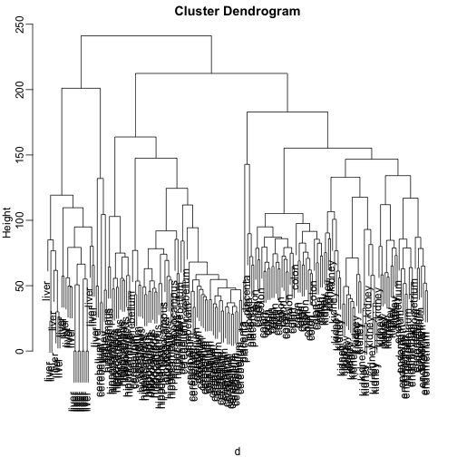
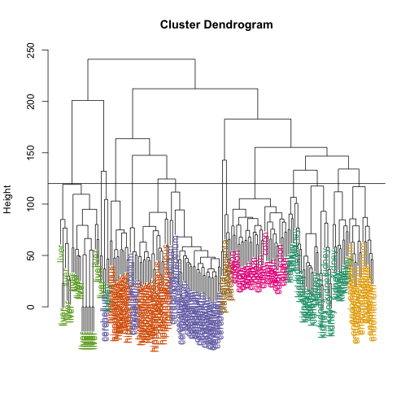
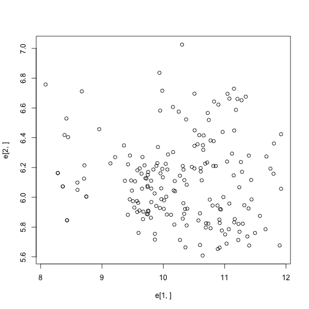
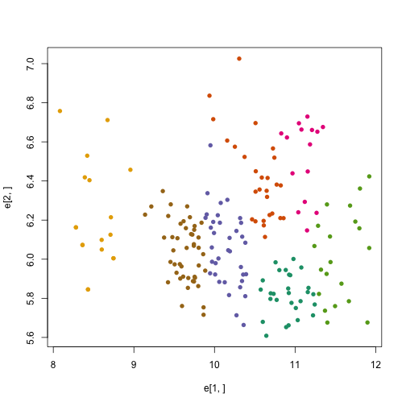
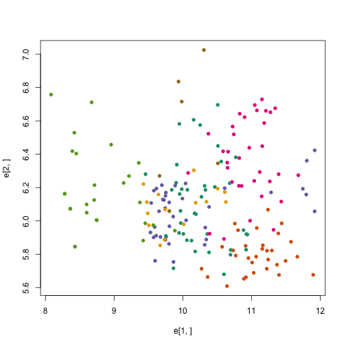
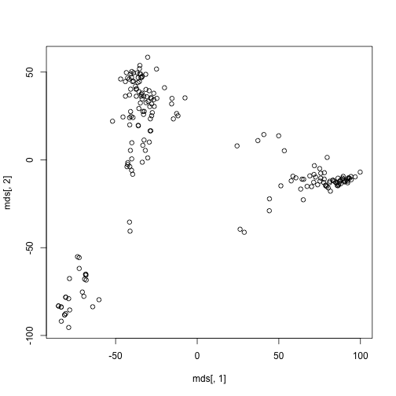
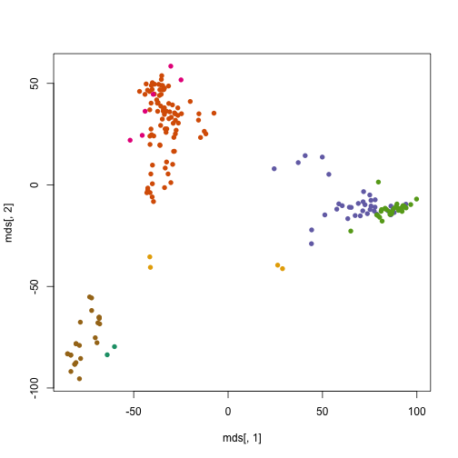
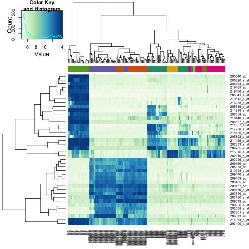

# Introduction

We load the tissue gene expression data


```r
library(tissuesGeneExpression)
data(tissuesGeneExpression)
```

Let's act as if we don't know these are different tissues and are interested in clustering. The first step is to compute the distance between each sample


```r
d <- dist(t(e))
```

<a name="hierarchical"></a>

# Hierarchical clustering

We can perform hierarchical clustering based on the
distances defined above, using the `hclust` function.
The `plot` method will make a plot of the tree that results from `hclust`. 


```r
library(rafalib)
```

```
## Loading required package: RColorBrewer
```

```r
mypar2(1,1)
hc <- hclust(d)
hc
```

```
## 
## Call:
## hclust(d = d)
## 
## Cluster method   : complete 
## Distance         : euclidean 
## Number of objects: 189
```

```r
plot(hc,labels=tissue)
```

 

Does this technique "discover" the clusters defined by the different tissues? In this case it is not easy to see the different tissues so we add colors.
 

```r
myplclust(hc, labels=tissue, lab.col=as.fumeric(tissue))
```

 

Note that hierarchical clustering does not define specific clusters but rather defines a dendrogram. To define clusters we need to "cut the tree" at some height and group all samples that are within that split into different groups below that line. We use 120 as an example:


```r
myplclust(hc, labels=tissue, lab.col=as.fumeric(tissue))
abline(h=120)
```

 

If we use the line above to cut the tree into clusters, we can examine how the clusters overlap with the actual tissues:


```r
hclusters <- cutree(hc, h=120)
table(true=tissue, cluster=hclusters)
```

```
##              cluster
## true           1  2  3  4  5  6  7  8  9 10 11 12 13 14
##   cerebellum   0  0  0  0 31  0  0  0  2  0  0  5  0  0
##   colon        0  0  0  0  0  0 34  0  0  0  0  0  0  0
##   endometrium  0  0  0  0  0  0  0  0  0  0 15  0  0  0
##   hippocampus  0  0 12 19  0  0  0  0  0  0  0  0  0  0
##   kidney       9 18  0  0  0 10  0  0  2  0  0  0  0  0
##   liver        0  0  0  0  0  0  0 24  0  2  0  0  0  0
##   placenta     0  0  0  0  0  0  0  0  0  0  0  0  2  4
```

<a name="kmeans"></a>

# K-means

We can also cluster with the `kmeans` function to perform k-means clustering. As an example, let's run k-means on the samples in the space of the first two genes:


```r
plot(e[1,], e[2,])
```

 

```r
set.seed(1)
km <- kmeans(t(e[1:2,]), centers=7)
names(km)
```

```
## [1] "cluster"      "centers"      "totss"        "withinss"    
## [5] "tot.withinss" "betweenss"    "size"         "iter"        
## [9] "ifault"
```

```r
plot(e[1,], e[2,], col=km$cluster, pch=16)
```

 

```r
plot(e[1,], e[2,], col=as.fumeric(tissue), pch=16)
```

 

```r
table(true=tissue,cluster=km$cluster)
```

```
##              cluster
## true           1  2  3  4  5  6  7
##   cerebellum   0  1  8  0  6  0 23
##   colon        2 11  2 15  4  0  0
##   endometrium  0  3  4  0  0  0  8
##   hippocampus 19  0  2  0 10  0  0
##   kidney       7  8 20  0  0  0  4
##   liver        0  0  0  0  0 18  8
##   placenta     0  4  0  0  0  0  2
```

We can instead perform k-means clustering using all of the genes. And to visualize this, we can use an MDS plot


```r
mds <- cmdscale(d)
plot(mds[,1], mds[,2]) 
```

 

```r
km <- kmeans(t(e), centers=7)
plot(mds[,1], mds[,2], col=km$cluster, pch=16)
```

 

```r
table(true=tissue,cluster=km$cluster)
```

```
##              cluster
## true           1  2  3  4  5  6  7
##   cerebellum   0  0  5  0 31  2  0
##   colon        0 34  0  0  0  0  0
##   endometrium  0 15  0  0  0  0  0
##   hippocampus  0  0 31  0  0  0  0
##   kidney       0 37  0  0  0  2  0
##   liver        2  0  0  0  0  0 24
##   placenta     0  0  0  6  0  0  0
```


<a name="heatmap"></a>

# Heatmaps

Heatmaps are useful plots for visualizing the measurements  for a subset of rows over all the samples. A *dendrogram* is added on top and on the side is a hierarchical clustering as we saw before. First we will
use the `heatmap` available in base R. First define a color palette.


```r
# install.packages("RColorBrewer")
library(RColorBrewer)
hmcol <- colorRampPalette(brewer.pal(9, "GnBu"))(100)
```

Now, pick the genes with the top variance over all samples:


```r
library(genefilter)
```

```
## 
## Attaching package: 'genefilter'
## 
## The following object is masked from 'package:base':
## 
##     anyNA
```

```r
rv <- rowVars(e)
idx <- order(-rv)[1:40]
```

Now we can plot a heatmap of these genes:


```r
heatmap(e[idx,], col=hmcol)
```

 

The `heatmap.2` function in the `gplots` package on CRAN is a bit more
customization. For example, it stretches to fill the window. Here we add colors to indicate the tissue on the top:


```r
# install.packages("gplots")
library(gplots)
```

```
## 
## Attaching package: 'gplots'
## 
## The following object is masked from 'package:stats':
## 
##     lowess
```

```r
cols <- palette(brewer.pal(8, "Dark2"))[as.fumeric(tissue)]
head(cbind(colnames(e),cols))
```

```
##                        cols     
## [1,] "GSM11805.CEL.gz" "#1B9E77"
## [2,] "GSM11814.CEL.gz" "#1B9E77"
## [3,] "GSM11823.CEL.gz" "#1B9E77"
## [4,] "GSM11830.CEL.gz" "#1B9E77"
## [5,] "GSM12067.CEL.gz" "#1B9E77"
## [6,] "GSM12075.CEL.gz" "#1B9E77"
```

```r
heatmap.2(e[idx,], labCol=tissue,
          trace="none", 
          ColSideColors=cols, 
          col=hmcol)
```

 


