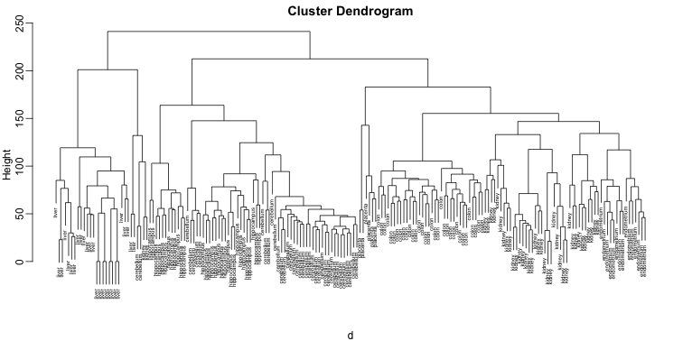

# Basic Machine Learning

Machine learning is a very broad topic and a highly active research area. In the life sciences, much of what is described as "precision medicine" is an application of machine learning to biomedical data. The general idea is to predict or discover outcomes from measured predictors. Can we discover new types of cancer from gene expression profiles? Or can we predict drug response from a series of genotypes? Here we give brief introductions to two major machine learning components: clustering and class prediction.

## Clustering 

The R markdown document for this section is available [here](https://github.com/genomicsclass/labs/tree/master/ml/clustering_and_heatmaps.Rmd).

We will demonstrate the concepts and code needed to perform clustering analysis with the tissue gene expression data:


```r
library(tissuesGeneExpression)
data(tissuesGeneExpression)
```

Now pretend that we don't know these are different tissues and are interested in clustering. The first step is to compute the distance between each sample:


```r
d <- dist( t(e) )
```

<a name="hierarchical"></a>

### Hierarchical Clustering

With the distance between each pair of samples computed, we need clustering algorithms to join them into groups. Hierarchical clustering is one of the many clustering algorithms available to do this. Each sample is assigned to its own group and then the algorithm continues iteratively, joining the two most similar clusters at each step, and continuing until there is just one group. While we have defined distances between samples, we have not yet defined distances between groups. There are various ways this can be done and they all rely on the individual pairwise distances. The helpfile for `hclust` includes detailed information. 

We can perform hierarchical clustering based on the distances defined above using the `hclust` function. This function returns an `hclust` object that describes the groupings that were created using the algorithm described above. The `plot` method represents these relationships with a tree or dendrogram: 


```r
library(rafalib)
mypar()
hc <- hclust(d)
hc
```

```
## 
## Call:
## hclust(d = d)
## 
## Cluster method   : complete 
## Distance         : euclidean 
## Number of objects: 189
```

```r
plot(hc,labels=tissue,cex=0.5)
```

 

Does this technique "discover" the clusters defined by the different tissues? In this case, it is not easy to see the different tissues so we add colors by using the `mypclust` function from the `rafalib` package. 
 

```r
myplclust(hc, labels=tissue, lab.col=as.fumeric(tissue), cex=0.5)
```

 

Keep in mind that hierarchical clustering does not define specific clusters, but rather defines the dendrogram above. From the dendrogram we can decipher the distance between any two groups by looking at the height at which the two groups split into two. To define clusters we need to "cut the tree" at some distance and group all samples that are within that distance into groups below. To visualize this, we draw a horizontal line at the height we wish to cut and this defines that line. We use 120 as an example:


```r
myplclust(hc, labels=tissue, lab.col=as.fumeric(tissue),cex=0.5)
abline(h=120)
```

 

If we use the line above to cut the tree into clusters, we can examine how the clusters overlap with the actual tissues:


```r
hclusters <- cutree(hc, h=120)
table(true=tissue, cluster=hclusters)
```

```
##              cluster
## true           1  2  3  4  5  6  7  8  9 10 11 12 13 14
##   cerebellum   0  0  0  0 31  0  0  0  2  0  0  5  0  0
##   colon        0  0  0  0  0  0 34  0  0  0  0  0  0  0
##   endometrium  0  0  0  0  0  0  0  0  0  0 15  0  0  0
##   hippocampus  0  0 12 19  0  0  0  0  0  0  0  0  0  0
##   kidney       9 18  0  0  0 10  0  0  2  0  0  0  0  0
##   liver        0  0  0  0  0  0  0 24  0  2  0  0  0  0
##   placenta     0  0  0  0  0  0  0  0  0  0  0  0  2  4
```

We can also ask `cutree` to give us back a given number of clusters. The function then automatically finds the height that results in the requested number of clusters:


```r
hclusters <- cutree(hc, k=8)
table(true=tissue, cluster=hclusters)
```

```
##              cluster
## true           1  2  3  4  5  6  7  8
##   cerebellum   0  0 31  0  0  2  5  0
##   colon        0  0  0 34  0  0  0  0
##   endometrium 15  0  0  0  0  0  0  0
##   hippocampus  0 12 19  0  0  0  0  0
##   kidney      37  0  0  0  0  2  0  0
##   liver        0  0  0  0 24  2  0  0
##   placenta     0  0  0  0  0  0  0  6
```

<a name="kmeans"></a>

### K-means

We can also cluster with the `kmeans` function to perform k-means clustering. As an example, let's run k-means on the samples in the space of the first two genes:


```r
set.seed(1)
km <- kmeans(t(e[1:2,]), centers=7)
names(km)
```

```
## [1] "cluster"      "centers"      "totss"        "withinss"    
## [5] "tot.withinss" "betweenss"    "size"         "iter"        
## [9] "ifault"
```

```r
mypar(1,2)
plot(e[1,], e[2,], col=as.fumeric(tissue), pch=16)
plot(e[1,], e[2,], col=km$cluster, pch=16)
```

 

```r
table(true=tissue,cluster=km$cluster)
```

```
##              cluster
## true           1  2  3  4  5  6  7
##   cerebellum   0  1  8  0  6  0 23
##   colon        2 11  2 15  4  0  0
##   endometrium  0  3  4  0  0  0  8
##   hippocampus 19  0  2  0 10  0  0
##   kidney       7  8 20  0  0  0  4
##   liver        0  0  0  0  0 18  8
##   placenta     0  4  0  0  0  0  2
```

We can instead perform k-means clustering using all of the genes. To visualize this, we can use an MDS plot:


```r
km <- kmeans(t(e), centers=7)
mds <- cmdscale(d)

mypar(1,2)
plot(mds[,1], mds[,2]) 
plot(mds[,1], mds[,2], col=km$cluster, pch=16)
```

 

```r
table(true=tissue,cluster=km$cluster)
```

```
##              cluster
## true           1  2  3  4  5  6  7
##   cerebellum   0  0  5  0 31  2  0
##   colon        0 34  0  0  0  0  0
##   endometrium  0 15  0  0  0  0  0
##   hippocampus  0  0 31  0  0  0  0
##   kidney       0 37  0  0  0  2  0
##   liver        2  0  0  0  0  0 24
##   placenta     0  0  0  6  0  0  0
```


<a name="heatmap"></a>

### Heatmaps

Heatmaps are useful plots for visualizing the measurements for a subset of rows over all the samples. A *dendrogram* is added on top; on the side is a hierarchical clustering as we saw before. First, we will use the `heatmap` available in base R. Let's begin by defining a color palette:


```r
library(RColorBrewer) 
hmcol <- colorRampPalette(brewer.pal(9, "GnBu"))(100)
```

Now, pick the genes with the top variance over all samples:


```r
library(genefilter)
```

```
## 
## Attaching package: 'genefilter'
## 
## The following object is masked from 'package:base':
## 
##     anyNA
```

```r
rv <- rowVars(e)
idx <- order(-rv)[1:40]
```

Now we can plot a heatmap of these genes:


```r
heatmap(e[idx,], col=hmcol)
```

 

The `heatmap.2` function in the `gplots` package on CRAN is a bit more customized. For example, it stretches to fill the window. Here we add colors to indicate the tissue on the top:


```r
library(gplots) ##Available from CRAN
cols <- palette(brewer.pal(8, "Dark2"))[as.fumeric(tissue)]
head(cbind(colnames(e),cols))
```

```
##                        cols     
## [1,] "GSM11805.CEL.gz" "#1B9E77"
## [2,] "GSM11814.CEL.gz" "#1B9E77"
## [3,] "GSM11823.CEL.gz" "#1B9E77"
## [4,] "GSM11830.CEL.gz" "#1B9E77"
## [5,] "GSM12067.CEL.gz" "#1B9E77"
## [6,] "GSM12075.CEL.gz" "#1B9E77"
```

```r
heatmap.2(e[idx,], labCol=tissue,
          trace="none", 
          ColSideColors=cols, 
          col=hmcol)
```

 


