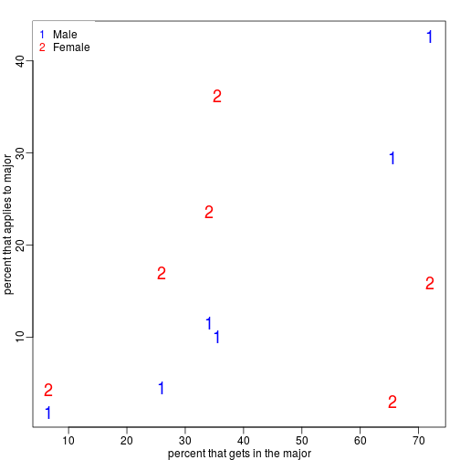
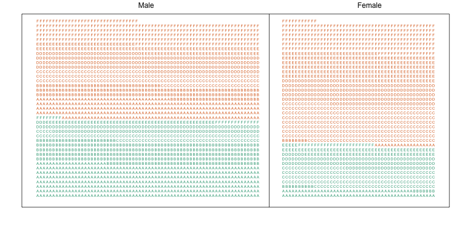
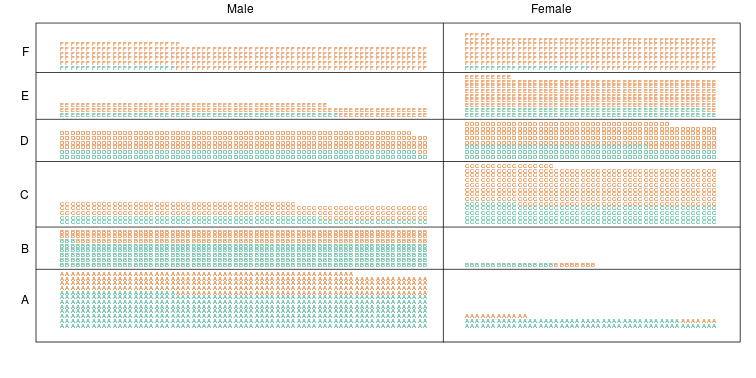
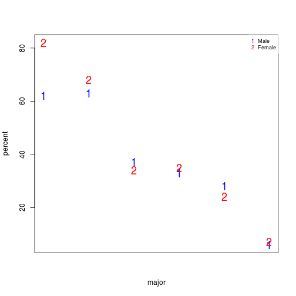
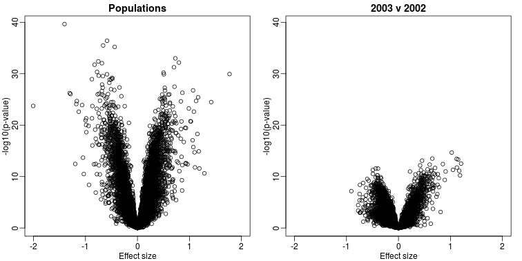

## Confounding

Batch effects have the most devastating effects when they are _counfounded_ with outcomes of interest. Here we described confounding and how it relates to data interpretation.

"Correlation is not causation" is one of the most important lessons you should take from this or any other data analysis course. A common example for why this statement is so often true is confounding. Simply stated confounding occurs when we observe a correlation or association between $$X$$ and $$Y$$, but  this is strictly the result of both $$X$$ and $$Y$$ depending on an extraneous variable $$Z$$. Here we describe Simpson's paradox, an example based on a famous legal case, and an example of confounding in high-throughput biology.

#### Example of Simpson's Paradox

Admission data from U.C. Berkeley 1973 showed that more men were being admitted than women: 44% men were admitted compared to 30% women. This actually led to a [lawsuit](http://en.wikipedia.org/wiki/Simpson%27s_paradox#Berkeley_gender_bias_case). See: PJ Bickel, EA Hammel, and JW O'Connell. Science (1975). Here is the data:


```r
library(dagdata)
data(admissions)
admissions$total=admissions$Percent*admissions$Number/100

##percent men get in
sum(admissions$total[admissions$Gender==1]/sum(admissions$Number[admissions$Gender==1]))
```

```
## [1] 0.4451951
```

```r
##percent women get in
sum(admissions$total[admissions$Gender==0]/sum(admissions$Number[admissions$Gender==0]))
```

```
## [1] 0.3033351
```

A chi-square test clearly rejects the hypothesis that gender and admission are independent:

```r
##make a 2 x 2 table
index = admissions$Gender==1
men = admissions[index,]
women = admissions[!index,]
menYes = sum(men$Number*men$Percent/100)
menNo = sum(men$Number*(1-men$Percent/100))
womenYes = sum(women$Number*women$Percent/100)
womenNo = sum(women$Number*(1-women$Percent/100))
tab = matrix(c(menYes,womenYes,menNo,womenNo),2,2)
print(chisq.test(tab)$p.val)
```

```
## [1] 9.139492e-22
```

But closer inspection shows a paradoxical result. Here are the percent admissions by major:

```r
y=cbind(admissions[1:6,c(1,3)],admissions[7:12,3])
colnames(y)[2:3]=c("Male","Female")
y
```

```
##   Major Male Female
## 1     A   62     82
## 2     B   63     68
## 3     C   37     34
## 4     D   33     35
## 5     E   28     24
## 6     F    6      7
```

Notice that we no longer see a clear gender bias. 
The chi-square test we performed above suggests a dependence between admission and gender. Yet when the data is grouped by major, this dependence seems to disappear.  What's going on? 

This is an example of _Simpson's paradox_ . A plot showing the percentages that applied to a major against the percent that get into that major, for males and females starts to point to an explanation.


```r
y=cbind(admissions[1:6,5],admissions[7:12,5])
y=sweep(y,2,colSums(y),"/")*100
x=rowMeans(cbind(admissions[1:6,3],admissions[7:12,3]))

library(rafalib)
mypar()
matplot(x,y,xlab="percent that gets in the major",ylab="percent that applies to major",col=c("blue","red"),cex=1.5)
legend("topleft",c("Male","Female"),col=c("blue","red"),pch=c("1","2"),box.lty=0)
```

 

What the plot suggests is that males were much more likely to apply to "easy" majors. The plot shows that males and "easy" majors are confounded.


#### Confounding explained graphically

Here we visualize the confounding. In the plots below, each letter represents a person. Accepted individuals are denoted in green and not admitted in orange. The letter indicates the major. In this first plot we group all the students together and notice that the proportion of green is larger for men.


 

Now we stratify the data by major. The key point here is that most of the accepted men (green) come from the easy majors: A and B.

 

#### Average after stratifying

In this plot, we can see that if we condition or stratify by major, and then look at differences, we control for the confounder and this effect goes away. 

```r
y=cbind(admissions[1:6,3],admissions[7:12,3])
matplot(1:6,y,xaxt="n",xlab="major",ylab="percent",col=c("blue","red"),cex=1.5)
axis(1,1:6,LETTERS[1:6])
legend("topright",c("Male","Female"),col=c("blue","red"),pch=c("1","2"),
       box.lty=0)
```

 

The average difference by major is actually 3.5% higher for women.


```r
mean(y[,1]-y[,2])
```

```
## [1] -3.5
```

#### Simpson's paradox in baseball

Simpson's Paradox is commonly seen in baseball statistics. Here is a well known example in which David Justice had a higher batting average than Derek Jeter in both 1995 and 1996, but Jeter had a higher overall average:

|               | 1995           | 1996           | Combined        |
| ------------- | -------------- | -------------- | --------------- |
| Derek Jeter   | 12/48 (.250)   | 183/582 (.314) | 195/630 (.310)  |
| David Justice | 104/411 (.253) | 45/140 (.321)  | 149/551 (.270)  |

The confounder here is games played. Jeter played more games during the year he batted better, while the opposite is true for Justice.

<a name="genomics"></a>

## Confounding: High-throughput Example

To describe the problem of confounding with a real example, we will use a dataset from [this paper](http://www.ncbi.nlm.nih.gov/pubmed/17206142) that claimed that roughly 50% of genes where differentially expressed when comparing blood from two ethnic groups. We include the data in one of our data packages:


```r
library(Biobase) ##available from Bioconductor
library(genefilter) 
library(GSE5859) ##available from github
data(GSE5859)
```

We can extract the gene expression data and sample information table using the Bioconductor functions `exprs` and `pData` like this:


```r
geneExpression = exprs(e)
sampleInfo = pData(e)
```

Note that some samples were processed at different times.


```r
head(sampleInfo$date)
```

```
## [1] "2003-02-04" "2003-02-04" "2002-12-17" "2003-01-30" "2003-01-03"
## [6] "2003-01-16"
```

This is an extraneous variable and should not affect the values in `geneExpression`. However, as we have seen in previous analyses, it does appear to have an effect. We will therefore explore this here.

We can immediately see that year and ethnicity are almost completely confounded:


```r
year = factor( format(sampleInfo$date,"%y") )
tab = table(year,sampleInfo$ethnicity)
print(tab)
```

```
##     
## year ASN CEU HAN
##   02   0  32   0
##   03   0  54   0
##   04   0  13   0
##   05  80   3   0
##   06   2   0  24
```

By running a t-test and creating a volcano plot, we note that thousands of genes appear to be differentially expressed between ethnicities. Yet when we perform a similar comparison only on the CEU population between the years 2002 and 2003, we again obtain thousands of differentially expressed genes:


```r
library(genefilter)

##remove control genes
out <- grep("AFFX",rownames(geneExpression))

eth <- sampleInfo$ethnicity
ind<- which(eth%in%c("CEU","ASN"))
res1 <- rowttests(geneExpression[-out,ind],droplevels(eth[ind]))
ind <- which(year%in%c("02","03") & eth=="CEU")
res2 <- rowttests(geneExpression[-out,ind],droplevels(year[ind]))

XLIM <- max(abs(c(res1$dm,res2$dm)))*c(-1,1)
YLIM <- range(-log10(c(res1$p,res2$p)))
mypar(1,2)
plot(res1$dm,-log10(res1$p),xlim=XLIM,ylim=YLIM,
     xlab="Effect size",ylab="-log10(p-value)",main="Populations")
plot(res2$dm,-log10(res2$p),xlim=XLIM,ylim=YLIM,
     xlab="Effect size",ylab="-log10(p-value)",main="2003 v 2002")
```

 

