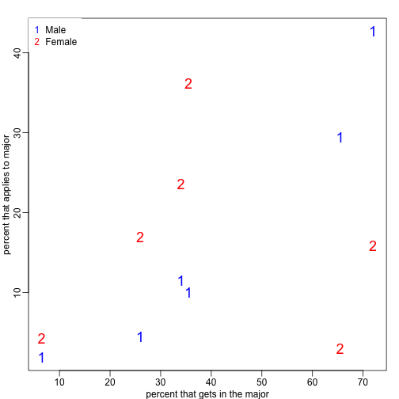
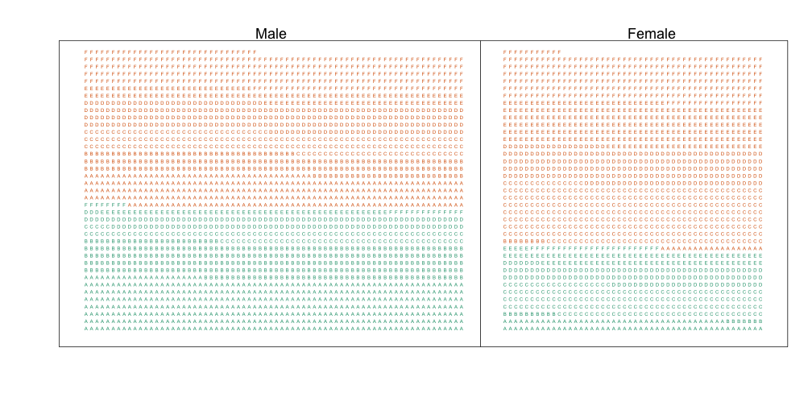
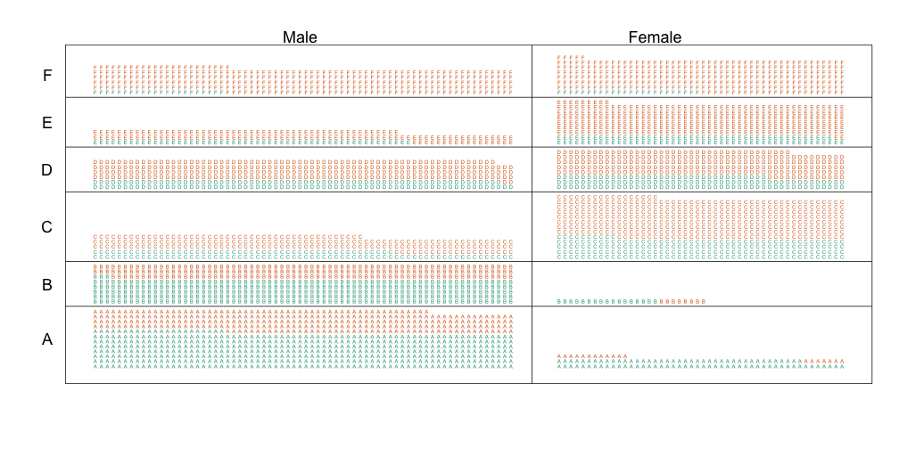

# Introduction

"Correlation is not causation" is one of the most important lessons you should take from this or any other data analysis course. A common example for why this statement is so often true is confounding. Simply stated confounding occurs when we observe a correlation or association between $$X$$ and $$Y$$ but  this is strictly the result of both $$X$$ and $$Y$$ depending on an extraneous variable $$Z$$. Here we describe Simpson's paradox, perhaps the most famous case of confounding and then show an example of confounding in high throughput biology.

# Simpson's paradox

Admission data from Berkeley 1973 showed more men were being admitted than women: 44\% men admitted compared to 30\% women. This actually led to a [lawsuit](http://en.wikipedia.org/wiki/Simpson%27s_paradox#Berkeley_gender_bias_case). See: PJ Bickel, EA Hammel, and JW O'Connell. Science (1975)


```r
library(dagdata)
data(admissions)
admissions$total=admissions$Percent*admissions$Number/100
##percent men get in
sum(admissions$total[admissions$Gender==1]/sum(admissions$Number[admissions$Gender==1]))
```

```
## [1] 0.4451951
```

```r
##percent women get in
sum(admissions$total[admissions$Gender==0]/sum(admissions$Number[admissions$Gender==0]))
```

```
## [1] 0.3033351
```

A chi-square test clearly rejects they hypothesis that gender and admission are independent:

```r
##let's make a 2 x 2
index = admissions$Gender==1
men = admissions[index,]
women = admissions[!index,]
menYes = sum(men$Number*men$Percent/100)
menNo = sum(men$Number*(1-men$Percent/100))
womenYes = sum(women$Number*women$Percent/100)
womenNo = sum(women$Number*(1-women$Percent/100))
tab = matrix(c(menYes,womenYes,menNo,womenNo),2,2)
print(chisq.test(tab)$p.val)
```

```
## [1] 9.139492e-22
```

But closer inspection shows a paradoxical result. Here are the percent admissions by Major:

```r
y=cbind(admissions[1:6,c(1,3)],admissions[7:12,3])
colnames(y)[2:3]=c("Male","Female")
y
```

```
##   Major Male Female
## 1     A   62     82
## 2     B   63     68
## 3     C   37     34
## 4     D   33     35
## 5     E   28     24
## 6     F    6      7
```

**Optional homework**: Run the `chisq.test` in each major.

Here are the absolute number of admissions by Major:

```r
y=cbind(admissions[1:6,c(1,2)],admissions[7:12,2])
colnames(y)[2:3]=c("Male","Female")
y
```

```
##   Major Male Female
## 1     A  825    108
## 2     B  560     25
## 3     C  325    593
## 4     D  417    375
## 5     E  191    393
## 6     F  373    341
```

The chi-square test we performed above suggests a dependence between admission and gender.  Yet when the data is grouped by Major, this dependence doesn't seem borne out.  What's going on? 

This is called _Simpson's paradox_ 
As we will see, males were much more likely to apply to "easy" majors. 

Male and easy majors are confounded. 

```r
y=cbind(admissions[1:6,5],admissions[7:12,5])
y=sweep(y,2,colSums(y),"/")*100
x=rowMeans(cbind(admissions[1:6,3],admissions[7:12,3]))

library(rafalib)
```

```
## Loading required package: RColorBrewer
```

```r
mypar2(1,1)
matplot(x,y,xlab="percent that gets in the major",ylab="percent that applies to major",col=c("blue","red"),cex=1.5)
legend("topleft",c("Male","Female"),col=c("blue","red"),pch=c("1","2"),box.lty=0)
```

 


## Confounding explained graphically


In the plots below each letter represents a person. Accepted individuals are denoted with green and not admitted in orange. The letter denotes the major. In this plot we group all the patients together and notice that the proportion of green is larger for men.


 

Now we stratify the data by major. The key point here is that most of the men denoted with green come from majors A and B which are the ones with the highest acceptance rate. 


 


## Average after stratifying

So if we condition or stratify by major this goes away. 

```r
y=cbind(admissions[1:6,3],admissions[7:12,3])
matplot(1:6,y,xaxt="n",xlab="major",ylab="percent",col=c("blue","red"),cex=1.5)
legend("topright",c("Male","Female"),col=c("blue","red"),pch=c("1","2"),box.lty=0,cex=0.75)
```

 

The average difference by Major is 3.5% higher for women.


```r
mean(y[,1]-y[,2])
```

```
## [1] -3.5
```

## Simpson's paradox in baseball

We see this in Baseball often:

|               | 1995           | 1996           | Combined        |
| ------------- | -------------- | -------------- | --------------- |
| Derek Jeter   | 12/48 (.250)   | 183/582 (.314) | 195/630 (.310)  |
| David Justice | 104/411 (.253) | 45/140 (.321)  | 149/551 (.270)  |


<a name="genomics"></a>

# Confounding in genomics

Here are the p-values from comparing CEU to ASN

```r
library(Biobase)
library(genefilter)
library(GSE5859)
```

```
## Error in library(GSE5859): there is no package called 'GSE5859'
```

```r
data(GSE5859)
```

```
## Warning in data(GSE5859): data set 'GSE5859' not found
```

Note that this is the original dataset from which we selected the subset used in `GSE5859Subset`. We can extract the gene expression data and sample information table using the Bio conductor functions `exprs` and `pData` like this:


```r
geneExpression = exprs(e)
```

```
## Error in exprs(e): error in evaluating the argument 'object' in selecting a method for function 'exprs': Error: object 'e' not found
```

```r
sampleInfo = pData(e)
```

```
## Error in pData(e): error in evaluating the argument 'object' in selecting a method for function 'pData': Error: object 'e' not found
```

Note that some samples were processed at different times.


```r
head(sampleInfo$date)
```

```
## Error in head(sampleInfo$date): object 'sampleInfo' not found
```

This is an extraneous variable and should not affect the values in `geneExpression`. However, as we have seen in previous analyses it does appear to have an effect so we will explore this here.

We can immediately see that year and ethnicity are almost completely confounded:


```r
year = factor( format(sampleInfo$date,"%y") )
```

```
## Error in format(sampleInfo$date, "%y"): object 'sampleInfo' not found
```

```r
tab = table(year,sampleInfo$ethnicity)
```

```
## Error in eval(expr, envir, enclos): object 'year' not found
```

```r
print(tab)
```

```
##         [,1]    [,2]
## [1,] 1198.02 1492.98
## [2,]  556.62 1278.38
```

By running a t-test and creating a volcano plot we note that thousands of genes appear to be differentially expressed. But when we perform a similar comparison between 2002 and 2003 only on the CEU population we again obtain thousands of diferentially expressed genes:


```r
library(genefilter)

##remove control genes
out <- grep("AFFX",rownames(geneExpression))
```

```
## Error in rownames(geneExpression): error in evaluating the argument 'x' in selecting a method for function 'rownames': Error: object 'geneExpression' not found
```

```r
eth <- sampleInfo$ethnicity
```

```
## Error in eval(expr, envir, enclos): object 'sampleInfo' not found
```

```r
ind<- which(eth%in%c("CEU","ASN"))
```

```
## Error in match(x, table, nomatch = 0L): object 'eth' not found
```

```r
res1 <- rowttests(geneExpression[-out,ind],droplevels(eth[ind]))
```

```
## Error in rowttests(geneExpression[-out, ind], droplevels(eth[ind])): error in evaluating the argument 'x' in selecting a method for function 'rowttests': Error: object 'geneExpression' not found
```

```r
ind <- which(year%in%c("02","03") & eth=="CEU")
```

```
## Error in match(x, table, nomatch = 0L): object 'year' not found
```

```r
res2 <- rowttests(geneExpression[-out,ind],droplevels(year[ind]))
```

```
## Error in rowttests(geneExpression[-out, ind], droplevels(year[ind])): error in evaluating the argument 'x' in selecting a method for function 'rowttests': Error: object 'geneExpression' not found
```

```r
XLIM <- max(abs(c(res1$dm,res2$dm)))*c(-1,1)
```

```
## Error in eval(expr, envir, enclos): object 'res1' not found
```

```r
YLIM <- range(-log10(c(res1$p,res2$p)))
```

```
## Error in eval(expr, envir, enclos): object 'res1' not found
```

```r
mypar(1,2)
plot(res1$dm,-log10(res1$p),xlim=XLIM,ylim=YLIM,xlab="Effect size",ylab="-log10(p-value)",main="Populations")
```

```
## Error in plot(res1$dm, -log10(res1$p), xlim = XLIM, ylim = YLIM, xlab = "Effect size", : error in evaluating the argument 'x' in selecting a method for function 'plot': Error: object 'res1' not found
```

```r
plot(res2$dm,-log10(res2$p),xlim=XLIM,ylim=YLIM,xlab="Effect size",ylab="-log10(p-value)",main="2003 v 2002")
```

```
## Error in plot(res2$dm, -log10(res2$p), xlim = XLIM, ylim = YLIM, xlab = "Effect size", : error in evaluating the argument 'x' in selecting a method for function 'plot': Error: object 'res2' not found
```

