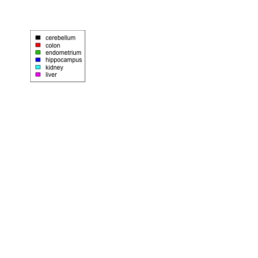
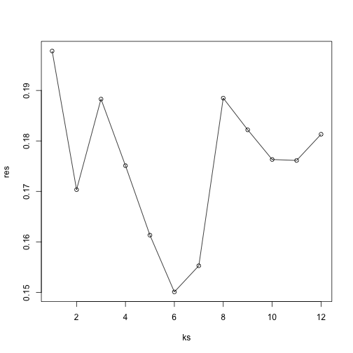
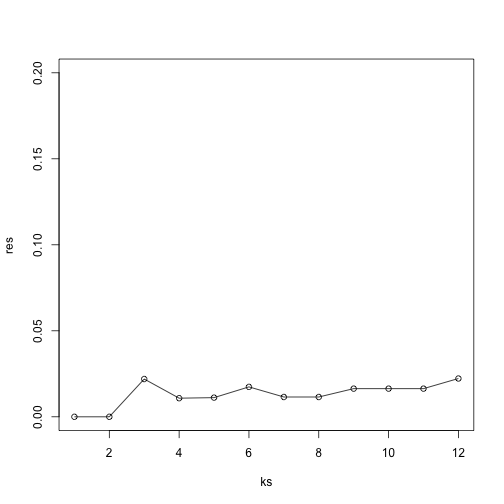

In this lab, we will explore a method for picking parameters in a prediction / machine learning task, which is called *cross-validation*.

Suppose we have a prediction algorithm which is going to predict the class of some observations using a number of features. For example, we will use the gene expression values to predict the tissue type in our tissues gene expression dataset.

If this algorithm has a parameter which controls the behavior, we might pick the value of this parameter which minimizes the classification error. However, trying to classify the same observations as we use to *train* the model can be misleading.  In lecture, we saw that for K-nearest neighbors, using k=1 will always give 0 classification error in the training set (because we use the single observation to classify itself). Instead, it's better to pick the parameter using the algorithms performance on a set of observations which the algorithm has never seen, a *test* set.

Cross-validation is simply a method which splits the data into a number of *folds*. If we have N folds, then the algorithm typically trains on (N-1) of the folds, and test the algorithms performance on the left-out single fold. This is then repeated N times until each fold has been used as a *test* set.

Let's load in the tissue gene expression dataset:


```r
library(tissuesGeneExpression)
data(tissuesGeneExpression)
```

For illustration purposes 
let's drop one of the tissues which doesn't have many samples:


```r
table(tissue)
```

```
## tissue
##  cerebellum       colon endometrium hippocampus      kidney       liver 
##          38          34          15          31          39          26 
##    placenta 
##           6
```

```r
ind <- which(tissue != "placenta")
y <- tissue[ind]
X <- t( e[,ind] )
```

We will use the `createFolds` function from the `caret` package to make 5 folds of the data, which are balanced over the tissues. Don't be confused that the `createFolds` function uses the same letter 'k' as the k in K-nearest neighbors. These 'k' are unrelated.  The caret function `createFolds` is asking for how many folds to create, the 'N' from above. The `knn` function is asking how many closest observations to use to classify the test observations.


```r
# install.packages("caret")
#library(class)
library(caret)
```

```
## Loading required package: lattice
## Loading required package: ggplot2
## Loading required package: methods
```

```r
set.seed(1)
idx <- createFolds(y, k=10)
sapply(idx, function(i) table(y[i]))
```

```
##             Fold01 Fold02 Fold03 Fold04 Fold05 Fold06 Fold07 Fold08 Fold09
## cerebellum       3      4      4      4      4      4      4      4      4
## colon            4      3      3      3      4      4      3      3      4
## endometrium      2      2      1      1      1      2      1      2      2
## hippocampus      3      3      3      3      3      3      4      3      3
## kidney           4      4      3      4      4      4      4      4      4
## liver            2      3      3      2      2      3      3      3      3
##             Fold10
## cerebellum       3
## colon            3
## endometrium      1
## hippocampus      3
## kidney           4
## liver            2
```


Because tissues have very different gene expression profiles, predicting tissue with all genes will be too easy. For illustration purposes we will try to predict tissue type with just two dimensional data. We will reduce dimension using `cmdscale`


```r
library(rafalib)
```

```
## Loading required package: RColorBrewer
```

```r
Xsmall <- cmdscale(dist(X))
plot(Xsmall,col=as.fumeric(y))
legend("topleft",levels(factor(y)),fill=seq_along(levels(factor(y))))
```

 

Now we can try out the K-nearest neighbors method on a single fold:


```r
library(class)
i=1
pred <- knn(train =  Xsmall[ -idx[[i]] , ], test = Xsmall[ idx[[i]], ], cl=  y[ -idx[[i]] ], k=5)
table(true=y[ idx[[i]] ], pred)
```

```
##              pred
## true          cerebellum colon endometrium hippocampus kidney liver
##   cerebellum           2     0           0           1      0     0
##   colon                0     4           0           0      0     0
##   endometrium          0     0           1           0      1     0
##   hippocampus          1     0           0           2      0     0
##   kidney               0     0           0           0      4     0
##   liver                0     0           0           0      0     2
```

```r
mean(y[ idx[[i]] ] != pred)
```

```
## [1] 0.1666667
```

Now we will create a loop, which tries out each value of k from 1 to 12, and runs the K-nearest neighbors algorithm on each fold. We then ask for the proportion of errors for each fold, and report the average from the 5 cross-validation folds:


```r
set.seed(1)
ks <- 1:12
res <- sapply(ks, function(k) {
  # try out each version of k from 1 to 12
  
  res.k <- sapply(seq_along(idx), function(i) {
    # loop over each of the 5 cross-validation folds

    # predict the held-out samples using k nearest neighbors
    pred <- knn(train = Xsmall[ -idx[[i]], ],
                test = Xsmall[ idx[[i]], ],
                cl = y[ -idx[[i]] ], k = k)

    # the ratio of misclassified samples
    mean(y[ idx[[i]] ] != pred)
  })
  
  # average over the 5 folds
  mean(res.k)
})
```

Now we can plot the mean misclassification rate for each value of k:


```r
plot(ks, res, type="o")
```

 


Finally, to show that gene expression can perfectly predict tissue, we use 5 dimensions instead of 2 and note we get perfect prediction


```r
Xsmall <- cmdscale(dist(X),k=5)
set.seed(1)
ks <- 1:12
res <- sapply(ks, function(k) {
  res.k <- sapply(seq_along(idx), function(i) {
    pred <- knn(train = Xsmall[ -idx[[i]], ],
                test = Xsmall[ idx[[i]], ],
                cl = y[ -idx[[i]] ], k = k)
    mean(y[ idx[[i]] ] != pred)
  })
  mean(res.k)
})
plot(ks, res, type="o",ylim=c(0,0.20))
```

 

Important note: We applied `cmdscale` to the entire dataset to create a smaller one for illustration purposes. However, in a real machine learning application all transformations of the data must be applied separately on the test and training dataset.
