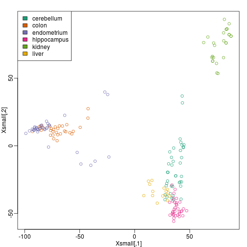
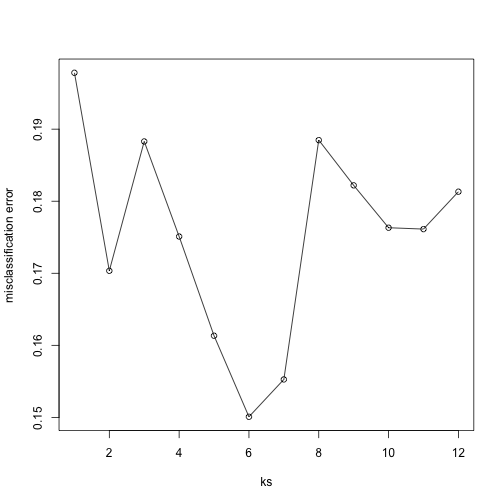
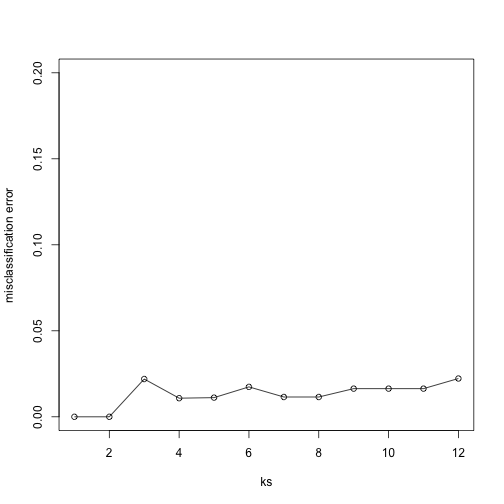

## Cross-validation

Here we describe *cross-validation*: one of the fundamental methods in machine learning for method assessment and picking parameters in a prediction or machine learning task. Suppose we have a set of observations with many features, and each observation is associated with a label. We will call this set we are given our training data. Our task is to predict the label of new samples by learning patterns in the many features. For a concrete example, let's consider gene expression values, where each gene acts as a feature, and we will be given a new set of unlabelled data (the test data) with the task of predicting the tissue type of the new samples.

If we choose a machine learning algorithm with a tunable parameter, we have to come up with a strategy for picking a good value for the parameter. We could try some values, and then just choose the one which performs the best on our training data, in terms of the number of errors the algorithm would make if we apply it to the samples we have been given for training. 

Let's see what this looks like, by loading the tissue gene expression dataset:


```r
library(tissuesGeneExpression)
data(tissuesGeneExpression)
```

For illustration purposes let's drop one of the tissues which doesn't have many samples:


```r
table(tissue)
```

```
## tissue
##  cerebellum       colon endometrium hippocampus      kidney       liver 
##          38          34          15          31          39          26 
##    placenta 
##           6
```

```r
ind <- which(tissue != "placenta")
y <- tissue[ind]
X <- t( e[,ind] )
```

Let's try out k-nearest neighbors for classification, using $$k=5$$. What is our average error in predicting the tissue in the training set, when we've used the same data for training and for testing?


```r
library(class)
pred <- knn(train =  X, test = X, cl=y, k=5)
mean(y != pred)
```

```
## [1] 0
```

We have no errors in prediction in the training set with $$k=5$$. What if we use $$k=1$$?


```r
pred <- knn(train=X, test=X, cl=y, k=1)
mean(y != pred)
```

```
## [1] 0
```

Trying to classify the same observations as we use to *train* the model can be very misleading. In fact, for k-nearest neighbors, using k=1 will always give 0 classification error in the training set, because we use the single observation to classify itself. The reliable way to get a sense of the performance of an algorithm is to make it give a prediction for a sample it has never seen. And similarly, if we want to know what the best value for a tunable parameter is, we need to see how different values of the paramter perform on samples which are not in the training data.

Cross-validation is a widely-used method in machine learning which solves this training and test data problem, while still using all the data for testing the predictive accuracy. It accomplishes this by splitting the data into a number of *folds*. If we have $$N$$ folds, then the first step of the algorithm is to train the algorithm using $$(N-1)$$ of the folds, and test the algorithm's accuracy on the single left-out fold. This is then repeated N times until each fold has been used as in the *test* set. If we have $$M$$ parameter settings to try out, then this is accomplished in an outer loop, so we have to fit the algorithm a total of $$N \times M$$ times.

We will use the `createFolds` function from the `caret` package to make 5 folds of our gene expression data, which are balanced over the tissues. Don't be confused that the `createFolds` function uses the same letter 'k' as the 'k' in k-nearest neighbors. These 'k' are totally unrelated. The caret function `createFolds` is asking for how many folds to create, the $$N$$ from above. The 'k' in the `knn` function is for how many closest observations to use in classifying a new sample. Here we will create 10 folds:


```r
library(caret)
set.seed(1)
idx <- createFolds(y, k=10)
idx
```

```
## $$Fold01
##  [1]   6   8  27  31  43  57  58  65  96 113 118 119 123 134 151 156 166
## [18] 171
## 
## $$Fold02
##  [1]  29  42  55  71  77  79  81  97 105 111 128 130 136 154 161 167 168
## [18] 180 181
## 
## $$Fold03
##  [1]  13  35  36  46  48  52  61  72  82  85  91 100 120 126 132 149 175
## 
## $$Fold04
##  [1]   4  18  19  30  47  59  74 101 108 110 122 140 142 147 150 179 182
## 
## $$Fold05
##  [1]   9  28  37  39  53  80  84  86  89  94  99 102 141 146 158 177 178
## [18] 183
## 
## $$Fold06
##  [1]   5  10  11  20  32  38  51  54  60  63  78 112 114 116 117 137 138
## [18] 139 162 163
## 
## $$Fold07
##  [1]   2  17  21  34  41  50  67  70  76  87  98 109 121 131 148 160 170
## [18] 173 176
## 
## $$Fold08
##  [1]   1   3  14  22  33  40  49  66  90  95 103 127 135 143 145 152 155
## [18] 165 169
## 
## $$Fold09
##  [1]   7  12  15  23  24  44  56  62  64  69  83  88  93 106 107 124 157
## [18] 159 172 174
## 
## $$Fold10
##  [1]  16  25  26  45  68  73  75  92 104 115 125 129 133 144 153 164
```

The folds are returned as a list of numeric indices. The first fold of data is therefore:


```r
y[idx[[1]]] ##the labels
```

```
##  [1] "kidney"      "kidney"      "hippocampus" "hippocampus" "hippocampus"
##  [6] "cerebellum"  "cerebellum"  "cerebellum"  "colon"       "colon"      
## [11] "colon"       "colon"       "kidney"      "kidney"      "endometrium"
## [16] "endometrium" "liver"       "liver"
```

```r
X[idx[[1]], 1:3] ##the genes (only showing the first 3 genes...)
```

```
##                  1007_s_at  1053_at   117_at
## GSM12075.CEL.gz   9.966782 6.060069 7.644452
## GSM12098.CEL.gz   9.945652 5.927861 7.847192
## GSM21214.cel.gz  10.955428 5.776781 7.493743
## GSM21218.cel.gz  10.757734 5.984170 8.525524
## GSM21230.cel.gz  11.496114 5.760156 7.787561
## GSM87086.cel.gz   9.798633 5.862426 7.279199
## GSM87087.cel.gz   9.758049 5.904910 7.382182
## GSM87094.cel.gz   9.753415 6.169774 7.338395
## GSM92250.CEL.gz  11.079038 6.662952 7.298781
## GSM92269.CEL.gz  10.646973 6.349878 7.584153
## GSM92274.CEL.gz  10.817390 6.210328 7.750246
## GSM92275.CEL.gz  10.391968 5.923316 8.042244
## GSM35981.cel.gz  10.697330 5.825616 8.596204
## GSM44675.CEL.gz  10.683256 6.225941 7.517055
## GSM296878.CEL.gz 10.626825 6.113875 7.404070
## GSM296883.CEL.gz 10.343827 6.115159 7.618541
## GSM298749.CEL.gz  8.746337 6.004847 8.885333
## GSM299113.CEL.gz  8.362492 6.072837 8.886452
```

We can see that in fact the tissues are fairly equally represented across the 10 folds:


```r
sapply(idx, function(i) table(y[i]))
```

```
##             Fold01 Fold02 Fold03 Fold04 Fold05 Fold06 Fold07 Fold08 Fold09
## cerebellum       3      4      4      4      4      4      4      4      4
## colon            4      3      3      3      4      4      3      3      4
## endometrium      2      2      1      1      1      2      1      2      2
## hippocampus      3      3      3      3      3      3      4      3      3
## kidney           4      4      3      4      4      4      4      4      4
## liver            2      3      3      2      2      3      3      3      3
##             Fold10
## cerebellum       3
## colon            3
## endometrium      1
## hippocampus      3
## kidney           4
## liver            2
```

Because tissues have very different gene expression profiles, predicting tissue with all genes will be very easy. For illustration purposes we will try to predict tissue type with just two dimensional data. We will reduce the dimension of our data using `cmdscale`:


```r
library(rafalib)
mypar()
Xsmall <- cmdscale(dist(X))
plot(Xsmall,col=as.fumeric(y))
legend("topleft",levels(factor(y)),fill=seq_along(levels(factor(y))))
```

 

Now we can try out the k-nearest neighbors method on a single fold. We provide the `knn` function with all the samples in `Xsmall` *except* those which are in the first fold. We remove these samples using the code `-idx[[1]]` inside the square brackets. We then use those samples in the test set. The `cl` argument is for the true classifications or labels (here, tissue) of the training data. We use 5 observations to classify in our k-nearest neighbor algorithm:


```r
pred <- knn(train=Xsmall[ -idx[[1]] , ], test=Xsmall[ idx[[1]], ], cl=y[ -idx[[1]] ], k=5)
table(true=y[ idx[[1]] ], pred)
```

```
##              pred
## true          cerebellum colon endometrium hippocampus kidney liver
##   cerebellum           2     0           0           1      0     0
##   colon                0     4           0           0      0     0
##   endometrium          0     0           1           0      1     0
##   hippocampus          1     0           0           2      0     0
##   kidney               0     0           0           0      4     0
##   liver                0     0           0           0      0     2
```

```r
mean(y[ idx[[1]] ] != pred)
```

```
## [1] 0.1666667
```

Now we have some misclassifications. How well do we do for the rest of the folds?


```r
for (i in 1:10) {
  pred <- knn(train=Xsmall[ -idx[[i]] , ], test=Xsmall[ idx[[i]], ], cl=y[ -idx[[i]] ], k=5)
  print(paste0(i,") error rate: ", round(mean(y[ idx[[i]] ] != pred),3)))
}
```

```
## [1] "1) error rate: 0.167"
## [1] "2) error rate: 0.105"
## [1] "3) error rate: 0.118"
## [1] "4) error rate: 0.118"
## [1] "5) error rate: 0.278"
## [1] "6) error rate: 0.05"
## [1] "7) error rate: 0.105"
## [1] "8) error rate: 0.211"
## [1] "9) error rate: 0.15"
## [1] "10) error rate: 0.312"
```

So we can see there is some variation for each fold, with errors rates hovering around 0.1-0.3. But is `k=5` the best setting for the k parameter? In order to explore the best setting for k, we need to create an outer loop, where we try different values for k, and then calculate the average test set error across all the folds.

We will try out each value of k from 1 to 12. Instead of using two `for` loops, we will use `sapply`:


```r
set.seed(1)
ks <- 1:12
res <- sapply(ks, function(k) {
  ##try out each version of k from 1 to 12
  res.k <- sapply(seq_along(idx), function(i) {
    ##loop over each of the 10 cross-validation folds
    ##predict the held-out samples using k nearest neighbors
    pred <- knn(train=Xsmall[ -idx[[i]], ],
                test=Xsmall[ idx[[i]], ],
                cl=y[ -idx[[i]] ], k = k)
    ##the ratio of misclassified samples
    mean(y[ idx[[i]] ] != pred)
  })
  ##average over the 10 folds
  mean(res.k)
})
```

Now, for each value of k, we have an associated test set error rate, from the cross-validation procedure.


```r
res
```

```
##  [1] 0.1978212 0.1703423 0.1882933 0.1750989 0.1613291 0.1500791 0.1552670
##  [8] 0.1884813 0.1822020 0.1763197 0.1761318 0.1813197
```

We can then plot the error rate for each value of k, which helps us to see in what region there might be a minimal error rate:


```r
plot(ks, res, type="o")
```

 

Remember, because the training set is a random sample, and because our fold-generation procedure involves random number generation, the "best" value of k we pick through this procedure is also a random variable. If we had new training data, and if we recreated our folds, we might get a different value for the optimal k.

Finally, to show that gene expression can perfectly predict tissue, we use 5 dimensions instead of 2, which results in perfect prediction:


```r
Xsmall <- cmdscale(dist(X),k=5)
set.seed(1)
ks <- 1:12
res <- sapply(ks, function(k) {
  res.k <- sapply(seq_along(idx), function(i) {
    pred <- knn(train=Xsmall[ -idx[[i]], ],
                test=Xsmall[ idx[[i]], ],
                cl=y[ -idx[[i]] ], k = k)
    mean(y[ idx[[i]] ] != pred)
  })
  mean(res.k)
})
plot(ks, res, type="o",ylim=c(0,0.20))
```

 

Important note: we applied `cmdscale` to the entire dataset to create
a smaller one for illustration purposes. However, in a real machine
learning application, this may result in an underestimation of test
set error for small sample sizes, where dimension reduction using the
unlabeled full dataset gives a boost in performance. A safer choice
would have been to transform the data separately for each fold, by
calculating a rotation and dimension reduction using the training set only
and applying this to the test set.
