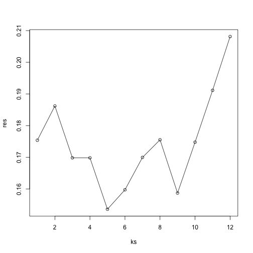

In this lab, we will explore a method for picking parameters in a
prediction / machine learning task, which is called
*cross-validation*.

Suppose we have a prediction algorithm which is going to predict the
class of some observations using a number of features. For example, we
will use the gene expression values to predict the tissue type in our
tissues gene expression dataset.

If this algorithm has a parameter which controls the behavior, we
might pick the value of this parameter which minimizes the
classification error. However, trying to classify the same
observations as we use to *train* the model can be misleading.
In lecture, we saw that for K-nearest neighbors, using k=1 will always
give 0 classification error in the training set (because we use the
single observation to classify itself). Instead, it's better to pick
the parameter using the algorithms performance on a set of
observations which the algorithm has never seen, a *test* set.

Cross-validation is simply a method which splits the data into a
number of *folds*. If we have N folds, then the algorithm typically
trains on (N-1) of the folds, and test the algorithms performance on
the left-out single fold. This is then repeated N times until each
fold has been used as a *test* set.

Let's load in the tissue gene expression dataset:


```r
# library(devtools) install_github('dagdata','genomicsclass')
library(dagdata)
data(tissuesGeneExpression)
library(Biobase)
```

```
## Loading required package: BiocGenerics
## Loading required package: methods
## Loading required package: parallel
## 
## Attaching package: 'BiocGenerics'
## 
## The following objects are masked from 'package:parallel':
## 
##     clusterApply, clusterApplyLB, clusterCall, clusterEvalQ,
##     clusterExport, clusterMap, parApply, parCapply, parLapply,
##     parLapplyLB, parRapply, parSapply, parSapplyLB
## 
## The following object is masked from 'package:stats':
## 
##     xtabs
## 
## The following objects are masked from 'package:base':
## 
##     anyDuplicated, append, as.data.frame, as.vector, cbind,
##     colnames, do.call, duplicated, eval, evalq, Filter, Find, get,
##     intersect, is.unsorted, lapply, Map, mapply, match, mget,
##     order, paste, pmax, pmax.int, pmin, pmin.int, Position, rank,
##     rbind, Reduce, rep.int, rownames, sapply, setdiff, sort,
##     table, tapply, union, unique, unlist
## 
## Welcome to Bioconductor
## 
##     Vignettes contain introductory material; view with
##     'browseVignettes()'. To cite Bioconductor, see
##     'citation("Biobase")', and for packages 'citation("pkgname")'.
```

```r
rownames(tab) <- tab$filename
t <- ExpressionSet(e, AnnotatedDataFrame(tab))
t$Tissue <- factor(t$Tissue)
colnames(t) <- paste0(t$Tissue, seq_len(ncol(t)))
```


Let's drop one of the tissues which doesn't have many samples:


```r
library(class)
table(t$Tissue)
```

```
## 
##  cerebellum       colon endometrium hippocampus      kidney       liver 
##          38          34          15          31          39          26 
##    placenta 
##           6
```

```r
t <- t[, t$Tissue != "placenta"]
t$Tissue <- droplevels(t$Tissue)
table(t$Tissue)
```

```
## 
##  cerebellum       colon endometrium hippocampus      kidney       liver 
##          38          34          15          31          39          26
```

```r
x <- t(exprs(t))
```


We will use the `createFolds` function from the `caret` 
package to make 5 folds of the data, which are
balanced over the tissues. Don't be confused that the 
`createFolds` function uses the same letter 'k' as the k in 
K-nearest neighbors. These 'k' are unrelated. 
The caret function `createFolds` is
asking for how many folds to create, the 'N' from above. The `knn`
function is asking how many closest observations to use to classify
the test observations.


```r
# install.packages('caret')
library(caret)
```

```
## Loading required package: lattice
## Loading required package: ggplot2
```

```r
set.seed(1)
idx <- createFolds(t$Tissue, k = 5)
sapply(idx, function(i) table(t$Tissue[i]))
```

```
##             Fold1 Fold2 Fold3 Fold4 Fold5
## cerebellum      7     8     7     8     8
## colon           6     7     7     7     7
## endometrium     3     3     3     3     3
## hippocampus     6     6     6     7     6
## kidney          8     8     8     8     7
## liver           5     6     5     5     5
```


Now we can try out the K-nearest neighbors method on a single fold:


```r
pred <- knn(train = x[-idx[[1]], ], test = x[idx[[1]], ], cl = t$Tissue[-idx[[1]]], 
    k = 5)
table(true = t$Tissue[idx[[1]]], pred)
```

```
##              pred
## true          cerebellum colon endometrium hippocampus kidney liver
##   cerebellum           7     0           0           0      0     0
##   colon                0     6           0           0      0     0
##   endometrium          0     0           3           0      0     0
##   hippocampus          0     0           0           6      0     0
##   kidney               0     0           0           0      8     0
##   liver                0     0           0           0      0     5
```


As the prediction is looking too good in the space of all the genes,
let's make it more difficult for the K-nearest neighbors algorithm.
We will use a reduced dimension representation of the dataset, using
the *multi-dimensional scaling* algorithm used in the previous section.


```r
xsmall <- cmdscale(dist(x))
```


Now we will create a loop, which tries out each value of k from 1 to
12, and runs the K-nearest neighbors algorithm on each fold. We then
ask for the proportion of errors for each fold, and report the average
from the 5 cross-validation folds:


```r
set.seed(1)
ks <- 1:12
res <- sapply(ks, function(k) {
    # try out each version of k from 1 to 12
    
    res.k <- sapply(seq_along(idx), function(i) {
        # loop over each of the 5 cross-validation folds
        
        # predict the held-out samples using k nearest neighbors
        pred <- knn(train = xsmall[-idx[[i]], ], test = xsmall[idx[[i]], ], 
            cl = t$Tissue[-idx[[i]]], k = k)
        
        # the ratio of misclassified samples
        mean(t$Tissue[idx[[i]]] != pred)
    })
    
    # average over the 5 folds
    mean(res.k)
})
```


Now we can plot the mean misclassification rate for each value of k:


```r
plot(ks, res, type = "o")
```

 

