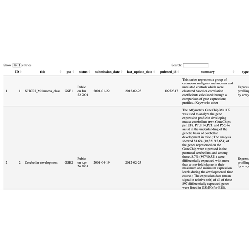
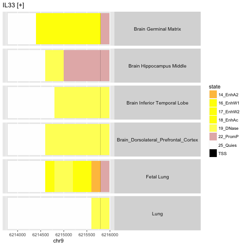
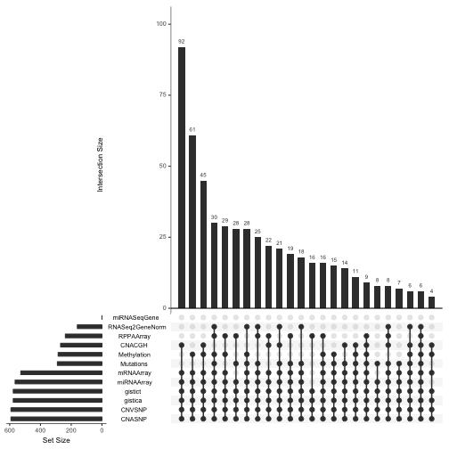

# Introduction

Data management is often regarded as a specialized and tedious
dimension of scientific research.  Because failures of data management
are extremely costly in terms of resources and reputation, highly
reliable and efficient methods are essential.
Customary lab science practice of maintaining data
in spreadsheets is regarded as risky.  We want to add value
to data by making it easier to follow
reliable data management practices.

In Bioconductor, principles that guide software development are
applied in data management strategy.  High value accrues to
data structures that are modular and extensible.  Packaging
and version control protocols apply to data class definitions.
We will motivate and illustrate these ideas by giving examples
of transforming spreadsheets to semantically rich objects,
working with the NCBI GEO archive, dealing with families of
BAM and BED files, and using external storage to foster
coherent interfaces to large multiomic archives like TCGA.

<a name="coord"></a>

# Coordinating information from diverse tables, gains from integration

## A demonstration package: tables from GSE5859Subset

GSE5859Subset is a package with expression data derived from
a study of genetics of gene expression.  Upon attachment and
loading of package data, we have three data elements:

```r
library(GSE5859Subset)
data(GSE5859Subset)
dim(geneExpression)
```

```
## [1] 8793   24
```

```r
dim(geneAnnotation)
```

```
## [1] 8793    4
```

```r
dim(sampleInfo)
```

```
## [1] 24  4
```

How are these entities (one matrix and two data frames) related?

```r
all.equal(sampleInfo$filename, colnames(geneExpression))
```

```
## [1] TRUE
```

```r
all.equal(rownames(geneExpression), geneAnnotation$PROBEID)
```

```
## [1] TRUE
```
Informally, we can think of `sampleInfo$filename` as a key
for joining, row by row, the sample information table with a _transposed
image_ of the gene expression table.  The `colnames` of the
gene expression matrix link the columns of that matrix to samples
enumerated in rows of `sampleInfo`.

Likewise, the `rownames` of `geneExpression` coincide exactly
with the `PROBEID` field of `geneAnnotation`.

```r
options(digits=2)
cbind(sampleInfo[1:3,], colnames(geneExpression)[1:3], 
    t(geneExpression)[1:3,1:4])
```

```
##     ethnicity       date         filename group
## 107       ASN 2005-06-23 GSM136508.CEL.gz     1
## 122       ASN 2005-06-27 GSM136530.CEL.gz     1
## 113       ASN 2005-06-27 GSM136517.CEL.gz     1
##     colnames(geneExpression)[1:3] 1007_s_at 1053_at 117_at 121_at
## 107              GSM136508.CEL.gz       6.5     7.5    5.4    7.9
## 122              GSM136530.CEL.gz       6.4     7.3    5.1    7.7
## 113              GSM136517.CEL.gz       6.3     7.2    5.0    7.5
```

<a name="exprset"></a>

## Binding the tables together in an ExpressionSet

The `ExpressionSet` container manages all this information
in one object.  To improve the visibility of nomenclature
for genes and samples, we improve the annotation for
the individual components.

```r
rownames(sampleInfo) = sampleInfo$filename
rownames(geneAnnotation) = geneAnnotation$PROBEID
```
Now we make the `ExpressionSet`.

```r
library(Biobase)
es5859 = ExpressionSet(assayData=geneExpression)
pData(es5859) = sampleInfo
fData(es5859) = geneAnnotation
es5859
```

```
## ExpressionSet (storageMode: lockedEnvironment)
## assayData: 8793 features, 24 samples 
##   element names: exprs 
## protocolData: none
## phenoData
##   sampleNames: GSM136508.CEL.gz GSM136530.CEL.gz ...
##     GSM136572.CEL.gz (24 total)
##   varLabels: ethnicity date filename group
##   varMetadata: labelDescription
## featureData
##   featureNames: 1007_s_at 1053_at ... AFFX-r2-P1-cre-5_at (8793
##     total)
##   fvarLabels: PROBEID CHR CHRLOC SYMBOL
##   fvarMetadata: labelDescription
## experimentData: use 'experimentData(object)'
## Annotation:
```

One of the nice things about this arrangement is that
we can easily select features using higher level
concepts annotated in the `fData` and `pData` components.
For example to obtain expression data for genes on the Y
chromosome only:

```r
es5859[which(fData(es5859)$CHR=="chrY"),]
```

```
## ExpressionSet (storageMode: lockedEnvironment)
## assayData: 21 features, 24 samples 
##   element names: exprs 
## protocolData: none
## phenoData
##   sampleNames: GSM136508.CEL.gz GSM136530.CEL.gz ...
##     GSM136572.CEL.gz (24 total)
##   varLabels: ethnicity date filename group
##   varMetadata: labelDescription
## featureData
##   featureNames: 201909_at 204409_s_at ... 211149_at (21 total)
##   fvarLabels: PROBEID CHR CHRLOC SYMBOL
##   fvarMetadata: labelDescription
## experimentData: use 'experimentData(object)'
## Annotation:
```

The full set of methods to which ExpressionSet instances respond
can be seen using

```r
methods(class="ExpressionSet")
```

```
##  [1] [                [[               [[<-             $$               
##  [5] $$<-              abstract         annotation       annotation<-    
##  [9] as.data.frame    as.matrix        assayData        assayData<-     
## [13] classVersion     classVersion<-   coerce           combine         
## [17] description      description<-    dim              dimnames        
## [21] dimnames<-       dims             esApply          experimentData  
## [25] experimentData<- exprs            exprs<-          fData           
## [29] fData<-          featureData      featureData<-    featureNames    
## [33] featureNames<-   fvarLabels       fvarLabels<-     fvarMetadata    
## [37] fvarMetadata<-   initialize       isCurrent        isVersioned     
## [41] KEGG2heatmap     KEGGmnplot       makeDataPackage  notes           
## [45] notes<-          pData            pData<-          phenoData       
## [49] phenoData<-      preproc          preproc<-        protocolData    
## [53] protocolData<-   pubMedIds        pubMedIds<-      rowMedians      
## [57] rowQ             sampleNames      sampleNames<-    show            
## [61] storageMode      storageMode<-    updateObject     updateObjectTo  
## [65] varLabels        varLabels<-      varMetadata      varMetadata<-   
## [69] write.exprs     
## see '?methods' for accessing help and source code
```
The most important methods are 

- `exprs()`: get the numerical expression values
- `pData()`: get the sample-level data
- `fData()`: get feature-level data
- `annotation()`: get a tag that identifies nomenclature for feature names
- `experimentData()`: get a [MIAME](https://www.ncbi.nlm.nih.gov/geo/info/MIAME.html)-compliant metadata structure

Note that many methods have `setter` versions, e.g., `exprs<-` can be used
to assign expression values.  Also, all components are optional.  Thus our `es5859`
has no content for `annotation` or `experimentData`.  We can improve the
self-describing capacity of this object as follows.  First, set the annotation field:

```r
annotation(es5859) = "hgfocus.db" # need to look at GSE record in GEO, and know .db
```
Second, acquire a MIAME-compliant document of metadata about the experiment.

```r
library(annotate)
mi = pmid2MIAME("17206142")
experimentData(es5859) = mi
es5859
```

```
## ExpressionSet (storageMode: lockedEnvironment)
## assayData: 8793 features, 24 samples 
##   element names: exprs 
## protocolData: none
## phenoData
##   sampleNames: GSM136508.CEL.gz GSM136530.CEL.gz ...
##     GSM136572.CEL.gz (24 total)
##   varLabels: ethnicity date filename group
##   varMetadata: labelDescription
## featureData
##   featureNames: 1007_s_at 1053_at ... AFFX-r2-P1-cre-5_at (8793
##     total)
##   fvarLabels: PROBEID CHR CHRLOC SYMBOL
##   fvarMetadata: labelDescription
## experimentData: use 'experimentData(object)'
##   pubMedIds: 17206142 
## Annotation: hgfocus.db
```
Now, for example, the `abstract` method will function well:

```r
nchar(abstract(es5859))
```

```
## [1] 1057
```

```r
substr(abstract(es5859),1,50)
```

```
## [1] "Variation in DNA sequence contributes to individua"
```

A more up-to-date approach to combining these table types
uses the `SummarizedExperiment` class, that we discuss below.

<a name="endo"></a>

## The endomorphism concept

A final remark about the ExpressionSet container design:  Suppose
`X` is an ExpressionSet.  The bracket operator has been defined so
that whenever `G` and `S` are suitable vectors identifying features
and samples respectively, `X[G, S]` is an ExpressionSet with features
and samples restricted to those identified in `G` and `S`.  All operations
that are valid for `X` are valid for `X[G, S]`.  This property is
called the _endomorphism of ExpressionSet with respect to subsetting
with bracket_.


<a name="geoquery"></a>

# GEO, GEOquery, ArrayExpress for expression array archives

Data from all microarray experiments funded by USA National Institutes
of Health should be deposited in the Gene Expression Omnibus (GEO).
Bioconductor's *[GEOquery](http://bioconductor.org/packages/GEOquery)* package simplifies
harvesting of this archive.  The European Molecular Biology Laboratories
sponsor ArrayExpress, which can be queried using the *[ArrayExpress](http://bioconductor.org/packages/ArrayExpress)*
package.

## GEOmetadb

There are results of tens of thousands of experiments in GEO.
The *[GEOmetadb](http://bioconductor.org/packages/GEOmetadb)* includes tools to acquire and
query a SQLite database with extensive annotation of GEO contents.
The database retrieved in October 2017 was over 6 GB in size.
Thus we do not require that you use this package.  If you are
interested, the vignette is very thorough.  A view of the
`gse` table is given here:



## getGEO: obtaining the ExpressionSet for a GEO series

We have an especial interest in the genomics of glioblastoma
and have identified a paper (PMID 27746144) addressing a metabolic pathway
whose manipulation may enhance treatment development strategies.
Affymetrix Primeview arrays were used,
with quantifications available in GEO.  We use `getGEO`
to acquire an image of these data.

```r
library(GEOquery)
glioMA = getGEO("GSE78703")[[1]]
```

```
## Found 1 file(s)
```

```
## GSE78703_series_matrix.txt.gz
```

```
## Warning: attributes are not identical across measure variables;
## they will be dropped
```

```
## Parsed with column specification:
## cols(
##   ID_REF = col_character(),
##   GSM2072905 = col_double(),
##   GSM2072906 = col_double(),
##   GSM2072907 = col_double(),
##   GSM2072908 = col_double(),
##   GSM2072909 = col_double(),
##   GSM2072910 = col_double(),
##   GSM2072911 = col_double(),
##   GSM2072912 = col_double(),
##   GSM2072913 = col_double(),
##   GSM2072914 = col_double(),
##   GSM2072915 = col_double(),
##   GSM2072916 = col_double()
## )
```

```
## File stored at:
```

```
## /var/folders/5_/14ld0y7s0vbg_z0g2c9l8v300000gr/T//Rtmp8uKiZA/GPL15207.soft
```

```r
glioMA
```

```
## ExpressionSet (storageMode: lockedEnvironment)
## assayData: 49395 features, 12 samples 
##   element names: exprs 
## protocolData: none
## phenoData
##   sampleNames: GSM2072905 GSM2072906 ... GSM2072916 (12 total)
##   varLabels: title geo_accession ... treated with:ch1 (34 total)
##   varMetadata: labelDescription
## featureData
##   featureNames: 11715100_at 11715101_s_at ... AFFX-TrpnX-M_at
##     (49395 total)
##   fvarLabels: ID GeneChip Array ... SPOT_ID (24 total)
##   fvarMetadata: Column Description labelDescription
## experimentData: use 'experimentData(object)'
## Annotation: GPL15207
```
In exercises we will see how to use this object
to check on the assertion that treatment with LXR-623
affects expression of gene ABCA1.  The associated PubMed ID is 27746144.

<a name="arrayexp"></a>

## ArrayExpress: searching and harvesting from EMBL-EBI ArrayExpress

``The [ArrayExpress Archive of Functional Genomics Data](https://www.ebi.ac.uk/arrayexpress/)
stores 
data from high-throughput functional genomics experiments, and provides 
these data for reuse to the research community.''  Until recently ArrayExpress
imported all expression data from NCBI GEO.

The *[ArrayExpress](http://bioconductor.org/packages/ArrayExpress)* permits direct interrogation
of the EMBL-EBI archive, with `queryAE`.  We'll examine
a small subset of the results.


```r
library(ArrayExpress)
sets = queryAE(keywords = "glioblastoma", species = "homo+sapiens")
dim(sets)
```

```
## [1] 518   8
```

```r
sets[5:7,-c(7,8)]
```

```
##                      ID Raw Processed ReleaseDate PubmedID      Species
## E-MTAB-4898 E-MTAB-4898 yes        no  2017-07-05       NA Homo sapiens
## E-MTAB-3258 E-MTAB-3258  no        no  2017-06-29       NA Homo sapiens
## E-MTAB-5797 E-MTAB-5797 yes        no  2017-06-24 28638988 Homo sapiens
```

We see a PubMed ID for one of the experiments retrieved here, and
acquire the raw data with the `getAE` function.


```r
initdir = dir()
if (!file.exists("E-MTAB-5797.sdrf.txt")) nano = getAE("E-MTAB-5797")
```

```
## Copying raw data files
```

```
## Unpacking data files
```

This particular invocation will populate the working
directory with files related to the experiment:
```
afterget = dir()
setdiff(afterget, initdir)
##  [1] "9406922003_R01C01_Grn.idat" "9406922003_R01C01_Red.idat"
##  [3] "9406922003_R02C01_Grn.idat" "9406922003_R02C01_Red.idat"
##  [5] "9406922003_R03C02_Grn.idat" "9406922003_R03C02_Red.idat"
##  [7] "9406922003_R04C02_Grn.idat" "9406922003_R04C02_Red.idat"
##  [9] "9406922003_R05C01_Grn.idat" "9406922003_R05C01_Red.idat"
## [11] "A-MEXP-2255.adf.txt"        "E-MTAB-5797.idf.txt"       
## [13] "E-MTAB-5797.raw.1.zip"      "E-MTAB-5797.sdrf.txt"
```

Below we will demonstrate import and inspection of this data.

<a name="summexp"></a>

# SummarizedExperiment: accommodating more diverse feature concepts

In the microarray era, assay targets were determined by the
content of the array in use.  
Greater flexibility for targeted
quantification is afforded by short read sequencing methods.
Consequently, Bioconductor developers created a more flexible
container for genome-scale assays.  A key idea is that
quantified features of interested may be identified only
by genomic coordinates.  It should be convenient to organize
the assay values to permit interrogation using genomic coordinates
only.  The general method `subsetByOverlaps` can be used
with SummarizedExperiment instances, and accomplishes this aim.

## General considerations

The methods table for SummarizedExperiment is longer than that
for ExpressionSet:

```r
methods(class="SummarizedExperiment")
```

```
##   [1] !=                [                 [[               
##   [4] [[<-              [<-               %in%             
##   [7] <                 <=                ==               
##  [10] >                 >=                $$                
##  [13] $$<-               aggregate         anyNA            
##  [16] append            as.character      as.complex       
##  [19] as.data.frame     as.env            as.integer       
##  [22] as.list           as.logical        as.matrix        
##  [25] as.numeric        as.raw            assay            
##  [28] assay<-           assayNames        assayNames<-     
##  [31] assays            assays<-          by               
##  [34] cbind             coerce            coerce<-         
##  [37] colData           colData<-         countOverlaps    
##  [40] dim               dimnames          dimnames<-       
##  [43] duplicated        elementMetadata   elementMetadata<-
##  [46] eval              expand            expand.grid      
##  [49] extractROWS       findOverlaps      head             
##  [52] intersect         is.na             length           
##  [55] lengths           match             mcols            
##  [58] mcols<-           merge             metadata         
##  [61] metadata<-        mstack            names            
##  [64] names<-           NROW              overlapsAny      
##  [67] parallelSlotNames pcompare          rank             
##  [70] rbind             realize           relist           
##  [73] rename            rep               rep.int          
##  [76] replaceROWS       rev               rowData          
##  [79] rowData<-         ROWNAMES          rowRanges<-      
##  [82] seqlevelsInUse    setdiff           setequal         
##  [85] shiftApply        show              sort             
##  [88] split             split<-           subset           
##  [91] subsetByOverlaps  table             tail             
##  [94] tapply            transform         union            
##  [97] unique            updateObject      values           
## [100] values<-          window            window<-         
## [103] with              xtabs            
## see '?methods' for accessing help and source code
```

Analogs of the key ExpressionSet methods are:

- `assay()`: get the primary numerical assay quantifications, but note that multiple assays are supported and a list of assays can be acquired using `assays()`
- `colData()`: get the sample-level data
- `rowData()`: get feature-level data, with `rowRanges()` applicable when features are identified primarily through genomic coordinates
- `metadata()`: get a list that may hold any relevant metadata about the experiment

<a name="rnaseq"></a>

## An RNA-seq experiment

We'll use the *[airway](http://bioconductor.org/packages/airway)* package to illustrate the
SummarizedExperiment concept.

```r
library(airway)
data(airway)
airway
```

```
## class: RangedSummarizedExperiment 
## dim: 64102 8 
## metadata(1): ''
## assays(1): counts
## rownames(64102): ENSG00000000003 ENSG00000000005 ... LRG_98 LRG_99
## rowData names(0):
## colnames(8): SRR1039508 SRR1039509 ... SRR1039520 SRR1039521
## colData names(9): SampleName cell ... Sample BioSample
```
Metadata are available in a list.

```r
metadata(airway)
```

```
## [[1]]
## Experiment data
##   Experimenter name: Himes BE 
##   Laboratory: NA 
##   Contact information:  
##   Title: RNA-Seq transcriptome profiling identifies CRISPLD2 as a glucocorticoid responsive gene that modulates cytokine function in airway smooth muscle cells. 
##   URL: http://www.ncbi.nlm.nih.gov/pubmed/24926665 
##   PMIDs: 24926665 
## 
##   Abstract: A 226 word abstract is available. Use 'abstract' method.
```

The matrix of quantified features has dimensions 64102 by
8.  The features that are quantified are exons, annotated
using ENSEMBL nomenclature.

```r
rowRanges(airway)
```

```
## GRangesList object of length 64102:
## $$ENSG00000000003 
## GRanges object with 17 ranges and 2 metadata columns:
##        seqnames               ranges strand |   exon_id       exon_name
##           <Rle>            <IRanges>  <Rle> | <integer>     <character>
##    [1]        X [99883667, 99884983]      - |    667145 ENSE00001459322
##    [2]        X [99885756, 99885863]      - |    667146 ENSE00000868868
##    [3]        X [99887482, 99887565]      - |    667147 ENSE00000401072
##    [4]        X [99887538, 99887565]      - |    667148 ENSE00001849132
##    [5]        X [99888402, 99888536]      - |    667149 ENSE00003554016
##    ...      ...                  ...    ... .       ...             ...
##   [13]        X [99890555, 99890743]      - |    667156 ENSE00003512331
##   [14]        X [99891188, 99891686]      - |    667158 ENSE00001886883
##   [15]        X [99891605, 99891803]      - |    667159 ENSE00001855382
##   [16]        X [99891790, 99892101]      - |    667160 ENSE00001863395
##   [17]        X [99894942, 99894988]      - |    667161 ENSE00001828996
## 
## ...
## <64101 more elements>
## -------
## seqinfo: 722 sequences (1 circular) from an unspecified genome
```

We may be accustomed to gene-level quantification in microarray studies.
Here the use of exon-level quantifications necessitates
special computations
for gene-level summaries.  For example, gene ORMDL3 has ENSEMBL
identifier ENSG00000172057.  The coordinates supplied in this
SummarizedExperiment are

```r
rowRanges(airway)$ENSG00000172057
```

```
## GRanges object with 20 ranges and 2 metadata columns:
##        seqnames               ranges strand |   exon_id       exon_name
##           <Rle>            <IRanges>  <Rle> | <integer>     <character>
##    [1]       17 [38077294, 38078938]      - |    549057 ENSE00001316037
##    [2]       17 [38077296, 38077570]      - |    549058 ENSE00002684279
##    [3]       17 [38077929, 38078002]      - |    549059 ENSE00002697088
##    [4]       17 [38078351, 38078552]      - |    549060 ENSE00002718599
##    [5]       17 [38078530, 38078938]      - |    549061 ENSE00001517665
##    ...      ...                  ...    ... .       ...             ...
##   [16]       17 [38081876, 38083094]      - |    549072 ENSE00001517669
##   [17]       17 [38082049, 38082592]      - |    549073 ENSE00002700064
##   [18]       17 [38083070, 38083099]      - |    549074 ENSE00002688012
##   [19]       17 [38083320, 38083482]      - |    549075 ENSE00002700595
##   [20]       17 [38083737, 38083854]      - |    549076 ENSE00001283878
##   -------
##   seqinfo: 722 sequences (1 circular) from an unspecified genome
```
We will look closely at the *[GenomicRanges](http://bioconductor.org/packages/GenomicRanges)* infrastructure
for working with structures like this.  To check for the existence of
overlapping regions in this list of exon coordinates, we can use the
`reduce` method:

```r
reduce(rowRanges(airway)$ENSG00000172057)
```

```
## GRanges object with 8 ranges and 0 metadata columns:
##       seqnames               ranges strand
##          <Rle>            <IRanges>  <Rle>
##   [1]       17 [38077294, 38078938]      -
##   [2]       17 [38079365, 38079516]      -
##   [3]       17 [38080283, 38080478]      -
##   [4]       17 [38081008, 38081058]      -
##   [5]       17 [38081422, 38081624]      -
##   [6]       17 [38081876, 38083099]      -
##   [7]       17 [38083320, 38083482]      -
##   [8]       17 [38083737, 38083854]      -
##   -------
##   seqinfo: 722 sequences (1 circular) from an unspecified genome
```

This shows that projecting from the set of exons to the genome leads to
8 regions
harboring subregions that may be transcribed.
Details on how to summarize such counts to gene level are
available [elsewhere in the genomicsclass book.](http://genomicsclass.github.io/book/pages/rnaseq_gene_level.html)

In addition to detailed annotation of
features, we need to manage information on samples.
This occurs using the `colData` method.
The `$` operator can be used as a shortcut to get
columns out of the sample data store.

```r
names(colData(airway))
```

```
## [1] "SampleName" "cell"       "dex"        "albut"      "Run"       
## [6] "avgLength"  "Experiment" "Sample"     "BioSample"
```

```r
table(airway$dex) # main treatment factor
```

```
## 
##   trt untrt 
##     4     4
```

<a name="methy"></a>

## Handling the ArrayExpress deposit of Illumina 450k Methylation arrays

The SummarizedExperiment class was designed for use with all kinds
of array or short read sequencing data.  The `getAE` call used
above retrieved a number of files from ArrayExpress recording
methylation quantification in glioblastoma tissues.

The sample level data are in the `sdrf.txt` file:

```r
library(data.table)
sd5797 = fread("E-MTAB-5797.sdrf.txt")
head(sd5797[,c(3,16,18)])
```

```
##    Characteristics[age] Label                   Performer
## 1:                   58   Cy3 IntegraGen SA, Evry, France
## 2:                   58   Cy5 IntegraGen SA, Evry, France
## 3:                   72   Cy3 IntegraGen SA, Evry, France
## 4:                   72   Cy5 IntegraGen SA, Evry, France
## 5:                   70   Cy3 IntegraGen SA, Evry, France
## 6:                   70   Cy5 IntegraGen SA, Evry, France
```

The raw assay data are delivered in `idat` files.  We
import these using `read.metharray()` from the *[minfi](http://bioconductor.org/packages/minfi)* package.

```r
library(minfi)
pref = unique(substr(dir(patt="idat"),1,17)) # find the prefix strings
raw = read.metharray(pref)
raw
```

```
## class: RGChannelSet 
## dim: 622399 5 
## metadata(0):
## assays(2): Green Red
## rownames(622399): 10600313 10600322 ... 74810490 74810492
## rowData names(0):
## colnames(5): 9406922003_R01C01 9406922003_R02C01 9406922003_R03C02
##   9406922003_R04C02 9406922003_R05C01
## colData names(0):
## Annotation
##   array: IlluminaHumanMethylation450k
##   annotation: ilmn12.hg19
```

A number of algorithms have been proposed to transform
the raw measures into biologically interpretable measures
of relative methylation.  Here we use a quantile normalization
algorithm to transform the red and green signals to measures
of relative methylation (M) and estimates of local copy number (CN)
in a SummarizedExperiment instance.

```r
glioMeth = preprocessQuantile(raw) # generate SummarizedExperiment
```

```
## [preprocessQuantile] Mapping to genome.
```

```
## [preprocessQuantile] Fixing outliers.
```

```
## [preprocessQuantile] Quantile normalizing.
```

```r
glioMeth
```

```
## class: GenomicRatioSet 
## dim: 485512 5 
## metadata(0):
## assays(2): M CN
## rownames(485512): cg13869341 cg14008030 ... cg08265308 cg14273923
## rowData names(0):
## colnames(5): 9406922003_R01C01 9406922003_R02C01 9406922003_R03C02
##   9406922003_R04C02 9406922003_R05C01
## colData names(1): predictedSex
## Annotation
##   array: IlluminaHumanMethylation450k
##   annotation: ilmn12.hg19
## Preprocessing
##   Method: Raw (no normalization or bg correction)
##   minfi version: 1.23.3
##   Manifest version: 0.4.0
```

Later in the course we will work on the interpretation of
the samples obtained in this study.

<a name="extern"></a>

# External storage of large assay data -- HDF5Array, saveHDF5SummarizedExperiment

<a name="memmeas"></a>

## Measuring memory consumption 

In typical interactive use, R data are fully resident in memory.
We can use the `gc` function to get estimates of quantity of
memory used in a session.  Space devoted to Ncells is used to
deal with language constructs such as parse trees and namespaces,
while space devoted to Vcells is used to store numerical and character
data loaded in the session.  On my macbook air, a vanilla startup
of R yields
```
> gc()
         used (Mb) gc trigger (Mb) max used (Mb)
Ncells 255849 13.7     460000 24.6   350000 18.7
Vcells 533064  4.1    1023718  7.9   908278  7.0
```
After loading the *[airway](http://bioconductor.org/packages/airway)* package:
```
> suppressMessages({library(airway)})
> gc()
          used  (Mb) gc trigger  (Mb) max used  (Mb)
Ncells 2772615 148.1    3886542 207.6  3205452 171.2
Vcells 2302579  17.6    3851194  29.4  3651610  27.9
```
After we load the `airway` SummarizedExperiment instance
```
> data(airway)
> gc()
          used  (Mb) gc trigger  (Mb) max used  (Mb)
Ncells 3594720 192.0    5684620 303.6  3594935 192.0
Vcells 6690732  51.1    9896076  75.6  6953991  53.1
> dim(airway)
[1] 64102     8
```
The memory to be managed will grow as the number of resources
made available for interaction increases.  The functions
`rm()` and `gc()` can be used manually to reduce memory consumption
but this is seldom necessary or efficient.

<a name="externHDF5"></a>

## Demonstrating HDF5 for external storage

[HDF5](https://en.wikipedia.org/wiki/Hierarchical_Data_Format) is a
widely used data model for numerical arrays, with interfaces
defined for a wide variety of scientific programming languages.
The *[HDF5Array](http://bioconductor.org/packages/HDF5Array)* package simplifies use of this
system for managing large numerical arrays.


```r
library(airway)
library(HDF5Array)  # setup for external serialization
```

```
## Loading required package: rhdf5
```

```r
data(airway)
airass = assay(airway)  # obtain numerical data, then save as HDF5
href = writeHDF5Array(airass, "airass.h5", "airway")
```
Now when we acquire access to the same numerical data,
there is no growth in memory consumption:
```
> gc()  # after attaching HDF5Array package
          used (Mb) gc trigger  (Mb) max used (Mb)
Ncells 1272290 68.0    2164898 115.7  1495687 79.9
Vcells 1539420 11.8    2552219  19.5  1938513 14.8
> myd = HDF5Array("airass.h5", "airway")  # get reference to data
> gc()
          used (Mb) gc trigger  (Mb) max used (Mb)
Ncells 1277344 68.3    2164898 115.7  1495687 79.9
Vcells 1543344 11.8    2552219  19.5  1938513 14.8
> dim(myd)
[1] 64102     8
```
This is all well and good, but it is more useful to
interact with the airway data through a SummarizedExperiment
container, as we will now show.

<a name="HDF5SE"></a>

## HDF5-backed SummarizedExperiment

Given a SummarizedExperiment, `saveHDF5SummarizedExperiment`
arranges the data and metadata together, allowing
control of memory consumption while preserving rich
semantics of the container.


```r
saveHDF5SummarizedExperiment(airway, "externalAirway", replace=TRUE)
newse = loadHDF5SummarizedExperiment("externalAirway")
newse
```

```
## class: RangedSummarizedExperiment 
## dim: 64102 8 
## metadata(1): ''
## assays(1): counts
## rownames(64102): ENSG00000000003 ENSG00000000005 ... LRG_98 LRG_99
## rowData names(0):
## colnames(8): SRR1039508 SRR1039509 ... SRR1039520 SRR1039521
## colData names(9): SampleName cell ... Sample BioSample
```

```r
assay(newse[c("ENSG00000000005", "LRG_99"), 
        which(newse$dex == "trt")]) # use familiar subsetting
```

```
## DelayedMatrix object of 2 x 4 integers:
##                 SRR1039509 SRR1039513 SRR1039517 SRR1039521
## ENSG00000000005          0          0          0          0
## LRG_99                   0          0          0          0
```
In this case the overhead of dealing with the SummarizedExperiment
metadata wipes out the advantage of externalizing the assay data.
```
> gc() # after loading SummarizedExperiment
          used  (Mb) gc trigger  (Mb) max used  (Mb)
Ncells 2802892 149.7    3886542 207.6  3205452 171.2
Vcells 2334204  17.9    3851194  29.4  3625311  27.7
> newse = loadHDF5SummarizedExperiment("externalAirway")
> gc()
          used  (Mb) gc trigger  (Mb) max used  (Mb)
Ncells 3754945 200.6    5684620 303.6  3972131 212.2
Vcells 6669078  50.9   10201881  77.9  6962256  53.2
```
For very large assay arrays, the HDF5-backed SummarizedExperiment
permits flexible computation with data that will not fit in
available memory.

<a name="genomicFiles"></a>

# GenomicFiles: families of files of a given type

The *[GenomicFiles](http://bioconductor.org/packages/GenomicFiles)* package helps to manage
collections of files.  This is important for data that
we do not want to parse and model holistically, and
do not need to import as a whole.

There are methods for `rowRanges` and `colData` for instances
of the `GenomicFiles` class.
We can coordinate metadata about the samples or experiments
from which files are derived in the `colData` component
of `GenomicFiles` instances, and can define genomic intervals
of interest for targeted querying using the `rowRanges` component.

<a name="bam"></a>

## BAM collections

A small-scale illustration with RNA-seq data uses the 2013 of
[Zarnack and colleagues](http://dx.doi.org/10.1016/j.cell.2012.12.023)
on a HNRNPC knockout experiment.  
There are 8 HeLa cell samples, four of which are wild type,
four of which have had RNA interference treatment to 
reduce expression of HNRNPC, a gene on chromosome 14.

The 
*[RNAseqData.HNRNPC.bam.chr14](http://bioconductor.org/packages/RNAseqData.HNRNPC.bam.chr14)* package has
a collection of aligned reads.  The locations of the BAM files
are in the vector `RNAseqData.HNRNPC.bam.chr14_BAMFILES`.


```r
library(RNAseqData.HNRNPC.bam.chr14)
library(GenomicFiles)
gf = GenomicFiles(files=RNAseqData.HNRNPC.bam.chr14_BAMFILES)
gf
```

```
## GenomicFiles object with 0 ranges and 8 files: 
## files: ERR127306_chr14.bam, ERR127307_chr14.bam, ..., ERR127304_chr14.bam, ERR127305_chr14.bam 
## detail: use files(), rowRanges(), colData(), ...
```

This compact representation of a file set can be enhanced
by binding a region of interest to the object.  We'll use
the GRanges for HNRNPC:

```r
hn = GRanges("chr14", IRanges(21677296, 21737638), strand="-")
rowRanges(gf) = hn
```

To extract all the alignments overlapping the region of interest,
we can use the `reduceByRange` method of `GenomicFiles`.
We need to define a MAP function to use this.
This will be a function of two arguments, `r` referring to
the range of interest, and `f` referring to the file being
parsed for alignments overlapping the range.
`readGAlignmentPairs` is used because we are dealing with
paired end sequencing data.

```r
library(GenomicAlignments)
MAP = function(r, f) 
    readGAlignmentPairs(f, param=ScanBamParam(which=r))
ali = reduceByRange(gf, MAP=MAP)
```

```
## Warning in .make_GAlignmentPairs_from_GAlignments(gal, strandMode = strandMode, :   4 alignments with ambiguous pairing were dumped.
##     Use 'getDumpedAlignments()' to retrieve them from the dump environment.
```

```r
sapply(ali[[1]], length)
```

```
## ERR127306 ERR127307 ERR127308 ERR127309 ERR127302 ERR127303 ERR127304 
##      2711      3160      2946      2779        86        98       158 
## ERR127305 
##       141
```
This shows, informally, that there are more reads aligning
to the HNRNPC region for the first four samples and thus
tells us which of the samples are wild type, and which have
had HNRNPC knocked down.  Note that the knockdown is imperfect --
there is still evidence of some transcription in cells
that underwent the knockdown protocol.

<a name="bed"></a>

## BED collections

The *[erma](http://bioconductor.org/packages/erma)* is developed as a demonstration
of the utility of packaging voluminous data on epigenomic
assay outputs on diverse cell types for 'out of memory'
analysis.  The basic container is a simple extension of
'GenomicFiles' and is constructed using the `makeErmaSet`
function:

```r
library(erma)
erset = makeErmaSet()
```

```
## NOTE: input data had non-ASCII characters replaced by ' '.
```

```r
erset
```

```
## ErmaSet object with 0 ranges and 31 files: 
## files: E002_25_imputed12marks_mnemonics.bed.gz, E003_25_imputed12marks_mnemonics.bed.gz, ..., E088_25_imputed12marks_mnemonics.bed.gz, E096_25_imputed12marks_mnemonics.bed.gz 
## detail: use files(), rowRanges(), colData(), ... 
## cellTypes() for type names; data(short_celltype) for abbr.
```
What are the samples managed here?  The `colData` method
gives a nice report:

```r
colData(erset)
```

```
## (showing narrow slice of  31 x 95  DataFrame)   narrDF with 31 rows and 6 columns
##      Epigenome.ID..EID.          GROUP  Epigenome.Mnemonic     ANATOMY
##             <character>    <character>         <character> <character>
## E002               E002            ESC             ESC.WA7         ESC
## E003               E003            ESC              ESC.H1         ESC
## E021               E021           iPSC         IPSC.DF.6.9        IPSC
## E032               E032   HSC & B-cell        BLD.CD19.PPC       BLOOD
## E033               E033 Blood & T-cell         BLD.CD3.CPC       BLOOD
## ...                 ...            ...                 ...         ...
## E071               E071          Brain        BRN.HIPP.MID       BRAIN
## E072               E072          Brain         BRN.INF.TMP       BRAIN
## E073               E073          Brain BRN.DL.PRFRNTL.CRTX       BRAIN
## E088               E088          Other             LNG.FET        LUNG
## E096               E096          Other                 LNG        LUNG
##                TYPE            SEX
##         <character>    <character>
## E002 PrimaryCulture         Female
## E003 PrimaryCulture           Male
## E021 PrimaryCulture           Male
## E032    PrimaryCell           Male
## E033    PrimaryCell        Unknown
## ...             ...            ...
## E071  PrimaryTissue           Male
## E072  PrimaryTissue          Mixed
## E073  PrimaryTissue          Mixed
## E088  PrimaryTissue Female/Unknown
## E096  PrimaryTissue         Female
## use colnames() for full set of metadata attributes.
```
We can use familiar shortcuts to tabulate metadata about
the samples.

```r
table(erset$ANATOMY)
```

```
## 
##    BLOOD    BRAIN      ESC      FAT     IPSC    LIVER     LUNG     SKIN 
##       15        7        2        1        1        1        2        1 
## VASCULAR 
##        1
```
Thus we can have very lightweight interface in R (limited to metadata
about the samples and file paths) to very large collections
of BED files.  If these are tabix-indexed we can have very
fast targeted retrieval of range-specific data.  This is
illustrated by the `stateProfile` function.


```r
stateProfile(erset[,26:31], shortCellType=FALSE)
```

```
## 'select()' returned 1:many mapping between keys and columns
```

```
## Warning: executing %dopar% sequentially: no parallel backend registered
```

```
## Scale for 'y' is already present. Adding another scale for 'y', which
## will replace the existing scale.
```


This depicts the variation between anatomic sites
in the epigenetic state of the promoter region of gene IL33,
on the plus strand of chr9.  Of interest is the
fact that the fetal lung sample seems to demonstrate
enhancer activity in regions where the adult lung
is found to have quiescent epigenetic state.

<a name="variants"></a>

# Managing information on large numbers of DNA variants

## VCF background

The most common approach to handling large numbers of
SNP genotypes (or small indels) is in files following the
Variant Call Format (VCF files).  Explanations of the
format are available at [Wikipedia](https://en.wikipedia.org/wiki/Variant_Call_Format), 
through the [spec](http://samtools.github.io/hts-specs/VCFv4.3.pdf),
and as 
a [diagram](http://vcftools.sourceforge.net/VCF-poster.pdf).
The basic design is that there is a header that provides
metadata about the contents of the VCF file, and one record per
genomic variant.  The variant records describe the nature
of the variant (what modifications to the reference have
been identified) and include a field for each sample describing
the variant configuration present.  Some variants are "called",
others may be uncertain and in this case genotype likelihoods
are recorded.  Variants may also be _phased_, meaning that it
is possible to locate different variant events on a given
chromosome. 

The *[VariantAnnotation](http://bioconductor.org/packages/VariantAnnotation)*
package defines infrastructure for working with this format.
Since there is a 
[tabix](https://www.ncbi.nlm.nih.gov/pmc/articles/PMC3042176/)
indexing procedure for these, *[Rsamtools](http://bioconductor.org/packages/Rsamtools)* also provides 
relevant infrastructure.

## 1000 Genomes VCF in the cloud

A very salient example of DNA variant archiving is the
[1000 genomes project](http://www.internationalgenome.org/).
Bioconductor's *[ldblock](http://bioconductor.org/packages/ldblock)* package includes
a utility that will create references to compressed,
tabix-indexed VCF files that are maintained by the
1000 genomes project in the Amazon cloud.


```r
library(ldblock)
sta = stack1kg()
sta
```

```
## VcfStack object with 22 files and 2504 samples
## Seqinfo object with 86 sequences from b37 genome 
## use 'readVcfStack()' to extract VariantAnnotation VCF.
```

Note that the genome build is tagged as 'b37'.  This is
unusual but is a feature of the metadata bound to the
variant data in the VCF.  It cannot be changed.

We would like to add information about geographic
origin of samples in this file.  The ph525x package
includes a table of sample information.


```r
library(ph525x)
data(sampInfo_1kg)
rownames(sampInfo_1kg) = sampInfo_1kg[,1]
cd = sampInfo_1kg[ colnames(sta), ]
colData(sta) = DataFrame(cd)
```


## Importing and using VCF data

We use the `readVcfStack` function from *[GenomicFiles](http://bioconductor.org/packages/GenomicFiles)*
to extract content from the VCF store.  We will
target the coding region of ORMDL3.


```r
library(erma)
orm = range(genemodel("ORMDL3")) # quick lookup
```

```
## 'select()' returned 1:many mapping between keys and columns
```

```r
genome(orm) = "b37"  # must agree with VCF
seqlevelsStyle(orm) = "NCBI"  # use integer chromosome codes
ormRead = readVcfStack(sta, orm)
ormRead
```

```
## class: CollapsedVCF 
## dim: 179 2504 
## rowRanges(vcf):
##   GRanges with 5 metadata columns: paramRangeID, REF, ALT, QUAL, FILTER
## info(vcf):
##   DataFrame with 27 columns: CIEND, CIPOS, CS, END, IMPRECISE, MC, MEIN...
## info(header(vcf)):
##                  Number Type    Description                               
##    CIEND         2      Integer Confidence interval around END for impr...
##    CIPOS         2      Integer Confidence interval around POS for impr...
##    CS            1      String  Source call set.                          
##    END           1      Integer End coordinate of this variant            
##    IMPRECISE     0      Flag    Imprecise structural variation            
##    MC            .      String  Merged calls.                             
##    MEINFO        4      String  Mobile element info of the form NAME,ST...
##    MEND          1      Integer Mitochondrial end coordinate of inserte...
##    MLEN          1      Integer Estimated length of mitochondrial insert  
##    MSTART        1      Integer Mitochondrial start coordinate of inser...
##    SVLEN         .      Integer SV length. It is only calculated for st...
##    SVTYPE        1      String  Type of structural variant                
##    TSD           1      String  Precise Target Site Duplication for bas...
##    AC            A      Integer Total number of alternate alleles in ca...
##    AF            A      Float   Estimated allele frequency in the range...
##    NS            1      Integer Number of samples with data               
##    AN            1      Integer Total number of alleles in called genot...
##    EAS_AF        A      Float   Allele frequency in the EAS populations...
##    EUR_AF        A      Float   Allele frequency in the EUR populations...
##    AFR_AF        A      Float   Allele frequency in the AFR populations...
##    AMR_AF        A      Float   Allele frequency in the AMR populations...
##    SAS_AF        A      Float   Allele frequency in the SAS populations...
##    DP            1      Integer Total read depth; only low coverage dat...
##    AA            1      String  Ancestral Allele. Format: AA|REF|ALT|In...
##    VT            .      String  indicates what type of variant the line...
##    EX_TARGET     0      Flag    indicates whether a variant is within t...
##    MULTI_ALLELIC 0      Flag    indicates whether a site is multi-allelic 
## geno(vcf):
##   SimpleList of length 1: GT
## geno(header(vcf)):
##       Number Type   Description
##    GT 1      String Genotype
```

The `CollapsedVCF` class manages the imported genotype
data.  Information was retrieved on 179
variants.
We can get a clearer sense of the contents
by transforming a subset of the result to the
`VRanges` representation of *[VariantTools](http://bioconductor.org/packages/VariantTools)*.


```r
library(VariantTools)
vr = as(ormRead[,1:5], "VRanges")
vr[1:3,]
```

```
## VRanges object with 3 ranges and 28 metadata columns:
##               seqnames               ranges strand         ref
##                  <Rle>            <IRanges>  <Rle> <character>
##   rs145809834       17 [38077298, 38077298]      *           C
##   rs141712028       17 [38077366, 38077366]      *           C
##     rs3169572       17 [38077412, 38077412]      *           G
##                            alt     totalDepth       refDepth
##               <characterOrRle> <integerOrRle> <integerOrRle>
##   rs145809834                G           <NA>           <NA>
##   rs141712028                T           <NA>           <NA>
##     rs3169572                A           <NA>           <NA>
##                     altDepth   sampleNames softFilterMatrix |      QUAL
##               <integerOrRle> <factorOrRle>         <matrix> | <numeric>
##   rs145809834           <NA>       HG00096                  |       100
##   rs141712028           <NA>       HG00096                  |       100
##     rs3169572           <NA>       HG00096                  |       100
##                       CIEND         CIPOS          CS IMPRECISE
##               <IntegerList> <IntegerList> <character> <logical>
##   rs145809834         NA,NA         NA,NA        <NA>     FALSE
##   rs141712028         NA,NA         NA,NA        <NA>     FALSE
##     rs3169572         NA,NA         NA,NA        <NA>     FALSE
##                            MC          MEINFO      MEND      MLEN
##               <CharacterList> <CharacterList> <integer> <integer>
##   rs145809834                    NA,NA,NA,...      <NA>      <NA>
##   rs141712028                    NA,NA,NA,...      <NA>      <NA>
##     rs3169572                    NA,NA,NA,...      <NA>      <NA>
##                  MSTART         SVLEN      SVTYPE         TSD
##               <integer> <IntegerList> <character> <character>
##   rs145809834      <NA>                      <NA>        <NA>
##   rs141712028      <NA>                      <NA>        <NA>
##     rs3169572      <NA>                      <NA>        <NA>
##                          AC            AF        NS        AN
##               <IntegerList> <NumericList> <integer> <integer>
##   rs145809834            34    0.00678914      2504      5008
##   rs141712028             1   0.000199681      2504      5008
##     rs3169572            78     0.0155751      2504      5008
##                      EAS_AF        EUR_AF        AFR_AF        AMR_AF
##               <NumericList> <NumericList> <NumericList> <NumericList>
##   rs145809834             0        0.0249        0.0023        0.0058
##   rs141712028             0         0.001             0             0
##     rs3169572             0        0.0358        0.0038        0.0274
##                      SAS_AF        DP          AA              VT
##               <NumericList> <integer> <character> <CharacterList>
##   rs145809834         0.002     17612        C|||             SNP
##   rs141712028             0     19337        C|||             SNP
##     rs3169572        0.0184     18815        G|||             SNP
##               EX_TARGET MULTI_ALLELIC          GT
##               <logical>     <logical> <character>
##   rs145809834     FALSE         FALSE         0|0
##   rs141712028     FALSE         FALSE         0|0
##     rs3169572     FALSE         FALSE         0|0
##   -------
##   seqinfo: 86 sequences from b37 genome
##   hardFilters: NULL
```
This gives a complete representation of the contents of
the extraction from the VCF.  To tabulate genotypes
for a given individual:

```r
table(vr[which(sampleNames(vr)=="HG00096"),]$GT)
```

```
## 
## 0|0 1|1 
## 175   4
```

In summary:

- VCF files store variant information on cohorts and the
VariantAnnotation package can import such files
- Chromosome-specific VCF files can be stacked together in
the VcfStack class
- colData can be bound to VcfStack to coordinate information
on sample members with their genotypes
- The VRanges class from VariantTools can be used to generate metadata-rich
variant-by-individual tables

<a name="multiomic"></a>

# Multiomics: MultiAssayExperiment, example of TCGA

[The Cancer Genome Atlas](https://cancergenome.nih.gov/) is a
collection of data from 14000 individuals, providing genomic
information on 29 distinct tumor sites.  We can download
curated public data on Glioblastoma Multiforme through
an effort of [Levi Waldron's lab](http://waldronlab.org/) at CUNY.  R objects of the
`MultiAssayExperiment` class have been stored in Amazon S3,
and a [Google Sheet](http://tinyurl.com/MAEOurls) provides details and links.

## Retrieving data on Glioblastoma Multiforme

Here we'll retrieve the archive on GBM.  Some software technicalities
necessitate use of `updateObject`.

```r
library(MultiAssayExperiment)
library(RaggedExperiment)
if (!file.exists("gbmMAEO.rds"))
   download.file("http://s3.amazonaws.com/multiassayexperiments/gbmMAEO.rds", 
      "gbmMAEO.rds")
gbm = readRDS("gbmMAEO.rds")
gbm = updateObject(gbm)
gbm
```

```
## A MultiAssayExperiment object of 12 listed
##  experiments with user-defined names and respective classes. 
##  Containing an ExperimentList class object of length 12: 
##  [1] RNASeq2GeneNorm: ExpressionSet with 20501 rows and 166 columns 
##  [2] miRNASeqGene: ExpressionSet with 1046 rows and 0 columns 
##  [3] CNASNP: RaggedExperiment with 602338 rows and 1104 columns 
##  [4] CNVSNP: RaggedExperiment with 146852 rows and 1104 columns 
##  [5] CNACGH: RaggedExperiment with 81512 rows and 438 columns 
##  [6] Methylation: SummarizedExperiment with 27578 rows and 285 columns 
##  [7] mRNAArray: ExpressionSet with 12042 rows and 528 columns 
##  [8] miRNAArray: ExpressionSet with 534 rows and 565 columns 
##  [9] RPPAArray: ExpressionSet with 208 rows and 244 columns 
##  [10] Mutations: RaggedExperiment with 22073 rows and 290 columns 
##  [11] gistica: SummarizedExperiment with 24776 rows and 577 columns 
##  [12] gistict: SummarizedExperiment with 24776 rows and 577 columns 
## Features: 
##  experiments() - obtain the ExperimentList instance 
##  colData() - the primary/phenotype DataFrame 
##  sampleMap() - the sample availability DataFrame 
##  `$`, `[`, `[[` - extract colData columns, subset, or experiment 
##  *Format() - convert into a long or wide DataFrame 
##  assays() - convert ExperimentList to a SimpleList of matrices
```
Thus a single R variable can be used to work with 12
different assays measured on (subsets of) 599 individuals.
Constituent assays have classes ExpressionSet, SummarizedExperiment, and RaggedExperiment.
*[RaggedExperiment](http://bioconductor.org/packages/RaggedExperiment)* has its own package, and the vignette can be
consulted for motivation.

To get a feel for the scope and completeness of the archive for GBM,
we can use an UpSet diagram:

```r
upsetSamples(gbm)
```

```
## Loading required namespace: UpSetR
```


This shows that the vast majority of participants provide data on
copy number variation and array-based expression, but much fewer provide
RNA-seq or proteomic (RPPA, reverse-phase proteomic assay) measurements.

## Working with TCGA mutation data

The mutation data illustrate a basic challenge of unified representation
of heterogeneous data.  


```r
mut = experiments(gbm)[["Mutations"]]
mut
```

```
## class: RaggedExperiment 
## dim: 22073 290 
## assays(73): Entrez_Gene_Id Center ... OREGANNO_ID OREGANNO_Values
## rownames(22073): ATAD3B TPM3 ... F9 FATE1
## colnames(290): TCGA-02-0003-01A-01D-1490-08
##   TCGA-02-0033-01A-01D-1490-08 ... TCGA-81-5911-01A-12D-1845-08
##   TCGA-87-5896-01A-01D-1696-08
## colData names(0):
```
The names of the 'assays' of mutations are given in a vector of
length 73.  These are not assays in the usual sense, but characteristics
or contexts of mutations that may vary between individuals.

```r
head(assayNames(mut))
```

```
## [1] "Entrez_Gene_Id"         "Center"                
## [3] "NCBI_Build"             "Variant_Classification"
## [5] "Variant_Type"           "Reference_Allele"
```

### Mutation locations and gene associations

The mutation data includes a GRanges structure recording the
genomic coordinates of mutations.

```r
rowRanges(mut)
```

```
## GRanges object with 22073 ranges and 0 metadata columns:
##          seqnames                 ranges strand
##             <Rle>              <IRanges>  <Rle>
##   ATAD3B        1 [  1430871,   1430871]      +
##     TPM3        1 [154148652, 154148652]      +
##    NR1I3        1 [161206281, 161206281]      +
##      AGT        1 [230846235, 230846235]      +
##    TACC2       10 [123810032, 123810032]      +
##      ...      ...                    ...    ...
##    MAGT1        X [ 77112989,  77112989]      +
##   RHOXF1        X [119243159, 119243159]      +
##    RAP2C        X [131348336, 131348336]      +
##       F9        X [138643011, 138643011]      +
##    FATE1        X [150891145, 150891145]      +
##   -------
##   seqinfo: 24 sequences from hg19 genome; no seqlengths
```
It is useful to note that the `names` element links gene symbols
to the genomic coordinates of mutations.  To see which genes
are most frequently mutated, we can make a table:

```r
sort(table(names(rowRanges(mut))),decreasing=TRUE)[1:5]
```

```
## 
## Unknown     TTN    EGFR    TP53    PTEN 
##     126     121     102     101      93
```

### Mutation types

We tabulate the kinds of variants recorded:

```r
table(as.character(assay(mut, "Variant_Classification")))
```

```
## 
##        Frame_Shift_Del        Frame_Shift_Ins           In_Frame_Del 
##                    566                    217                    214 
##           In_Frame_Ins      Missense_Mutation      Nonsense_Mutation 
##                     28                  14213                    851 
##       Nonstop_Mutation                 Silent            Splice_Site 
##                     17                   5514                    382 
## Translation_Start_Site 
##                     71
```

Which genes have had deletions causing frame shifts?  
Given that `assay(mut, "Variant_Classification")`
is a matrix, we can use `apply` over rows

```r
rfs = rowRanges(mut)[ which( apply(
     assay(mut, "Variant_Classification"), 1, 
       function(x) any(x=="Frame_Shift_Del"))
     )]
rfs
```

```
## GRanges object with 566 ranges and 0 metadata columns:
##            seqnames                 ranges strand
##               <Rle>              <IRanges>  <Rle>
##    ZNF280D       15   [56993158, 56993158]      +
##     CREBBP       16   [ 3843446,  3843446]      +
##     SPACA3       17   [31322643, 31322643]      +
##     GGNBP2       17   [34943625, 34943625]      +
##      MALT1       18   [56400716, 56400716]      +
##        ...      ...                    ...    ...
##    TBC1D8B        X [106066520, 106066521]      +
##     SPTBN5       15 [ 42164092,  42164092]      +
##   C16orf82       16 [ 27078770,  27078770]      +
##   C12orf42       12 [103695960, 103695960]      +
##      DUSP8       11 [  1577819,   1577820]      +
##   -------
##   seqinfo: 24 sequences from hg19 genome; no seqlengths
```

What are the genes most commonly affected by such deletions?

```r
sort(table(names(rfs)),decreasing=TRUE)[1:8]
```

```
## 
##    PTEN     NF1    ATRX     RB1   CDC27    TP53     TTN Unknown 
##      16      10       7       7       6       6       4       4
```

In summary 

- MultiAssayExperiment unifies diverse assays collected on a cohort of individuals
- TCGA tumor-specific datasets have been serialized as MultiAssayExperiments for public use
from Amazon S3
- Idiosyncratic data with complex annotation can be managed in RaggedAssay structures; these
have proven useful for mutation and copy number variants

<a name="cloud"></a>

# Cloud-oriented management strategies: CGC and GDC concepts

In the previous section we indicated how the TCGA data on a tumor can be collected
in a coherent object that unifies numerous genomic assays.  In this section we
want to illustrate how the complete data from the TCGA can be accessed for
interactive analysis through a single R connection object.  To execute the
commands in this section,
you will need to be able to authenticate to the Cancer Genomics Cloud as managed
by the Institute for Systems Biology.  Contact the [ISB project administrators]
(https://www.systemsbiology.org/research/cancer-genomics-cloud/) to obtain
an account.

In the following code, we create a *[DBI](https://CRAN.R-project.org/package=DBI)* connection to 
[Google BigQuery](https://cloud.google.com/bigquery/), using the
*[bigrquery](https://CRAN.R-project.org/package=bigrquery)* package maintained by the r-db-stats group.
We then list the available tables.


```r
library(bigrquery)
library(dplyr)
library(magrittr)
tcgaCon = DBI::dbConnect(dbi_driver(), project="isb-cgc", 
     dataset="TCGA_hg38_data_v0", billing = Sys.getenv("CGC_BILLING")) 
dbListTables(tcgaCon)
```
```
##  [1] "Copy_Number_Segment_Masked"  "DNA_Methylation"            
##  [3] "DNA_Methylation_chr1"        "DNA_Methylation_chr10"      
##  [5] "DNA_Methylation_chr11"       "DNA_Methylation_chr12"      
##  [7] "DNA_Methylation_chr13"       "DNA_Methylation_chr14"      
##  [9] "DNA_Methylation_chr15"       "DNA_Methylation_chr16"      
## [11] "DNA_Methylation_chr17"       "DNA_Methylation_chr18"      
## [13] "DNA_Methylation_chr19"       "DNA_Methylation_chr2"       
## [15] "DNA_Methylation_chr20"       "DNA_Methylation_chr21"      
## [17] "DNA_Methylation_chr22"       "DNA_Methylation_chr3"       
## [19] "DNA_Methylation_chr4"        "DNA_Methylation_chr5"       
## [21] "DNA_Methylation_chr6"        "DNA_Methylation_chr7"       
## [23] "DNA_Methylation_chr8"        "DNA_Methylation_chr9"       
## [25] "DNA_Methylation_chrX"        "DNA_Methylation_chrY"       
## [27] "Protein_Expression"          "RNAseq_Gene_Expression"     
## [29] "Somatic_Mutation"            "Somatic_Mutation_Jun2017"   
## [31] "miRNAseq_Expression"         "miRNAseq_Isoform_Expression"
```

Now we use the *[dplyr](https://CRAN.R-project.org/package=dplyr)* approach to requesting a summary of
mutation types in GBM.

```r
tcgaCon %>% tbl("Somatic_Mutation") %>% dplyr::filter(project_short_name=="TCGA-GBM") %>% 
      dplyr::select(Variant_Classification, Hugo_Symbol) %>% group_by(Variant_Classification) %>%
      summarise(n=n())
```
```
## # Source:   lazy query [?? x 2]
## # Database: BigQueryConnection
##    Variant_Classification     n
##                     <chr> <int>
##  1                  3'UTR  4166
##  2                 Intron  3451
##  3                3'Flank   423
##  4       Nonstop_Mutation    58
##  5                    IGR     3
##  6                    RNA  1338
##  7            Splice_Site   955
##  8        Frame_Shift_Del  1487
##  9      Missense_Mutation 53054
## 10 Translation_Start_Site    60
## # ... with more rows
```

This is essentially a proof of concept that the entire TCGA archive can be
interrogated through operations on a single R variable, in this case `tcgaCon`.
The underlying infrastructure is Google-specific, but the basic idea should
replicate well in other environments.

Can we envision a SummarizedExperiment-like interface to this data store?
The answer is yes; see the `seByTumor` function in the `shwetagopaul92/restfulSE`
package on github.  (This package is under evaluation for Bioconductor but
may always be acquired through github.)

This concludes the discussion of the Cancer Genomics Cloud pilot
instance at Institute for Systems Biology.  Other Cloud pilot
projects were created at [Seven Bridges Genomics](http://www.cancergenomicscloud.org/) and [Broad Institute](https://software.broadinstitute.org/firecloud/).  There is considerable effort underway to federate large
collections of general genomics data in a cloud-oriented
framework that would diminish the need for genomics data transfer.
This [RFA](https://grants.nih.gov/grants/guide/rfa-files/RFA-HG-17-011.html)
is very informative about what is at stake.

# Overall summary

We have reviewed basic concepts of genome-scale data managment for several
experimental paradigms:

- array-based gene expression measures
- array-based measurement of DNA methylation
- RNA-seq alignments and gene expression measures derived from these
- genome-wide genotyping
- tumor mutation assessment 

Data sources include:

- local files
- institutional archives (NCBI GEO, EMBL ArrayExpress)
- high-performance external data stores (HDF5)
- cloud-resident distributed data stores (Google BigQuery or Amazon S3)

Critical managerial principles include:

- unification of assay, sample characteristics, and experiment metadata in formal object classes (ExpressionSet, SummarizedExperiment)
- amalgamation of multiple coordinated assay sets when applied to overlapping subsets of a cohort (MultiAssayExperiment)
- endomorphic character of objects under feature- or sample-level filtering
- amenability to filtering by genomic coordinates, using GRanges as queries
- support for consistency checking by labeling object components with key provenance information such as reference genome build

This is a time of great innovation in the domains of molecular assay technology and data storage
and retrieval.  Benchmarking and support for decisionmaking on choice of strategy are high-value 
processes that are hard to come by.  This chapter has acquainted you with a spectrum of concepts
and solutions, many of which will be applied in analytical examples to follow in the course.
