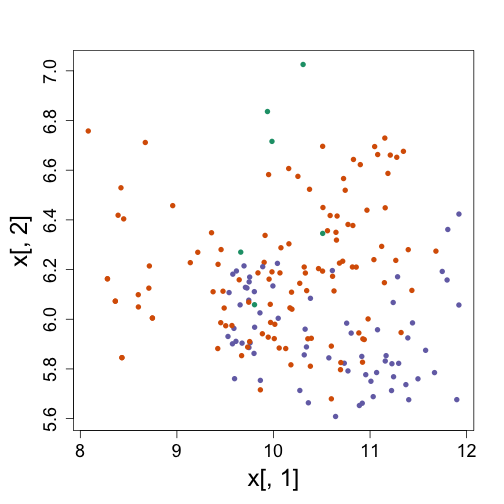
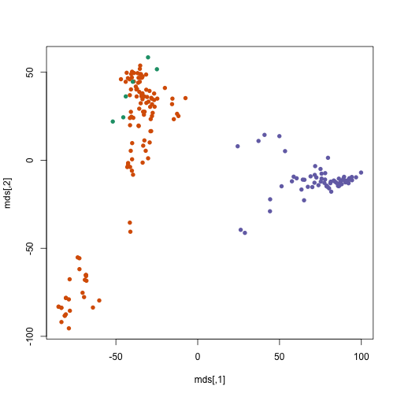
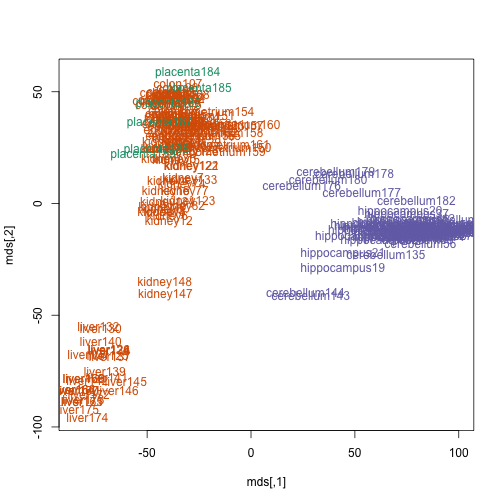
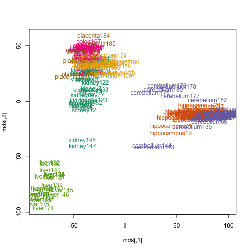
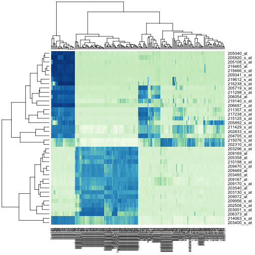
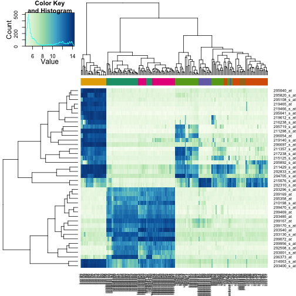

## Dimension reduction

We start loading the tissue gene expression dataset:


```r
# library(devtools) install_github('dagdata','genomicsclass')
library(dagdata)
data(tissuesGeneExpression)
library(Biobase)
```

```
## Loading required package: BiocGenerics
## Loading required package: methods
## Loading required package: parallel
## 
## Attaching package: 'BiocGenerics'
## 
## The following objects are masked from 'package:parallel':
## 
##     clusterApply, clusterApplyLB, clusterCall, clusterEvalQ,
##     clusterExport, clusterMap, parApply, parCapply, parLapply,
##     parLapplyLB, parRapply, parSapply, parSapplyLB
## 
## The following object is masked from 'package:stats':
## 
##     xtabs
## 
## The following objects are masked from 'package:base':
## 
##     anyDuplicated, append, as.data.frame, as.vector, cbind,
##     colnames, do.call, duplicated, eval, evalq, Filter, Find, get,
##     intersect, is.unsorted, lapply, Map, mapply, match, mget,
##     order, paste, pmax, pmax.int, pmin, pmin.int, Position, rank,
##     rbind, Reduce, rep.int, rownames, sapply, setdiff, sort,
##     table, tapply, union, unique, unlist
## 
## Welcome to Bioconductor
## 
##     Vignettes contain introductory material; view with
##     'browseVignettes()'. To cite Bioconductor, see
##     'citation("Biobase")', and for packages 'citation("pkgname")'.
```

```r
rownames(tab) <- tab$filename
t <- ExpressionSet(e, AnnotatedDataFrame(tab))
t$Tissue <- factor(t$Tissue)
colnames(t) <- paste0(t$Tissue, seq_len(ncol(t)))
```


As we noticed in the end of the clustering section, we weren't able to
*see* why the k-means algorithm defined a certain set of clusters
using only the first two genes.


```r
x <- t(exprs(t))
km <- kmeans(x, centers = 3)
library(rafalib)
```

```
## Loading required package: RColorBrewer
```

```r
mypar()
plot(x[, 1], x[, 2], col = km$cluster, pch = 16)
```

 


Instead of the first two genes, let's use the *multi-dimensional
scaling* algorithm which Rafa introduced in the lectures. This is a
projection from the space of all genes to a two dimensional space,
which mostly preserves the inter-sample distances. The `cmdscale`
function in R takes a distance object and returns a matrix which has
two dimensions (columns) for each sample.


```r
mds <- cmdscale(dist(x))
plot(mds, col = km$cluster, pch = 16)
```

 


We can also plot the names of the tissues with the color of the cluster.


```r
plot(mds, type = "n")
text(mds, colnames(t), col = km$cluster)
```

 


...or the names of the tissues with the color of the tissue.


```r
plot(mds, type = "n")
text(mds, colnames(t), col = as.fumeric(t$Tissue))
```

 


## Heatmaps

Heatmaps are useful plots for visualizing the expression values for a
subset of genes over all the samples. The *dendrogram* on top and on
the side is a hierarchical clustering as we saw before. First we will
use the `heatmap` available in base R. First define a color palette.


```r
# install.packages('RColorBrewer')
library(RColorBrewer)
hmcol <- colorRampPalette(brewer.pal(9, "GnBu"))(100)
```


Now, pick the genes with the top variance over all samples:


```r
library(genefilter)
```

```
## 
## Attaching package: 'genefilter'
## 
## The following object is masked from 'package:base':
## 
##     anyNA
```

```r
rv <- rowVars(exprs(t))
idx <- order(-rv)[1:40]
```


Now we can plot a heatmap of these genes:


```r
heatmap(exprs(t)[idx, ], col = hmcol)
```

 


The `heatmap.2` function in the `gplots` package on CRAN is a bit more
customizable, and stretches to fill the window. Here we add colors to
indicate the tissue on the top:


```r
# install.packages('gplots')
library(gplots)
```

```
## KernSmooth 2.23 loaded
## Copyright M. P. Wand 1997-2009
## 
## Attaching package: 'gplots'
## 
## The following object is masked from 'package:stats':
## 
##     lowess
```

```r
cols <- palette(brewer.pal(8, "Dark2"))[t$Tissue]
cbind(colnames(t), cols)
```

```
##                         cols     
##   [1,] "kidney1"        "#66A61E"
##   [2,] "kidney2"        "#66A61E"
##   [3,] "kidney3"        "#66A61E"
##   [4,] "kidney4"        "#66A61E"
##   [5,] "kidney5"        "#66A61E"
##   [6,] "kidney6"        "#66A61E"
##   [7,] "kidney7"        "#66A61E"
##   [8,] "kidney8"        "#66A61E"
##   [9,] "kidney9"        "#66A61E"
##  [10,] "kidney10"       "#66A61E"
##  [11,] "kidney11"       "#66A61E"
##  [12,] "kidney12"       "#66A61E"
##  [13,] "kidney13"       "#66A61E"
##  [14,] "kidney14"       "#66A61E"
##  [15,] "kidney15"       "#66A61E"
##  [16,] "kidney16"       "#66A61E"
##  [17,] "hippocampus17"  "#E7298A"
##  [18,] "hippocampus18"  "#E7298A"
##  [19,] "hippocampus19"  "#E7298A"
##  [20,] "hippocampus20"  "#E7298A"
##  [21,] "hippocampus21"  "#E7298A"
##  [22,] "hippocampus22"  "#E7298A"
##  [23,] "hippocampus23"  "#E7298A"
##  [24,] "hippocampus24"  "#E7298A"
##  [25,] "hippocampus25"  "#E7298A"
##  [26,] "hippocampus26"  "#E7298A"
##  [27,] "hippocampus27"  "#E7298A"
##  [28,] "hippocampus28"  "#E7298A"
##  [29,] "hippocampus29"  "#E7298A"
##  [30,] "hippocampus30"  "#E7298A"
##  [31,] "hippocampus31"  "#E7298A"
##  [32,] "hippocampus32"  "#E7298A"
##  [33,] "hippocampus33"  "#E7298A"
##  [34,] "hippocampus34"  "#E7298A"
##  [35,] "hippocampus35"  "#E7298A"
##  [36,] "hippocampus36"  "#E7298A"
##  [37,] "hippocampus37"  "#E7298A"
##  [38,] "hippocampus38"  "#E7298A"
##  [39,] "hippocampus39"  "#E7298A"
##  [40,] "hippocampus40"  "#E7298A"
##  [41,] "hippocampus41"  "#E7298A"
##  [42,] "hippocampus42"  "#E7298A"
##  [43,] "hippocampus43"  "#E7298A"
##  [44,] "hippocampus44"  "#E7298A"
##  [45,] "hippocampus45"  "#E7298A"
##  [46,] "hippocampus46"  "#E7298A"
##  [47,] "cerebellum47"   "#1B9E77"
##  [48,] "cerebellum48"   "#1B9E77"
##  [49,] "cerebellum49"   "#1B9E77"
##  [50,] "cerebellum50"   "#1B9E77"
##  [51,] "cerebellum51"   "#1B9E77"
##  [52,] "cerebellum52"   "#1B9E77"
##  [53,] "cerebellum53"   "#1B9E77"
##  [54,] "cerebellum54"   "#1B9E77"
##  [55,] "cerebellum55"   "#1B9E77"
##  [56,] "cerebellum56"   "#1B9E77"
##  [57,] "cerebellum57"   "#1B9E77"
##  [58,] "cerebellum58"   "#1B9E77"
##  [59,] "cerebellum59"   "#1B9E77"
##  [60,] "cerebellum60"   "#1B9E77"
##  [61,] "cerebellum61"   "#1B9E77"
##  [62,] "cerebellum62"   "#1B9E77"
##  [63,] "cerebellum63"   "#1B9E77"
##  [64,] "cerebellum64"   "#1B9E77"
##  [65,] "cerebellum65"   "#1B9E77"
##  [66,] "cerebellum66"   "#1B9E77"
##  [67,] "cerebellum67"   "#1B9E77"
##  [68,] "cerebellum68"   "#1B9E77"
##  [69,] "cerebellum69"   "#1B9E77"
##  [70,] "cerebellum70"   "#1B9E77"
##  [71,] "cerebellum71"   "#1B9E77"
##  [72,] "cerebellum72"   "#1B9E77"
##  [73,] "cerebellum73"   "#1B9E77"
##  [74,] "kidney74"       "#66A61E"
##  [75,] "kidney75"       "#66A61E"
##  [76,] "kidney76"       "#66A61E"
##  [77,] "kidney77"       "#66A61E"
##  [78,] "kidney78"       "#66A61E"
##  [79,] "kidney79"       "#66A61E"
##  [80,] "kidney80"       "#66A61E"
##  [81,] "kidney81"       "#66A61E"
##  [82,] "kidney82"       "#66A61E"
##  [83,] "kidney83"       "#66A61E"
##  [84,] "kidney84"       "#66A61E"
##  [85,] "kidney85"       "#66A61E"
##  [86,] "kidney86"       "#66A61E"
##  [87,] "colon87"        "#D95F02"
##  [88,] "colon88"        "#D95F02"
##  [89,] "colon89"        "#D95F02"
##  [90,] "colon90"        "#D95F02"
##  [91,] "colon91"        "#D95F02"
##  [92,] "colon92"        "#D95F02"
##  [93,] "colon93"        "#D95F02"
##  [94,] "colon94"        "#D95F02"
##  [95,] "colon95"        "#D95F02"
##  [96,] "colon96"        "#D95F02"
##  [97,] "colon97"        "#D95F02"
##  [98,] "colon98"        "#D95F02"
##  [99,] "colon99"        "#D95F02"
## [100,] "colon100"       "#D95F02"
## [101,] "colon101"       "#D95F02"
## [102,] "colon102"       "#D95F02"
## [103,] "colon103"       "#D95F02"
## [104,] "colon104"       "#D95F02"
## [105,] "colon105"       "#D95F02"
## [106,] "colon106"       "#D95F02"
## [107,] "colon107"       "#D95F02"
## [108,] "colon108"       "#D95F02"
## [109,] "colon109"       "#D95F02"
## [110,] "colon110"       "#D95F02"
## [111,] "colon111"       "#D95F02"
## [112,] "colon112"       "#D95F02"
## [113,] "colon113"       "#D95F02"
## [114,] "colon114"       "#D95F02"
## [115,] "colon115"       "#D95F02"
## [116,] "colon116"       "#D95F02"
## [117,] "colon117"       "#D95F02"
## [118,] "colon118"       "#D95F02"
## [119,] "colon119"       "#D95F02"
## [120,] "colon120"       "#D95F02"
## [121,] "kidney121"      "#66A61E"
## [122,] "kidney122"      "#66A61E"
## [123,] "kidney123"      "#66A61E"
## [124,] "liver124"       "#E6AB02"
## [125,] "liver125"       "#E6AB02"
## [126,] "liver126"       "#E6AB02"
## [127,] "kidney127"      "#66A61E"
## [128,] "kidney128"      "#66A61E"
## [129,] "kidney129"      "#66A61E"
## [130,] "liver130"       "#E6AB02"
## [131,] "liver131"       "#E6AB02"
## [132,] "liver132"       "#E6AB02"
## [133,] "kidney133"      "#66A61E"
## [134,] "kidney134"      "#66A61E"
## [135,] "cerebellum135"  "#1B9E77"
## [136,] "hippocampus136" "#E7298A"
## [137,] "liver137"       "#E6AB02"
## [138,] "liver138"       "#E6AB02"
## [139,] "liver139"       "#E6AB02"
## [140,] "liver140"       "#E6AB02"
## [141,] "liver141"       "#E6AB02"
## [142,] "liver142"       "#E6AB02"
## [143,] "cerebellum143"  "#1B9E77"
## [144,] "cerebellum144"  "#1B9E77"
## [145,] "liver145"       "#E6AB02"
## [146,] "liver146"       "#E6AB02"
## [147,] "kidney147"      "#66A61E"
## [148,] "kidney148"      "#66A61E"
## [149,] "endometrium149" "#7570B3"
## [150,] "endometrium150" "#7570B3"
## [151,] "endometrium151" "#7570B3"
## [152,] "endometrium152" "#7570B3"
## [153,] "endometrium153" "#7570B3"
## [154,] "endometrium154" "#7570B3"
## [155,] "endometrium155" "#7570B3"
## [156,] "endometrium156" "#7570B3"
## [157,] "endometrium157" "#7570B3"
## [158,] "endometrium158" "#7570B3"
## [159,] "endometrium159" "#7570B3"
## [160,] "endometrium160" "#7570B3"
## [161,] "endometrium161" "#7570B3"
## [162,] "endometrium162" "#7570B3"
## [163,] "endometrium163" "#7570B3"
## [164,] "liver164"       "#E6AB02"
## [165,] "liver165"       "#E6AB02"
## [166,] "liver166"       "#E6AB02"
## [167,] "liver167"       "#E6AB02"
## [168,] "liver168"       "#E6AB02"
## [169,] "liver169"       "#E6AB02"
## [170,] "liver170"       "#E6AB02"
## [171,] "liver171"       "#E6AB02"
## [172,] "liver172"       "#E6AB02"
## [173,] "liver173"       "#E6AB02"
## [174,] "liver174"       "#E6AB02"
## [175,] "liver175"       "#E6AB02"
## [176,] "cerebellum176"  "#1B9E77"
## [177,] "cerebellum177"  "#1B9E77"
## [178,] "cerebellum178"  "#1B9E77"
## [179,] "cerebellum179"  "#1B9E77"
## [180,] "cerebellum180"  "#1B9E77"
## [181,] "cerebellum181"  "#1B9E77"
## [182,] "cerebellum182"  "#1B9E77"
## [183,] "cerebellum183"  "#1B9E77"
## [184,] "placenta184"    "#A6761D"
## [185,] "placenta185"    "#A6761D"
## [186,] "placenta186"    "#A6761D"
## [187,] "placenta187"    "#A6761D"
## [188,] "placenta188"    "#A6761D"
## [189,] "placenta189"    "#A6761D"
```

```r
heatmap.2(exprs(t)[idx, ], trace = "none", ColSideColors = cols, col = hmcol)
```

 


