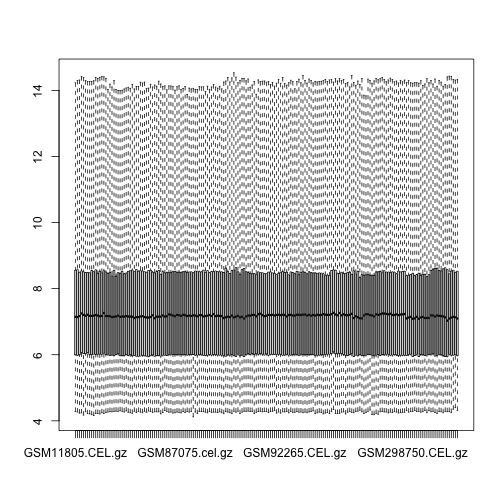
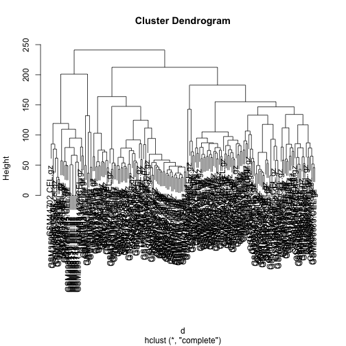
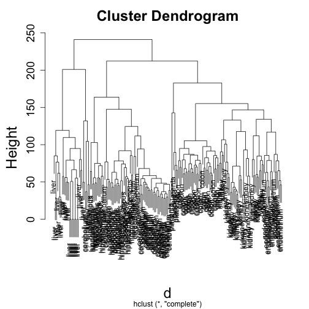
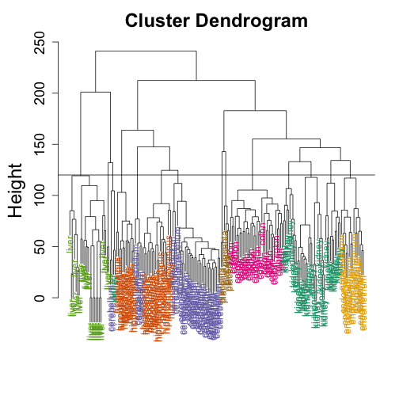
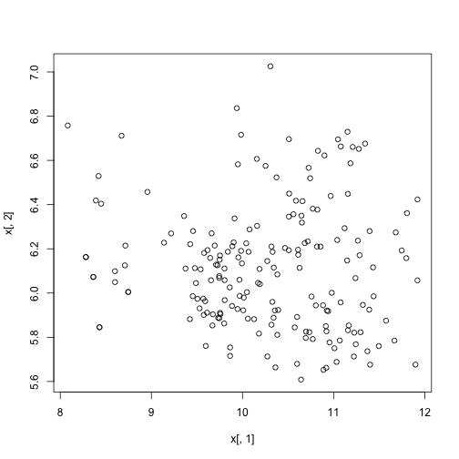
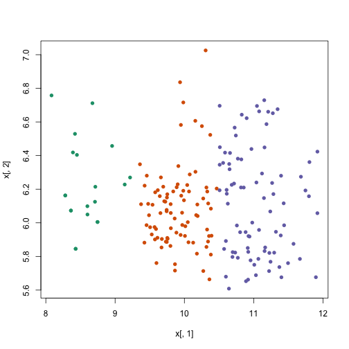
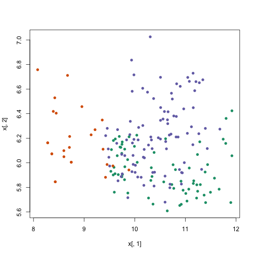

Let's load the tissue gene expression data which Rafa discussed in the lecture:


```r
# library(devtools) install_github('dagdata','genomicsclass')
library(dagdata)
data(tissuesGeneExpression)
library(Biobase)
```

```
## Loading required package: BiocGenerics
## Loading required package: methods
## Loading required package: parallel
## 
## Attaching package: 'BiocGenerics'
## 
## The following objects are masked from 'package:parallel':
## 
##     clusterApply, clusterApplyLB, clusterCall, clusterEvalQ,
##     clusterExport, clusterMap, parApply, parCapply, parLapply,
##     parLapplyLB, parRapply, parSapply, parSapplyLB
## 
## The following object is masked from 'package:stats':
## 
##     xtabs
## 
## The following objects are masked from 'package:base':
## 
##     anyDuplicated, append, as.data.frame, as.vector, cbind,
##     colnames, do.call, duplicated, eval, evalq, Filter, Find, get,
##     intersect, is.unsorted, lapply, Map, mapply, match, mget,
##     order, paste, pmax, pmax.int, pmin, pmin.int, Position, rank,
##     rbind, Reduce, rep.int, rownames, sapply, setdiff, sort,
##     table, tapply, union, unique, unlist
## 
## Welcome to Bioconductor
## 
##     Vignettes contain introductory material; view with
##     'browseVignettes()'. To cite Bioconductor, see
##     'citation("Biobase")', and for packages 'citation("pkgname")'.
```

```r
rownames(tab) <- tab$filename
t <- ExpressionSet(e, AnnotatedDataFrame(tab))
t$Tissue <- factor(t$Tissue)
boxplot(exprs(t), range = 0)
```

 


We will take the transpose of the vector, as the `dist` function will
compute distances between the rows, and we want sample-sample distances:
Note that the value in the 1,2 slot of the matrix of the object `d` is
the same as the square root of the sum of squared differences, i.e.,
the definition of the Euclidean distance.


```r
x <- t(exprs(t))
d <- dist(x)
class(d)
```

```
## [1] "dist"
```

```r
as.matrix(d)[1, 2]
```

```
## [1] 85.85
```

```r
sqrt(sum((x[1, ] - x[2, ])^2))
```

```
## [1] 85.85
```


## Clustering

We can perform hierarchical clustering based on the
distances defined above, using the `hclust` function.
The `plot` method will make a plot of the tree that results from
`hclust`. 


```r
hc <- hclust(d)
hc
```

```
## 
## Call:
## hclust(d = d)
## 
## Cluster method   : complete 
## Distance         : euclidean 
## Number of objects: 189
```

```r
plot(hc)
```

 

```r
library(rafalib)
```

```
## Loading required package: RColorBrewer
```

```r
mypar()
plot(hc, labels = t$Tissue)
```

 

```r
myplclust(hc, labels = t$Tissue, lab.col = as.fumeric(t$Tissue))
abline(h = 120)
```

 


If we use the line above to cut the tree into clusters, we can examine
how the clusters overlap with the actual tissues:


```r
hclusters <- cutree(hc, h = 120)
table(true = t$Tissue, cluster = hclusters)
```

```
##              cluster
## true           1  2  3  4  5  6  7  8  9 10 11 12 13 14
##   cerebellum   0  0  0  0 31  0  0  0  2  0  0  5  0  0
##   colon        0  0  0  0  0  0 34  0  0  0  0  0  0  0
##   endometrium  0  0  0  0  0  0  0  0  0  0 15  0  0  0
##   hippocampus  0  0 12 19  0  0  0  0  0  0  0  0  0  0
##   kidney       9 18  0  0  0 10  0  0  2  0  0  0  0  0
##   liver        0  0  0  0  0  0  0 24  0  2  0  0  0  0
##   placenta     0  0  0  0  0  0  0  0  0  0  0  0  2  4
```


We can also call the `kmeans` function to perform k-means clustering
as was explained in the lecture. Let's run k-means on the samples in
the space of the first two genes, so that we can observe the results
of the algorithm in the same space:


```r
plot(x[, 1], x[, 2])
```

 

```r
km <- kmeans(x[, 1:2], centers = 3)
names(km)
```

```
## [1] "cluster"      "centers"      "totss"        "withinss"    
## [5] "tot.withinss" "betweenss"    "size"         "iter"        
## [9] "ifault"
```

```r
plot(x[, 1], x[, 2], col = km$cluster, pch = 16)
```

 


Note that if we perform k-means clustering using all of the genes, the
results are not the same as before. Looking at the first two genes
doesn't explain why the clusters we see were generated. So we need to
use a different method to *see* these inter-samples distances.


```r
km <- kmeans(x, centers = 3)
plot(x[, 1], x[, 2], col = km$cluster, pch = 16)
```

 


Let's try one last time with larger 'k':


```r
km <- kmeans(x, centers = 7)
table(true = t$Tissue, cluster = km$cluster)
```

```
##              cluster
## true           1  2  3  4  5  6  7
##   cerebellum   2  0  0  0 19  5 12
##   colon        0 34  0  0  0  0  0
##   endometrium  0  0  0 15  0  0  0
##   hippocampus  0  0  0  0  0 31  0
##   kidney       2  0  0 37  0  0  0
##   liver        2  0 24  0  0  0  0
##   placenta     0  6  0  0  0  0  0
```

