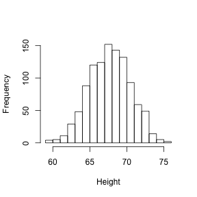
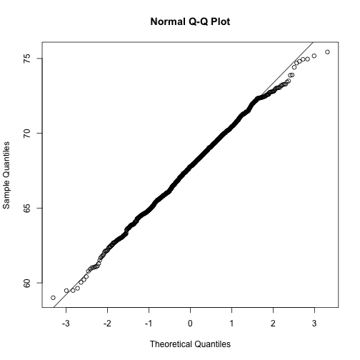
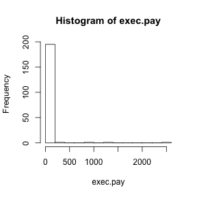
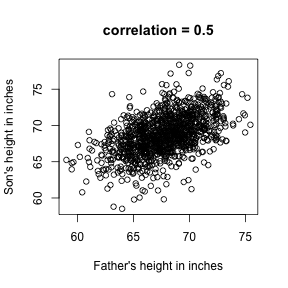
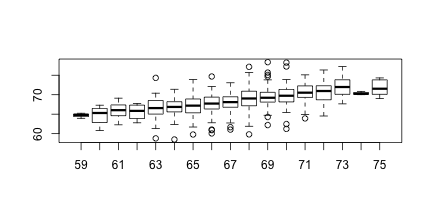
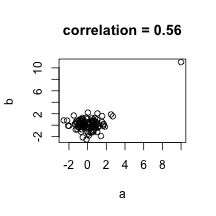

# Exploratory Data Analysis

Biases, systematic errors and unexpected variability are common in genomics data. Failure to discover these problems often leads to flawed analyses and false discoveries. As an example, consider that experiments sometimes fail and not all data processing pipelines are designed to detect these. Yet, these pipelines still give you an answer and the from the final results it may be hard or impossible to notice an error was made. In later modules we will cover many other examples. 

Graphing data is a powerful approach to detecting these problems. We refer to this as _exploratory data analyis_ (EDA). Many important methodological contributions to genomics data analysis were initiated as discovery made via EDA. We will show some useful exploratory plots for gene expression data measured with microarrays and NGS. We start with a general introduction to EDA using height data.

## Histograms

We can think of any given dataset as a list of numbers. Suppose you have measured the heights of all men in a population. Imagine you have need to describe these numbers to someone that has no idea what these heights are, say an alien that has never visited earth. 


```r
library(UsingR)
x = father.son$fheight
```

One approach is to simply list out all the numbers for the alien to see. Here are 20 randomly selected heights of 1,078.


```r
round(sample(x, 20), 1)
```

```
##  [1] 63.9 69.3 68.8 70.4 72.1 64.1 70.9 66.1 64.7 69.1 68.5 64.0 67.0 68.7
## [15] 65.5 65.9 64.1 62.8 68.3 67.6
```


From scanning through these numbers we start getting a rough idea of what the entire list looks like but it certainly inefficient. We can quickly improve on this approach by creating bins, say by rounding each value to its nearest integer, and reporting the number of individuals in each bin. A plot of these heights is called a histogram

```r
hist(x, breaks = seq(floor(min(x)), ceiling(max(x))), main = "", xlab = "Height")
```

 

Showing this plot to the alien is much more informative than showing the numbers. Note that with this simple plot we can approximate the number of individuals in any given interval. For example, there are about 70 individuals over six feet (72 inches) tall. 


```r
xs <- seq(floor(min(x)), ceiling(max(x)), 0.1)
plot(xs, ecdf(x)(xs), type = "l", xlab = "x=Height", ylab = "F(x)")
```

 


## Normal approximation

If instead of the total numbers we report the proportions, then the histogram is a probability distribution. The probability distribution we see above approximates one that is very common in a nature: the bell curve or normal distribution or Gaussian distribution. When the histogram of a list of numbers approximates the normal distribution we can use a convenient mathematical formula to approximate the proportion of individuals in any given interval

$$
\mbox{Pr}(a < x < b) = \int_a^b \frac{1}{\sqrt{2\pi\sigma^2}}
\exp{ \frac{-(x-\mu)^2}{2 \sigma^2} } \, dx
$$

Here $\mu$ and $\sigma$ are refereed to as the mean and standard deviation. If this approximation holds for our list then the population mean and variance of our list can be used in the formula above. To see this with an example remember that above we noted that 70 individuals or 6% of our population were taller than 6 feet. The normal approximation works well:

```r
1 - pnorm(72, mean(x), sd(x))
```

```
## [1] 0.05806
```


A very useful characteristic of this approximation is that one only needs to know $\mu$ and $\sigma$ to describe the entire distribution. All we really have to tell our alien friend is that heights follow a normal distribution with average height 68'' and a standard deviation of 3''. From this we can compute the proportion of individuals in any interval. 

## QQ-plot

To corroborate that the normal distribution is in fact a good approximation we can use quantile-quantile plots. Quantiles are best understood by considering the special case of percentiles. The p-th percentile of a list of a distribution is defined as the number q that is bigger than p% of numbers. For example, the median 50-th percentile is the median. We can compute the percentiles for our list and for the normal distribution

```r
ps <- seq(0.01, 0.99, 0.01)
qs <- quantile(x, ps)
normalqs <- qnorm(ps, mean(x), sd(x))
plot(normalqs, qs, xlab = "Normal percentiles", ylab = "Height percentiles")
abline(0, 1)  ##identity line
```

 

Note how close these values are. Also note that we can do same with less code

```r
qqnorm(x)
qqline(x)
```

 


## Box-plot
Data is not always normally distributed. Income 
In these cases the average and standard deviation are not necessarily informative. The properties described above are specific to the normal. For example, the normal distribution does not seem to be a good approximation for the direct compensation for 199 United States CEOs in the year 2000

```r
hist(exec.pay)
```

 

```r
qqnorm(exec.pay)
qqline(exec.pay)
```

 

A practical summary is to compute 3 percentiles: 25-th, 50-th (the median) and the 75-th. A boxplots shows these 3 values along with a range calculated as median $\pm$ 1.5 75-th percentiles - 25th-percentile. Values outside this range are shown as points.


```r
boxplot(exec.pay, ylab = "10,000s of dollars", ylim = c(0, 400))
```

 


## Scatter plots and correlation
In the biomedical sciences it is common to be interested in the relationship between two or more variables. A classic examples is the father/son height data used by Galton to understand the heredity. Were we to summarize these data we could use the two average and two standard deviation as both are well approximated by the normal distribution. This summary however fails to describe an important characteristic of the data.


```r
data("father.son")
x = father.son$fheight
y = father.son$sheight
plot(x, y, xlab = "Father's height in inches", ylab = "Son's height in inches", 
    main = paste("correlation =", signif(cor(x, y), 2)))
```

 

The scatter plot shows a general trend: the taller the father the taller to son. A summary of this trend is the correlation coefficient which in this cases is 0.5. We motivate this statistic by trying to predict son's height using the father's.

## Stratification
Suppose we are asked to guess the height of randomly select height from the sons. The average height, 68.7 inches, is the value with the highest proportion (see histogram) and would be our prediction. But what if we are told that the father is 72 inches tall, do we sill guess 68.7?

Note that the father is taller than average. He is 1.7 standard deviations taller than the average father. So should we predict that the son is also 1.75 standard deviations taller? Turns out this is an overestimate. To see this we look at all the sons with fathers who are about 72 inches. We do this by _stratifying_ the son heights.

```r
boxplot(split(y, round(x)))
```

 

```r
print(mean(y[round(x) == 72]))
```

```
## [1] 70.68
```

Stratification followed by boxplots lets us see the distribution of each group. The average height of sons with fathers that are 72 is 70.7. We also see that the means of the strata appear to follow a straight line. 

This line is refereed to the regression line and it's slope related to the correlation. When two variables follow a bivariate normal distribution then for any given value of x we predict the value of y with
$$
\frac{Y - \mu_Y}{\sigma_Y} = r \frac{X-\mu_X}{\sigma_X}
$$
with the $\mu$ representing the averages, $\sigma$ the standard deviations, and $r$ the correlation. Let's compare the mean of each strata to the identity line and the regression line


```r
x = (x - mean(x))/sd(x)
y = (y - mean(y))/sd(y)
means = tapply(y, round(x * 4)/4, mean)
fatherheights = as.numeric(names(means))
plot(fatherheights, means, ylab = "average of strata of son heights", ylim = range(fatherheights))
abline(0, cor(x, y))
```

 

## Spearman's correlation
Just like the average and standard deviation are not good summaries when the data is not well approximated by the normal distribution, the correlation is not a good summary when pairs of lists are not approximated by the bivariate normal distribution. Examples include cases in which on variable is related to another by a parabolic function. Another, more common example are caused by outliers or extreme values.


```r
a = rnorm(100)
a[1] = 10
b = rnorm(100)
b[1] = 11
plot(a, b, main = paste("correlation =", signif(cor(a, b), 2)))
```

 

In the example above the data are not associated but for one pair both values are very large. The correlation here is about 0.5. This is driven by just that one point as taking it out lowers to correlation to about 0. An alternative summary for cases with outliers or extreme values is Spearman's correlation which is based on ranks instead of the values themselves. 


