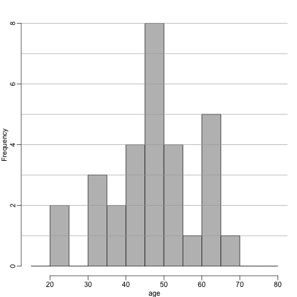

{pagebreak}

## Exercises

 

1. Given the above histogram, how many people are between the ages of 35 and 45?


2. The `InsectSprays` data set is included in R. The dataset reports the counts of insects in agricultural experimental units treated with different insecticides. Make a boxplot and determine which insecticide appears to be most effective. 


3.  Download and load [this](http://courses.edx.org/c4x/HarvardX/PH525.1x/asset/skew.RData) dataset into R.
Use exploratory data analysis tools to determine which two columns are different from the rest. Which is the column that is positively skewed? 


4. Which is the column that is negatively skewed?


5. Let's consider a random sample of finishers from the New York City Marathon in 2002.  This dataset can be found in the UsingR package. Load the library and then load the `nym.2002` dataset. 

    
    ```r
    library(dplyr)
    data(nym.2002, package="UsingR")
    ```

    Use boxplots and histograms to compare the finishing times of males and females. Which of the following best describes the difference?
    
    - A) Males and females have the same distribution.
    - B) Most males are faster than most women.
    - C) Male and females have similar right skewed distributions with the former, 20 minutes shifted to the left.
    - D) Both distribution are normally distributed with a difference in mean of about 30 minutes.
  


6. Use `dplyr` to create two new data frames: `males` and `females`, with the data for each gender. For males, what is the Pearson correlation between age and time to finish? 


7. For females, what is the Pearson correlation between age and time to finish? 


8. If we interpret these correlations without visualizing the data, we would conclude that the older we get, the slower we run marathons, regardless of gender. Look at scatterplots and boxplots of times stratified by age groups (20-25, 25-30, etc..). After examining the data, what is a more reasonable conclusion?
    - A) Finish times are constant up until about our 40s, then we get slower.
    - B) On average, finish times go up by about 7 minutes every five years.
    - C) The optimal age to run a marathon is 20-25.
    - D) Coding errors never happen: a five year old boy completed the 2012 NY city marathon.


9. When is it appropriate to use pie charts or donut charts?
  - A) When you are hungry. 
  - B) To compare percentages.  
  - C) To compare values that add up to 100%.
  - D) Never.


10. The use of pseudo-3D plots in the literature mostly adds:
  - A) Pizzazz.
  - B) The ability to see three dimensional data.
  - C) Ability to discover.
  - D) Confusion.


