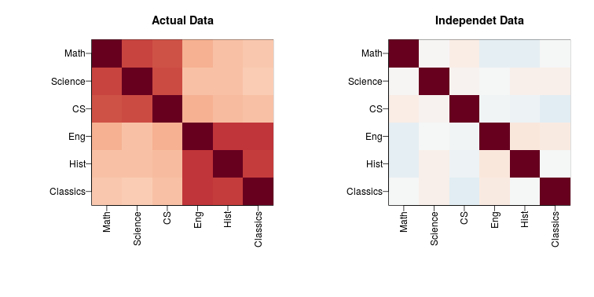
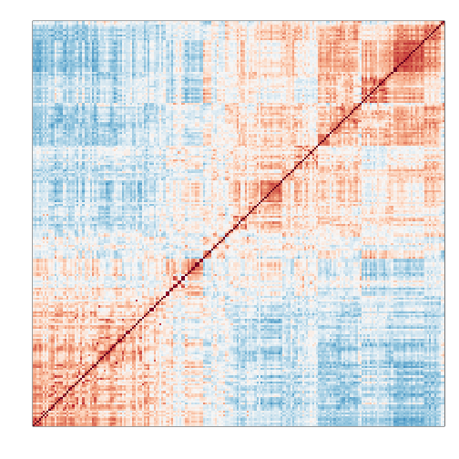

## Factor Analysis


Many of the statistical ideas applied to correcting for batch effects come from Factor Analysis. Factor Analysis was first developed over a century ago. Karl Pearson noted that correlation between different subject when the correlation was computed across students. To explain this, he posed a model having one factor that was common across subjects for each student that explained this correlation:

$$
Y_ij = \alpha_i W_1 + \varepsilon_{ij}
$$

with $$Y_{ij}$$ the grade for individual $$i$$ on subject $$j$$ and $$\alpha_i$$ representing the ability of student $$i$$ to obtain good grades. 

In this example, $$W_1$$ is a constant. Here we will motivate factor analysis with a slightly more complicated situation that resembles the presence of batch effects. We generate random grade
$$\mathbf{Y}$$ is $$N \times 6$$ are grades in five different subjects for N children. 


#### Sample correlations

Note we observe high correlation across five subject:

```r
round(cor(Y),2)
```

```
##          Math Science   CS  Eng Hist Classics
## Math     1.00    0.67 0.64 0.34 0.29     0.28
## Science  0.67    1.00 0.65 0.29 0.29     0.26
## CS       0.64    0.65 1.00 0.35 0.30     0.29
## Eng      0.34    0.29 0.35 1.00 0.71     0.72
## Hist     0.29    0.29 0.30 0.71 1.00     0.68
## Classics 0.28    0.26 0.29 0.72 0.68     1.00
```

A graphical look shows that the correlation suggests a grouping into STEM and humanities.

In the figure below high correlations are red, no correlation is white and negative correlations are blue.

 


#### Factor model

Based on the plot above we hypothesize that there are two hidden factors $$\mathbf{W}_1$$ and $$\mathbf{W}_2$$ and to account for the observed correlation structure we model the data in the following way:

$$
Y_{ij} = \alpha_{i,1} W_{1,j} + \alpha_{i,2} W_{2,j} + \varepsilon_{ij}
$$

The interpretation of these parameters are as follows: $$\alpha_{i,1}$$ is the overall ability for student $$i$$ and $$\alpha_{i,2}$$ is the difference in ability between the two subgroups for student $$i$$. Can we estimate the $$W$$ and $$\alpha$$ ? 

#### Factor analysis and PCA

The first two principal components estimate $$W_1$$ and $$W_2$$ [we need to add reference for the math]


```r
s <- svd(Y)
W <- t(s$v[,1:2])
colnames(W)<-colnames(Y)
round(W,1)
```

```
##      Math Science   CS Eng Hist Classics
## [1,]  0.4     0.4  0.4 0.5  0.4      0.4
## [2,] -0.4    -0.5 -0.4 0.3  0.3      0.4
```

As expected, the first factor is close to a constant and will help explain the observed correlation across all subjects, while the second is a factor that differs between STEM and humanities. We can use these estimateS in the model:

$$
Y_{ij} = \alpha_{i,1} \hat{W}_{1,j} + \alpha_{i,2} \hat{W}_{2,j} + \varepsilon_{ij}
$$
 
and we can now fit the model:


```r
fit = s$u[,1:2]%*% (s$d[1:2]*W)
var(as.vector(fit))/var(as.vector(Y))
```

```
## [1] 0.7880933
```


#### Factor analysis in general

In high-throughput data it is quite common to see correlation structure. For example, notice the complex correlations we see across samples in the plot below. These are the correlations for a gene expression experiment with columns ordered by data:


```r
library(Biobase)
library(GSE5859)
data(GSE5859)
n <- nrow(pData(e))
o <- order(pData(e)$date)
Y=exprs(e)[,o]
cors=cor(Y-rowMeans(Y))

mypar()

cols=colorRampPalette(rev(brewer.pal(11,"RdBu")))(100)
image(1:n,1:n,cors,xaxt="n",yaxt="n",col=cols,xlab="",ylab="",zlim=c(-1,1))
```

 

Two factors will not be enough to model the observed correlation structure. However, a more general factor model can be useful:

$$
Y_{ij} = \sum_{k=1}^K \alpha_{i,k} W_{j,k} + \varepsilon_{ij}
$$

And we can use PCA to estimate $$\mathbf{W}_1,\dots,\mathbf{W}_K$$. Choosing $$k$$ is a challenge. In the next section we describe how exploratory data analysis might help.


