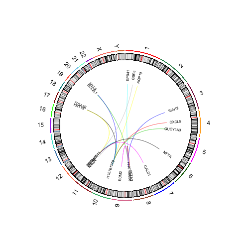

```
## Warning: replacing previous import 'BiocGenerics::var' by 'stats::var' when
## loading 'MLInterfaces'
```


## RCircos

RCircos is not distributed in Bioconductor, but can
be useful for developing compact displays of interactions
among genomic elements.  I am unaware of any interfaces between
Bioconductor data classes and RCircos, and this topic deserves
attention.

In the ph525x package we have added a selection of trans-eQTL
findings from Westra et al. Nature 2013 (doi: 10.1038/ng.2756).
We show a few SNP-gene associations from this study:

```r
library(ph525x)
data(westraTransSel)
westraTransSel[1:3]
```

```
## $$rs10484554
## [1] "TMEM154"      "CDC42EP4"     "LRBA"         "AE000660.1-5"
## [5] "U66060.1-23" 
## 
## $$rs10484561
## [1] "LIMS1"        "U66060.1-23"  "AE000660.1-4" "CD19"        
## [5] "FCRLA"        "CD79B"        "ERG"         
## 
## $$rs10758658
## [1] "TSTA3"      "BCL2L1"     "AC010679.1" "SIAH2"      "EPB41"     
## [6] "ECM2"
```

```r
sglToCircos(westraTransSel[1:5])
```



