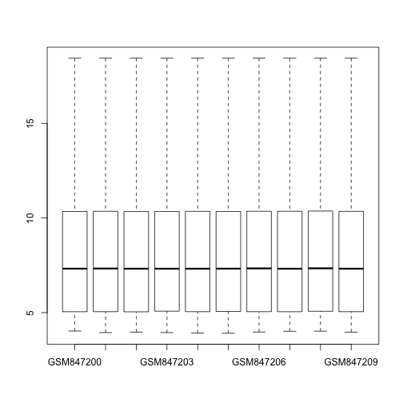

<a name="roast"></a>

# Gene set testing

Here, we will explore software for testing differential expression in a set of genes. These tests differ from the gene-by-gene tests we saw previously. Again, the gene set testing software we will use lives in the `limma` package.

We download an experiment from the GEO website, using the `getGEO` function from the `GEOquery` package:


```r
library(GEOquery)
g <- getGEO("GSE34313")
e <- g[[1]]
```

This dataset is hosted by GEO at the following link: <http://www.ncbi.nlm.nih.gov/geo/query/acc.cgi?acc=GSE34313>

The experiment is described in the paper by [Masuno 2011](#foot).

Briefly, the investigators applied a glucocorticoid hormone to cultured human airway smooth muscle. The glucocorticoid hormone is used to treat asthma, as it reduces the inflammation response, however it has many other effects throughout the different tissues of the body.

The groups are defined in the `characteristics_ch1.2` variable:


```r
e$condition <- e$characteristics_ch1.2
levels(e$condition) <- c("dex24","dex4","control")
table(e$condition)
```

```
## 
##   dex24    dex4 control 
##       3       3       4
```

By examining boxplots, we can guess that the data has already been normalized somehow, and on the GEO site the investigators report that they normalized using Agilent software.

We will subset to the control samples and the samples treated with dexamethasone (the hormone) after 4 hours.


```r
boxplot(exprs(e), range=0)
```

 

```r
names(fData(e))
```

```
##  [1] "ID"                   "SPOT_ID"              "CONTROL_TYPE"        
##  [4] "REFSEQ"               "GB_ACC"               "GENE"                
##  [7] "GENE_SYMBOL"          "GENE_NAME"            "UNIGENE_ID"          
## [10] "ENSEMBL_ID"           "TIGR_ID"              "ACCESSION_STRING"    
## [13] "CHROMOSOMAL_LOCATION" "CYTOBAND"             "DESCRIPTION"         
## [16] "GO_ID"                "SEQUENCE"
```

```r
lvls <- c("control", "dex4")
es <- e[,e$condition %in% lvls]
es$condition <- factor(es$condition, levels=lvls)
```

The following lines run the linear model in `limma`. We note that the top genes are common immune-response genes (CSF2, LIF, CCL2, IL6). Also present is FKBP5, a gene which regulates and is regulated by the protein which receives the glucocorticoid hormone.


```r
library(limma)
design <- model.matrix(~ es$condition)
fit <- lmFit(es, design=design)
fit <- eBayes(fit)
tt <- topTable(fit, coef=2, genelist=fData(es)$GENE_SYMBOL)
tt
```

```
##                    ID     logFC   AveExpr         t      P.Value
## A_23_P133408     CSF2 -4.724965  8.187709 -69.36145 2.381749e-12
## A_24_P122137      LIF -6.689927 11.052517 -67.23929 3.048075e-12
## A_32_P5276   ARHGEF26  3.411468  7.373888  54.47705 1.619429e-11
## A_23_P89431      CCL2 -3.618725 13.762759 -54.13669 1.701965e-11
## A_23_P42257      IER3 -4.808854 13.417263 -48.57810 4.018095e-11
## A_23_P71037       IL6 -4.568355 11.595039 -45.78704 6.422142e-11
## A_24_P20327     KLF15  4.013070  6.824730  43.90736 8.951793e-11
## A_24_P38081     FKBP5  3.567059  9.310028  43.77025 9.176326e-11
## A_23_P213944    HBEGF -2.902190 10.269416 -43.72761 9.247448e-11
## A_24_P250922    PTGS2 -3.518360 10.476972 -42.52588 1.153122e-10
##                 adj.P.Val        B
## A_23_P133408 6.248554e-08 15.93230
## A_24_P122137 6.248554e-08 15.84703
## A_32_P5276   1.744514e-07 15.16827
## A_23_P89431  1.744514e-07 15.14523
## A_23_P42257  3.294838e-07 14.72004
## A_23_P71037  4.212726e-07 14.46609
## A_24_P20327  4.212726e-07 14.27685
## A_24_P38081  4.212726e-07 14.26242
## A_23_P213944 4.212726e-07 14.25791
## A_24_P250922 4.727798e-07 14.12733
```


We will use the [ROAST method](#foot) for gene set testing. We can test a single gene set by looking up the genes which contain a certain GO ID, and providing this to the `roast` function. We will show how to get such lists of genes associated with a GO ID in the next chunk.

The roast function performs an advanced statistical technique, *rotation of residuals*, in order to generate a sense of the null distribution for the test statistic. The test statistics in this case is the summary of the scores from each gene. The tests are *self-contained* because only the summary for a single set is used, whereas other gene set tests might compare a set to all the other genes in the dataset, e.g., a *competitive* gene set test.

The result here tells us that the *immune response* genes are significantly down-regulated, and additionally, mixed up and down.


```r
# Immune response
idx <- grep("GO:0006955", fData(es)$GO_ID)
length(idx)
```

```
## [1] 504
```

```r
r1 <- roast(es, idx, design)
# ?roast
r1
```

```
##          Active.Prop    P.Value
## Down      0.16269841 0.01550775
## Up        0.09325397 0.98499250
## UpOrDown  0.16269841 0.03100000
## Mixed     0.25595238 0.00800000
```

<a name="mroast"></a>

## Testing multiple gene sets

We can also use the `mroast` function to perform multiple roast tests. First we need to create a list, which contains the indices of genes in the ExpressionSet for each of a number of gene sets. We will use the `org.Hs.eg.db` package to gather the gene set information.


```r
# biocLite("org.Hs.eg.db")
library(org.Hs.eg.db)
```

```
## Loading required package: AnnotationDbi
## Loading required package: stats4
## Loading required package: GenomeInfoDb
## Loading required package: S4Vectors
## Loading required package: IRanges
## 
## Attaching package: 'AnnotationDbi'
## 
## The following object is masked from 'package:GenomeInfoDb':
## 
##     species
## 
## Loading required package: DBI
```

```r
org.Hs.egGO2EG
```

```
## GO2EG map for Human (object of class "Go3AnnDbBimap")
```

```r
go2eg <- as.list(org.Hs.egGO2EG)
head(go2eg)
```

```
## $$`GO:0000002`
##     TAS     TAS     ISS     IMP     NAS     IMP     IEA     IMP 
##   "291"  "1890"  "4205"  "4358"  "9361" "10000" "80119" "92667" 
## 
## $$`GO:0000003`
##    IEP 
## "8510" 
## 
## $$`GO:0000012`
##         IDA         IDA         IEA         IMP         IDA         IDA 
##      "3981"      "7141"      "7515"     "23411"     "54840"     "55775" 
##         IMP         IMP         IEA 
##     "55775"    "200558" "100133315" 
## 
## $$`GO:0000018`
##     TAS     TAS     TAS     IMP     IMP     IEP 
##  "3575"  "3836"  "3838"  "9984" "10189" "56916" 
## 
## $$`GO:0000019`
##     TAS     IDA 
##  "4361" "10111" 
## 
## $$`GO:0000022`
##    TAS    TAS 
## "9055" "9493"
```

The following code unlists the list, then gets matches for each Entrez gene ID to the index in the ExpressionSet. Finally, we rebuild the list.


```r
govector <- unlist(go2eg)
golengths <- sapply(go2eg, length)
head(fData(es)$GENE)
```

```
## [1] "400451" "10239"  "9899"   "348093" "57099"  "146050"
```

```r
idxvector <- match(govector, fData(es)$GENE)
table(is.na(idxvector))
```

```
## 
##  FALSE   TRUE 
## 221613   7296
```

```r
idx <- split(idxvector, rep(names(go2eg), golengths))
go2eg[[1]]
```

```
##     TAS     TAS     ISS     IMP     NAS     IMP     IEA     IMP 
##   "291"  "1890"  "4205"  "4358"  "9361" "10000" "80119" "92667"
```

```r
fData(es)$GENE[idx[[1]]]
```

```
## [1] "291"   "1890"  "4205"  "4358"  "9361"  "10000" "80119" "92667"
```

We need to clean this list such that there are no `NA` values. We also clean it to remove gene sets which have less than 10 genes.


```r
idxclean <- lapply(idx, function(x) x[!is.na(x)])
idxlengths <- sapply(idxclean, length)
idxsub <- idxclean[idxlengths > 10]
length(idxsub)
```

```
## [1] 2906
```

The following line of code runs the multiple ROAST test. This can take about 3 minutes.


```r
r2 <- mroast(es, idxsub, design)
head(r2)
```

```
##            NGenes  PropDown     PropUp Direction PValue         FDR
## GO:0005125    169 0.2662722 0.04733728      Down  0.001 0.009435065
## GO:0008083    167 0.2874251 0.07784431      Down  0.001 0.009435065
## GO:0043433     61 0.2786885 0.13114754      Down  0.001 0.009435065
## GO:0007623     57 0.2105263 0.12280702      Down  0.001 0.009435065
## GO:0006959     52 0.2500000 0.09615385      Down  0.001 0.009435065
## GO:0051781     49 0.3265306 0.08163265      Down  0.001 0.009435065
##            PValue.Mixed  FDR.Mixed
## GO:0005125        0.001 0.00256261
## GO:0008083        0.001 0.00256261
## GO:0043433        0.001 0.00256261
## GO:0007623        0.001 0.00256261
## GO:0006959        0.001 0.00256261
## GO:0051781        0.001 0.00256261
```

```r
r2 <- r2[order(r2$PValue.Mixed),]
```

We can use the `GO.db` annotation package to extract the GO terms for the top results, by the *mixed* test.


```r
# biocLite("GO.db")
library(GO.db)
```

```
## 
```

```r
columns(GO.db)
```

```
## [1] "GOID"       "TERM"       "ONTOLOGY"   "DEFINITION"
```

```r
keytypes(GO.db)
```

```
## [1] "GOID"       "TERM"       "ONTOLOGY"   "DEFINITION"
```

```r
GOTERM[[rownames(r2)[1]]]
```

```
## GOID: GO:0005125
## Term: cytokine activity
## Ontology: MF
## Definition: Functions to control the survival, growth,
##     differentiation and effector function of tissues and cells.
## Synonym: autocrine activity
## Synonym: paracrine activity
```

```r
r2tab <- select(GO.db, keys=rownames(r2)[1:10],
                columns=c("GOID","TERM","DEFINITION"), 
                keytype="GOID")
r2tab[,1:2]
```

```
##          GOID
## 1  GO:0005125
## 2  GO:0008083
## 3  GO:0043433
## 4  GO:0007623
## 5  GO:0006959
## 6  GO:0051781
## 7  GO:0048661
## 8  GO:0030593
## 9  GO:0032755
## 10 GO:0005912
##                                                                                  TERM
## 1                                                                   cytokine activity
## 2                                                              growth factor activity
## 3  negative regulation of sequence-specific DNA binding transcription factor activity
## 4                                                                    circadian rhythm
## 5                                                             humoral immune response
## 6                                                positive regulation of cell division
## 7                             positive regulation of smooth muscle cell proliferation
## 8                                                               neutrophil chemotaxis
## 9                                     positive regulation of interleukin-6 production
## 10                                                                  adherens junction
```

We can also look for the top results using the standard p-value and in the *up* direction.


```r
r2 <- r2[order(r2$PValue),]
r2tab <- select(GO.db, keys=rownames(r2)[r2$Direction == "Up"][1:10],
                columns=c("GOID","TERM","DEFINITION"), 
                keytype="GOID")
r2tab[,1:2]
```

```
##          GOID
## 1  GO:0005912
## 2  GO:0030032
## 3  GO:0017147
## 4  GO:0048008
## 5  GO:0003950
## 6  GO:0046847
## 7  GO:0042813
## 8  GO:0010942
## 9  GO:0008631
## 10 GO:0045926
##                                                                     TERM
## 1                                                      adherens junction
## 2                                                 lamellipodium assembly
## 3                                                    Wnt-protein binding
## 4              platelet-derived growth factor receptor signaling pathway
## 5                                   NAD+ ADP-ribosyltransferase activity
## 6                                                    filopodium assembly
## 7                                        Wnt-activated receptor activity
## 8                                      positive regulation of cell death
## 9  intrinsic apoptotic signaling pathway in response to oxidative stress
## 10                                         negative regulation of growth
```

Again but for the *down* direction.


```r
r2tab <- select(GO.db, keys=rownames(r2)[r2$Direction == "Down"][1:5],
                columns=c("GOID","TERM","DEFINITION"), 
                keytype="GOID")
r2tab[,1:2]
```

```
##         GOID
## 1 GO:0005125
## 2 GO:0008083
## 3 GO:0043433
## 4 GO:0007623
## 5 GO:0006959
##                                                                                 TERM
## 1                                                                  cytokine activity
## 2                                                             growth factor activity
## 3 negative regulation of sequence-specific DNA binding transcription factor activity
## 4                                                                   circadian rhythm
## 5                                                            humoral immune response
```


## Footnotes <a name="foot"></a>

### Methods within the limma package

Wu D, Lim E, Vaillant F, Asselin-Labat ML, Visvader JE, Smyth GK. "ROAST: rotation gene set tests for complex microarray experiments". Bioinformatics. 2010.
<http://www.ncbi.nlm.nih.gov/pubmed/20610611>

Di Wu and Gordon K. Smyth, "Camera: a competitive gene set test accounting for inter-gene correlation" Nucleic Acids Research, 2012.
<http://nar.oxfordjournals.org/content/40/17/e133>

### GSEA

Subramanian A1, Tamayo P, Mootha VK, Mukherjee S, Ebert BL, Gillette MA, Paulovich A, Pomeroy SL, Golub TR, Lander ES, Mesirov JP, "Gene set enrichment analysis: a knowledge-based approach for interpreting genome-wide expression profiles" Proc Natl Acad Sci U S A. 2005.
<http://www.ncbi.nlm.nih.gov/pubmed/16199517>

### Correlation within gene sets

William T. Barry, Andrew B. Nobel, and Fred A. Wright, "A statistical framework for testing functional categories in microarray data" Ann. Appl. Stat, 2008.
<http://projecteuclid.org/euclid.aoas/1206367822>

William Barry has a package `safe` in Bioconductor for gene set testing with resampling.
<http://www.bioconductor.org/packages/release/bioc/html/safe.html>

Daniel M Gatti, William T Barry, Andrew B Nobel, Ivan Rusyn and Fred A Wright, "Heading Down the Wrong Pathway: on the Influence of Correlation within Gene Sets", BMC Genomics, 2010.
<http://www.biomedcentral.com/1471-2164/11/574#B24>

### Gene sets and power

The following article points out an issue with gene set testing: the power to detect differential expression for an individual gene depends on the number of NGS reads which align to that gene, which depends on the transcript length among other factors.

Alicia Oshlack* and Matthew J Wakefield, "Transcript length bias in RNA-seq data confounds systems biology", Biology Direct, 2009.
<http://www.biologydirect.com/content/4/1/14>

### The dataset used in this lab

Masuno K, Haldar SM, Jeyaraj D, Mailloux CM, Huang X, Panettieri RA Jr, Jain MK, Gerber AN., "Expression profiling identifies Klf15 as a glucocorticoid target that regulates airway hyperresponsiveness". Am J Respir Cell Mol Biol. 2011.
<http://www.ncbi.nlm.nih.gov/pubmed/21257922>
