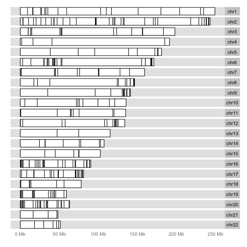
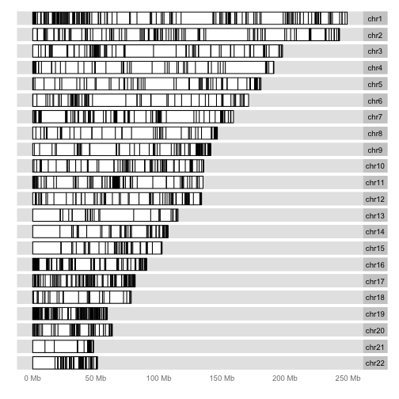

There are many interesting approaches to visualizing genome-scale data.
Two major packages in Bioconductor are Gviz and ggbio.  Both represent
significant efforts at bridging the gap between graphics facilities
and various genomic data structures.

ggbio's `autoplot` method can be very useful for broad overviews.
For a GRanges instance, each range for which data exists can be
depicted as a band on the chromosome.  The karyogram layout
gives a genome-wide view, but it can be important to control
the handling of extra-chromosomal sequence levels.


```
## Loading required package: methods
## Loading required package: stats4
## Loading required package: BiocGenerics
## Loading required package: parallel
## 
## Attaching package: 'BiocGenerics'
## 
## The following objects are masked from 'package:parallel':
## 
##     clusterApply, clusterApplyLB, clusterCall, clusterEvalQ,
##     clusterExport, clusterMap, parApply, parCapply, parLapply,
##     parLapplyLB, parRapply, parSapply, parSapplyLB
## 
## The following object is masked from 'package:stats':
## 
##     xtabs
## 
## The following objects are masked from 'package:base':
## 
##     anyDuplicated, append, as.data.frame, as.vector, cbind,
##     colnames, do.call, duplicated, eval, evalq, Filter, Find, get,
##     intersect, is.unsorted, lapply, Map, mapply, match, mget,
##     order, paste, pmax, pmax.int, pmin, pmin.int, Position, rank,
##     rbind, Reduce, rep.int, rownames, sapply, setdiff, sort,
##     table, tapply, union, unique, unlist, unsplit
## 
## Loading required package: S4Vectors
## Loading required package: IRanges
## Loading required package: ggplot2
## Need specific help about ggbio? try mailing 
##  the maintainer or visit http://tengfei.github.com/ggbio/
## 
## Attaching package: 'ggbio'
## 
## The following objects are masked from 'package:ggplot2':
## 
##     geom_bar, geom_rect, geom_segment, ggsave, stat_bin,
##     stat_identity, xlim
```

```r
library(ERBS)
data(HepG2)
library(GenomeInfoDb)  # trim all but autosomal chroms
seqlevels(HepG2, force=TRUE) = paste0("chr", 1:22)
data(GM12878)
seqlevels(GM12878, force=TRUE) = paste0("chr", 1:22)
library(ggbio)
autoplot(HepG2, layout="karyogram", main="ESRRA binding on HepG2")
```

```
## Scale for 'x' is already present. Adding another scale for 'x', which will replace the existing scale.
## Scale for 'x' is already present. Adding another scale for 'x', which will replace the existing scale.
```

 

Notice that the title is not printed, currently a bug.


```r
autoplot(GM12878, layout="karyogram", main="ESRRA binding on GM12878")
```

```
## Scale for 'x' is already present. Adding another scale for 'x', which will replace the existing scale.
## Scale for 'x' is already present. Adding another scale for 'x', which will replace the existing scale.
```

 
