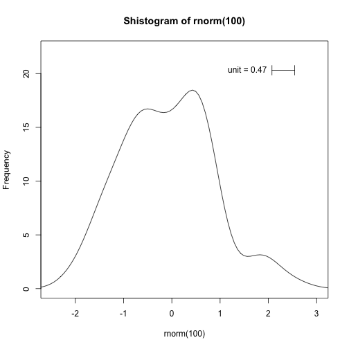

```r
# install.packages('devtools')
library(devtools)
# install_github('rafalib','ririzarr')
library(rafalib)
```

```
## Loading required package: RColorBrewer
```

```r
mypar
```

```
## function (a = 1, b = 1, brewer.n = 8, brewer.name = "Dark2", 
##     cex.lab = 2, cex.main = 2, cex.axis = 1.5, mar = c(5.1, 5.1, 
##         3.5, 2.1), mgp = c(3, 1, 0), ...) 
## {
##     require(RColorBrewer)
##     par(mar = mar, mgp = mgp, cex.lab = cex.lab, cex.main = cex.main, 
##         cex.axis = cex.axis)
##     par(mfrow = c(a, b), ...)
##     palette(brewer.pal(brewer.n, brewer.name))
## }
## <environment: namespace:rafalib>
```

```r
shist(rnorm(100))
```

 


