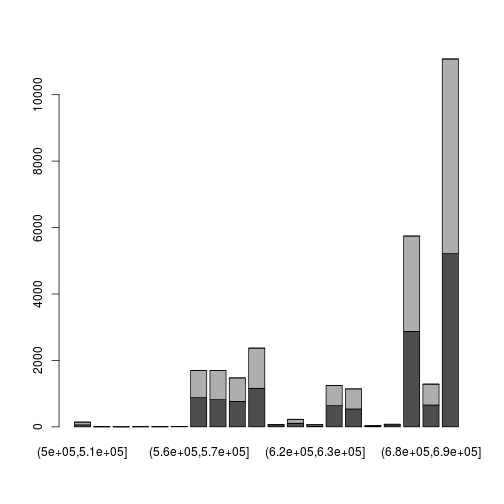

There are two main packages for working with NGS data in R: the *Rsamtools* package and the *GenomicAlignments* package. You can think of the difference as:

* *Rsamtools* provides raw access to the information in NGS data files
* *GenomicAlignments* uses the Rsamtools functions to provide NGS data in R as high-level Bioconductor objects (based on *GRanges* for example). We will see more examples below.

## Rsamtools description

The Rsamtools package has the description:

> ... provides an interface to the 'samtools', 'bcftools', and 'tabix' utilities for manipulating SAM (Sequence Alignment / Map), FASTA, binary variant call (BCF) and compressed indexed tab-delimited (tabix) files.

## What are BAM files?

You might not be familiar with all these formats, but the ones we are interested in for now are SAM and it's compressed form BAM. We will refer here to BAM files, because these are the kind of files which are kept most often because they are smaller (there is a [SAMtools](http://samtools.sourceforge.net/) utility for converting SAM to BAM and BAM to SAM).

SAM and BAM files contain information about the alignment of NGS reads to a reference genome. These files are produced by alignment software, which take as input:

* the FASTQ files from the sequencing machine (either 1 file for a single-end sequencing sample, or 2 files for a paired-end sequencing sample).
* an genomic index, which is typically produced by special software packaged with the alignment software. The genomic index is created from the reference genome. Sometimes the genomic index files for popular reference genomes can be downloaded.

Note: alignment software is typically application specific. In particular, alignment programs for RNA-seq are different than those for genomic DNA sequencing, because in the case of the former, it is expected that reads might fall on exon-exon boundaries. The read will not contain intron sequence, because it is typically the mature, spliced mRNA which is converted to cDNA and sequenced, and the introns are already spliced out of this molecule. This is not a concern for genomic DNA sequencing.

## How to import NGS data using Rsamtools

We will use example BAM files from the *pasillaBamSubset* package to examine the Rsamtools functions:


```r
library(pasillaBamSubset)
library(Rsamtools)
filename <- untreated1_chr4()
```

We can create a `BamFile` object using the function `BamFile`, which allows other functions to know how to process the file.


```r
(bf <- BamFile(filename))
```

```
## class: BamFile 
## path: /usr/local/lib/R/site-library/pasillaBamSubset.../untreated1_chr4.bam
## index: /usr/local/lib/R/site-library/pasillaBamS.../untreated1_chr4.bam.bai
## isOpen: FALSE 
## yieldSize: NA 
## obeyQname: FALSE 
## asMates: FALSE 
## qnamePrefixEnd: NA 
## qnameSuffixStart: NA
```

We can ask about information on the chromosomes which are declared in the header of the BAM file:


```r
seqinfo(bf)
```

```
## Seqinfo object with 8 sequences from an unspecified genome:
##   seqnames seqlengths isCircular genome
##   chr2L      23011544         NA   <NA>
##   chr2R      21146708         NA   <NA>
##   chr3L      24543557         NA   <NA>
##   chr3R      27905053         NA   <NA>
##   chr4        1351857         NA   <NA>
##   chrM          19517         NA   <NA>
##   chrX       22422827         NA   <NA>
##   chrYHet      347038         NA   <NA>
```

```r
(sl <- seqlengths(bf))
```

```
##    chr2L    chr2R    chr3L    chr3R     chr4     chrM     chrX  chrYHet 
## 23011544 21146708 24543557 27905053  1351857    19517 22422827   347038
```

A summary of the kind of alignments in the file can be generated:


```r
quickBamFlagSummary(bf)
```

```
##                                 group |    nb of |    nb of | mean / max
##                                    of |  records |   unique | records per
##                               records | in group |   QNAMEs | unique QNAME
## All records........................ A |   204355 |   190770 | 1.07 / 10
##   o template has single segment.... S |   204355 |   190770 | 1.07 / 10
##   o template has multiple segments. M |        0 |        0 |   NA / NA
##       - first segment.............. F |        0 |        0 |   NA / NA
##       - last segment............... L |        0 |        0 |   NA / NA
##       - other segment.............. O |        0 |        0 |   NA / NA
## 
## Note that (S, M) is a partitioning of A, and (F, L, O) is a partitioning of M.
## Indentation reflects this.
## 
## Details for group S:
##   o record is mapped.............. S1 |   204355 |   190770 | 1.07 / 10
##       - primary alignment......... S2 |   204355 |   190770 | 1.07 / 10
##       - secondary alignment....... S3 |        0 |        0 |   NA / NA
##   o record is unmapped............ S4 |        0 |        0 |   NA / NA
```

## Specifying: what and which

A number of functions in Rsamtools take an argument `param`, which expects a `ScanBamParam` specification. There are full details available by looking up `?scanBamParam`, but two important options are:

* what - what kind of information to extract?
* which - which ranges of alignments to extract?

BAM files are often paired with an index file (if not they can be indexed from R with `indexBam`), and so we can quickly pull out information about reads from a particular genomic range. Here we count the number of records (reads) on chromosome 4:


```r
(gr <- GRanges("chr4",IRanges(1, sl["chr4"])))
```

```
## GRanges object with 1 range and 0 metadata columns:
##       seqnames       ranges strand
##          <Rle>    <IRanges>  <Rle>
##   [1]     chr4 [1, 1351857]      *
##   -------
##   seqinfo: 1 sequence from an unspecified genome; no seqlengths
```

```r
countBam(bf, param=ScanBamParam(which = gr))
```

```
##   space start     end   width                file records nucleotides
## 1  chr4     1 1351857 1351857 untreated1_chr4.bam  204355    15326625
```

We can pull out all the information with `scanBam`. Here, we specify a new `BamFile`, and use the `yieldSize` argument. This limits the number of reads which will be extracted to 5 at a time. Each time we call `scanBam` we will get 5 more reads, until there are no reads left. If we do not specify `yieldSize` we get all the reads at once. `yieldSize` is useful mainly for two reasons: (1) for limiting the number of reads at a time, for example, 1 or 2 million reads at a time, to keep within the memory limits of a given machine, say in the 5 GB range (2) or, for debugging, working through small examples while writing software.


```r
reads <- scanBam(BamFile(filename, yieldSize=5))
```

## Examining the output of scanBam

`reads` is a list of lists. The outer list indexes over the ranges in the `which` command. Since we didn't specify `which`, here it is a list of length 1. The inner list contains different pieces of information from the BAM file. Since we didn't specify `what` we get everything. See `?scanBam` for the possible kinds of information to specify for `what`.


```r
class(reads)
```

```
## [1] "list"
```

```r
names(reads[[1]])
```

```
##  [1] "qname"  "flag"   "rname"  "strand" "pos"    "qwidth" "mapq"  
##  [8] "cigar"  "mrnm"   "mpos"   "isize"  "seq"    "qual"
```

```r
reads[[1]]$pos # the aligned start position
```

```
## [1] 892 919 924 936 949
```

```r
reads[[1]]$rname # the chromosome
```

```
## [1] chr4 chr4 chr4 chr4 chr4
## Levels: chr2L chr2R chr3L chr3R chr4 chrM chrX chrYHet
```

```r
reads[[1]]$strand # the strand
```

```
## [1] - - + + +
## Levels: + - *
```

```r
reads[[1]]$qwidth # the width of the read
```

```
## [1] 75 75 75 75 75
```

```r
reads[[1]]$seq # the sequence of the read
```

```
##   A DNAStringSet instance of length 5
##     width seq
## [1]    75 CTGTGGTGACCAACACCACAGAATGGTTCGG...GTTCCCTGCCCCTTTCCTGGCTAGGTTGTCC
## [2]    75 TCGGGCCCAATTAGAGGGTTCCCTGCCCCTT...GTCCGCTAGCTCATTTCCTGGGCTGTTGTTG
## [3]    75 CCCAATTAGAGGATTCTCTGCCCCTTTCCTG...GTAGCTCATTTCCCGGGATGTTGTTGTGTCC
## [4]    75 GTTCTCTGCCCCTTTCCTGGCTAGGTTGTCC...CCGAGATGTTGTTGTGTCCCGGGACCCACCT
## [5]    75 TTCCTGGCTAGGTTGTCCGCTAGCTCATTTC...GTGTCCCGGGACACACCTTATTGTGAGTTTG
```

Here we give an example of specifying `what` and `which`:


```r
gr <- GRanges("chr4",IRanges(500000, 700000))
reads <- scanBam(bf, param=ScanBamParam(what=c("pos","strand"), which=gr))
```

How are the start positions distributed:


```r
hist(reads[[1]]$pos)
```

 

A slightly more complicated picture: split positions by strand, tabulate in bins and make a stacked barplot:


```r
readsByStrand <- split(reads[[1]]$pos, reads[[1]]$strand)
myHist <- function(x) table(cut(x, 50:70 * 10000 ))
tab <- sapply(readsByStrand, myHist)
barplot( t(tab) )
```

 

## GenomicAlignments description

The GenomicAlignments package is described with:

> Provides efficient containers for storing and manipulating short genomic alignments (typically obtained by aligning short reads to a reference genome). This includes read counting, computing the coverage, junction detection, and working with the nucleotide content of the alignments.

This package defines the classes and functions which are used to represent genomic alignments in Bioconductor. Two of the most important functions in GenomicAlignments are:

* readGAlignments - this and other similarly named functions read data from BAM files
* summarizeOverlaps - this function simplifies counting reads in genomic ranges across one or more files

The `summarizeOverlaps` function is covered in more depth in the [read counting](read_counting.html) page. `summarizeOverlaps` is a function which wraps up other functions in GenomicAlignments function for counting reads.

Here we will examine the output of the `readGAlignments` function, continuing with the BAM file from the pasilla dataset.


```r
library(GenomicAlignments)
```


```r
(ga <- readGAlignments(bf))
```

```
## GAlignments object with 204355 alignments and 0 metadata columns:
##            seqnames strand       cigar    qwidth     start       end
##               <Rle>  <Rle> <character> <integer> <integer> <integer>
##        [1]     chr4      -         75M        75       892       966
##        [2]     chr4      -         75M        75       919       993
##        [3]     chr4      +         75M        75       924       998
##        [4]     chr4      +         75M        75       936      1010
##        [5]     chr4      +         75M        75       949      1023
##        ...      ...    ...         ...       ...       ...       ...
##   [204351]     chr4      +         75M        75   1348268   1348342
##   [204352]     chr4      +         75M        75   1348268   1348342
##   [204353]     chr4      +         75M        75   1348268   1348342
##   [204354]     chr4      -         75M        75   1348449   1348523
##   [204355]     chr4      -         75M        75   1350124   1350198
##                width     njunc
##            <integer> <integer>
##        [1]        75         0
##        [2]        75         0
##        [3]        75         0
##        [4]        75         0
##        [5]        75         0
##        ...       ...       ...
##   [204351]        75         0
##   [204352]        75         0
##   [204353]        75         0
##   [204354]        75         0
##   [204355]        75         0
##   -------
##   seqinfo: 8 sequences from an unspecified genome
```

```r
length(ga)
```

```
## [1] 204355
```

Note that we can extract the *GRanges* object within the *GAlignments* object, although we will see below that we can often work directly with the *GAlignments* object.


```r
granges(ga[1])
```

```
## GRanges object with 1 range and 0 metadata columns:
##       seqnames     ranges strand
##          <Rle>  <IRanges>  <Rle>
##   [1]     chr4 [892, 966]      -
##   -------
##   seqinfo: 8 sequences from an unspecified genome
```

Some of our familiar GenomicRanges functions work on GAlignments: we can use `findOverlaps`, `countOverlaps` and `%over%` directly on the *GAlignments* object. Note that location of `ga` and `gr` in the calls below:


```r
gr <- GRanges("chr4", IRanges(700000, 800000))
(fo <- findOverlaps(ga, gr)) # which reads over this range
```

```
## Hits of length 6465
## queryLength: 204355
## subjectLength: 1
##      queryHits subjectHits 
##       <integer>   <integer> 
##  1       127157           1 
##  2       127238           1 
##  3       127240           1 
##  4       127242           1 
##  5       127243           1 
##  ...        ...         ... 
##  6461    144660           1 
##  6462    144661           1 
##  6463    144662           1 
##  6464    144663           1 
##  6465    144664           1
```

```r
countOverlaps(gr, ga) # count overlaps of range with the reads
```

```
## [1] 6465
```

```r
table(ga %over% gr) # logical vector of read overlaps with the range
```

```
## 
##  FALSE   TRUE 
## 197890   6465
```

If we had run `countOverlaps(ga, gr)` it would return an integer vector with the number of overlaps for each read with the range in `gr`.

