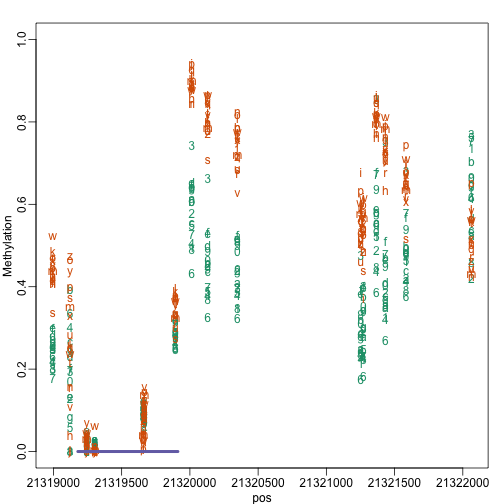
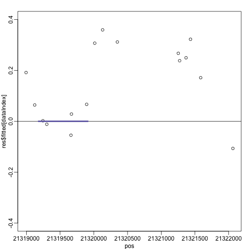

```r
library(minfi) ##Bioc
```

```
## Loading required package: methods
## Loading required package: BiocGenerics
## Loading required package: parallel
## 
## Attaching package: 'BiocGenerics'
## 
## The following objects are masked from 'package:parallel':
## 
##     clusterApply, clusterApplyLB, clusterCall, clusterEvalQ,
##     clusterExport, clusterMap, parApply, parCapply, parLapply,
##     parLapplyLB, parRapply, parSapply, parSapplyLB
## 
## The following object is masked from 'package:stats':
## 
##     xtabs
## 
## The following objects are masked from 'package:base':
## 
##     anyDuplicated, append, as.data.frame, as.vector, cbind,
##     colnames, do.call, duplicated, eval, evalq, Filter, Find, get,
##     intersect, is.unsorted, lapply, Map, mapply, match, mget,
##     order, paste, pmax, pmax.int, pmin, pmin.int, Position, rank,
##     rbind, Reduce, rep.int, rownames, sapply, setdiff, sort,
##     table, tapply, union, unique, unlist, unsplit
## 
## Loading required package: Biobase
## Welcome to Bioconductor
## 
##     Vignettes contain introductory material; view with
##     'browseVignettes()'. To cite Bioconductor, see
##     'citation("Biobase")', and for packages 'citation("pkgname")'.
## 
## Loading required package: lattice
## Loading required package: GenomicRanges
## Loading required package: S4Vectors
## Loading required package: stats4
## Loading required package: IRanges
## Loading required package: GenomeInfoDb
## Loading required package: Biostrings
## Loading required package: XVector
## Loading required package: bumphunter
## Loading required package: foreach
## Loading required package: iterators
## Loading required package: locfit
## locfit 1.5-9.1 	 2013-03-22
## Setting options('download.file.method.GEOquery'='auto')
```

```r
library(IlluminaHumanMethylation450kmanifest) ##Bioc
library(doParallel) ##CRAN
library(pkgmaker)
```

```
## Loading required package: registry
## 
## Attaching package: 'pkgmaker'
## 
## The following object is masked from 'package:S4Vectors':
## 
##     new2
## 
## The following object is masked from 'package:base':
## 
##     isNamespaceLoaded
```


```r
path="/Users/ririzarr/myDocuments/teaching/HarvardX/tcgaMethylationSubset"
targets=read.delim(file.path (path,"targets.txt"),as.is=TRUE)
table(targets$Tissue,targets$Status)
```

```
##         
##          cancer normal
##   breast     13     13
##   colon      17     17
##   lung       19     19
```

For illustration we will read in the normal colon and lung


```r
index = which( targets$Status=="normal" & targets$Tissue%in%c("colon","lung") )
targets = targets[index,]
```


```r
dat = read.450k.exp(base=path,targets = targets, verbose=TRUE)
```

```
## [read.450k] Reading 5775041068_R01C02_Grn.idat 
## [read.450k] Reading 5775041068_R04C01_Grn.idat 
## [read.450k] Reading 5775041068_R06C01_Grn.idat 
## [read.450k] Reading 5775041068_R02C02_Grn.idat 
## [read.450k] Reading 5775041068_R03C02_Grn.idat 
## [read.450k] Reading 5775041068_R01C01_Grn.idat 
## [read.450k] Reading 5775041068_R02C01_Grn.idat 
## [read.450k] Reading 5775041068_R03C01_Grn.idat 
## [read.450k] Reading 5775041068_R05C01_Grn.idat 
## [read.450k] Reading 5775041088_R04C01_Grn.idat 
## [read.450k] Reading 5775041084_R05C02_Grn.idat 
## [read.450k] Reading 5775041065_R02C02_Grn.idat 
## [read.450k] Reading 5775041088_R02C02_Grn.idat 
## [read.450k] Reading 5775041065_R04C02_Grn.idat 
## [read.450k] Reading 5775041007_R01C02_Grn.idat 
## [read.450k] Reading 5775041084_R06C02_Grn.idat 
## [read.450k] Reading 5775041084_R03C02_Grn.idat 
## [read.450k] Reading 6929671086_R04C02_Grn.idat 
## [read.450k] Reading 6285625064_R03C02_Grn.idat 
## [read.450k] Reading 6285625087_R05C02_Grn.idat 
## [read.450k] Reading 6285625087_R02C02_Grn.idat 
## [read.450k] Reading 6285625087_R06C02_Grn.idat 
## [read.450k] Reading 6285625099_R05C02_Grn.idat 
## [read.450k] Reading 6285625099_R02C02_Grn.idat 
## [read.450k] Reading 6285625090_R06C01_Grn.idat 
## [read.450k] Reading 6285625087_R04C02_Grn.idat 
## [read.450k] Reading 6929671122_R06C01_Grn.idat 
## [read.450k] Reading 6285625090_R03C02_Grn.idat 
## [read.450k] Reading 6285625090_R02C01_Grn.idat 
## [read.450k] Reading 6264488083_R05C01_Grn.idat 
## [read.450k] Reading 6285625090_R01C01_Grn.idat 
## [read.450k] Reading 6285625099_R04C01_Grn.idat 
## [read.450k] Reading 6285625064_R03C01_Grn.idat 
## [read.450k] Reading 6285625099_R01C02_Grn.idat 
## [read.450k] Reading 6285625095_R01C01_Grn.idat 
## [read.450k] Reading 6285625090_R04C02_Grn.idat 
## [read.450k] Reading 5775041068_R01C02_Red.idat 
## [read.450k] Reading 5775041068_R04C01_Red.idat 
## [read.450k] Reading 5775041068_R06C01_Red.idat 
## [read.450k] Reading 5775041068_R02C02_Red.idat 
## [read.450k] Reading 5775041068_R03C02_Red.idat 
## [read.450k] Reading 5775041068_R01C01_Red.idat 
## [read.450k] Reading 5775041068_R02C01_Red.idat 
## [read.450k] Reading 5775041068_R03C01_Red.idat 
## [read.450k] Reading 5775041068_R05C01_Red.idat 
## [read.450k] Reading 5775041088_R04C01_Red.idat 
## [read.450k] Reading 5775041084_R05C02_Red.idat 
## [read.450k] Reading 5775041065_R02C02_Red.idat 
## [read.450k] Reading 5775041088_R02C02_Red.idat 
## [read.450k] Reading 5775041065_R04C02_Red.idat 
## [read.450k] Reading 5775041007_R01C02_Red.idat 
## [read.450k] Reading 5775041084_R06C02_Red.idat 
## [read.450k] Reading 5775041084_R03C02_Red.idat 
## [read.450k] Reading 6929671086_R04C02_Red.idat 
## [read.450k] Reading 6285625064_R03C02_Red.idat 
## [read.450k] Reading 6285625087_R05C02_Red.idat 
## [read.450k] Reading 6285625087_R02C02_Red.idat 
## [read.450k] Reading 6285625087_R06C02_Red.idat 
## [read.450k] Reading 6285625099_R05C02_Red.idat 
## [read.450k] Reading 6285625099_R02C02_Red.idat 
## [read.450k] Reading 6285625090_R06C01_Red.idat 
## [read.450k] Reading 6285625087_R04C02_Red.idat 
## [read.450k] Reading 6929671122_R06C01_Red.idat 
## [read.450k] Reading 6285625090_R03C02_Red.idat 
## [read.450k] Reading 6285625090_R02C01_Red.idat 
## [read.450k] Reading 6264488083_R05C01_Red.idat 
## [read.450k] Reading 6285625090_R01C01_Red.idat 
## [read.450k] Reading 6285625099_R04C01_Red.idat 
## [read.450k] Reading 6285625064_R03C01_Red.idat 
## [read.450k] Reading 6285625099_R01C02_Red.idat 
## [read.450k] Reading 6285625095_R01C01_Red.idat 
## [read.450k] Reading 6285625090_R04C02_Red.idat 
## [read.450k] Read idat files in  39.762 seconds
## [read.450k] Creating data matrices ... done in 4.107 seconds
## [read.450k] Instantiating final object ... done in 2.433 seconds
```

```r
dat = preprocessIllumina(dat)
dat = mapToGenome(dat)
```

```
## Loading required package: IlluminaHumanMethylation450kanno.ilmn12.hg19
```

```r
dat = ratioConvert(dat,type="Illumina")
```


```r
library(doParallel)
detectCores()
```

```
## [1] 4
```

```r
registerDoParallel(cores = 4)
```


```r
tissue =pData(dat)$Tissue
X= model.matrix(~tissue)
index = which(seqnames(dat)=="chr22")
dat = dat[index,] ## for illustrative purposes
res=bumphunter(dat,X,cutoff=0.1,B=1000)
```

```
## [bumphunterEngine] Parallelizing using 4 workers/cores (backend: doParallelMC, version: 1.0.8).
## [bumphunterEngine] Computing coefficients.
## [bumphunterEngine] Performing 1000 permutations.
## [bumphunterEngine] Computing marginal permutation p-values.
## [bumphunterEngine] cutoff: 0.1
## [bumphunterEngine] Finding regions.
## [bumphunterEngine] Found 1084 bumps.
## [bumphunterEngine] Computing regions for each permutation.
## Loading required package: rngtools
## [bumphunterEngine] Estimating p-values and FWER.
```

```r
head(res$tab)
```

```
##        chr    start      end      value     area cluster indexStart
## 877  chr22 30476089 30476525 -0.3120382 3.432420    1237       2985
## 177  chr22 24890330 24891166  0.2542534 3.305294     887       2106
## 565  chr22 44568387 44568913  0.2341722 2.107550    2606       6520
## 406  chr22 38506589 38506781  0.3310945 1.986567    1879       4630
## 1004 chr22 45608345 45608692 -0.2176403 1.958763    2687       6738
## 387  chr22 37975941 37976192  0.3856820 1.928410    1789       4355
##      indexEnd  L clusterL p.value fwer  p.valueArea fwerArea
## 877      2995 11       11       0    0 0.000000e+00    0.000
## 177      2118 13       17       0    0 0.000000e+00    0.000
## 565      6528  9       10       0    0 0.000000e+00    0.000
## 406      4635  6        6       0    0 5.307574e-05    0.002
## 1004     6746  9       10       0    0 5.307574e-05    0.002
## 387      4359  5        7       0    0 5.307574e-05    0.002
```


```r
library(rafalib)
library(AnnotationHub)
cgi = AnnotationHub()[["AH5086"]]
```


```r
tab = res$tab[res$tab$fwer <= 0.05,]
tab = makeGRangesFromDataFrame(tab,keep.extra.columns = TRUE)

map=distanceToNearest(tab,cgi)
d = mcols(map)$dist
prop.table( table( cut(d,c(0,1,2000,5000,Inf),include.lowest=TRUE,right=FALSE) ))
```

```
## 
##         [0,1)     [1,2e+03) [2e+03,5e+03)   [5e+03,Inf] 
##     0.2960894     0.3016760     0.1508380     0.2513966
```

```r
null =  granges(dat)
nulltab = makeGRangesFromDataFrame(null,keep.extra.columns = TRUE)

nullmap=distanceToNearest(nulltab,cgi)
nulld = mcols(nullmap)$dist
prop.table( table( cut(nulld,c(0,1,2000,5000,Inf),include.lowest=TRUE,right=FALSE) ))
```

```
## 
##         [0,1)     [1,2e+03) [2e+03,5e+03)   [5e+03,Inf] 
##     0.4168616     0.2657858     0.1460477     0.1713050
```


```r
beta = getBeta(dat)
cols = as.factor(pData(dat)$Tissue)

tab = tab[order(-mcols(tab)$area)]
tab = tab+3000 ##add 3000 to each side
mypar2(1,1)
i=17
dataIndex = which(granges(dat)%over%tab[i])
cgiIndex = which(cgi%over%tab[i])
thecgi = cgi[cgiIndex]
    
pos = start(dat)[dataIndex]
xlim=range(c(pos,start(thecgi),end(thecgi)) )
  
y = beta[dataIndex,]
  
matplot(pos,y,col=as.numeric(cols) , xlim=xlim, ylim=c(0,1),ylab="Methylation")  
apply(cbind(start(thecgi),end(thecgi)),1,function(x) segments(x[1],0,x[2],0,lwd=4,col=3))
```

 

```
## NULL
```

```r
plot(pos,res$fitted[dataIndex],xlim=xlim,ylim=c(-0.4,0.4))
abline(h=0)
apply(cbind(start(thecgi),end(thecgi)),1,function(x) segments(x[1],0,x[2],0,lwd=4,col=3))
```

 

```
## NULL
```


```r
table(getIslandStatus(dat))
```

```
## 
##  Island OpenSea   Shelf   Shore 
##    3565    1553    1161    2273
```


