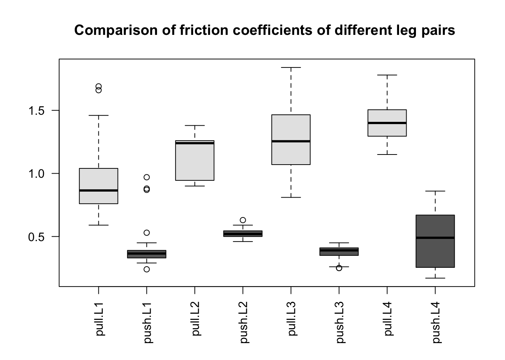
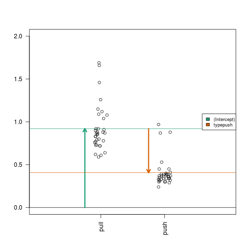
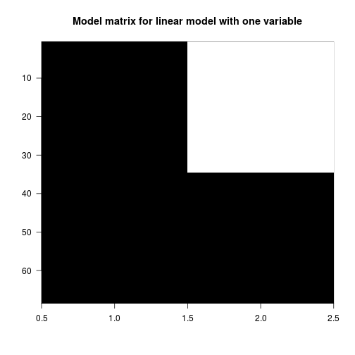
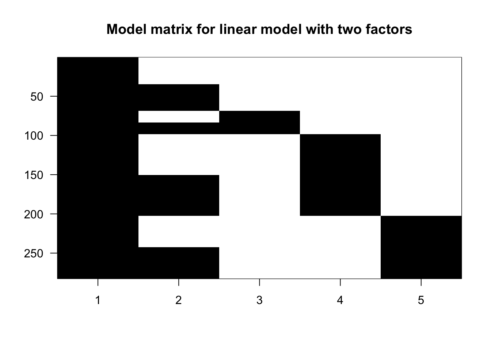
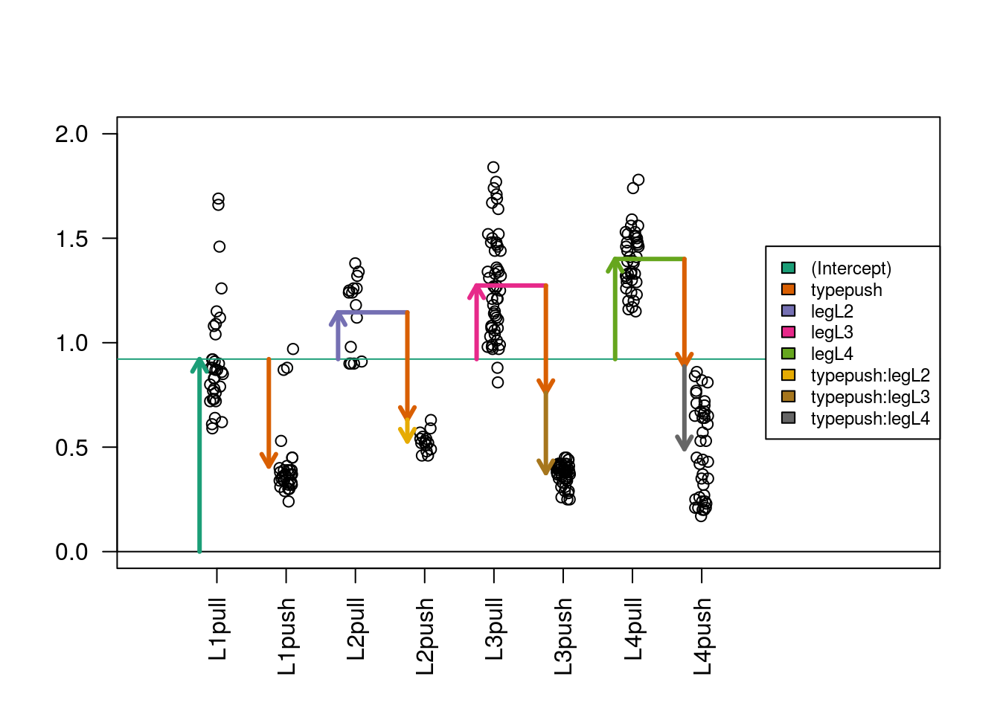
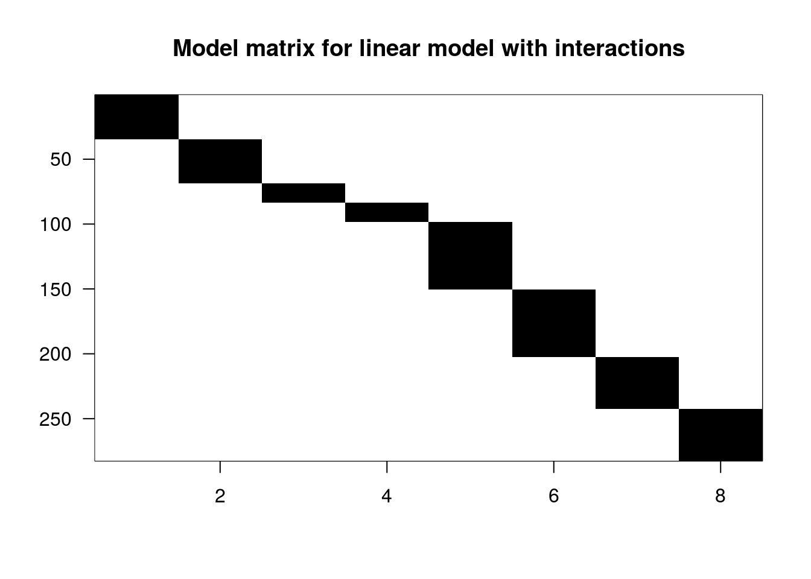
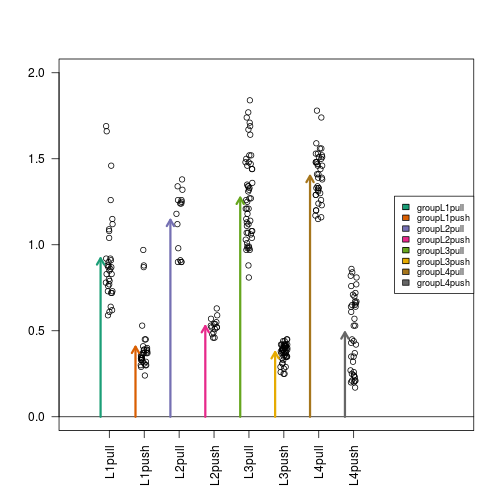

For learning about linear models, we will be using a datasest which compares the different frictional coefficients on the different legs on a spider, and whether more friction comes from a pushing or pulling motion of the leg. The original paper from which the data was provided is:

Jonas O. Wolff  & Stanislav N. Gorb, [Radial arrangement of Janus-like setae permits friction control in spiders](http://dx.doi.org/10.1038/srep01101), Scientific Reports, 22 January 2013.

The abstract of the paper says, 

> The hunting spider Cupiennius salei (Arachnida, Ctenidae) possesses hairy attachment pads (claw tufts) at its distal legs, consisting of directional branched setae... Friction of claw tufts on smooth glass was measured to reveal the functional effect of seta arrangement within the pad.

Figure 1 includes some pretty cool electron microscope images of the tufts. We are intereseted in the comparisons in Figure 4, where the pulling and pushing motions are compared for different leg pairs (for an example of pushing and pulling see the top of Figure 3). We can recreate Figure 4 of the paper, by loading the data and calling boxplot():


```r
url <- "https://raw.githubusercontent.com/genomicsclass/dagdata/master/inst/extdata/spider_wolff_gorb_2013.csv"
filename <- "spider_wolff_gorb_2013.csv"
library(downloader)
if (!file.exists(filename)) download(url, filename)
spider <- read.csv(filename, skip=1)
boxplot(spider$friction ~ spider$type * spider$leg, 
        col=c("grey90","grey40"), las=2, 
        main="Comparison of friction coefficients of different leg pairs ")
```

 

## Initial visual inspection of the data

What we can see immediately, are two trends: 

* pulling motion has a higher frictional coefficient than pushing motion
* the leg pairs to the back of the spider (L4 being the last) generally have higher pulling frictional coefficients.

Another thing to notice is that the groups have different spread, what we call *within-group variance*. This is somewhat of a problem for the kinds of linear models we will explore below, because we will assume that around the fitted values $\hat{Y}_i$, the errors $\varepsilon_i$ are distributed identically, meaning the same variance within each group. The consequence of ignoring the different variance is that comparisons between the groups with small variances with be overly "conservative" (because the overall estimate of variance is larger than these groups), and comparisons between the groups with large variances will be overly confident.

An alternative test for comparing groups would be t-tests without the equal variance assumption, using a "Welch" or "Satterthwaite approximation", or a test of a shift in distribution, such as the Mann-Whitney-Wilcoxon test.

However, we will continue, and show the different kinds of linear models using this dataset, setting aside the issue of different within-group variances.

## A linear model with one variable

Note: this is a not a good approach for analysis, but we show here for demonstration purposes. It ignores the information we have regarding the different leg type, and so it loses power. We will show better approaches below.


```r
spider.sub <- spider[spider$leg == "L1",]
fit <- lm(friction ~ type, data=spider.sub)
summary(fit)
```

```
## 
## Call:
## lm(formula = friction ~ type, data = spider.sub)
## 
## Residuals:
##      Min       1Q   Median       3Q      Max 
## -0.33147 -0.10735 -0.04941 -0.00147  0.76853 
## 
## Coefficients:
##             Estimate Std. Error t value Pr(>|t|)    
## (Intercept)  0.92147    0.03827  24.078  < 2e-16 ***
## typepush    -0.51412    0.05412  -9.499  5.7e-14 ***
## ---
## Signif. codes:  0 '***' 0.001 '**' 0.01 '*' 0.05 '.' 0.1 ' ' 1
## 
## Residual standard error: 0.2232 on 66 degrees of freedom
## Multiple R-squared:  0.5776,	Adjusted R-squared:  0.5711 
## F-statistic: 90.23 on 1 and 66 DF,  p-value: 5.698e-14
```

```r
(coefs <- coef(fit))
```

```
## (Intercept)    typepush 
##   0.9214706  -0.5141176
```

```r
s <- split(spider.sub$friction, spider.sub$type)
mean(s[["pull"]])
```

```
## [1] 0.9214706
```

```r
mean(s[["push"]]) - mean(s[["pull"]])
```

```
## [1] -0.5141176
```


```r
X <- model.matrix(~ type, data=spider)
colnames(X)
```

```
## [1] "(Intercept)" "typepush"
```

```r
head(X)
```

```
##   (Intercept) typepush
## 1           1        0
## 2           1        0
## 3           1        0
## 4           1        0
## 5           1        0
## 6           1        0
```

```r
# library(devtools); install_github("ririzarr/rafalib")
library(rafalib)
imagemat(X, main="Model matrix for linear model with interactions")
```

 

### Examining the coefficients


```r
stripchart(split(spider.sub$friction, spider.sub$type), 
           vertical=TRUE, pch=1, method="jitter", las=2, xlim=c(0,3), ylim=c(0,2))
a <- -0.25
lgth <- .1
library(RColorBrewer)
cols <- brewer.pal(3,"Dark2")
abline(h=0)
arrows(1+a,0,1+a,coefs[1],lwd=3,col=cols[1],length=lgth)
abline(h=coefs[1],col=cols[1])
arrows(2+a,coefs[1],2+a,coefs[1]+coefs[2],lwd=3,col=cols[2],length=lgth)
abline(h=coefs[1]+coefs[2],col=cols[2])
legend("right",names(coefs),fill=cols,cex=.75,bg="white")
```

 

## A linear model with two variables


```r
X <- model.matrix(~ type + leg, data=spider)
colnames(X)
```

```
## [1] "(Intercept)" "typepush"    "legL2"       "legL3"       "legL4"
```

```r
head(X)
```

```
##   (Intercept) typepush legL2 legL3 legL4
## 1           1        0     0     0     0
## 2           1        0     0     0     0
## 3           1        0     0     0     0
## 4           1        0     0     0     0
## 5           1        0     0     0     0
## 6           1        0     0     0     0
```

```r
imagemat(X, main="Model matrix for linear model with 2 factors")
```

 

```r
fit2 <- lm(friction ~ type + leg, data=spider)
summary(fit2)
```

```
## 
## Call:
## lm(formula = friction ~ type + leg, data = spider)
## 
## Residuals:
##      Min       1Q   Median       3Q      Max 
## -0.46392 -0.13441 -0.00525  0.10547  0.69509 
## 
## Coefficients:
##             Estimate Std. Error t value Pr(>|t|)    
## (Intercept)  1.05392    0.02816  37.426  < 2e-16 ***
## typepush    -0.77901    0.02482 -31.380  < 2e-16 ***
## legL2        0.17192    0.04569   3.763 0.000205 ***
## legL3        0.16049    0.03251   4.937 1.37e-06 ***
## legL4        0.28134    0.03438   8.183 1.01e-14 ***
## ---
## Signif. codes:  0 '***' 0.001 '**' 0.01 '*' 0.05 '.' 0.1 ' ' 1
## 
## Residual standard error: 0.2084 on 277 degrees of freedom
## Multiple R-squared:  0.7916,	Adjusted R-squared:  0.7886 
## F-statistic:   263 on 4 and 277 DF,  p-value: < 2.2e-16
```

```r
(coefs <- coef(fit2))
```

```
## (Intercept)    typepush       legL2       legL3       legL4 
##   1.0539153  -0.7790071   0.1719216   0.1604921   0.2813382
```

### Reminder: the mathematics behind lm()

$$ \hat{\beta} = (X^t X)^{-1} X^t y $$


```r
y <- spider$friction
X <- model.matrix(~ type + leg, data=spider)
beta <- solve(t(X) %*% X) %*% t(X) %*% y
beta
```

```
##                   [,1]
## (Intercept)  1.0539153
## typepush    -0.7790071
## legL2        0.1719216
## legL3        0.1604921
## legL4        0.2813382
```

```r
t(beta)
```

```
##      (Intercept)   typepush     legL2     legL3     legL4
## [1,]    1.053915 -0.7790071 0.1719216 0.1604921 0.2813382
```

```r
coefs
```

```
## (Intercept)    typepush       legL2       legL3       legL4 
##   1.0539153  -0.7790071   0.1719216   0.1604921   0.2813382
```

### Examining the coefficients

We might question the assumptions of a simple linear model here, since it supposes that the residuals, $r_i = hat{Y_i} - Y_i$, have the same variance in each group.


```r
spider$group <- factor(paste0(spider$leg, spider$type))
stripchart(split(spider$friction, spider$group), 
           vertical=TRUE, pch=1, method="jitter", las=2, xlim=c(0,11), ylim=c(0,2))
cols <- brewer.pal(5,"Dark2")
abline(h=0)
arrows(1+a,0,1+a,coefs[1],lwd=3,col=cols[1],length=lgth)
abline(h=coefs[1],col=cols[1])
arrows(3+a,coefs[1],3+a,coefs[1]+coefs[3],lwd=3,col=cols[3],length=lgth)
arrows(5+a,coefs[1],5+a,coefs[1]+coefs[4],lwd=3,col=cols[4],length=lgth)
arrows(7+a,coefs[1],7+a,coefs[1]+coefs[5],lwd=3,col=cols[5],length=lgth)
arrows(2+a,coefs[1],2+a,coefs[1]+coefs[2],lwd=3,col=cols[2],length=lgth)
segments(3+a,coefs[1]+coefs[3],4+a,coefs[1]+coefs[3],lwd=3,col=cols[3])
arrows(4+a,coefs[1]+coefs[3],4+a,coefs[1]+coefs[3]+coefs[2],lwd=3,col=cols[2],length=lgth)
segments(5+a,coefs[1]+coefs[4],6+a,coefs[1]+coefs[4],lwd=3,col=cols[4])
arrows(6+a,coefs[1]+coefs[4],6+a,coefs[1]+coefs[4]+coefs[2],lwd=3,col=cols[2],length=lgth)
segments(7+a,coefs[1]+coefs[5],8+a,coefs[1]+coefs[5],lwd=3,col=cols[5])
arrows(8+a,coefs[1]+coefs[5],8+a,coefs[1]+coefs[5]+coefs[2],lwd=3,col=cols[2],length=lgth)
legend("right",names(coefs),fill=cols,cex=.75,bg="white")
```

 

### Contrasting the coefficients

A *contrast* is a combination of coefficients: $\boldsymbol{C} \beta$.


```r
library(contrast)
```

```
## Loading required package: rms
## Loading required package: Hmisc
## Loading required package: grid
## Loading required package: lattice
## Loading required package: survival
## Loading required package: splines
## Loading required package: Formula
## 
## Attaching package: 'Hmisc'
## 
## The following objects are masked from 'package:base':
## 
##     format.pval, round.POSIXt, trunc.POSIXt, units
## 
## Loading required package: SparseM
## 
## Attaching package: 'SparseM'
## 
## The following object is masked from 'package:base':
## 
##     backsolve
```

```r
L3vsL2 <- contrast(fit2,list(leg="L3",type="pull"),list(leg="L2",type="pull"))
L3vsL2
```

```
## lm model parameter contrast
## 
##     Contrast       S.E.      Lower      Upper     t  df Pr(>|t|)
##  -0.01142949 0.04319685 -0.0964653 0.07360632 -0.26 277   0.7915
```

```r
coefs[4] - coefs[3]
```

```
##       legL3 
## -0.01142949
```

```r
(C <- L3vsL2$X)
```

```
##   (Intercept) typepush legL2 legL3 legL4
## 1           0        0    -1     1     0
## attr(,"assign")
## [1] 0 1 2 2 2
## attr(,"contrasts")
## attr(,"contrasts")$type
## [1] "contr.treatment"
## 
## attr(,"contrasts")$leg
## [1] "contr.treatment"
```

```r
C %*% beta
```

```
##          [,1]
## 1 -0.01142949
```

```r
L3vsL2.equiv <- contrast(fit2,list(leg="L3",type="push"),list(leg="L2",type="push"))
L3vsL2.equiv$X
```

```
##   (Intercept) typepush legL2 legL3 legL4
## 1           0        0    -1     1     0
## attr(,"assign")
## [1] 0 1 2 2 2
## attr(,"contrasts")
## attr(,"contrasts")$type
## [1] "contr.treatment"
## 
## attr(,"contrasts")$leg
## [1] "contr.treatment"
```


## A linear model with interactions


```r
X <- model.matrix(~ type + leg + type:leg, data=spider)
colnames(X)
```

```
## [1] "(Intercept)"    "typepush"       "legL2"          "legL3"         
## [5] "legL4"          "typepush:legL2" "typepush:legL3" "typepush:legL4"
```

```r
head(X)
```

```
##   (Intercept) typepush legL2 legL3 legL4 typepush:legL2 typepush:legL3
## 1           1        0     0     0     0              0              0
## 2           1        0     0     0     0              0              0
## 3           1        0     0     0     0              0              0
## 4           1        0     0     0     0              0              0
## 5           1        0     0     0     0              0              0
## 6           1        0     0     0     0              0              0
##   typepush:legL4
## 1              0
## 2              0
## 3              0
## 4              0
## 5              0
## 6              0
```

```r
imagemat(X, main="Model matrix for linear model with interactions")
```

 


```r
fit3 <- lm(friction ~ type + leg + type:leg, data=spider)
summary(fit3)
```

```
## 
## Call:
## lm(formula = friction ~ type + leg + type:leg, data = spider)
## 
## Residuals:
##      Min       1Q   Median       3Q      Max 
## -0.46385 -0.10735 -0.01111  0.07848  0.76853 
## 
## Coefficients:
##                Estimate Std. Error t value Pr(>|t|)    
## (Intercept)     0.92147    0.03266  28.215  < 2e-16 ***
## typepush       -0.51412    0.04619 -11.131  < 2e-16 ***
## legL2           0.22386    0.05903   3.792 0.000184 ***
## legL3           0.35238    0.04200   8.390 2.62e-15 ***
## legL4           0.47928    0.04442  10.789  < 2e-16 ***
## typepush:legL2 -0.10388    0.08348  -1.244 0.214409    
## typepush:legL3 -0.38377    0.05940  -6.461 4.73e-10 ***
## typepush:legL4 -0.39588    0.06282  -6.302 1.17e-09 ***
## ---
## Signif. codes:  0 '***' 0.001 '**' 0.01 '*' 0.05 '.' 0.1 ' ' 1
## 
## Residual standard error: 0.1904 on 274 degrees of freedom
## Multiple R-squared:  0.8279,	Adjusted R-squared:  0.8235 
## F-statistic: 188.3 on 7 and 274 DF,  p-value: < 2.2e-16
```

```r
coefs <- coef(fit3)
```


### Examining the coefficients


```r
stripchart(split(spider$friction, spider$group), 
           vertical=TRUE, pch=1, method="jitter", las=2, xlim=c(0,11), ylim=c(0,2))
cols <- brewer.pal(8,"Dark2")
abline(h=0)
arrows(1+a,0,1+a,coefs[1],lwd=3,col=cols[1],length=lgth)
abline(h=coefs[1],col=cols[1])
arrows(2+a,coefs[1],2+a,coefs[1]+coefs[2],lwd=3,col=cols[2],length=lgth)
arrows(3+a,coefs[1],3+a,coefs[1]+coefs[3],lwd=3,col=cols[3],length=lgth)
arrows(5+a,coefs[1],5+a,coefs[1]+coefs[4],lwd=3,col=cols[4],length=lgth)
arrows(7+a,coefs[1],7+a,coefs[1]+coefs[5],lwd=3,col=cols[5],length=lgth)
# now the interactions:
segments(3+a,coefs[1]+coefs[3],4+a,coefs[1]+coefs[3],lwd=3,col=cols[3])
arrows(4+a,coefs[1]+coefs[3],4+a,coefs[1]+coefs[3]+coefs[2],lwd=3,col=cols[2],length=lgth)
arrows(4+a,coefs[1]+coefs[2]+coefs[3],4+a,coefs[1]+coefs[2]+coefs[3]+coefs[6],lwd=3,col=cols[6],length=lgth)
#
segments(5+a,coefs[1]+coefs[4],6+a,coefs[1]+coefs[4],lwd=3,col=cols[4])
arrows(6+a,coefs[1]+coefs[4],6+a,coefs[1]+coefs[4]+coefs[2],lwd=3,col=cols[2],length=lgth)
arrows(6+a,coefs[1]+coefs[4]+coefs[2],6+a,coefs[1]+coefs[4]+coefs[2]+coefs[7],lwd=3,col=cols[7],length=lgth)
#
segments(7+a,coefs[1]+coefs[5],8+a,coefs[1]+coefs[5],lwd=3,col=cols[5])
arrows(8+a,coefs[1]+coefs[5],8+a,coefs[1]+coefs[5]+coefs[2],lwd=3,col=cols[2],length=lgth)
arrows(8+a,coefs[1]+coefs[5]+coefs[2],8+a,coefs[1]+coefs[5]+coefs[2]+coefs[8],lwd=3,col=cols[8],length=lgth)
legend("right",names(coefs),fill=cols,cex=.75,bg="white")
```

 

### Contrasts

For some simple cases, we can use the contrast package:


```r
library(contrast)
L2push.vs.pull <- contrast(fit3,
                   list(leg="L2", type = "push"), 
                   list(leg="L2", type = "pull"))
L2push.vs.pull
```

```
## lm model parameter contrast
## 
##  Contrast      S.E.      Lower      Upper     t  df Pr(>|t|)
##    -0.618 0.0695372 -0.7548951 -0.4811049 -8.89 274        0
```

```r
coefs[2] + coefs[6]
```

```
## typepush 
##   -0.618
```

### Differences of differences

The question if the push vs pull difference is different for different legs can be asked in general by the anova() function:


```r
anova(fit3)
```

```
## Analysis of Variance Table
## 
## Response: friction
##            Df Sum Sq Mean Sq  F value    Pr(>F)    
## type        1 42.783  42.783 1179.713 < 2.2e-16 ***
## leg         3  2.921   0.974   26.847 2.972e-15 ***
## type:leg    3  2.098   0.699   19.282 2.256e-11 ***
## Residuals 274  9.937   0.036                       
## ---
## Signif. codes:  0 '***' 0.001 '**' 0.01 '*' 0.05 '.' 0.1 ' ' 1
```

If we want to compare two specific groups, and one of the groups is the L1 group, then we can simply read off the interaction effects in summary(fit).

### Difference of differences not involving the reference level


```r
library(multcomp)
```

```
## Loading required package: mvtnorm
## Loading required package: TH.data
```

```r
C <- matrix(c(0,0,0,0,0,-1,1,0), 1)
L3vsL2interaction <- glht(fit3, linfct=C)
summary(L3vsL2interaction)
```

```
## 
## 	 Simultaneous Tests for General Linear Hypotheses
## 
## Fit: lm(formula = friction ~ type + leg + type:leg, data = spider)
## 
## Linear Hypotheses:
##        Estimate Std. Error t value Pr(>|t|)    
## 1 == 0 -0.27988    0.07893  -3.546  0.00046 ***
## ---
## Signif. codes:  0 '***' 0.001 '**' 0.01 '*' 0.05 '.' 0.1 ' ' 1
## (Adjusted p values reported -- single-step method)
```

```r
coefs[7] - coefs[6]
```

```
## typepush:legL3 
##     -0.2798846
```

## A different specification of the same model


```r
# earlier, we defined the 'group' column:
spider$group <- factor(paste0(spider$leg, spider$type))
X <- model.matrix(~ 0 + group, data=spider)
colnames(X)
```

```
## [1] "groupL1pull" "groupL1push" "groupL2pull" "groupL2push" "groupL3pull"
## [6] "groupL3push" "groupL4pull" "groupL4push"
```

```r
head(X)
```

```
##   groupL1pull groupL1push groupL2pull groupL2push groupL3pull groupL3push
## 1           1           0           0           0           0           0
## 2           1           0           0           0           0           0
## 3           1           0           0           0           0           0
## 4           1           0           0           0           0           0
## 5           1           0           0           0           0           0
## 6           1           0           0           0           0           0
##   groupL4pull groupL4push
## 1           0           0
## 2           0           0
## 3           0           0
## 4           0           0
## 5           0           0
## 6           0           0
```

```r
imagemat(X, main="Model matrix for linear model with interactions")
```

 


```r
fit4 <- lm(friction ~ 0 + group, data=spider)
summary(fit4)
```

```
## 
## Call:
## lm(formula = friction ~ 0 + group, data = spider)
## 
## Residuals:
##      Min       1Q   Median       3Q      Max 
## -0.46385 -0.10735 -0.01111  0.07848  0.76853 
## 
## Coefficients:
##             Estimate Std. Error t value Pr(>|t|)    
## groupL1pull  0.92147    0.03266   28.21   <2e-16 ***
## groupL1push  0.40735    0.03266   12.47   <2e-16 ***
## groupL2pull  1.14533    0.04917   23.29   <2e-16 ***
## groupL2push  0.52733    0.04917   10.72   <2e-16 ***
## groupL3pull  1.27385    0.02641   48.24   <2e-16 ***
## groupL3push  0.37596    0.02641   14.24   <2e-16 ***
## groupL4pull  1.40075    0.03011   46.52   <2e-16 ***
## groupL4push  0.49075    0.03011   16.30   <2e-16 ***
## ---
## Signif. codes:  0 '***' 0.001 '**' 0.01 '*' 0.05 '.' 0.1 ' ' 1
## 
## Residual standard error: 0.1904 on 274 degrees of freedom
## Multiple R-squared:   0.96,	Adjusted R-squared:  0.9588 
## F-statistic:   821 on 8 and 274 DF,  p-value: < 2.2e-16
```

```r
coefs <- coef(fit4)
```

### Examining the coefficients


```r
stripchart(split(spider$friction, spider$group), 
           vertical=TRUE, pch=1, method="jitter", las=2, xlim=c(0,11), ylim=c(0,2))
cols <- brewer.pal(8,"Dark2")
abline(h=0)
for (i in 1:8) {
  arrows(i+a,0,i+a,coefs[i],lwd=3,col=cols[i],length=lgth)
}
legend("right",names(coefs),fill=cols,cex=.75,bg="white")
```

 

### Simple contrasts using the contrast package


```r
groupL2push.vs.pull <- contrast(fit4,
                                list(group = "L2push"), 
                                list(group = "L2pull"))
groupL2push.vs.pull
```

```
## lm model parameter contrast
## 
##   Contrast      S.E.      Lower      Upper     t  df Pr(>|t|)
## 1   -0.618 0.0695372 -0.7548951 -0.4811049 -8.89 274        0
```

```r
coefs[4] - coefs[3]
```

```
## groupL2push 
##      -0.618
```

### Differences of differences when there is not an intercept


```r
C <- matrix(c(0,0,1,-1,-1,1,0,0), 1)
groupL3vsL2interaction <- glht(fit4, linfct=C)
summary(groupL3vsL2interaction)
```

```
## 
## 	 Simultaneous Tests for General Linear Hypotheses
## 
## Fit: lm(formula = friction ~ 0 + group, data = spider)
## 
## Linear Hypotheses:
##        Estimate Std. Error t value Pr(>|t|)    
## 1 == 0 -0.27988    0.07893  -3.546  0.00046 ***
## ---
## Signif. codes:  0 '***' 0.001 '**' 0.01 '*' 0.05 '.' 0.1 ' ' 1
## (Adjusted p values reported -- single-step method)
```

```r
(coefs[6] - coefs[5]) - (coefs[4] - coefs[3])
```

```
## groupL3push 
##  -0.2798846
```

