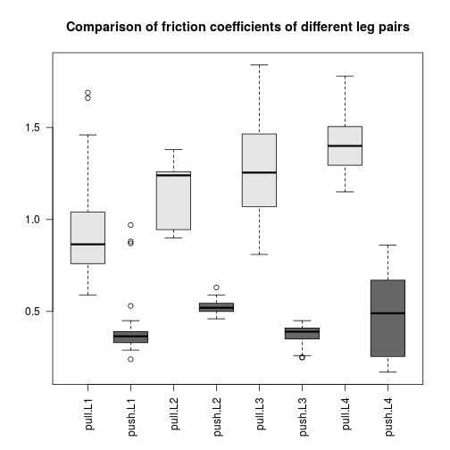
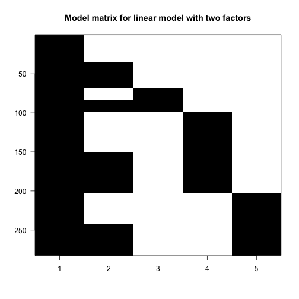
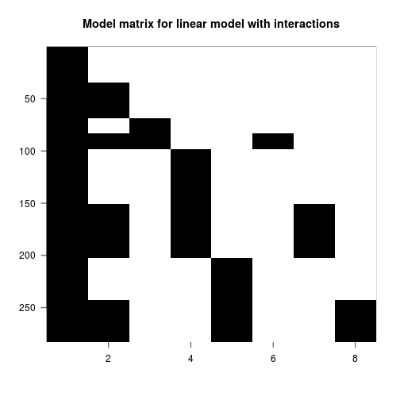
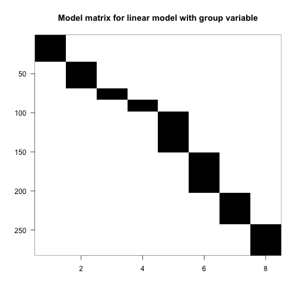
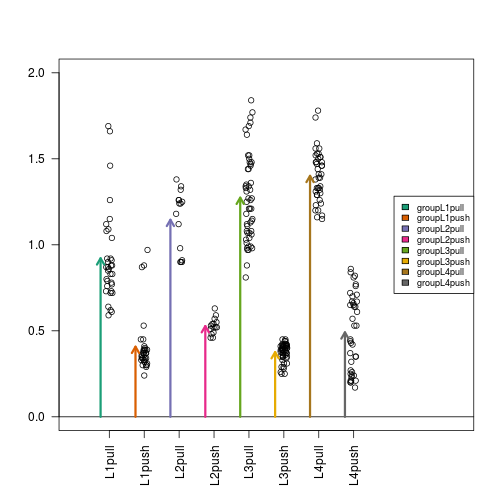

## Interactions and Contrasts

As a running example to learn about more complex linear models, we will be using a dataset which compares the different frictional coefficients on the different legs of a spider. Specifically, we will be determining whether more friction comes from a pushing or pulling motion of the leg. The original paper from which the data was provided is:

Jonas O. Wolff  & Stanislav N. Gorb, [Radial arrangement of Janus-like setae permits friction control in spiders](http://dx.doi.org/10.1038/srep01101), Scientific Reports, 22 January 2013.

The abstract of the paper says, 

> The hunting spider Cupiennius salei (Arachnida, Ctenidae) possesses hairy attachment pads (claw tufts) at its distal legs, consisting of directional branched setae... Friction of claw tufts on smooth glass was measured to reveal the functional effect of seta arrangement within the pad.

[Figure 1](http://www.nature.com/articles/srep01101/figures/1) 
includes some pretty cool electron microscope images of the tufts. We are interested in the comparisons in 
[Figure 4](http://www.nature.com/articles/srep01101/figures/4), 
where the pulling and pushing motions are compared for different leg pairs (for a diagram of pushing and pulling see the top of 
[Figure 3](http://www.nature.com/articles/srep01101/figures/3)). 

We include the data in our dagdata package and can download it this way:


```r
url <- "https://raw.githubusercontent.com/genomicsclass/dagdata/master/inst/extdata/spider_wolff_gorb_2013.csv"
filename <- "spider_wolff_gorb_2013.csv"
library(downloader)
if (!file.exists(filename)) download(url, filename)
spider <- read.csv(filename, skip=1)
```

#### Initial visual inspection of the data

Each measurement comes from one of our legs while it is either pushing or pulling. So we have two variables:


```r
table(spider$leg,spider$type)
```

```
##     
##      pull push
##   L1   34   34
##   L2   15   15
##   L3   52   52
##   L4   40   40
```


We can make a boxplot summarizing the measurements for each of the eight pairs. This is similar to Figure 4 of the original paper:


```r
boxplot(spider$friction ~ spider$type * spider$leg, 
        col=c("grey90","grey40"), las=2, 
        main="Comparison of friction coefficients of different leg pairs")
```

 


What we can immediately see are two trends: 

* The pulling motion has higher friction than the pushing motion.
* The leg pairs to the back of the spider (L4 being the last) have higher pulling friction.

Another thing to notice is that the groups have different spread around their average, what we call *within-group variance*. This is somewhat of a problem for the kinds of linear models we will explore below, since we will be assuming that around the population average values, the errors $$\varepsilon_i$$ are distributed identically, meaning the same variance within each group. The consequence of ignoring the different variances for the different groups is that comparisons between those groups with small variances will be overly "conservative" (because the overall estimate of variance is larger than an estimate for just these groups), and comparisons between those groups with large variances will be overly confident. If the spread is related to the range of friction, such that groups with large friction values also have larger spread, a possibility is to transform the data with a function such as the `log` or `sqrt`. This looks like it could be useful here, since three of the four push groups (L1, L2, L3) have the smallest friction values and also the smallest spread.

Some alternative tests for comparing groups without transforming the values first include: t-tests without the equal variance assumption using a "Welch" or "Satterthwaite approximation", or the Wilcoxon rank sum test mentioned previously. However here, for simplicity of illustration, we will fit a model that assumes equal variance and shows the different kinds of linear model designs using this dataset, setting aside the issue of different within-group variances.

#### A linear model with one variable

To remind ourselves how the simple two-group linear model looks, we will subset the data to include only the L1 leg pair, and run `lm`:


```r
spider.sub <- spider[spider$leg == "L1",]
fit <- lm(friction ~ type, data=spider.sub)
summary(fit)
```

```
## 
## Call:
## lm(formula = friction ~ type, data = spider.sub)
## 
## Residuals:
##      Min       1Q   Median       3Q      Max 
## -0.33147 -0.10735 -0.04941 -0.00147  0.76853 
## 
## Coefficients:
##             Estimate Std. Error t value Pr(>|t|)    
## (Intercept)  0.92147    0.03827  24.078  < 2e-16 ***
## typepush    -0.51412    0.05412  -9.499  5.7e-14 ***
## ---
## Signif. codes:  0 '***' 0.001 '**' 0.01 '*' 0.05 '.' 0.1 ' ' 1
## 
## Residual standard error: 0.2232 on 66 degrees of freedom
## Multiple R-squared:  0.5776,	Adjusted R-squared:  0.5711 
## F-statistic: 90.23 on 1 and 66 DF,  p-value: 5.698e-14
```

```r
(coefs <- coef(fit))
```

```
## (Intercept)    typepush 
##   0.9214706  -0.5141176
```

These two estimated coefficients are the mean of the pull observations (the first estimated coefficient) and the difference between the means of the two groups (the second coefficient). We can show this with R code:


```r
s <- split(spider.sub$friction, spider.sub$type)
mean(s[["pull"]])
```

```
## [1] 0.9214706
```

```r
mean(s[["push"]]) - mean(s[["pull"]])
```

```
## [1] -0.5141176
```

We can form the design matrix, which was used inside `lm`:


```r
X <- model.matrix(~ type, data=spider.sub)
colnames(X)
```

```
## [1] "(Intercept)" "typepush"
```

```r
head(X)
```

```
##   (Intercept) typepush
## 1           1        0
## 2           1        0
## 3           1        0
## 4           1        0
## 5           1        0
## 6           1        0
```

```r
tail(X)
```

```
##    (Intercept) typepush
## 63           1        1
## 64           1        1
## 65           1        1
## 66           1        1
## 67           1        1
## 68           1        1
```

Now we'll make a plot of the $$\mathbf{X}$$ matrix by putting a black block for the 1's and a white block for the 0's. This plot will be more interesting for the linear models later on in this script. Along the y-axis is the sample number (the row number of the `data`) and along the x-axis is the column of the design matrix $$\mathbf{X}$$. If you have installed the *rafalib* library, you can make this plot with the `imagemat` function:


```r
library(rafalib)
imagemat(X, main="Model matrix for linear model with one variable")
```

 

#### Examining the estimated coefficients

Now we show the coefficient estimates from the linear model in a diagram with arrows (code not shown).

 

#### A linear model with two variables

Now we'll continue and examine the full dataset, including the observations from all leg pairs. In order to model both the leg pair differences (L1, L2, L3, L4) and the push vs. pull difference, we need to include both terms in the R formula. Let's see what kind of design matrix will be formed with two variables in the formula:


```r
X <- model.matrix(~ type + leg, data=spider)
colnames(X)
```

```
## [1] "(Intercept)" "typepush"    "legL2"       "legL3"       "legL4"
```

```r
head(X)
```

```
##   (Intercept) typepush legL2 legL3 legL4
## 1           1        0     0     0     0
## 2           1        0     0     0     0
## 3           1        0     0     0     0
## 4           1        0     0     0     0
## 5           1        0     0     0     0
## 6           1        0     0     0     0
```

```r
imagemat(X, main="Model matrix for linear model with two factors")
```

 

The first column is the intercept, and so it has 1's for all samples. The second column has 1's for the push samples, and we can see that there are four groups of them. Finally, the third, fourth and fifth columns have 1's for the L2, L3 and L4 samples. The L1 samples do not have a column, because *L1* is the reference level for `leg`. Similarly, there is no *pull* column, because *pull* is the reference level for the `type` variable.

To estimate coefficients for this model, we use `lm` with the formula `~ type + leg`. We'll save the linear model to `fitTL` standing for a *fit* with *Type* and *Leg*.


```r
fitTL <- lm(friction ~ type + leg, data=spider)
summary(fitTL)
```

```
## 
## Call:
## lm(formula = friction ~ type + leg, data = spider)
## 
## Residuals:
##      Min       1Q   Median       3Q      Max 
## -0.46392 -0.13441 -0.00525  0.10547  0.69509 
## 
## Coefficients:
##             Estimate Std. Error t value Pr(>|t|)    
## (Intercept)  1.05392    0.02816  37.426  < 2e-16 ***
## typepush    -0.77901    0.02482 -31.380  < 2e-16 ***
## legL2        0.17192    0.04569   3.763 0.000205 ***
## legL3        0.16049    0.03251   4.937 1.37e-06 ***
## legL4        0.28134    0.03438   8.183 1.01e-14 ***
## ---
## Signif. codes:  0 '***' 0.001 '**' 0.01 '*' 0.05 '.' 0.1 ' ' 1
## 
## Residual standard error: 0.2084 on 277 degrees of freedom
## Multiple R-squared:  0.7916,	Adjusted R-squared:  0.7886 
## F-statistic:   263 on 4 and 277 DF,  p-value: < 2.2e-16
```

```r
(coefs <- coef(fitTL))
```

```
## (Intercept)    typepush       legL2       legL3       legL4 
##   1.0539153  -0.7790071   0.1719216   0.1604921   0.2813382
```

R uses the name `coefficient` to denote the component containing the least squares **estimates**. It is important to remember that the coefficients are parameters that we do not observe, but only estimate.

#### Mathematical representation

The model we are fitting above can be written as

$$
Y_i = \beta_0 + \beta_1 x_{i,1} + \beta_2 x_{i,2} + \beta_3 x_{i,3} + \beta_4 x_{i,4} + \varepsilon_i, i=1,\dots,N
$$

with the $$x$$ all indicator variables denoting push or pull and which leg. For example, a push on leg 3 will have $$x_{i,1}$$ and $$x_{i,3}$$ equal to 1 and the rest would be 0. Throughout this section we will refer to the $$\beta$$ s with the effects they represent. For example we call $$\beta_0$$ the intercept, $$\beta_1$$ the pull effect, $$\beta_2$$ the L2 effect, etc. We do not observe the coefficients, e.g.  $$\beta_1$$, directly, but estimate them with, e.g. $$\hat{\beta}_4$$.

We can now form the matrix $$\mathbf{X}$$ depicted above and obtain the least square estimates with:

$$ \hat{\boldsymbol{\beta}} = (\mathbf{X}^\top \mathbf{X})^{-1} \mathbf{X}^\top \mathbf{Y} $$


```r
Y <- spider$friction
X <- model.matrix(~ type + leg, data=spider)
beta.hat <- solve(t(X) %*% X) %*% t(X) %*% Y
t(beta.hat)
```

```
##      (Intercept)   typepush     legL2     legL3     legL4
## [1,]    1.053915 -0.7790071 0.1719216 0.1604921 0.2813382
```

```r
coefs
```

```
## (Intercept)    typepush       legL2       legL3       legL4 
##   1.0539153  -0.7790071   0.1719216   0.1604921   0.2813382
```

We can see that these values agree with the output of `lm`.

#### Examining the estimated coefficients

We can make the same plot as before, with arrows for each of the estimated coefficients in the model (code not shown). 

 

In this case, the fitted means for each group, derived from the fitted coefficients, do not line up with those we obtain from simply taking the average from each of the eight possible groups. The reason is that our model uses five coefficients, instead of eight. We are **assuming** that the effects are additive. However, as we demonstrate in more detail below, this particular dataset is better described with a model including interactions.
 

```r
s <- split(spider$friction, spider$group)
mean(s[["L1pull"]])
```

```
## [1] 0.9214706
```

```r
coefs[1]
```

```
## (Intercept) 
##    1.053915
```

```r
mean(s[["L1push"]])
```

```
## [1] 0.4073529
```

```r
coefs[1] + coefs[2]
```

```
## (Intercept) 
##   0.2749082
```

Here we can demonstrate that the push vs. pull estimated coefficient, `coefs[2]`, is a weighted average of the difference of the means for each group. Furthermore, the weighting is determined by the sample size of each group. The math works out simply here because the sample size is equal for the push and pull subgroups within each leg pair. If the sample sizes were not equal for push and pull within each leg pair, the weighting is more complicated but uniquely determined by a formula involving the sample size of each subgroup, the total sample size, and the number of coefficients. This can be worked out from $$(\mathbf{X}^\top \mathbf{X})^{-1} \mathbf{X}^\top$$.


```r
means <- sapply(s, mean)
##the sample size of push or pull groups for each leg pair
ns <- sapply(s, length)[c(1,3,5,7)]
(w <- ns/sum(ns))
```

```
##    L1pull    L2pull    L3pull    L4pull 
## 0.2411348 0.1063830 0.3687943 0.2836879
```

```r
sum(w * (means[c(2,4,6,8)] - means[c(1,3,5,7)]))
```

```
## [1] -0.7790071
```

```r
coefs[2]
```

```
##   typepush 
## -0.7790071
```

#### Contrasting coefficients

Sometimes, the comparison we are interested in is represented directly by a single coefficient in the model, such as the push vs pull difference, which was `coefs[2]` above. However, sometimes, we want to make a comparison which is not a single coefficient, but a combination of coefficients, which is called a _contrast_. To introduce the concept of _contrasts_, first consider the comparisons which we can read off from the linear model summary:


```r
coefs
```

```
## (Intercept)    typepush       legL2       legL3       legL4 
##   1.0539153  -0.7790071   0.1719216   0.1604921   0.2813382
```

Here we have the intercept estimate, the push vs. pull estimated effect across all leg pairs, and the estimates for the L2 vs. L1 effect, the L3 vs. L1 effect, and the L4 vs. L1 effect. What if we want to compare two groups and one of those groups is not L1? The solution to this question is to use *contrasts*. 

A *contrast* is a combination of estimated coefficient: $$\mathbf{c^\top} \hat{\boldsymbol{\beta}}$$, where $$\mathbf{c}$$ is a column vector with as many rows as the number of coefficients in the linear model. If $$\mathbf{c}$$ has a 0 for one or more of its rows, then the corresponding estimated coefficients in $$\hat{\boldsymbol{\beta}}$$ are not involved in the contrast.

If we want to compare leg pairs L3 and L2, this is equivalent to contrasting two coefficients from the linear model because, in this contrast, the comparison to the reference level *L1* cancels out:

$$ (\mbox{L3} - \mbox{L1}) - (\mbox{L2} - \mbox{L1}) = \mbox{L3} - \mbox{L2 }$$

An easy way to make these contrasts of two groups is to use the `contrast` function from the *contrast* package. We just need to specify which groups we want to compare. We have to pick one of *pull* or *push* types, although the answer will not differ, as we will see below.


```r
library(contrast) #Available from CRAN
L3vsL2 <- contrast(fitTL,list(leg="L3",type="pull"),list(leg="L2",type="pull"))
L3vsL2
```

```
## lm model parameter contrast
## 
##     Contrast       S.E.      Lower      Upper     t  df Pr(>|t|)
##  -0.01142949 0.04319685 -0.0964653 0.07360632 -0.26 277   0.7915
```

The first column `Contrast` gives the L3 vs L2 estimate from the model we fit above.

We can show that the least squares estimates of a linear combination of coefficients is the same linear combination of the estimates. 
Therefore, the effect size estimate is just the difference between two estimated coefficients. The contrast vector used by `contrast` is stored as a variable called `X` within the resulting object (not to be confused with our original $$\mathbf{X}$$, the design matrix).


```r
coefs[4] - coefs[3]
```

```
##       legL3 
## -0.01142949
```

```r
(cT <- L3vsL2$X)
```

```
##   (Intercept) typepush legL2 legL3 legL4
## 1           0        0    -1     1     0
## attr(,"assign")
## [1] 0 1 2 2 2
## attr(,"contrasts")
## attr(,"contrasts")$type
## [1] "contr.treatment"
## 
## attr(,"contrasts")$leg
## [1] "contr.treatment"
```

```r
cT %*% coefs
```

```
##          [,1]
## 1 -0.01142949
```

What about the standard error and t-statistic? As before, the t-statistic is the estimate divided by the standard error. The standard error of the contrast estimate is formed by multiplying the contrast vector $$\mathbf{c}$$ on either side of the estimated covariance matrix, $$\hat{\Sigma}$$, our estimate for $$\mathrm{var}(\hat{\boldsymbol{\beta}})$$:

$$ \sqrt{\mathbf{c^\top} \hat{\boldsymbol{\Sigma}} \mathbf{c}} $$

where we saw the covariance of the coefficients earlier:

$$ 
\boldsymbol{\Sigma} = \sigma^2 (\mathbf{X}^\top \mathbf{X})^{-1}
$$

We estimate $$\sigma^2$$ with the sample estimate $$\hat{\sigma}^2$$ described above and obtain:


```r
Sigma.hat <- sum(fitTL$residuals^2)/(nrow(X) - ncol(X)) * solve(t(X) %*% X)
signif(Sigma.hat, 2)
```

```
##             (Intercept) typepush    legL2    legL3    legL4
## (Intercept)     0.00079 -3.1e-04 -0.00064 -0.00064 -0.00064
## typepush       -0.00031  6.2e-04  0.00000  0.00000  0.00000
## legL2          -0.00064 -6.4e-20  0.00210  0.00064  0.00064
## legL3          -0.00064 -6.4e-20  0.00064  0.00110  0.00064
## legL4          -0.00064 -1.2e-19  0.00064  0.00064  0.00120
```

```r
sqrt(cT %*% Sigma.hat %*% t(cT))
```

```
##            1
## 1 0.04319685
```

```r
L3vsL2$SE
```

```
## [1] 0.04319685
```

We would have obtained the same result for a contrast of L3 and L2 had we picked `type="push"`. The reason it does not change the contrast is because it leads to addition of the `typepush` effect on both sides of the difference, which cancels out:


```r
L3vsL2.equiv <- contrast(fitTL,list(leg="L3",type="push"),list(leg="L2",type="push"))
L3vsL2.equiv$X
```

```
##   (Intercept) typepush legL2 legL3 legL4
## 1           0        0    -1     1     0
## attr(,"assign")
## [1] 0 1 2 2 2
## attr(,"contrasts")
## attr(,"contrasts")$type
## [1] "contr.treatment"
## 
## attr(,"contrasts")$leg
## [1] "contr.treatment"
```

## Linear Model with Interactions

In previous linear model, we assumed that the push vs. pull effect was the same for all of the leg pairs (the same orange arrow). You can easily see that this does not capture the trends in the data that well. That is, the tips of the arrows did not line up perfectly with the group averages. For the L1 leg pair, the push vs. pull estimated coefficient was too large, and for the L3 leg pair, the push vs. pull coefficient was somewhat too small.

_Interaction terms_ will help us overcome this problem by introducing additional coefficients to compensate for differences in the push vs. pull effect across the 4 groups. As we already have a push vs. pull term in the model, we only need to add three more terms to have the freedom to find leg-pair-specific push vs. pull differences. As we will see, interaction terms are added to the design matrix by multiplying the columns of the design matrix representing existing terms. 

We can rebuild our linear model with an interaction between `type` and `leg`, by including an extra term in the formula `type:leg`. The `:` symbol adds an interaction between the two variables surrounding it. An equivalent way to specify this model is `~ type*leg`, which will expand to the formula `~ type + leg + type:leg`, with main effects for `type`, `leg` and an interaction term `type:leg`.


```r
X <- model.matrix(~ type + leg + type:leg, data=spider)
colnames(X)
```

```
## [1] "(Intercept)"    "typepush"       "legL2"          "legL3"         
## [5] "legL4"          "typepush:legL2" "typepush:legL3" "typepush:legL4"
```

```r
head(X)
```

```
##   (Intercept) typepush legL2 legL3 legL4 typepush:legL2 typepush:legL3
## 1           1        0     0     0     0              0              0
## 2           1        0     0     0     0              0              0
## 3           1        0     0     0     0              0              0
## 4           1        0     0     0     0              0              0
## 5           1        0     0     0     0              0              0
## 6           1        0     0     0     0              0              0
##   typepush:legL4
## 1              0
## 2              0
## 3              0
## 4              0
## 5              0
## 6              0
```

```r
imagemat(X, main="Model matrix for linear model with interactions")
```

 

Columns 6-8 (`typepush:legL2`, `typepush:legL3`, and `typepush:legL4`) are the product of the 2nd column (`typepush`) and columns 3-5 (the three `leg` columns). Looking at the last column, for example, the `typepush:legL4` column is adding an extra coefficient $$\beta_{\textrm{push,L4}}$$ to those samples which are both push samples and leg pair L4 samples. This accounts for a possible difference when the mean of samples in the L4-push group are not at the location which would be predicted by adding the estimated intercept, the estimated push coefficient `typepush`, and the estimated L4 coefficient `legL4`.

We can run the linear model using the same code as before:


```r
fitX <- lm(friction ~ type + leg + type:leg, data=spider)
summary(fitX)
```

```
## 
## Call:
## lm(formula = friction ~ type + leg + type:leg, data = spider)
## 
## Residuals:
##      Min       1Q   Median       3Q      Max 
## -0.46385 -0.10735 -0.01111  0.07848  0.76853 
## 
## Coefficients:
##                Estimate Std. Error t value Pr(>|t|)    
## (Intercept)     0.92147    0.03266  28.215  < 2e-16 ***
## typepush       -0.51412    0.04619 -11.131  < 2e-16 ***
## legL2           0.22386    0.05903   3.792 0.000184 ***
## legL3           0.35238    0.04200   8.390 2.62e-15 ***
## legL4           0.47928    0.04442  10.789  < 2e-16 ***
## typepush:legL2 -0.10388    0.08348  -1.244 0.214409    
## typepush:legL3 -0.38377    0.05940  -6.461 4.73e-10 ***
## typepush:legL4 -0.39588    0.06282  -6.302 1.17e-09 ***
## ---
## Signif. codes:  0 '***' 0.001 '**' 0.01 '*' 0.05 '.' 0.1 ' ' 1
## 
## Residual standard error: 0.1904 on 274 degrees of freedom
## Multiple R-squared:  0.8279,	Adjusted R-squared:  0.8235 
## F-statistic: 188.3 on 7 and 274 DF,  p-value: < 2.2e-16
```

```r
coefs <- coef(fitX)
```

#### Examining the estimated coefficients

Here is where the plot with arrows really helps us interpret the coefficients. The estimated interaction coefficients (the yellow, brown and silver arrows) allow leg-pair-specific differences in the push vs. pull difference. The orange arrow now represents the estimated push vs. pull difference only for the reference leg pair, which is L1. If an estimated interaction coefficient is large, this means that the push vs. pull difference for that leg pair is very different than the push vs. pull difference in the reference leg pair.

Now, as we have eight terms in the model and eight parameters, you can check that the tips of the arrowheads are exactly equal to the group means (code not shown).

 

#### Contrasts

Again we will show how to combine estimated coefficients from the model using contrasts. For some simple cases, we can use the contrast package. Suppose we want to know the push vs. pull effect for the L2 leg pair samples. We can see from the arrow plot that this is the orange arrow plus the yellow arrow. We can also specify this comparison with the `contrast` function:


```r
library(contrast) ##Available from CRAN
L2push.vs.pull <- contrast(fitX,
                   list(leg="L2", type = "push"), 
                   list(leg="L2", type = "pull"))
L2push.vs.pull
```

```
## lm model parameter contrast
## 
##  Contrast      S.E.      Lower      Upper     t  df Pr(>|t|)
##    -0.618 0.0695372 -0.7548951 -0.4811049 -8.89 274        0
```

```r
coefs[2] + coefs[6] ##we know this is also orange + yellow arrow
```

```
## typepush 
##   -0.618
```


#### Differences of differences

The question of whether the push vs. pull difference is *different* in L2 compared to L1, is answered by a single term in the model: the `typepush:legL2` estimated coefficient corresponding to the yellow arrow in the plot. A p-value for whether this coefficient is actually equal to zero can be read off from the table printed with `summary(fitX)` above. Similarly, we can read off the p-values for the differences of differences for L3 vs L1 and for L4 vs L1.

Suppose we want to know if the push vs. pull difference is *different* in L3 compared to L2. By examining the arrows in the diagram above, we can see that the push vs. pull effect for a leg pair other than L1 is the `typepush` arrow plus the interaction term for that group.

If we work out the math for comparing across two non-reference leg pairs, this is:

$$
(\mbox{typepush} + \mbox{typepush:legL3}) - (\mbox{typepush} + \mbox{typepush:legL2})
$$

...which simplifies to:

$$
= \mbox{typepush:legL3} - \mbox{typepush:legL2}
$$

We can't make this contrast using the `contrast` function shown before, but we can make this comparison using the `glht` (for "general linear hypothesis test") function from the *multcomp* package. We need to form a 1-row matrix which has a -1 for the `typepush:legL2` coefficient and a +1 for the `typepush:legL3` coefficient. We provide this matrix to the `linfct` (linear function) argument, and obtain a summary table for this contrast of estimated interaction coefficients.

Note that there are other ways to perform contrasts using base R, and this is just our preferred way.


```r
library(multcomp) ##Available from CRAN
C <- matrix(c(0,0,0,0,0,-1,1,0), 1)
L3vsL2interaction <- glht(fitX, linfct=C)
summary(L3vsL2interaction)
```

```
## 
## 	 Simultaneous Tests for General Linear Hypotheses
## 
## Fit: lm(formula = friction ~ type + leg + type:leg, data = spider)
## 
## Linear Hypotheses:
##        Estimate Std. Error t value Pr(>|t|)    
## 1 == 0 -0.27988    0.07893  -3.546  0.00046 ***
## ---
## Signif. codes:  0 '***' 0.001 '**' 0.01 '*' 0.05 '.' 0.1 ' ' 1
## (Adjusted p values reported -- single-step method)
```

```r
coefs[7] - coefs[6] ##we know this is also brown - yellow
```

```
## typepush:legL3 
##     -0.2798846
```

## Analysis of variance

Suppose that we want to know if the push vs. pull difference is different across leg pairs in general. We do not want to compare any two leg pairs in particular, but rather we want to know if the three interaction terms which represent differences in the push vs. pull difference across leg pairs are larger than we would expect them to be if the push vs pull difference was in fact equal across all leg pairs.

Such a question can be answered by an _analysis of variance_, which is often abbreviated as ANOVA. ANOVA compares the reduction in the sum of squares of the residuals for models of different complexity. The model with eight coefficients is more complex than the model with five coefficients where we assumed the push vs pull difference was equal across leg pairs. The least complex model would only use a single coefficient, an intercept. Under certain assumptions we can also perform inference that determines the probability of improvements as large as what we observed. Let's first print the result of an ANOVA in R and then examine the results in detail:


```r
anova(fitX)
```

```
## Analysis of Variance Table
## 
## Response: friction
##            Df Sum Sq Mean Sq  F value    Pr(>F)    
## type        1 42.783  42.783 1179.713 < 2.2e-16 ***
## leg         3  2.921   0.974   26.847 2.972e-15 ***
## type:leg    3  2.098   0.699   19.282 2.256e-11 ***
## Residuals 274  9.937   0.036                       
## ---
## Signif. codes:  0 '***' 0.001 '**' 0.01 '*' 0.05 '.' 0.1 ' ' 1
```

The first line tells us that adding a variable `type` (push or pull) to the design is very useful (reduces the sum of squared residuals) compared to a model with only an intercept. We can see that it is useful, because this single coefficient reduces the sum of squares by 42.783. The original sum of squares of the model with just an intercept is:


```r
mu0 <- mean(spider$friction)
(initial.ss <- sum((spider$friction - mu0)^2))
```

```
## [1] 57.73858
```

Note that this initial sum of squares is just a scaled version of the sample variance:


```r
N <- nrow(spider)
(N - 1) * var(spider$friction)
```

```
## [1] 57.73858
```

Let's see exactly how get this 42.783. We need to calculate the sum of squared residuals for the model with only the type information. We can do this by calculating the residuals, squaring these, summing these within groups and then summing across the groups.


```r
s <- split(spider$friction, spider$type)
after.type.ss <- sum( sapply(s, function(x) {
  residual <- x - mean(x) 
  sum(residual^2)
  }) )
```

The reduction in sum of squared residuals from introducing the `type` coefficient is therefore:


```r
(type.ss <- initial.ss - after.type.ss)
```

```
## [1] 42.78307
```

Through [simple arithmetic](http://en.wikipedia.org/wiki/Partition_of_sums_of_squares#Proof), this reduction can be shown to be equivalent to the sum of squared differences between the fitted values for the models with formula `~type` and `~1`:


```r
sum(sapply(s, length) * (sapply(s, mean) - mu0)^2)
```

```
## [1] 42.78307
```


Keep in mind that the order of terms in the formula, and therefore rows in the ANOVA table, is important: each row considers the reduction in the sum of squared residuals after adding coefficients *compared to the model in the previous row*.

The other columns in the ANOVA table show the "degrees of freedom" with each row. As the `type` variable introduced only one term in the model, the `Df` column has a 1. Because the `leg` variable introduced three terms in the model (`legL2`, `legL3` and `legL4`), the `Df` column has a 3.

Finally, there is a column which lists the *F value*. The F value is the *mean of squares* for the inclusion of the terms of interest (the sum of squares divided by the degrees of freedom) divided by the mean squared residuals (from the bottom row):

$$ r_i = Y_i - \hat{Y}_i $$

$$ \mbox{Mean Sq Residuals} = \frac{1}{N - p} \sum_{i=1}^N r_i^2 $$

where $$p$$ is the number of coefficients in the model (here eight, including the intercept term).

Under the null hypothesis (the true value of the additional coefficient(s) is 0), we have a theoretical result for what the distribution of the F value will be for each row. The assumptions needed for this approximation to hold are similar to those of the t-distribution approximation we described in earlier chapters. We either need a large sample size so that CLT applies or we need the population data to follow a normal approximation. 

As an example of how one interprets these p-values, let's take the last row `type:leg` which specifies the three interaction coefficients. Under the null hypothesis that the true value for these three additional terms is actually 0, e.g. $$\beta_{\textrm{push,L2}} = 0, \beta_{\textrm{push,L3}} = 0, \beta_{\textrm{push,L4}} = 0$$, then we can calculate the chance of seeing such a large F-value for this row of the ANOVA table. Remember that we are only concerned with large values here, because we have a ratio of sum of squares, the F-value can only be positive. The p-value in the last column for the `type:leg` row can be interpreted as: under the null hypothesis that there are no differences in the push vs. pull difference across leg pair, this is the probability of an estimated interaction coefficient explaining so much of the observed variance. If this p-value is small, we would consider rejecting the null hypothesis that the push vs. pull difference is the same across leg pairs.

The [F distribution](http://en.wikipedia.org/wiki/F-distribution) has two parameters: one for the degrees of freedom of the numerator (the terms of interest) and one for the denominator (the residuals). In the case of the interaction coefficients row, this is 3, the number of interaction coefficients divided by 274, the number of samples minus the total number of coefficients.

#### A different specification of the same model

Now we show an alternate specification of the same model, wherein we assume that each combination of type and leg has its own mean value (and so that the push vs. pull effect is not the same for each leg pair). This specification is in some ways simpler, as we will see, but it does not allow us to build the ANOVA table as above, because it does not split interaction coefficients out in the same way. 

We start by constructing a factor variable with a level for each unique combination of `type` and `leg`. We include a `0 +` in the formula because we do not want to include an intercept in the model matrix.


```r
##earlier, we defined the 'group' column:
spider$group <- factor(paste0(spider$leg, spider$type))
X <- model.matrix(~ 0 + group, data=spider)
colnames(X)
```

```
## [1] "groupL1pull" "groupL1push" "groupL2pull" "groupL2push" "groupL3pull"
## [6] "groupL3push" "groupL4pull" "groupL4push"
```

```r
head(X)
```

```
##   groupL1pull groupL1push groupL2pull groupL2push groupL3pull groupL3push
## 1           1           0           0           0           0           0
## 2           1           0           0           0           0           0
## 3           1           0           0           0           0           0
## 4           1           0           0           0           0           0
## 5           1           0           0           0           0           0
## 6           1           0           0           0           0           0
##   groupL4pull groupL4push
## 1           0           0
## 2           0           0
## 3           0           0
## 4           0           0
## 5           0           0
## 6           0           0
```

```r
imagemat(X, main="Model matrix for linear model with group variable")
```

 

We can run the linear model with the familiar call:


```r
fitG <- lm(friction ~ 0 + group, data=spider)
summary(fitG)
```

```
## 
## Call:
## lm(formula = friction ~ 0 + group, data = spider)
## 
## Residuals:
##      Min       1Q   Median       3Q      Max 
## -0.46385 -0.10735 -0.01111  0.07848  0.76853 
## 
## Coefficients:
##             Estimate Std. Error t value Pr(>|t|)    
## groupL1pull  0.92147    0.03266   28.21   <2e-16 ***
## groupL1push  0.40735    0.03266   12.47   <2e-16 ***
## groupL2pull  1.14533    0.04917   23.29   <2e-16 ***
## groupL2push  0.52733    0.04917   10.72   <2e-16 ***
## groupL3pull  1.27385    0.02641   48.24   <2e-16 ***
## groupL3push  0.37596    0.02641   14.24   <2e-16 ***
## groupL4pull  1.40075    0.03011   46.52   <2e-16 ***
## groupL4push  0.49075    0.03011   16.30   <2e-16 ***
## ---
## Signif. codes:  0 '***' 0.001 '**' 0.01 '*' 0.05 '.' 0.1 ' ' 1
## 
## Residual standard error: 0.1904 on 274 degrees of freedom
## Multiple R-squared:   0.96,	Adjusted R-squared:  0.9588 
## F-statistic:   821 on 8 and 274 DF,  p-value: < 2.2e-16
```

```r
coefs <- coef(fitG)
```

#### Examining the estimated coefficients

Now we have eight arrows, one for each group. The arrow tips align directly with the mean of each group:

 

#### Simple contrasts using the contrast package

While we cannot perform an ANOVA with this formulation, we can easily contrast the estimated coefficients for individual groups using the `contrast` function:


```r
groupL2push.vs.pull <- contrast(fitG,
                                list(group = "L2push"), 
                                list(group = "L2pull"))
groupL2push.vs.pull
```

```
## lm model parameter contrast
## 
##   Contrast      S.E.      Lower      Upper     t  df Pr(>|t|)
## 1   -0.618 0.0695372 -0.7548951 -0.4811049 -8.89 274        0
```

```r
coefs[4] - coefs[3]
```

```
## groupL2push 
##      -0.618
```

#### Differences of differences when there is no intercept

We can also make pair-wise comparisons of the estimated push vs. pull difference across leg pair. For example, if we want to compare the push vs. pull difference in leg pair L3 vs. leg pair L2:

$$ (\mbox{L3push} - \mbox{L3pull}) - (\mbox{L2push} - \mbox{L2pull}) $$

$$ = \mbox{L3 push} + \mbox{L2pull} - \mbox{L3pull} - \mbox{L2push} $$


```r
C <- matrix(c(0,0,1,-1,-1,1,0,0), 1)
groupL3vsL2interaction <- glht(fitG, linfct=C)
summary(groupL3vsL2interaction)
```

```
## 
## 	 Simultaneous Tests for General Linear Hypotheses
## 
## Fit: lm(formula = friction ~ 0 + group, data = spider)
## 
## Linear Hypotheses:
##        Estimate Std. Error t value Pr(>|t|)    
## 1 == 0 -0.27988    0.07893  -3.546  0.00046 ***
## ---
## Signif. codes:  0 '***' 0.001 '**' 0.01 '*' 0.05 '.' 0.1 ' ' 1
## (Adjusted p values reported -- single-step method)
```

```r
names(coefs)
```

```
## [1] "groupL1pull" "groupL1push" "groupL2pull" "groupL2push" "groupL3pull"
## [6] "groupL3push" "groupL4pull" "groupL4push"
```

```r
(coefs[6] - coefs[5]) - (coefs[4] - coefs[3])
```

```
## groupL3push 
##  -0.2798846
```

