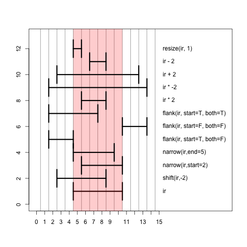

The IRanges and GRanges objects are core components of the Bioconductor infrastructure for defining *integer ranges* in general (IRanges), and specifically for addressing locations in the genome and hence including chromosome and strand information (GRanges). Here we will briefly explore what these objects are and a subset of the operations which manipulate IRanges and GRanges.

## IRanges

First we load the IRanges package. This is included in the base installation of Bioconductor, but as with all Bioconductor packages it can be installed with `biocLite`. R will print out a bunch of messages when you load IRanges about objects which are masked from other packages. This is part of the normal loading process. Here we print these messages, although on some other book pages we suppress the messages for cleanliness:


```r
library(IRanges)
```

```
## Loading required package: methods
## Loading required package: BiocGenerics
## Loading required package: parallel
## 
## Attaching package: 'BiocGenerics'
## 
## The following objects are masked from 'package:parallel':
## 
##     clusterApply, clusterApplyLB, clusterCall, clusterEvalQ,
##     clusterExport, clusterMap, parApply, parCapply, parLapply,
##     parLapplyLB, parRapply, parSapply, parSapplyLB
## 
## The following object is masked from 'package:stats':
## 
##     xtabs
## 
## The following objects are masked from 'package:base':
## 
##     anyDuplicated, append, as.data.frame, as.vector, cbind,
##     colnames, do.call, duplicated, eval, evalq, Filter, Find, get,
##     intersect, is.unsorted, lapply, Map, mapply, match, mget,
##     order, paste, pmax, pmax.int, pmin, pmin.int, Position, rank,
##     rbind, Reduce, rep.int, rownames, sapply, setdiff, sort,
##     table, tapply, union, unique, unlist, unsplit
## 
## Loading required package: S4Vectors
## Loading required package: stats4
```

The `IRanges` function defines interval ranges. If you provide it with two numbers, these are the start and end of a inclusive range, e.g. $$[5,10] = \{ 5,6,7,8,9,10 \}$$, which has *width* 6. When referring to the size of a range, the term *width* is used, instead of *length*.


```r
ir <- IRanges(5,10)
ir
```

```
## IRanges of length 1
##     start end width
## [1]     5  10     6
```

```r
start(ir)
```

```
## [1] 5
```

```r
end(ir)
```

```
## [1] 10
```

```r
width(ir)
```

```
## [1] 6
```

```r
# for detailed information on the class:
# ?IRanges
```

A single *IRanges* object can hold more than one range. We do this by specifying vector to the `start` and `end` arguments. 


```r
IRanges(start=c(3,5,17), end=c(10,8,20))
```

```
## IRanges of length 3
##     start end width
## [1]     3  10     8
## [2]     5   8     4
## [3]    17  20     4
```

We will continue to work with the single range $$[5,10]$$ though. We can look up a number of *intra-range* methods for IRanges objects, which mean that the operations work on each range independently. For example, we can shift all the ranges two integers to the left. By left and right, we refer to the direction on the integer number line: $$\{ \dots, -2, -1, 0, 1, 2, \dots \}$$. Compare `ir` and `shift(ir, -2)`:


```r
# full details on the intra-range methods:
# ?"intra-range-methods"
ir
```

```
## IRanges of length 1
##     start end width
## [1]     5  10     6
```

```r
shift(ir, -2)
```

```
## IRanges of length 1
##     start end width
## [1]     3   8     6
```

Here we show the result of a number of different operations applied to `ir`, with a picture below.


```r
ir
```

```
## IRanges of length 1
##     start end width
## [1]     5  10     6
```

```r
narrow(ir, start=2)
```

```
## IRanges of length 1
##     start end width
## [1]     6  10     5
```

```r
narrow(ir, end=5)
```

```
## IRanges of length 1
##     start end width
## [1]     5   9     5
```

```r
flank(ir, width=3, start=TRUE, both=FALSE)
```

```
## IRanges of length 1
##     start end width
## [1]     2   4     3
```

```r
flank(ir, width=3, start=FALSE, both=FALSE)
```

```
## IRanges of length 1
##     start end width
## [1]    11  13     3
```

```r
flank(ir, width=3, start=TRUE, both=TRUE)
```

```
## IRanges of length 1
##     start end width
## [1]     2   7     6
```

```r
ir * 2
```

```
## IRanges of length 1
##     start end width
## [1]     6   8     3
```

```r
ir * -2
```

```
## IRanges of length 1
##     start end width
## [1]     2  13    12
```

```r
ir + 2
```

```
## IRanges of length 1
##     start end width
## [1]     3  12    10
```

```r
ir - 2
```

```
## IRanges of length 1
##     start end width
## [1]     7   8     2
```

```r
resize(ir, 1)
```

```
## IRanges of length 1
##     start end width
## [1]     5   5     1
```

Those same operations plotted in a single window. The red bar shows the shadow of the original range `ir`. The best way to get the hang of these operations is to try them out yourself in the console on ranges you define yourself.

 

There are also a set of *inter-range* methods. These are operations which work on a set of ranges, and the output depends on all the ranges, thus distinguishes these methods from the *intra-range* methods, for which the other ranges in the set do not change the output. This is best explained with some examples. The `range` function gives the integer range from the start of the leftmost range to the end of the rightmost range:


```r
# full details on the inter-range methods:
# ?"inter-range-methods"
(ir <- IRanges(start=c(3,5,17), end=c(10,8,20)))
```

```
## IRanges of length 3
##     start end width
## [1]     3  10     8
## [2]     5   8     4
## [3]    17  20     4
```

```r
range(ir)
```

```
## IRanges of length 1
##     start end width
## [1]     3  20    18
```

The `reduce` function collapses the ranges, so that integers are covered by only one range in the output.


```r
reduce(ir)
```

```
## IRanges of length 2
##     start end width
## [1]     3  10     8
## [2]    17  20     4
```

The `gaps` function gives back the ranges of integers which are in `range(ir)` but not covered by any of the ranges in `ir`:


```r
gaps(ir)
```

```
## IRanges of length 1
##     start end width
## [1]    11  16     6
```

The `disjoin` function breaks up the ranges in `ir` into discrete ranges. This is best explained with examples, but here is the formal definition first:

> returns a disjoint object, by finding the union of the
> end points in ‘x’. In other words, the result consists of a range
> for every interval, of maximal length, over which the set of
> overlapping ranges in ‘x’ is the same and at least of size 1.


```r
disjoin(ir)
```

```
## IRanges of length 4
##     start end width
## [1]     3   4     2
## [2]     5   8     4
## [3]     9  10     2
## [4]    17  20     4
```

Note that this is not a comprehensive list! Check the man pages we listed above, and the best way to get the hang of the functions is to try them out on some ranges you construct yourself. Note that most of the functions are defined both for IRanges and for GRanges, which will be described below.

<a name="granges"></a>

## GRanges

*GRanges* are objects which contain *IRanges* and two more important pieces of information:

* the chromosome we are referring to (called `seqnames` in Bioconductor)
* the strand of DNA we are referring to

With an *IRange*, a chromosome name, and a strand, we can be sure we are uniquely referring to the same region of the DNA molecule as another researcher, given that we are using the same build of *genome*. There are other pieces of information which can be contained within a GRanges object, but the two above are the most important.


```r
library(GenomicRanges)
```

Let's create a set of two ranges on a made-up chromosome, *chrZ*. And we will say that these ranges refer to the genome *hg19*. Because we have not linked our genome to a database, we are allowed to specify a chromosome which does not really exist in *hg19*.


```r
gr <- GRanges("chrZ", IRanges(start=c(5,10),end=c(35,45)),
              strand="+", seqlengths=c(chrZ=100L))
gr
```

```
## GRanges object with 2 ranges and 0 metadata columns:
##       seqnames    ranges strand
##          <Rle> <IRanges>  <Rle>
##   [1]     chrZ  [ 5, 35]      +
##   [2]     chrZ  [10, 45]      +
##   -------
##   seqinfo: 1 sequence from an unspecified genome
```

```r
genome(gr) <- "hg19"
gr
```

```
## GRanges object with 2 ranges and 0 metadata columns:
##       seqnames    ranges strand
##          <Rle> <IRanges>  <Rle>
##   [1]     chrZ  [ 5, 35]      +
##   [2]     chrZ  [10, 45]      +
##   -------
##   seqinfo: 1 sequence from hg19 genome
```

Note the seqnames and seqlengths which we defined in the call above:


```r
seqnames(gr)
```

```
## factor-Rle of length 2 with 1 run
##   Lengths:    2
##   Values : chrZ
## Levels(1): chrZ
```

```r
seqlengths(gr)
```

```
## chrZ 
##  100
```

We can use the `shift` function as we did with the IRanges. However, notice the warning when we try to shift the range beyond the length of the chromosome:


```r
shift(gr, 10)
```

```
## GRanges object with 2 ranges and 0 metadata columns:
##       seqnames    ranges strand
##          <Rle> <IRanges>  <Rle>
##   [1]     chrZ  [15, 45]      +
##   [2]     chrZ  [20, 55]      +
##   -------
##   seqinfo: 1 sequence from hg19 genome
```

```r
shift(gr, 80)
```

```
## Warning in valid.GenomicRanges.seqinfo(x, suggest.trim = TRUE): GRanges object contains 2 out-of-bound ranges located on sequence
##   chrZ. Note that only ranges located on a non-circular sequence
##   whose length is not NA can be considered out-of-bound (use
##   seqlengths() and isCircular() to get the lengths and circularity
##   flags of the underlying sequences). You can use trim() to trim
##   these ranges. See ?`trim,GenomicRanges-method` for more
##   information.
```

```
## GRanges object with 2 ranges and 0 metadata columns:
##       seqnames    ranges strand
##          <Rle> <IRanges>  <Rle>
##   [1]     chrZ [85, 115]      +
##   [2]     chrZ [90, 125]      +
##   -------
##   seqinfo: 1 sequence from hg19 genome
```

If we trim the ranges, we obtain the ranges which are left, disregarding the portion that stretched beyond the length of the chromosome:


```r
trim(shift(gr, 80))
```

```
## GRanges object with 2 ranges and 0 metadata columns:
##       seqnames    ranges strand
##          <Rle> <IRanges>  <Rle>
##   [1]     chrZ [85, 100]      +
##   [2]     chrZ [90, 100]      +
##   -------
##   seqinfo: 1 sequence from hg19 genome
```

We can add columns of information to each range using the `mcols` function (stands for *metadata columns*). Note: this is also possible with IRanges. We can remove the columns by assigning `NULL`.


```r
mcols(gr)
```

```
## DataFrame with 2 rows and 0 columns
```

```r
mcols(gr)$value <- c(-1,4)
gr
```

```
## GRanges object with 2 ranges and 1 metadata column:
##       seqnames    ranges strand |     value
##          <Rle> <IRanges>  <Rle> | <numeric>
##   [1]     chrZ  [ 5, 35]      + |        -1
##   [2]     chrZ  [10, 45]      + |         4
##   -------
##   seqinfo: 1 sequence from hg19 genome
```

```r
mcols(gr)$value <- NULL
```

### GRangesList

Especially when referring to genes, it is useful to create a *list* of GRanges. This is useful for representing groupings, for example the [exons](http://en.wikipedia.org/wiki/Exon) which belong to each gene. The elements of the list are the genes, and within each element the exon ranges are defined as GRanges.


```r
gr2 <- GRanges("chrZ",IRanges(11:13,51:53))
grl <- GRangesList(gr,gr2)
grl
```

```
## GRangesList object of length 2:
## [[1]] 
## GRanges object with 2 ranges and 0 metadata columns:
##       seqnames    ranges strand
##          <Rle> <IRanges>  <Rle>
##   [1]     chrZ  [ 5, 35]      +
##   [2]     chrZ  [10, 45]      +
## 
## [[2]] 
## GRanges object with 3 ranges and 0 metadata columns:
##       seqnames   ranges strand
##   [1]     chrZ [11, 51]      *
##   [2]     chrZ [12, 52]      *
##   [3]     chrZ [13, 53]      *
## 
## -------
## seqinfo: 1 sequence from hg19 genome
```


```r
length(grl)
```

```
## [1] 2
```

```r
grl[[1]]
```

```
## GRanges object with 2 ranges and 0 metadata columns:
##       seqnames    ranges strand
##          <Rle> <IRanges>  <Rle>
##   [1]     chrZ  [ 5, 35]      +
##   [2]     chrZ  [10, 45]      +
##   -------
##   seqinfo: 1 sequence from hg19 genome
```

```r
mcols(grl)$value <- c(5,7)
grl
```

```
## GRangesList object of length 2:
## [[1]] 
## GRanges object with 2 ranges and 0 metadata columns:
##       seqnames    ranges strand
##          <Rle> <IRanges>  <Rle>
##   [1]     chrZ  [ 5, 35]      +
##   [2]     chrZ  [10, 45]      +
## 
## [[2]] 
## GRanges object with 3 ranges and 0 metadata columns:
##       seqnames   ranges strand
##   [1]     chrZ [11, 51]      *
##   [2]     chrZ [12, 52]      *
##   [3]     chrZ [13, 53]      *
## 
## -------
## seqinfo: 1 sequence from hg19 genome
```

```r
mcols(grl)
```

```
## DataFrame with 2 rows and 1 column
##       value
##   <numeric>
## 1         5
## 2         7
```

### findOverlaps and %over%


```r
gr1 <- GRanges("chrZ",IRanges(c(1,11,21,31,41),width=5))
gr2 <- GRanges("chrZ",IRanges(c(19,33),c(38,35)))
gr1
```

```
## GRanges object with 5 ranges and 0 metadata columns:
##       seqnames    ranges strand
##          <Rle> <IRanges>  <Rle>
##   [1]     chrZ  [ 1,  5]      *
##   [2]     chrZ  [11, 15]      *
##   [3]     chrZ  [21, 25]      *
##   [4]     chrZ  [31, 35]      *
##   [5]     chrZ  [41, 45]      *
##   -------
##   seqinfo: 1 sequence from an unspecified genome; no seqlengths
```

```r
gr2
```

```
## GRanges object with 2 ranges and 0 metadata columns:
##       seqnames    ranges strand
##          <Rle> <IRanges>  <Rle>
##   [1]     chrZ  [19, 38]      *
##   [2]     chrZ  [33, 35]      *
##   -------
##   seqinfo: 1 sequence from an unspecified genome; no seqlengths
```

```r
fo <- findOverlaps(gr1, gr2)
fo
```

```
## Hits of length 3
## queryLength: 5
## subjectLength: 2
##   queryHits subjectHits 
##    <integer>   <integer> 
##  1         3           1 
##  2         4           1 
##  3         4           2
```

```r
queryHits(fo)
```

```
## [1] 3 4 4
```

```r
subjectHits(fo)
```

```
## [1] 1 1 2
```

```r
gr1 %over% gr2
```

```
## [1] FALSE FALSE  TRUE  TRUE FALSE
```

```r
gr1[gr1 %over% gr2]
```

```
## GRanges object with 2 ranges and 0 metadata columns:
##       seqnames    ranges strand
##          <Rle> <IRanges>  <Rle>
##   [1]     chrZ  [21, 25]      *
##   [2]     chrZ  [31, 35]      *
##   -------
##   seqinfo: 1 sequence from an unspecified genome; no seqlengths
```

### Rle and Views


```r
r <- Rle(c(1,1,1,0,0,-2,-2,-2,rep(-1,20)))
r
```

```
## numeric-Rle of length 28 with 4 runs
##   Lengths:  3  2  3 20
##   Values :  1  0 -2 -1
```

```r
str(r)
```

```
## Formal class 'Rle' [package "S4Vectors"] with 4 slots
##   ..@ values         : num [1:4] 1 0 -2 -1
##   ..@ lengths        : int [1:4] 3 2 3 20
##   ..@ elementMetadata: NULL
##   ..@ metadata       : list()
```

```r
as.numeric(r)
```

```
##  [1]  1  1  1  0  0 -2 -2 -2 -1 -1 -1 -1 -1 -1 -1 -1 -1 -1 -1 -1 -1 -1 -1
## [24] -1 -1 -1 -1 -1
```

```r
Views(r, start=c(4,2), end=c(7,6))
```

```
## Views on a 28-length Rle subject
## 
## views:
##     start end width
## [1]     4   7     4 [ 0  0 -2 -2]
## [2]     2   6     5 [ 1  1  0  0 -2]
```

## Footnotes

For more information about the `GenomicRanges` package, check out the PLOS Comp Bio paper, which the authors of GenomicRanges published:

<http://www.ploscompbiol.org/article/info%3Adoi%2F10.1371%2Fjournal.pcbi.1003118>

Also the software vignettes have a lot of details about the functionality. Check out "An Introduction to Genomic Ranges Classes":

<http://www.bioconductor.org/packages/release/bioc/vignettes/GenomicRanges/inst/doc/GenomicRangesIntroduction.pdf>

All of the vignette PDFs are available here:

<http://www.bioconductor.org/packages/release/bioc/html/GenomicRanges.html>

