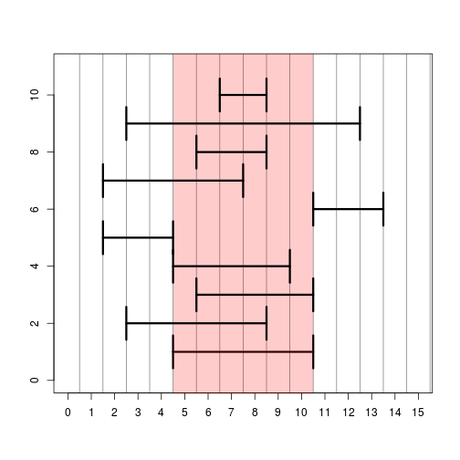

## IRanges


```r
library(IRanges)
```


```r
ir <- IRanges(5,10)
ir
```

```
## IRanges of length 1
##     start end width
## [1]     5  10     6
```

```r
start(ir)
```

```
## [1] 5
```

```r
end(ir)
```

```
## [1] 10
```

```r
width(ir)
```

```
## [1] 6
```

```r
# ?IRanges
```


```r
ir <- IRanges(start=c(3,5,17), end=c(10,8,20))
ir
```

```
## IRanges of length 3
##     start end width
## [1]     3  10     8
## [2]     5   8     4
## [3]    17  20     4
```

```r
ir <- IRanges(5,10)
```


```r
# ?"intra-range-methods"
shift(ir, -2)
```

```
## IRanges of length 1
##     start end width
## [1]     3   8     6
```

Remeber, all of these commands can work on more than one range at once. Here we show the effects of the different methods using a single range:


```r
shift(ir,-2)
```

```
## IRanges of length 1
##     start end width
## [1]     3   8     6
```

```r
narrow(ir, start=2)
```

```
## IRanges of length 1
##     start end width
## [1]     6  10     5
```

```r
narrow(ir, end=5)
```

```
## IRanges of length 1
##     start end width
## [1]     5   9     5
```

```r
flank(ir, width=3, start=TRUE, both=FALSE)
```

```
## IRanges of length 1
##     start end width
## [1]     2   4     3
```

```r
flank(ir, width=3, start=FALSE, both=FALSE)
```

```
## IRanges of length 1
##     start end width
## [1]    11  13     3
```

```r
flank(ir, width=3, start=TRUE, both=TRUE)
```

```
## IRanges of length 1
##     start end width
## [1]     2   7     6
```

```r
ir * 2
```

```
## IRanges of length 1
##     start end width
## [1]     6   8     3
```

```r
ir + 2
```

```
## IRanges of length 1
##     start end width
## [1]     3  12    10
```

```r
ir - 2
```

```
## IRanges of length 1
##     start end width
## [1]     7   8     2
```


```r
resize(ir, 1)
```

```
## IRanges of length 1
##     start end width
## [1]     5   5     1
```


```r
# set up a plotting window so we can look at range operations
plotir <- function(ir,i) { arrows(start(ir)-.5,i,end(ir)+.5,i,code=3,angle=90,lwd=3) }
plot(0,0,xlim=c(0,15),ylim=c(0,11),type="n",xlab="",ylab="",xaxt="n")
axis(1,0:15)
abline(v=0:30 + .5,col=rgb(0,0,0,.5))

# plot the original IRange
plotir(ir,1)

# draw a red shadow for the original IRange
polygon(c(start(ir)-.5,start(ir)-.5,end(ir)+.5,end(ir)+.5),c(-1,12,12,-1),col=rgb(1,0,0,.2),border=NA)
plotir(shift(ir,-2), 2)
plotir(narrow(ir, start=2), 3)
plotir(narrow(ir, end=5), 4)
plotir(flank(ir, width=3, start=TRUE, both=FALSE), 5)
plotir(flank(ir, width=3, start=FALSE, both=FALSE), 6)
plotir(flank(ir, width=3, start=TRUE, both=TRUE), 7)
plotir(ir * 2, 8)
plotir(ir + 2, 9)
plotir(ir - 2, 10)
```

 


```r
# ?"inter-range-methods"
ir <- IRanges(start=c(3,5,17), end=c(10,8,20))
range(ir)
```

```
## IRanges of length 1
##     start end width
## [1]     3  20    18
```

```r
reduce(ir)
```

```
## IRanges of length 2
##     start end width
## [1]     3  10     8
## [2]    17  20     4
```

```r
gaps(ir)
```

```
## IRanges of length 1
##     start end width
## [1]    11  16     6
```

```r
disjoin(ir)
```

```
## IRanges of length 4
##     start end width
## [1]     3   4     2
## [2]     5   8     4
## [3]     9  10     2
## [4]    17  20     4
```

<a name="granges"></a>

## GRanges and GRangesList

### GRanges


```r
library(GenomicRanges)
```


```r
gr <- GRanges("chrZ", IRanges(start=c(5,10),end=c(35,45)),
              strand="+", seqlengths=c(chrZ=100L))
gr
```

```
## GRanges object with 2 ranges and 0 metadata columns:
##       seqnames    ranges strand
##          <Rle> <IRanges>  <Rle>
##   [1]     chrZ  [ 5, 35]      +
##   [2]     chrZ  [10, 45]      +
##   -------
##   seqinfo: 1 sequence from an unspecified genome
```

```r
shift(gr, 10)
```

```
## GRanges object with 2 ranges and 0 metadata columns:
##       seqnames    ranges strand
##          <Rle> <IRanges>  <Rle>
##   [1]     chrZ  [15, 45]      +
##   [2]     chrZ  [20, 55]      +
##   -------
##   seqinfo: 1 sequence from an unspecified genome
```

```r
shift(gr, 80)
```

```
## Warning in valid.GenomicRanges.seqinfo(x, suggest.trim = TRUE): GRanges object contains 2 out-of-bound ranges located on sequence
##   chrZ. Note that only ranges located on a non-circular sequence
##   whose length is not NA can be considered out-of-bound (use
##   seqlengths() and isCircular() to get the lengths and circularity
##   flags of the underlying sequences). You can use trim() to trim
##   these ranges. See ?`trim,GenomicRanges-method` for more
##   information.
```

```
## GRanges object with 2 ranges and 0 metadata columns:
##       seqnames    ranges strand
##          <Rle> <IRanges>  <Rle>
##   [1]     chrZ [85, 115]      +
##   [2]     chrZ [90, 125]      +
##   -------
##   seqinfo: 1 sequence from an unspecified genome
```

```r
trim(shift(gr, 80))
```

```
## GRanges object with 2 ranges and 0 metadata columns:
##       seqnames    ranges strand
##          <Rle> <IRanges>  <Rle>
##   [1]     chrZ [85, 100]      +
##   [2]     chrZ [90, 100]      +
##   -------
##   seqinfo: 1 sequence from an unspecified genome
```

```r
mcols(gr)
```

```
## DataFrame with 2 rows and 0 columns
```

```r
mcols(gr)$value <- c(-1,4)
gr
```

```
## GRanges object with 2 ranges and 1 metadata column:
##       seqnames    ranges strand |     value
##          <Rle> <IRanges>  <Rle> | <numeric>
##   [1]     chrZ  [ 5, 35]      + |        -1
##   [2]     chrZ  [10, 45]      + |         4
##   -------
##   seqinfo: 1 sequence from an unspecified genome
```

### GRangesList


```r
gr2 <- GRanges("chrZ",IRanges(11:13,51:53))
mcols(gr)$value <- NULL
grl <- GRangesList(gr,gr2)
grl
```

```
## GRangesList object of length 2:
## [[1]] 
## GRanges object with 2 ranges and 0 metadata columns:
##       seqnames    ranges strand
##          <Rle> <IRanges>  <Rle>
##   [1]     chrZ  [ 5, 35]      +
##   [2]     chrZ  [10, 45]      +
## 
## [[2]] 
## GRanges object with 3 ranges and 0 metadata columns:
##       seqnames   ranges strand
##   [1]     chrZ [11, 51]      *
##   [2]     chrZ [12, 52]      *
##   [3]     chrZ [13, 53]      *
## 
## -------
## seqinfo: 1 sequence from an unspecified genome
```

```r
length(grl)
```

```
## [1] 2
```

```r
grl[[1]]
```

```
## GRanges object with 2 ranges and 0 metadata columns:
##       seqnames    ranges strand
##          <Rle> <IRanges>  <Rle>
##   [1]     chrZ  [ 5, 35]      +
##   [2]     chrZ  [10, 45]      +
##   -------
##   seqinfo: 1 sequence from an unspecified genome
```

```r
mcols(grl)$value <- c(5,7)
grl
```

```
## GRangesList object of length 2:
## [[1]] 
## GRanges object with 2 ranges and 0 metadata columns:
##       seqnames    ranges strand
##          <Rle> <IRanges>  <Rle>
##   [1]     chrZ  [ 5, 35]      +
##   [2]     chrZ  [10, 45]      +
## 
## [[2]] 
## GRanges object with 3 ranges and 0 metadata columns:
##       seqnames   ranges strand
##   [1]     chrZ [11, 51]      *
##   [2]     chrZ [12, 52]      *
##   [3]     chrZ [13, 53]      *
## 
## -------
## seqinfo: 1 sequence from an unspecified genome
```

```r
mcols(grl)
```

```
## DataFrame with 2 rows and 1 column
##       value
##   <numeric>
## 1         5
## 2         7
```

### findOverlaps and %over%


```r
gr1 <- GRanges("chrZ",IRanges(c(1,11,21,31,41),width=5))
gr2 <- GRanges("chrZ",IRanges(c(19,33),c(38,35)))
gr1
```

```
## GRanges object with 5 ranges and 0 metadata columns:
##       seqnames    ranges strand
##          <Rle> <IRanges>  <Rle>
##   [1]     chrZ  [ 1,  5]      *
##   [2]     chrZ  [11, 15]      *
##   [3]     chrZ  [21, 25]      *
##   [4]     chrZ  [31, 35]      *
##   [5]     chrZ  [41, 45]      *
##   -------
##   seqinfo: 1 sequence from an unspecified genome; no seqlengths
```

```r
gr2
```

```
## GRanges object with 2 ranges and 0 metadata columns:
##       seqnames    ranges strand
##          <Rle> <IRanges>  <Rle>
##   [1]     chrZ  [19, 38]      *
##   [2]     chrZ  [33, 35]      *
##   -------
##   seqinfo: 1 sequence from an unspecified genome; no seqlengths
```

```r
fo <- findOverlaps(gr1, gr2)
fo
```

```
## Hits of length 3
## queryLength: 5
## subjectLength: 2
##   queryHits subjectHits 
##    <integer>   <integer> 
##  1         3           1 
##  2         4           1 
##  3         4           2
```

```r
queryHits(fo)
```

```
## [1] 3 4 4
```

```r
subjectHits(fo)
```

```
## [1] 1 1 2
```

```r
gr1 %over% gr2
```

```
## [1] FALSE FALSE  TRUE  TRUE FALSE
```

```r
gr1[gr1 %over% gr2]
```

```
## GRanges object with 2 ranges and 0 metadata columns:
##       seqnames    ranges strand
##          <Rle> <IRanges>  <Rle>
##   [1]     chrZ  [21, 25]      *
##   [2]     chrZ  [31, 35]      *
##   -------
##   seqinfo: 1 sequence from an unspecified genome; no seqlengths
```

### Rle and Views


```r
r <- Rle(c(1,1,1,0,0,-2,-2,-2,rep(-1,20)))
r
```

```
## numeric-Rle of length 28 with 4 runs
##   Lengths:  3  2  3 20
##   Values :  1  0 -2 -1
```

```r
str(r)
```

```
## Formal class 'Rle' [package "S4Vectors"] with 4 slots
##   ..@ values         : num [1:4] 1 0 -2 -1
##   ..@ lengths        : int [1:4] 3 2 3 20
##   ..@ elementMetadata: NULL
##   ..@ metadata       : list()
```

```r
as.numeric(r)
```

```
##  [1]  1  1  1  0  0 -2 -2 -2 -1 -1 -1 -1 -1 -1 -1 -1 -1 -1 -1 -1 -1 -1 -1
## [24] -1 -1 -1 -1 -1
```

```r
Views(r, start=c(4,2), end=c(7,6))
```

```
## Views on a 28-length Rle subject
## 
## views:
##     start end width
## [1]     4   7     4 [ 0  0 -2 -2]
## [2]     2   6     5 [ 1  1  0  0 -2]
```

## Footnotes

For more information about the `GenomicRanges` package, check out the PLOS Comp Bio paper, which the authors of GenomicRanges published:

<http://www.ploscompbiol.org/article/info%3Adoi%2F10.1371%2Fjournal.pcbi.1003118>

Also the software vignettes have a lot of details about the functionality. Check out "An Introduction to Genomic Ranges Classes":

<http://www.bioconductor.org/packages/release/bioc/vignettes/GenomicRanges/inst/doc/GenomicRangesIntroduction.pdf>

All of the vignette PDFs are available here:

<http://www.bioconductor.org/packages/release/bioc/html/GenomicRanges.html>

